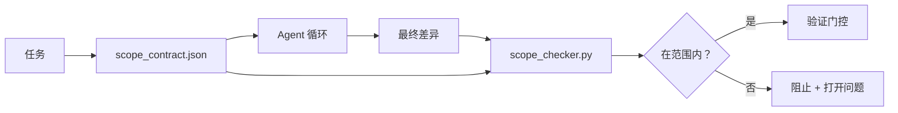

# 范围合约与任务边界

> 模型不知道工作在哪里结束。范围合约是一个每任务的文件，说明工作从哪里开始、在哪里结束，以及如果溢出如何回滚。合约将"保持在范围内"从愿望转化为检查。

**类型：** 构建
**语言：** Python（标准库）
**前置条件：** 第 14 阶段 · 32（最小工作台），第 14 阶段 · 33（规则作为约束）
**时间：** ~50 分钟

## 学习目标

- 编写一个 agent 在任务开始时读取、验证者在任务结束时读取的范围合约。
- 指定允许的文件、禁止的文件、验收标准、回滚计划和审批边界。
- 实现一个范围检查器，将差异与合约进行比较并标记违规。
- 使范围蔓延可见、自动且可审查。

## 问题

Agent 会蔓延。任务是"修复登录 bug"。差异触及登录路由、邮件助手、数据库驱动、README 和发布脚本。每次触碰在那一刻都有合理的理由。合在一起，它们是一个与被审查的不同变更。

范围蔓延是 agent 工作中最未被监控的失败模式，因为 agent 以善意叙述每一步。修复不是更严格的提示。修复是磁盘上的合约，说明承诺了什么，以及将结果与承诺进行比较的检查。

## 概念



### 范围合约中包含什么

| 字段 | 用途 |
|------|------|
| `task_id` | 链接到板上的任务 |
| `goal` | 审查者可以验证的一句话 |
| `allowed_files` | Agent 可以写入的通配符 |
| `forbidden_files` | Agent 即使意外也不能触碰的通配符 |
| `acceptance_criteria` | 证明完成的测试命令或断言行 |
| `rollback_plan` | 如果需要停止，操作员可以执行的一段文字 |
| `approvals_required` | 范围外需要明确人工签署的动作 |

没有 `forbidden_files` 的合约是不完整的。负空间是合约的一半。

### 通配符，不是原始路径

真实仓库会移动文件。将合约固定到通配符（`app/**/*.py`、`tests/test_signup*.py`），以便会话之间的重构不会使合约无效。

### 回滚是范围的一部分

列出如何回滚迫使合约作者思考可能出错的地方。无法从中回滚的合约是不应被批准的合约。

### 范围检查是差异检查

Agent 写入差异。检查器读取差异、允许的通配符、禁止的通配符和任何运行的验收命令列表。每次违规都是验证门控可以拒绝的标记发现。

## 构建

`code/main.py` 实现：

- `scope_contract.json` 模式（JSON Schema 子集，通配符数组）。
- 将触碰的文件列表加运行的命令列表转换为 `RunSummary` 的差异解析器。
- 针对合约返回 `(violations, in_scope, off_scope)` 的 `scope_check`。
- 两次演示运行：一次保持在范围内，一次蔓延。检查器用确切的文件和原因标记蔓延。

运行：

```
python3 code/main.py
```

输出：合约、两次运行、每次运行的裁决，以及保存的 `scope_report.json`。

## 野外生产模式

一位实践者运行"specsmaxxing"（在调用 agent 之前用 YAML 写范围合约）报告，兔子洞率在三周内从 52% 降到 21%，没有改变 agent。合约做了工作，不是模型。三种模式使收益持续。

**违规预算，不是二元失败。** `agent-guardrails`（Claude Code、Cursor、Windsurf、Codex 通过 MCP 使用的 OSS 合并门）为每个任务提供 `violationBudget`：预算内的轻微范围滑移作为警告呈现；只有超过预算时合并门才拒绝。与 `violationSeverity: "error" | "warning"` 配对。预算是发货的门与被讨厌它的团队禁用的门之间的区别。

**按路径家族的严重度不对称。** 对 `docs/**` 的范围外写入通常是 `warn`；对 `scripts/**`、`migrations/**`、`config/prod/**` 的范围外写入总是 `block`。这种不对称必须存在于合约中，而不是运行时中，因为它是项目特定的且每任务变化。

**时间和网络预算紧邻文件预算。** `time_budget_minutes` 字段限制挂钟时间；运行时超过它时拒绝继续，除非重新批准。主机名上的 `network_egress` 允许列表防止 agent 静默命中不是任务一部分的外部 API。这些也是范围维度；文件通配符是必要但不充分的。

**多合约合并语义（最小权限）。** 当两个范围合约适用时（例如项目范围合约加任务特定合约），合并是：**交集** `allowed_files`（两个合约都必须允许路径），**并集** `forbidden_files`（任一可以禁止），`time_budget_minutes` 是最严格的（最小），`approvals_required` 累积。`network_egress` 是 `None` 表示无强制执行，`[]` 表示拒绝所有，`[...]` 作为允许列表；合并时，`None` 听从另一方，两个列表交集，拒绝所有保持拒绝所有。在合约模式中说明这一点，以便合并是机械且可审查的。

## 使用

生产模式：

- **Claude Code 斜杠命令。** `/scope` 命令写入合约并将其固定为会话上下文。子 agent 在行动前读取合约。
- **GitHub PR。** 将合约作为 PR 正文中的 JSON 文件或作为检入的工件推送。CI 针对合并差异运行范围检查器。
- **LangGraph 中断。** 范围违规触发中断；处理程序询问人类合约需要增长还是 agent 需要后退。

合约随任务旅行。任务关闭时，合约归档在 `outputs/scope/closed/` 下。

## 交付

`outputs/skill-scope-contract.md` 为任务描述生成范围合约和一个通配符感知检查器，在每次 agent 差异上的 CI 中运行。

## 练习

1. 添加 `network_egress` 字段，列出允许的外部主机。拒绝触碰其他主机的运行。
2. 扩展检查器，在 `docs/**` 上软失败，在 `scripts/**` 上硬失败。为不对称辩护。
3. 使合约使用静态规则集（无 LLM）从 `goal` 字段派生 `allowed_files`。第一个边缘案例上出什么错？
4. 添加 `time_budget_minutes`，一旦挂钟超过它则拒绝继续。
5. 针对相同差异运行两个合约。当两者都适用时，正确的合并语义是什么？

## 关键术语

| 术语 | 人们怎么说 | 实际含义 |
|------|-----------|---------|
| Scope contract | "任务简报" | 每任务 JSON，列出允许/禁止的文件、验收、回滚 |
| Scope creep | "它也触碰了..." | 合约外的文件在同一任务中更改 |
| Rollback plan | "我们可以回退" | 停止的操作员运行手册的一段文字 |
| Approval boundary | "需要签署" | 合约中列为需要明确人工审批的动作 |
| Diff check | "路径审计" | 将触碰的文件与合约通配符进行比较 |

## 延伸阅读

- [LangGraph 人工在环中断](https://langchain-ai.github.io/langgraph/concepts/human_in_the_loop/)
- [OpenAI Agents SDK 工具审批策略](https://platform.openai.com/docs/guides/agents-sdk)
- [logi-cmd/agent-guardrails — 合并门和范围验证](https://github.com/logi-cmd/agent-guardrails) —— 违规预算、严重度层级
- [Dev|Journal, 用 Agent 合约测试防止 AI Agent 配置漂移](https://earezki.com/ai-news/2026-05-05-i-built-a-tiny-ci-tool-to-keep-ai-agent-configs-from-drifting-in-my-repo/) —— 无外部依赖的 `--strict` 模式
- [Agentic Coding Is Not a Trap (生产日志)](https://dev.to/jtorchia/agentic-coding-is-not-a-trap-i-answered-the-viral-hn-post-with-my-own-production-logs-33d9) —— specsmaxxing 收据：52% → 21%
- [OpenCode 权限通配符](https://opencode.ai/docs/agents/) —— 细粒度每权限范围
- [Knostic, AI 编码 Agent 安全：威胁模型和保护策略](https://www.knostic.ai/blog/ai-coding-agent-security) —— 范围作为最小权限的一部分
- [Augment Code, AI 规范模板](https://www.augmentcode.com/guides/ai-spec-template) —— 三层边界系统（必须/询问/绝不）
- 第 14 阶段 · 27 —— 与范围锁配对的提示注入防御
- 第 14 阶段 · 33 —— 此合约每任务特化的规则集
- 第 14 阶段 · 38 —— 检查器报告进入的验证门控