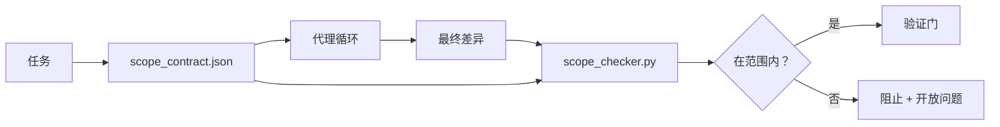

# 范围契约与任务边界

> 模型不知道工作在哪里结束。范围契约是一个每任务文件，它说明工作从哪里开始、在哪里结束，以及一旦超出范围如何回滚。这份契约将"保持在范围内"从一句愿望变成一项检查。

**类型：** 构建
**语言：** Python（标准库）
**前置条件：** 阶段 14 · 32（最小工作台），阶段 14 · 33（规则即约束）
**时间：** ~50 分钟

## 学习目标

- 编写一份范围契约，让代理在任务开始时读取，验证器在任务结束时读取。
- 指定允许的文件、禁止的文件、验收标准、回滚计划和审批边界。
- 实现一个范围检查器，将差异（diff）与契约进行比较并标记违规。
- 使范围蔓延变得可见、自动且可审查。

## 问题

代理会蔓延。任务是"修复登录 bug"。差异（diff）触动了登录路由、邮件辅助函数、数据库驱动、README 和发布脚本。每一次触碰在当时都有一个合理的理由。但它们加在一起，与当初被审查的变更已经完全不同。

范围蔓延是代理工作中最容易被忽视的失败模式，因为代理在每一步都以善意叙述。解决方法不是更严格的提示词。解决方法是一份磁盘上的契约，说明承诺了什么，以及一个将结果与承诺进行比较的检查。

## 概念


```mermaid
flowchart LR
  Task[任务] --> Contract[scope_contract.json]
  Contract --> Agent[代理循环]
  Agent --> Diff[最终差异]
  Diff --> Checker[scope_checker.py]
  Contract --> Checker
  Checker --> Verdict{在范围内？}
  Verdict -- 是 --> Verify[验证门]
  Verdict -- 否 --> Block[阻止 + 开放问题]
```

### 范围契约中包含什么

| 字段 | 用途 |
|-------|---------|
| `task_id` | 链接到看板上的任务 |
| `goal` | 验证者可以验证的一句话 |
| `allowed_files` | 代理可以写入的 glob 模式 |
| `forbidden_files` | 代理即使不小心也不能触碰的 glob 模式 |
| `acceptance_criteria` | 证明完成的测试命令或断言行 |
| `rollback_plan` | 操作员在需要停止时可以执行的一段说明 |
| `approvals_required` | 超出范围需要显式人工签核的操作 |

没有 `forbidden_files` 的契约是不完整的。否定空间占了契约的一半。

### Glob 模式，而非原始路径

真正的代码仓会移动文件。将契约绑定到 glob 模式（`app/**/*.py`、`tests/test_signup*.py`），这样会话间的重构不会使契约失效。

### 回滚是范围的一部分

列出如何回滚，迫使契约作者思考可能出问题的地方。一份无法回滚的契约就是一份不应被批准的契约。

### 范围检查即差异检查

代理写出差异。检查器读取差异、允许的 glob 模式、禁止的 glob 模式以及已运行的所有验收命令列表。每次违规都是一个带标签的发现项，验证门可以拒绝它。

### 范围的两个层次：功能列表和任务契约

范围契约约束一个任务。它不约束整个项目。一个代理可以完美地保持在"修复登录"任务的契约内，但在下一轮中决定项目还需要一个设置页面、一个深色模式开关和重写路由器。契约从未被问及哪些工作属于项目的范围，只问了哪些文件属于任务的范围。

第二个层次需要自己的原语：一个 `feature_list.json`，代理在会话开始时读取它。它是项目待办事项的机器可读的有序文件。代理精确选择一个 `status` 为 `todo` 的功能，将其 `id` 写入活动范围契约，并且禁止在同一会话中开始第二个功能。"一次只做一个功能"不再是一行代理可以用理由绕过的提示词，而是它从磁盘读取的一个值，以及验证门强制执行的一项检查。

```json
{
  "project": "knowledge-base",
  "active": "import-pdf",
  "features": [
    { "id": "import-pdf",   "status": "in_progress", "goal": "将 PDF 导入库",        "done_when": "pytest tests/test_import.py && 一个样例 PDF 出现在库视图中" },
    { "id": "full-text-search", "status": "todo",     "goal": "搜索文档文本并对结果排序",   "done_when": "查询返回带摘要的排序结果" },
    { "id": "cite-answers", "status": "todo",         "goal": "答案附带来源引用",        "done_when": "每个答案至少呈现一个可点击的引用" }
  ]
}
```

| 字段 | 用途 |
|-------|---------|
| `active` | 当前会话可以触及的单一功能；为空则表示选取一个并设置 |
| `features[].id` | 稳定的标识符，范围契约的 `task_id` 指向它 |
| `features[].status` | `todo`、`in_progress`、`done`、`blocked`；一次只能有一个 `in_progress` |
| `features[].goal` | 验证者可以验证的一句话 |
| `features[].done_when` | 将 `in_progress` 翻转为 `done` 的验收行 |

两条规则使列表具有实际承载能力而非装饰性。首先，"最多一个 `in_progress`"的不变性本身就是一个启动检查（阶段 14 · 33）：如果列表显示两个，会话拒绝启动，直到人类解决。其次，功能列表是一个文件，而不是聊天消息，因为聊天记录会滚动出上下文，而文件跨会话、跨代理持久存在。交接（阶段 14 · 40）将已完成功能的状态写回 `done`，以便下一个会话打开时看到准确的看板，而不是重新推导还剩什么。

契约和列表通过最小权限组合，与下面描述的合并方式相同：任务契约的 `allowed_files` 必须位于活动功能触及的范围之内，绝不能超出。

## 构建它

`code/main.py` 实现了：

- `scope_contract.json` 模式（JSON Schema 的子集，glob 数组）。
- 一个差异解析器，将触碰的文件列表加上运行的命令列表转换为 `RunSummary`。
- 一个 `scope_check`，返回 `(violations, in_scope, off_scope)` 与契约的比对结果。
- 两个演示运行：一个保持在范围内，一个发生蔓延。检查器用精确的文件和原因标记蔓延。

运行它：

```
python3 code/main.py
```

输出：契约、两次运行、每次运行的判定结果以及保存的 `scope_report.json`。

## 生产环境中的模式

一位践行"specsmaxxing"（在调用代理之前用 YAML 编写范围契约）的从业者报告，兔子洞率在三个星期内从 52% 降至 21%，且未更改代理。完成工作的是契约，而不是模型。三种模式使这一成果得以巩固。

**违规预算，而非二元失败。** `agent-guardrails`（Claude Code、Cursor、Windsurf、Codex 通过 MCP 使用的开源合并门）为每个任务提供一个 `violationBudget`：预算内的轻微范围滑移仅作为警告呈现；只有当预算被超出时，合并门才拒绝。配合 `violationSeverity: "error" | "warning"` 使用。预算是"一个能上线的门"与"一个被讨厌它的团队禁用的门"之间的区别。

**按路径族划分严重性不对称。** 对 `docs/**` 的越范围写入通常是 `warn`；对 `scripts/**`、`migrations/**`、`config/prod/**` 的越范围写入始终是 `block`。这种不对称必须存在于契约中，而非运行时，因为它因项目而异且每个任务都会变化。

**时间与网络预算与文件预算并列。** 一个 `time_budget_minutes` 字段约束墙上时钟时间；运行时在超出该时间后拒绝继续执行，除非重新批准。一个基于主机名的 `network_egress` 白名单防止代理静默访问不属于任务的的外部 API。这些同样是范围的维度；文件 glob 模式是必要的，但不是充分的。

**多契约合并语义（最小权限）。** 当两个范围契约同时适用时（例如，一个项目级契约加上一个任务级契约），合并规则为：**交集** `allowed_files`（两个契约都必须允许该路径），**并集** `forbidden_files`（任一契约可以禁止），`time_budget_minutes` 取最严格的（最小值），`approvals_required` 累加。`network_egress` 为 `None` 表示不强制执行，`[]` 表示全部拒绝，`[...]` 作为白名单；在合并时，`None` 由另一方决定，两个列表取交集，全部拒绝保持不变。在契约模式中说明这一点，使合并变得机械且可审查。

## 使用它

生产模式：

- **Claude Code 斜杠命令。** 一个 `/scope` 命令编写契约并将其固定为会话上下文。子代理在执行前读取契约。
- **GitHub PR。** 将契约作为 PR 正文中的 JSON 文件或检入的工件推送。CI 对合并差异运行范围检查器。
- **LangGraph 中断。** 范围违规触发中断；处理程序询问人类：契约需要扩大还是代理需要后退。

契约随任务一起旅行。当任务关闭时，契约归档到 `outputs/scope/closed/` 下。

## 交付它

`outputs/skill-scope-contract.md` 根据任务描述生成一份范围契约，以及一个在 CI 中对每个代理差异运行的 glob 感知检查器。

## 练习

1. 添加一个 `network_egress` 字段，列出允许的外部主机。拒绝触及其他主机的运行。
2. 扩展检查器，使其对 `docs/**` 软失败，对 `scripts/**` 硬失败。说明这种不对称的合理性。
3. 使契约使用静态规则集（无 LLM）从 `goal` 字段推导 `allowed_files`。在第一个边缘情况下会出现什么问题？
4. 添加一个 `time_budget_minutes`，并在墙上时钟时间超出时拒绝继续执行。
5. 对同一差异运行两份契约。当两者同时适用时，正确的合并语义是什么？

## 关键术语

| 术语 | 人们通常说 | 实际含义 |
|------|----------------|------------------------|
| 范围契约 | "任务简介" | 每次任务的 JSON，列出允许/禁止的文件、验收标准、回滚 |
| 范围蔓延 | "它还碰了..." | 同一任务中更改了契约外的文件 |
| 回滚计划 | "我们可以回退" | 用于停止的一段操作员运行手册 |
| 审批边界 | "需要签核" | 契约中列出的需要显式人工批准的行动 |
| 差异检查 | "路径审计" | 将触碰的文件与契约 glob 模式进行比较 |

## 延伸阅读

- [LangGraph 人机协作中断](https://langchain-ai.github.io/langgraph/concepts/human_in_the_loop/)
- [OpenAI Agents SDK 工具审批策略](https://platform.openai.com/docs/guides/agents-sdk)
- [logi-cmd/agent-guardrails — 合并门与范围验证](https://github.com/logi-cmd/agent-guardrails) — 违规预算、严重性等级
- [Dev|Journal, Preventing AI Agent Configuration Drift with Agent Contract Testing](https://earezki.com/ai-news/2026-05-05-i-built-a-tiny-ci-tool-to-keep-ai-agent-configs-from-drifting-in-my-repo/) — 无需外部依赖的 `--strict` 模式
- [Agentic Coding Is Not a Trap (production logs)](https://dev.to/jtorchia/agentic-coding-is-not-a-trap-i-answered-the-viral-hn-post-with-my-own-production-logs-33d9) — specsmaxxing 实证：52% → 21%
- [OpenCode 权限 glob 模式](https://opencode.ai/docs/agents/) — 细粒度按权限划分的范围
- [Knostic, AI Coding Agent Security: Threat Models and Protection Strategies](https://www.knostic.ai/blog/ai-coding-agent-security) — 范围作为最小权限的一部分
- [Augment Code, AI Spec Template](https://www.augmentcode.com/guides/ai-spec-template) — 三层边界系统（必须/询问/绝不）
- 阶段 14 · 27 — 与范围锁配对的提示注入防御
- 阶段 14 · 33 — 本契约为每个任务特化的规则集
- 阶段 14 · 38 — 检查器向其报告的验证门
