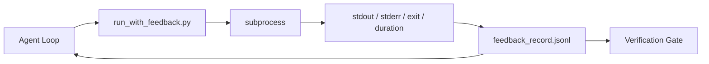

# Runtime Feedback Loops

> 実際のコマンド出力を見ないエージェントは推測します。feedback runner は stdout、stderr、exit code、実行時間を、次のターンが読める構造化レコードに取り込みます。そうするとエージェントは、事実についての自分の予測ではなく、事実そのものに反応できます。

**種類:** Build
**言語:** Python (stdlib)
**前提:** Phase 14 · 32 (Minimal Workbench), Phase 14 · 35 (Init Script)
**時間:** 約50分

## 学習目標

- ランタイム feedback と observability telemetry を区別する。
- shell コマンドをラップし、構造化レコードを永続化する feedback runner を構築する。
- ループを token budget 内に保つため、大きな出力を決定的に切り詰める。
- feedback が欠けているときはループの前進を拒否する。

## 問題

エージェントが「これからテストを実行します」と言います。次のメッセージでは「すべてのテストが通りました」と言います。しかし実際にはテストは実行されていません。エージェントが出力を想像したか、コマンドを実行して結果を読まなかったか、結果を読んだものの失敗行を黙って切り詰めたのです。

feedback runner はそのすき間をなくします。すべてのコマンドは runner を通ります。すべてのレコードには、コマンド、取り込んだ stdout と stderr、exit code、wall-clock duration、エージェントの1行メモが含まれます。エージェントは次のターンでそのレコードを読みます。verification gate はタスクの最後にレコードを読みます。

## コンセプト



### feedback record に入るもの

| Field | なぜ重要か |
|-------|------------|
| `command` | 正確な argv。shell 展開の思わぬ副作用を避ける |
| `stdout_tail` | 末尾 N 行。決定的な切り詰め |
| `stderr_tail` | stdout と分離した末尾 N 行 |
| `exit_code` | 曖昧さのない成功シグナル |
| `duration_ms` | 遅い probe や暴走プロセスを表面化する |
| `started_at` | replay 用の timestamp |
| `agent_note` | 結果を読む前にエージェントが予想を書く1行 |

### 切り詰めは決定的にする

50 MB の log はループを壊します。runner は head と tail を `...truncated N lines...` marker 付きで切り詰めます。同じ出力は常に同じ record になるよう決定的にします。sampling はしません。エージェントが見る必要のある部分、つまり最後の error や summary は tail にあります。

### feedback と telemetry

Telemetry (Phase 14 · 23, OTel GenAI conventions) は、人間の operator が時間をまたいで run を確認するためのものです。Feedback は、この run の次のターンのためのものです。両者は field を共有しますが、異なる保持期間を持つ別ファイルに住みます。

### feedback なしでは前進しない

runner が exit を取り込む前に error になった場合、record は `exit_code: null` と `error: <reason>` を持ちます。agent loop は `null` exit で成功を主張してはいけません。exit がなければ進捗もありません。

## 作ってみる

`code/main.py` は次を実装しています。

- `subprocess.run` をラップし、stdout/stderr/exit/duration を取り込み、決定的に切り詰め、`feedback_record.jsonl` に append する `run_with_feedback(command, agent_note)`。
- JSONL を Python list に stream する小さな loader。
- 3つの command (success、failure、slow) を実行し、各 command の最後の record を inline で表示する demo。

実行:

```
python3 code/main.py
```

出力: 3つの feedback record が `feedback_record.jsonl` に append され、それぞれの最後の record が inline で表示されます。再実行しながら file を tail すると、loop が蓄積していく様子を見られます。

## 現場の production pattern

runner を出荷できる水準まで堅牢にする pattern は3つあります。

**read 時ではなく write 時に redact する。** stdout や stderr に触れる record は秘密情報を漏らす可能性があります。runner は JSONL append の前に redaction pass を持ちます。`^Bearer `、`password=`、`api[_-]?key=`、`AKIA[0-9A-Z]{16}` (AWS)、`xox[baprs]-` (Slack) に一致する行を strip します。read 時の redaction は foot-gun です。disk 上の file こそ攻撃者が到達するものです。production runtime で観測された secret format に照らして、redaction pattern を四半期ごとに audit してください。

**単一 file ではなく rotation policy。** `feedback_record.jsonl` を file ごとに 1 MB で cap します。overflow したら `.1`、`.2` に rotate し、`.5` を drop します。agent loop は現在の file だけを読むので runtime cost は bounded です。CI artifact storage には rotated set 全体を保存します。rotation がなければ、loader call のたびに file が bottleneck になります。

**retry chain 用の parent-command id。** すべての record は `command_id` を持ちます。retry は前回 attempt を指す `parent_command_id` を持ちます。reviewer の「failed attempts」list (Phase 14 · 40) と verification gate の audit はどちらも chain を辿ります。この link がないと、retry は独立した成功に見え、audit は failure history を隠してしまいます。

## 使い方

Production pattern:

- **Claude Code Bash tool。** この tool はすでに stdout、stderr、exit、duration を取り込みます。この lesson の runner は、あらゆる agent product 向けの framework-agnostic な同等物です。
- **LangGraph nodes。** shell node を runner で wrap して、record が graph state の外に永続化されるようにします。
- **CI logs。** JSONL を CI artifact store に流します。reviewer は session を再実行せずに任意の command を replay できます。

runner は薄い wrapper です。record の shape を所有するため、framework migration のたびに生き残ります。

## 出荷する

`outputs/skill-feedback-runner.md` は、正しい truncation budget、workbench に接続された JSONL writer、エージェントが毎ターン読む loader を備えた、project-specific な `run_with_feedback.py` を生成します。

## 演習

1. record ごとに `cwd` field を追加し、異なる directory から実行した同じ command を区別できるようにする。
2. `^Bearer ` または `password=` に一致する行を strip する `redaction` step を追加する。fixture record で test する。
3. `feedback_record.jsonl` の総 size を 1 MB に cap し、`.1`、`.2` file へ rotate する。rotation policy を説明する。
4. retry chain が見えるように `parent_command_id` を追加する。次の command が消費した input をどの command が作ったかを示す。
5. JSONL を、最新の non-zero exit を highlight する小さな TUI に流す。review で有用になるために TUI が表示すべき8つの key feature を挙げる。

## 重要用語

| 用語 | よくある言い方 | 実際の意味 |
|------|----------------|------------|
| Feedback record | 「Run log」 | command、output、exit、duration を含む構造化 JSONL entry |
| Tail truncation | 「log を trim する」 | record を token budget に収めるための決定的な head+tail capture |
| Refuse-on-null | 「missing data で block する」 | `exit_code` が null のとき loop は前進してはいけない |
| Agent note | 「Expectation tag」 | 結果を読む前にエージェントが書く1行の予測 |
| Telemetry split | 「2つの log file」 | 次のターン用の feedback、operator 用の telemetry |

## 参考文献

- [OpenTelemetry GenAI semantic conventions](https://opentelemetry.io/docs/specs/semconv/gen-ai/)
- [Anthropic, Effective harnesses for long-running agents](https://www.anthropic.com/engineering/effective-harnesses-for-long-running-agents)
- [Guardrails AI x MLflow — deterministic safety, PII, quality validators](https://guardrailsai.com/blog/guardrails-mlflow) — regression test としての redaction pattern
- [Aport.io, Best AI Agent Guardrails 2026: Pre-Action Authorization Compared](https://aport.io/blog/best-ai-agent-guardrails-2026-pre-action-authorization-compared/) — tool 実行前後の capture
- [Andrii Furmanets, AI Agents in 2026: Practical Architecture for Tools, Memory, Evals, Guardrails](https://andriifurmanets.com/blogs/ai-agents-2026-practical-architecture-tools-memory-evals-guardrails) — observability surface
- Phase 14 · 23 — telemetry 側の OTel GenAI conventions
- Phase 14 · 24 — agent observability platforms (Langfuse, Phoenix, Opik)
- Phase 14 · 33 — done 宣言前に feedback を要求する rule
- Phase 14 · 38 — JSONL を読む verification gate
