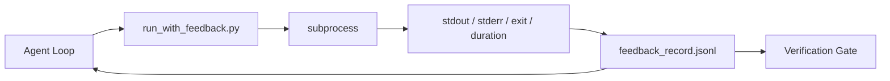

# Feedback Loops em Runtime

> Agents que não veem a saída real de comandos ficam chutando. Um feedback runner captura stdout, stderr, código de saída e timing num registro estruturado que o próximo turno pode ler. Aí o agent reage a fatos em vez de reagir à própria previsão de fatos.

**Tipo:** Construção
**Linguagens:** Python (stdlib)
**Pré-requisitos:** Fase 14 · 32 (Workbench Mínimo), Fase 14 · 35 (Script de Init)
**Tempo:** ~50 minutos

## Objetivos de Aprendizado

- Distinguir feedback de runtime de telemetria de observabilidade.
- Criar um feedback runner que encapsula comandos de shell e persiste registros estruturados.
- Truncar saídas grandes de forma determinística pra que o loop fique dentro do orçamento de tokens.
- Recusar avançar o loop quando o feedback tá faltando.

## O Problema

O agent diz "rodando testes agora." A próxima mensagem diz "todos os testes passaram." A realidade é que nenhum teste rodou. O agent imaginou a saída, ou rodou o comando e nunca leu o resultado, ou leu o resultado e truncou silenciosamente a linha de falha.

Um feedback runner remove esse gap. Todo comando passa pelo runner. Todo registro carrega o comando, o stdout e stderr capturados, o código de saída, a duração e uma nota de uma linha do agent. O agent lê o registro no próximo turno. O verification gate lê os registros no final da tarefa.

## O Conceito



### O que vai num registro de feedback

| Campo | Por que importa |
|-------|-----------------|
| `command` | argv exato, sem surpresas de expansão de shell |
| `stdout_tail` | Últimas N linhas, truncamento determinístico |
| `stderr_tail` | Últimas N linhas, separado do stdout |
| `exit_code` | O sinal inequívoco de sucesso |
| `duration_ms` | Revela probes lentos e processos descontrolados |
| `started_at` | Timestamp pra replay |
| `agent_note` | Uma linha que o agent escreve sobre o que esperava |

### Truncamento é determinístico

Um log de 50 MB destrói o loop. O runner trunca começo e fim com um marcador `...truncated N lines...`, determinístico pra que a mesma saída sempre produza o mesmo registro. Sem sampling; as partes que o agent precisa ver (erro final, resumo final) ficam no final.

### Feedback versus telemetria

Telemetria (Fase 14 · 23, convenções OTel GenAI) é pra operadores humanos revisando rodadas ao longo do tempo. Feedback é pro próximo turno dessa rodada. Compartilham campos mas moram em arquivos diferentes com retenções diferentes.

### Recuse avançar sem feedback

Se o runner erro antes de capturar o exit, o registro carrega `exit_code: null` e `error: <motivo>`. O agent loop precisa recusar declarar sucesso num exit `null`. Sem exit, sem progresso.

## Construa

`code/main.py` implementa:

- `run_with_feedback(command, agent_note)` que encapsula `subprocess.run`, captura stdout/stderr/exit/duration, trunca deterministicamente, e anexa ao `feedback_record.jsonl`.
- Um loader pequeno que faz streaming do JSONL pra uma lista Python.
- Uma demo que roda três comandos (sucesso, falha, lento) e imprime o último registro de cada.

Rode:

```
python3 code/main.py
```

Saída: três registros de feedback anexados ao `feedback_record.jsonl`, o último de cada impresso inline. Faça tail do arquivo entre rodadas pra ver o loop acumulando.

## Padrões de produção no mundo real

Três padrões tornam o runner robusto o suficiente pra produção.

**Redija na gravação, não na leitura.** Qualquer registro que toca stdout ou stderr pode vazar segredos. O runner tem uma passada de redação antes do append no JSONL: remove linhas que casam com `^Bearer `, `password=`, `api[_-]?key=`, `AKIA[0-9A-Z]{16}` (AWS), `xox[baprs]-` (Slack). Redação no momento da leitura é uma bomba-relógio; o arquivo no disco é o que um atacante acessa. Revise os padrões de redação trimestralmente contra os formatos de segredo observados no runtime de produção.

**Política de rotação, não um único arquivo.** Limite o `feedback_record.jsonl` em 1 MB por arquivo; ao estourar, rotacione pra `.1`, `.2`, descarte `.5`. O loop do agent só lê o arquivo atual, então o custo de runtime é limitado. Armazenamento de artifacts no CI recebe o conjunto completo rotacionado. Sem rotação, o arquivo vira o gargalo em toda chamada de loader.

**ID de comando pai pra cadeias de retry.** Cada registro recebe `command_id`; retries carregam `parent_command_id` apontando pra tentativa anterior. A lista de "tentativas falhas" do revisor (Fase 14 · 40) e a auditoria do verification gate seguem a cadeia. Sem esse link, retries parecem sucessos independentes e a auditoria esconde o histórico de falhas.

## Use

Padrões de produção:

- **Ferramenta Bash do Claude Code.** A ferramenta já captura stdout, stderr, exit e duration. O runner dessa aula é o equivalente agnóstico de framework pra qualquer produto de agent.
- **Nós do LangGraph.** Encapsule qualquer nó shell no runner pra que o registro persista fora do estado do grafo.
- **Logs de CI.** Conecte o JSONL ao seu armazenamento de artifacts do CI; revisores podem replayar qualquer comando sem rerodar a sessão.

O runner é um wrapper fino que sobrevive a qualquer migração de framework porque é ele quem define o formato do registro.

## Entregue

`outputs/skill-feedback-runner.md` gera um `run_with_feedback.py` específico pro projeto com o orçamento de truncamento correto, um writer de JSONL conectado ao workbench e um loader que o agent lê a cada turno.

## Exercícios

1. Adicione um campo `cwd` por registro pra que o mesmo comando rodado de diretórios diferentes seja distinguível.
2. Adicione uma etapa de `redação` que remove linhas que casam com `^Bearer ` ou `password=`. Teste com um registro fixture.
3. Limite o tamanho total do `feedback_record.jsonl` em 1 MB rotacionando pra arquivos `.1`, `.2`. Defenda a política de rotação.
4. Adicione um `parent_command_id` pra que cadeias de retry sejam visíveis: qual comando produziu a entrada que o próximo comando consumiu.
5. Conecte o JSONL a um TUI pequeno que destaca o último exit não-zero. Oito funcionalidades que o TUI precisa ter pra ser útil numa review.

## Termos-Chave

| Termo | O que a galera fala | O que realmente significa |
|-------|---------------------|--------------------------|
| Registro de feedback | "Log de rodada" | Entrada JSONL estruturada com comando, saída, exit, duração |
| Truncamento de cauda | "Aparar o log" | Captura determinística de começo+fim pra registros caberem no orçamento de tokens |
| Recusa em null | "Bloquear em dado faltando" | O loop não pode avançar quando `exit_code` é null |
| Nota do agent | "Tag de expectativa" | A previsão de uma linha que o agent escreve antes de ler o resultado |
| Separação de telemetria | "Dois arquivos de log" | Feedback pro próximo turno, telemetria pro operador |

## Leitura Complementar

- [OpenTelemetry GenAI semantic conventions](https://opentelemetry.io/docs/specs/semconv/gen-ai/)
- [Anthropic, Effective harnesses for long-running agents](https://www.anthropic.com/engineering/effective-harnesses-for-long-running-agents)
- [Guardrails AI x MLflow — deterministic safety, PII, quality validators](https://guardrailsai.com/blog/guardrails-mlflow) — padrões de redação como testes de regressão
- [Aport.io, Best AI Agent Guardrails 2026: Pre-Action Authorization Compared](https://aport.io/blog/best-ai-agent-guardrails-2026-pre-action-authorization-compared/) — captura pré/pós-ferramenta
- [Andrii Furmanets, AI Agents in 2026: Practical Architecture for Tools, Memory, Evals, Guardrails](https://andriifurmanets.com/blogs/ai-agents-2026-practical-architecture-tools-memory-evals-guardrails) — superfícies de observabilidade
- Fase 14 · 23 — convenções OTel GenAI pro lado da telemetria
- Fase 14 · 24 — plataformas de observabilidade de agent (Langfuse, Phoenix, Opik)
- Fase 14 · 33 — a regra que exige feedback antes de declarar pronto
- Fase 14 · 38 — o verification gate que lê o JSONL
