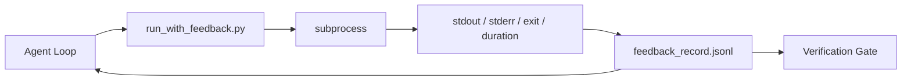

# Çalışma Zamanı Geri Bildirim Döngüleri

> Gerçek komut çıktısı tahminini görmeyen Agent'ler. Bir geri bildirim koşucusu, stdout, stderr, çıkış kodunu ve zamanlamayı bir sonraki dönüşün okuyabileceği yapılandırılmış bir kayda yakalar. O zaman agent kendi gerçek tahminleri yerine gerçeklere tepki verir.

**Tür:** Yapım
**Diller:** Python (stdlib)
**Önkoşullar:** Aşama 14 · 32 (Minimal Workbench), Aşama 14 · 35 (Başlatma Komut Dosyası)
**Süre:** ~50 dakika

## Öğrenme Hedefleri

- Çalışma zamanı geri bildirimini observability telemetrisinden ayırın.
- Kabuk komutlarını saran ve yapılandırılmış kayıtları sürdüren bir geri bildirim çalıştırıcısı oluşturun.
- Döngünün token bütçe dahilinde kalması için büyük çıktıları belirleyici bir şekilde kesin.
- Geri bildirim eksik olduğunda döngüyü ilerletmeyi reddedin.

## Sorun

agent "testler şimdi yapılıyor" diyor. Bir sonraki mesajda "tüm testler başarılı" yazıyor. Gerçek şu ki hiçbir test yapılmadı. agent çıktıyı hayal etti veya komutu çalıştırdı ve sonucu hiç okumadı veya sonucu okudu ve başarısızlık satırını sessizce kesti.

Bir geri bildirim koşucusu bu boşluğu ortadan kaldırır. Her komut koşucudan geçer. Her kayıt komutu, yakalanan stdout ve stderr'yi, çıkış kodunu, duvar saati süresini ve tek satırlık bir agent notunu taşır. agent bir sonraki turda kaydı okur. Doğrulama kapısı görev sonunda kayıtları okur.

## Konsept



### Geri bildirim kaydında neler bulunur?

| Alan | Neden önemlidir |
|-------|----------------|
| `command` | Tam argv, kabuk genişletme sürprizleri yok |
| `stdout_tail` | Son N satır, deterministik kesme |
| `stderr_tail` | Son N satır, stdout'tan ayrı |
| `exit_code` | Kesin başarı sinyali |
| `duration_ms` | Yüzeyler probları ve kontrolden çıkan süreçleri yavaşlatır |
| `started_at` | Tekrar oynatma için zaman damgası |
| `agent_note` | agent ne beklediğini anlatan bir satır |

### Kesme deterministiktir

50 MB'lık bir günlük döngüyü yok eder. Koşucu, tura ve kuyruğu bir `...truncated N lines...` işaretiyle keser, bu deterministiktir, böylece aynı çıktı her zaman aynı kaydı üretir. Örnekleme yok; agent'nın görmesi gereken kısımlar (son hata, son özet) kuyrukta canlı olarak görüntülenir.

### Geri bildirime karşı telemetri

Telemetri (Aşama 14 · 23, OTel GenAI konvansiyonları), zaman içindeki çalışmaları inceleyen insan operatörler içindir. Geri bildirim bu çalışmanın bir sonraki turu içindir. Alanları paylaşıyorlar ancak farklı saklama koşullarıyla farklı dosyalarda yaşıyorlar.

### Geri bildirim olmadan ilerlemeyi reddet

Koşucu çıkışı yakalamadan önce hata yaparsa kayıt `exit_code: null` ve `error: <reason>`'yi taşır. agent loop, {`null` çıkışında başarı iddiasını reddetmelidir. Çıkış yok, ilerleme yok.

## İnşa Et

`code/main.py` şunu uygular:

- `subprocess.run`'yi saran, stdout/stderr/exit/duration'ı yakalayan, deterministik olarak kesen, {`feedback_record.jsonl`'ye eklenen `run_with_feedback(command, agent_note)`.
- JSONL'yi Python listesine aktaran küçük bir yükleyici.
- Üç komutu çalıştıran (başarılı, başarısız, yavaş) ve komut başına son kaydı yazdıran bir demo.

Çalıştır:

```
python3 code/main.py
```

Çıktı: her yazdırılan satır içi kaydın sonuncusu olan `feedback_record.jsonl` öğesine eklenen üç geri bildirim kaydı. Döngünün biriktiğini görmek için dosyayı yeniden çalıştırmalar boyunca kuyruklayın.

## Vahşi doğada üretim modelleri

Üç desen, koşucuyu nakliyeye yetecek kadar sertleştirir.

**Okuma sırasında değil, yazma sırasında düzeltin.** Stdout veya stderr'e dokunan herhangi bir kayıt, sırların sızdırılmasına neden olabilir. Koşucu, JSONL eklentisinden önce bir redaksiyon geçişi gönderir: `^Bearer `, `password=`, {`api[_-]?key=`, `AKIA[0-9A-Z]{16}` (AWS), `xox[baprs]-` (Slack) ile eşleşen şerit satırları. Okuma sırasındaki redaksiyon bir ayak silahıdır; Diskteki dosya saldırganın ulaştığı dosyadır. Üretim çalışma zamanının gözlemlenen gizli biçimlerine göre redaksiyon modellerini üç ayda bir denetleyin.

**Döndürme politikası, tek bir dosya değil.** Dosya başına 1 MB'ta `feedback_record.jsonl` sınırı; taşma durumunda `.1`, {`.2`'ye döndürün, `.5`'yi bırakın. agent'ın döngüsü yalnızca geçerli dosyayı okur, dolayısıyla çalışma zamanı maliyeti sınırlıdır. CI artifact depolama, tam döndürülmüş seti alır. Döndürme olmadan dosya her yükleyici çağrısında darboğaz haline gelir.

**Yeniden deneme zincirleri için ana komut kimliği.** Her kayıt `command_id` alır; yeniden denemeler önceki denemeyi işaret eden `parent_command_id` taşır. Gözden geçirenin "başarısız girişimler" listesi (Aşama 14 · 40) ve doğrulama kapısının denetimi zinciri takip eder. Bu bağlantı olmadan yeniden denemeler bağımsız başarılar gibi görünür ve denetim başarısızlık geçmişini gizler.

## Kullan onu

Üretim modelleri:

- **Claude Code Bash aracı.** Araç zaten stdout, stderr, çıkış ve süreyi yakalıyor. Bu dersteki koşucu, herhangi bir agent ürününün framework-agnostik eşdeğeridir.
- **LangGraph düğümleri.** Kaydın grafik durumu dışında kalmasını sağlamak için herhangi bir kabuk düğümünü koşucuya sarın.
- **CI günlükleri.** JSONL'yi CI artifact deponuza aktarın; Gözden geçirenler, oturumu yeniden çalıştırmadan herhangi bir komutu yeniden yürütebilir.

Koşucu, kaydın şekline sahip olduğu için her framework geçişte hayatta kalan ince bir sarmalayıcıdır.

## Gönderin

`outputs/skill-feedback-runner.md`, doğru kesme bütçesi, çalışma tezgahına bağlı bir JSONL yazıcısı ve agent'nin her fırsatta okuduğu bir yükleyici ile projeye özel bir `run_with_feedback.py` oluşturur.

## Egzersizler

1. Aynı komutun farklı dizinlerden çalıştırılabilmesini sağlamak için kayıt başına bir `cwd` alanı ekleyin.
2. `^Bearer ` veya {`password=` ile eşleşen satırları soyan bir `redaction` adımı ekleyin. Bir fikstür kaydı üzerinde test yapın.
3. `.1`, {`.2` dosyalarına döndürerek toplam `feedback_record.jsonl` boyutunu 1 MB olarak sınırlayın. Rotasyon politikasını savunun.
4. Yeniden deneme zincirlerinin görülebilmesi için bir `parent_command_id` ekleyin: sonraki komutun tükettiği girişi hangi komut üretti?
5. JSONL'yi sıfır olmayan en son çıkışı vurgulayan küçük bir TUI'ye aktarın. TUI'nin bir incelemede yararlı olabilmesi için göstermesi gereken sekiz temel özellik.

## Anahtar Terimler

| Dönem | İnsanlar ne diyor | Aslında ne anlama geliyor |
|------|----------------|------------------------|
| Geri bildirim kaydı | "Günlüğü çalıştır" | Komut, çıktı, çıkış, süre ile yapılandırılmış JSONL girişi |
| Kuyruk kesilmesi | "Günlüğü kırp" | Kayıtların token bütçesine sığması için deterministik tura+kuyruk yakalama |
| Boşu reddet | "Eksik verileri engelle" | `exit_code` null olduğunda döngü ilerlememelidir |
| Agent notu | "Beklenti etiketi" | Sonucu okumadan önce agent'nin yazdığı tek satırlık tahmin |
| Telemetri bölünmesi | "İki günlük dosyası" | Bir sonraki dönüş için geri bildirim, operatör için telemetri |

## Daha Fazla Okuma

- [OpenTelemetry GenAI anlam kuralları](https://opentelemetry.io/docs/specs/semconv/gen-ai/)
- [Uzun koşan agentlar için antropik, Etkili koşum takımları](https://www.anthropic.com/engineering/effective-harnesses-for-long-running-agents)
- [Guardrails AI x MLflow — deterministik güvenlik, PII, kalite doğrulayıcılar](https://guardrailsai.com/blog/guardrails-mlflow) — regresyon testleri olarak redaksiyon modelleri
- [Aport.io, En İyi Yapay Zeka Agent Guardrails 2026: Eylem Öncesi Yetkilendirme Karşılaştırıldı](https://aport.io/blog/best-ai-agent-guardrails-2026-pre-action-authorization-compared/) — araç öncesi/sonrası yakalama
- [Andrii Furmanets, 2026'da Yapay Zeka Agent'ler: Araçlar, Bellek, Değerlendirmeler, Korkuluklar için Pratik Mimari](https://andriifurmanets.com/blogs/ai-agents-2026-practical-architecture-tools-memory-evals-guardrails) — observability yüzeyler
- Aşama 14 · 23 — Telemetri tarafı için OTel GenAI sözleşmeleri
- Aşama 14 · 24 — agent observability platformlar (Langfuse, Phoenix, Opik)
- Aşama 14 · 33 — tamamlandığını bildirmeden önce geri bildirim talep eden kural
- Aşama 14 · 38 — JSONL'yi okuyan doğrulama kapısı
