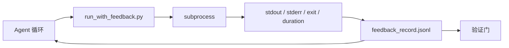

# 运行时反馈循环

> 看不到真实命令输出的 Agent 会猜测。反馈运行器将 stdout、stderr、退出代码和时序捕获到结构化记录中，下一轮可以读取。然后 Agent 对事实做出反应，而非对其自身的事实预测。

**类型：** 构建
**语言：** Python（标准库）
**先决条件：** 阶段 14 · 32（最小工作台）、阶段 14 · 35（初始化脚本）
**时间：** ~50 分钟

## 学习目标

- 区分运行时反馈与可观测性遥测。
- 构建一个包装 shell 命令并持久化结构化记录的反馈运行器。
- 确定性地截断大输出，以便循环保持在 token 预算内。
- 当反馈缺失时拒绝推进循环。

## 问题

Agent 说"现在运行测试"。下一条消息说"所有测试通过"。现实是没有测试运行。Agent 想象了输出，或者它运行了命令但从未读取结果，或者它读取了结果并静默截断了失败行。

反馈运行器消除了这种差距。每个命令都通过运行器。每个记录携带命令、捕获的 stdout 和 stderr、退出代码、挂钟持续时间和一行 Agent 笔记。Agent 在下一轮读取记录。验证门在任务结束时读取记录。

## 概念



### 反馈记录中的内容

| 字段 | 为何重要 |
|-------|----------|
| `command` | 确切的 argv，无 shell 扩展意外 |
| `stdout_tail` | 最后 N 行，确定性截断 |
| `stderr_tail` | 最后 N 行，与 stdout 分离 |
| `exit_code` | 明确的成功信号 |
| `duration_ms` | 呈现慢速探测和失控进程 |
| `started_at` | 用于重放的时间戳 |
| `agent_note` | Agent 关于其预期的一行描述 |

### 截断是确定性的

50 MB 日志会破坏循环。运行器用 `...truncated N lines...` 标记截断头部和尾部，确定性地使相同输出总是产生相同记录。无采样；Agent 需要查看的部分（最终错误、最终摘要）位于尾部。

### 反馈与遥测

遥测（阶段 14 · 23，OTel GenAI 约定）供人类操作员跨时间审查运行。反馈用于本次运行的下一轮。它们共享字段，但存在于具有不同保留策略的不同文件中。

### 无反馈时拒绝推进

如果运行器在捕获退出前出错，记录携带 `exit_code: null` 和 `error: <reason>`。Agent 循环必须拒绝在 `null` 退出时声称成功。无退出，无进展。

## 构建

`code/main.py` 实现：

- `run_with_feedback(command, agent_note)` 包装 `subprocess.run`，捕获 stdout/stderr/exit/duration，确定性地截断，追加到 `feedback_record.jsonl`。
- 将 JSONL 流式传输到 Python 列表的小型加载器。
- 运行三个命令（成功、失败、慢速）并打印每个命令的最后记录的演示。

运行：

```
python3 code/main.py
```

输出：追加到 `feedback_record.jsonl` 的三个反馈记录，每个的内联打印最后一个。跨重新运行追踪文件以查看循环累积。

## 生产模式

三种模式使运行器足够强化以交付。

**在写入时编辑，而非在读取时。** 任何触及 stdout 或 stderr 的记录都可能泄漏秘密。运行器在 JSONL 追加之前提供编辑通行：剥离匹配 `^Bearer `、`password=`、`api[_-]?key=`、`AKIA[0-9A-Z]{16}` (AWS)、`xox[baprs]-` (Slack) 的行。在读取时编辑是 foot-gun；磁盘上的文件是攻击者到达的地方。每季度根据生产运行时观察到的秘密格式审计编辑模式。

**轮换策略，而非单个文件。** 将每个文件的 `feedback_record.jsonl` 限制在 1 MB；溢出时轮换到 `.1`、`.2`，丢弃 `.5`。Agent 的循环仅读取当前文件，因此运行时成本是有界的。CI 制品存储获取完整的轮换集。没有轮换，文件成为每个加载器调用的瓶颈。

**重试链的父命令 ID。** 每个记录获取 `command_id`；重试携带指向先前尝试的 `parent_command_id`。审查者的"失败尝试"列表（阶段 14 · 40）和验证门的审计都遵循链。没有此链接，重试看起来像独立的成功，审计隐藏失败历史。

## 使用

生产模式：

- **Claude Code Bash 工具。** 该工具已经捕获 stdout、stderr、退出和持续时间。本课中的运行器是任何 Agent 产品的框架无关等效项。
- **LangGraph 节点。** 将任何 shell 节点包装在运行器中，以便记录持久化在图状态之外。
- **CI 日志。** 将 JSONL 管道传输到你的 CI 制品存储；审查者可以在不重新运行会话的情况下重放任何命令。

运行器是一个瘦包装器，在每个框架迁移中存活，因为它拥有记录的形状。

## 部署

`outputs/skill-feedback-runner.md` 生成项目特定的 `run_with_feedback.py`，具有正确的截断预算、连接到工作台的 JSONL 写入器和 Agent 每轮读取的加载器。

## 练习

1. 为每个记录添加 `cwd` 字段，以便从不同的目录运行的相同命令可区分。
2. 添加 `redaction` 步骤，剥离匹配 `^Bearer ` 或 `password=` 的行。在固定装置记录上测试。
3. 通过轮换到 `.1`、`.2` 文件，将总 `feedback_record.jsonl` 大小限制在 1 MB。辩护轮换策略。
4. 添加 `parent_command_id`，以便重试链可见：哪个命令产生了下一个命令消耗的输入。
5. 将 JSONL 管道传输到突出显示最新非零退出的微型 TUI。TUI 必须显示的八个关键功能，以便在审查中有用。

## 关键术语

| 术语 | 人们的说法 | 实际含义 |
|------|----------|----------|
| Feedback record（反馈记录） | "运行日志" | 带命令、输出、退出、持续时间的结构化 JSONL 条目 |
| Tail truncation（尾部截断） | "修剪日志" | 确定性头部+尾部捕获，以便记录适合 token 预算 |
| Refuse-on-null（空值拒绝） | "缺失数据阻止" | 当 `exit_code` 为 null 时，循环不得推进 |
| Agent note（Agent 笔记） | "预期标签" | Agent 在读取结果之前写入的单行预测 |
| Telemetry split（遥测分离） | "两个日志文件" | 下一轮的反馈，操作员的可观测性 |

## 延伸阅读

- [OpenTelemetry GenAI 语义约定](https://opentelemetry.io/docs/specs/semconv/gen-ai/)
- [Anthropic, 长运行 Agent 的有效 harness](https://www.anthropic.com/engineering/effective-harnesses-for-long-running-agents)
- [Guardrails AI x MLflow — 确定性安全、PII、质量验证器](https://guardrailsai.com/blog/guardrails-mlflow) — 作为回归测试的编辑模式
- [Aport.io, 最佳 AI Agent 护栏 2026：预操作授权比较](https://aport.io/blog/best-ai-agent-guardrails-2026-pre-action-authorization-compared/) — 工具前/后捕获
- [Andrii Furmanets, 2026 年 AI Agent：工具、记忆、评估、护栏的实用架构](https://andriifurmanets.com/blogs/ai-agents-2026-practical-architecture-tools-memory-evals-guardrails) — 可观测性层面
- 阶段 14 · 23 — 遥测侧的 OTel GenAI 约定
- 阶段 14 · 24 — Agent 可观测性平台（Langfuse、Phoenix、Opik）
- 阶段 14 · 33 — 在声明完成之前要求反馈的规则
- 阶段 14 · 38 — 读取 JSONL 的验证门
