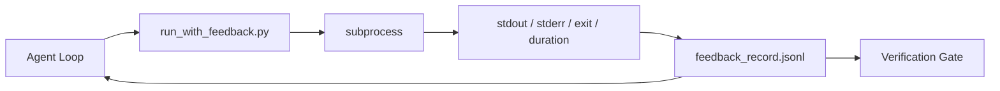

# 37 · 运行时反馈循环

> 看不到真实命令输出的智能体（Agent）只能靠猜。一个反馈运行器（feedback runner）会把标准输出（stdout）、标准错误（stderr）、退出码（exit code）和耗时统统捕获到一条结构化记录里，供下一回合读取。这样智能体就能针对事实做出反应，而不是针对它自己对事实的预测。

**类型：** 构建
**语言：** Python（标准库）
**前置：** 第 14 阶段 · 32（最小工作台 Minimal Workbench）、第 14 阶段 · 35（初始化脚本 Init Script）
**时长：** 约 50 分钟

## 学习目标

- 区分运行时反馈（runtime feedback）与可观测性遥测（observability telemetry）。
- 构建一个反馈运行器，用它包裹 shell 命令并持久化结构化记录。
- 确定性地截断超大输出，使循环始终处于 token 预算之内。
- 当反馈缺失时，拒绝推进循环。

## 问题所在

智能体说「现在开始跑测试」。下一条消息说「所有测试通过」。而现实是：根本没有任何测试运行过。智能体凭空想象了输出，或者它运行了命令却从未读取结果，又或者它读了结果却悄悄把失败那一行截掉了。

反馈运行器消除了这条裂缝。每一条命令都要经过运行器。每一条记录都携带命令本身、捕获到的 stdout 与 stderr、退出码、墙钟时长（wall-clock duration），以及一行智能体备注。智能体在下一回合读取这条记录。验证关卡（verification gate）则在任务结束时读取这些记录。

## 核心概念



### 反馈记录里都放些什么

| 字段 | 为何重要 |
|-------|----------------|
| `command` | 精确的 argv，没有 shell 展开带来的意外 |
| `stdout_tail` | 末尾 N 行，确定性截断 |
| `stderr_tail` | 末尾 N 行，与 stdout 分开 |
| `exit_code` | 毫不含糊的成功信号 |
| `duration_ms` | 暴露慢探针和失控进程 |
| `started_at` | 用于回放的时间戳 |
| `agent_note` | 智能体写下的、关于它预期结果的一行备注 |

### 截断是确定性的

一份 50 MB 的日志会摧毁整个循环。运行器对开头和结尾做截断，中间用一个 `...truncated N lines...` 标记，并且是确定性的——同样的输出永远产生同样的记录。不做采样；智能体需要看的部分（最终错误、最终摘要）都存在末尾。

### 反馈对比遥测

遥测（telemetry，第 14 阶段 · 23，OTel GenAI 约定）面向的是事后跨时间审阅运行记录的人类操作员。反馈则面向本次运行的下一回合。二者共享字段，但分处不同文件、有着不同的保留策略。

### 没有反馈就拒绝推进

如果运行器在捕获到退出码之前就出错了，记录会携带 `exit_code: null` 和 `error: <reason>`。智能体循环必须拒绝在退出码为 `null` 的情况下宣称成功。没有退出码，就没有进展。

## 动手构建

`code/main.py` 实现了：

- `run_with_feedback(command, agent_note)`，它包裹 `subprocess.run`，捕获 stdout/stderr/退出码/时长，做确定性截断，并追加写入 `feedback_record.jsonl`。
- 一个小型加载器，把 JSONL 以流式方式读入一个 Python 列表。
- 一个演示程序，运行三条命令（成功、失败、慢速），并打印每条命令的最后一条记录。

运行它：

```
python3 code/main.py
```

输出：三条反馈记录被追加到 `feedback_record.jsonl`，其中每条命令的最后一条记录被内联打印出来。在多次重跑之间 tail 该文件，就能看到循环不断累积。

## 真实世界中的生产模式

有三种模式能让运行器足够稳健、可以上线交付。

**在写入时脱敏，而非在读取时脱敏。** 任何触及 stdout 或 stderr 的记录都可能泄露机密。运行器在 JSONL 追加写入之前会跑一遍脱敏（redaction）流程：剔除匹配 `^Bearer `、`password=`、`api[_-]?key=`、`AKIA[0-9A-Z]{16}`（AWS）、`xox[baprs]-`（Slack）的行。在读取时才脱敏是个坑；磁盘上的文件才是攻击者能触及的东西。每季度对照生产运行时观察到的机密格式审计一次这些脱敏模式。

**轮转策略，而非单一文件。** 把 `feedback_record.jsonl` 每个文件上限设为 1 MB；溢出时轮转到 `.1`、`.2`，并丢弃 `.5`。智能体的循环只读取当前文件，所以运行时开销是有界的。CI 制品（artifact）存储则保留完整的轮转集合。没有轮转，这个文件就会成为每次加载器调用的瓶颈。

**用父命令 id 串起重试链。** 每条记录都有 `command_id`；重试则携带 `parent_command_id`，指向上一次尝试。审查者的「失败尝试」列表（第 14 阶段 · 40）和验证关卡的审计都会沿着这条链追溯。没有这个链接，重试看起来就像彼此独立的成功，审计也就掩盖了失败历史。

## 实际运用

生产模式：

- **Claude Code 的 Bash 工具。** 该工具已经捕获了 stdout、stderr、退出码和时长。本课的运行器是面向任意智能体产品的、与框架无关的等价物。
- **LangGraph 节点。** 用运行器包裹任意 shell 节点，让记录持久化在图状态（graph state）之外。
- **CI 日志。** 把 JSONL 灌入你的 CI 制品存储；审查者无需重跑会话就能回放任意命令。

这个运行器是一层薄薄的包装，它能挺过每一次框架迁移，因为它掌控着记录的形态。

## 交付成果

`outputs/skill-feedback-runner.md` 会生成一份针对具体项目的 `run_with_feedback.py`，配上恰当的截断预算、一个接到工作台的 JSONL 写入器，以及一个智能体在每一回合都会读取的加载器。

## 练习

1. 为每条记录增加一个 `cwd` 字段，使同一条命令从不同目录运行时可以区分开来。
2. 增加一个 `redaction`（脱敏）步骤，剔除匹配 `^Bearer ` 或 `password=` 的行。在一条固定测试记录（fixture record）上测试它。
3. 通过轮转到 `.1`、`.2` 文件，把 `feedback_record.jsonl` 的总大小上限设为 1 MB。为你的轮转策略作辩护。
4. 增加一个 `parent_command_id`，使重试链可见：是哪条命令产生了下一条命令所消费的输入。
5. 把 JSONL 灌入一个小型 TUI，让它高亮最新的非零退出码。给出该 TUI 必须展示的、在审查中才算有用的八项关键特性。

## 关键术语

| 术语 | 人们怎么说 | 它实际指什么 |
|------|----------------|------------------------|
| 反馈记录（Feedback record） | 「运行日志」 | 包含命令、输出、退出码、时长的结构化 JSONL 条目 |
| 末尾截断（Tail truncation） | 「裁剪日志」 | 确定性的「头+尾」捕获，使记录适配 token 预算 |
| 遇 null 即拒（Refuse-on-null） | 「数据缺失就阻断」 | 当 `exit_code` 为 null 时循环绝不能推进 |
| 智能体备注（Agent note） | 「预期标签」 | 智能体在读取结果之前写下的一行预测 |
| 遥测分离（Telemetry split） | 「两个日志文件」 | 反馈给下一回合，遥测给操作员 |

## 延伸阅读

- [OpenTelemetry GenAI 语义约定](https://opentelemetry.io/docs/specs/semconv/gen-ai/)
- [Anthropic：面向长时运行智能体的高效框架（Effective harnesses for long-running agents）](https://www.anthropic.com/engineering/effective-harnesses-for-long-running-agents)
- [Guardrails AI x MLflow——确定性的安全、PII、质量校验器](https://guardrailsai.com/blog/guardrails-mlflow) ——把脱敏模式当作回归测试
- [Aport.io：2026 年最佳 AI 智能体护栏：行动前授权对比（Best AI Agent Guardrails 2026: Pre-Action Authorization Compared）](https://aport.io/blog/best-ai-agent-guardrails-2026-pre-action-authorization-compared/) ——工具调用前/后的捕获
- [Andrii Furmanets：2026 年的 AI 智能体：工具、记忆、评估、护栏的实用架构](https://andriifurmanets.com/blogs/ai-agents-2026-practical-architecture-tools-memory-evals-guardrails) ——可观测性面板
- 第 14 阶段 · 23 ——遥测一侧的 OTel GenAI 约定
- 第 14 阶段 · 24 ——智能体可观测性平台（Langfuse、Phoenix、Opik）
- 第 14 阶段 · 33 ——要求在宣称完成之前先有反馈的那条规则
- 第 14 阶段 · 38 ——读取该 JSONL 的验证关卡
