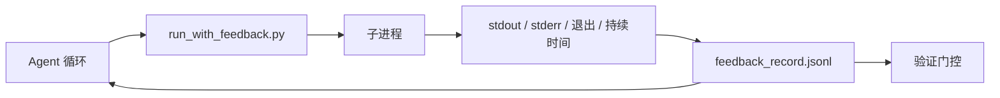

# 运行时反馈循环

> 看不到真实命令输出的 agent 会猜测。反馈运行器捕获 stdout、stderr、退出代码和时序到结构化记录中，下一轮可以读取。然后 agent 对事实做出反应，而不是对它自己对事实的预测做出反应。

**类型：** 构建
**语言：** Python（标准库）
**前置条件：** 第 14 阶段 · 32（最小工作台），第 14 阶段 · 35（初始化脚本）
**时间：** ~50 分钟

## 学习目标

- 区分运行时反馈与可观察性遥测。
- 构建一个包装 shell 命令并持久化结构化记录的反馈运行器。
- 确定性地截断大型输出，使循环保持在 token 预算内。
- 反馈缺失时拒绝推进循环。

## 问题

Agent 说"正在运行测试"。下一条消息说"所有测试通过"。现实是没有测试运行。Agent 想象了输出，或者它运行了命令但从未读取结果，或者它读取了结果但静默截断了失败行。

反馈运行器消除了这个差距。每个命令都通过运行器。每条记录携带命令、捕获的 stdout 和 stderr、退出代码、挂钟持续时间和一行 agent 注释。Agent 在下一轮读取记录。验证门控在任务结束时读取记录。

## 概念



### 反馈记录中包含什么

| 字段 | 为什么重要 |
|------|-----------|
| `command` | 精确的 argv，无 shell 扩展意外 |
| `stdout_tail` | 最后 N 行，确定性截断 |
| `stderr_tail` | 最后 N 行，与 stdout 分开 |
| `exit_code` | 明确的成功信号 |
| `duration_ms` | 呈现慢探测和失控进程 |
| `started_at` | 重放的时间戳 |
| `agent_note` | Agent 关于期望的一行注释 |

### 截断是确定性的

50 MB 的日志会破坏循环。运行器截断头部和尾部，带 `...truncated N lines...` 标记，确定性的，使相同输出始终产生相同记录。无采样；agent 需要看到的部分（最终错误、最终摘要）位于尾部。

### 反馈与遥测

遥测（第 14 阶段 · 23，OTel GenAI 约定）是供人类操作员跨时间审查运行的。反馈是供本次运行的下一轮的。它们共享字段，但存在于不同文件中，具有不同的保留期。

### 无反馈则拒绝推进

如果运行器在捕获退出前出错，记录携带 `exit_code: null` 和 `error: <reason>`。Agent 循环必须拒绝在 `null` 退出上声称成功。无退出，无进展。

## 构建

`code/main.py` 实现：

- `run_with_feedback(command, agent_note)` 包装 `subprocess.run`，捕获 stdout/stderr/退出/持续时间，确定性截断，追加到 `feedback_record.jsonl`。
- 将 JSONL 流式传输到 Python 列表的小型加载器。
- 运行三个命令（成功、失败、慢）并打印每个命令的最后记录的演示。

运行：

```
python3 code/main.py
```

输出：三个反馈记录追加到 `feedback_record.jsonl`，每个的最后一个内联打印。跨重新运行跟踪文件以查看循环累积。

## 野外生产模式

三种模式使运行器足够坚固以发布。

**写入时脱敏，不是读取时。** 任何触碰 stdout 或 stderr 的记录都可能泄漏秘密。运行器在 JSONL 追加前进行脱敏传递：剥离匹配 `^Bearer `、`password=`、`api[_-]?key=`、`AKIA[0-9A-Z]{16}`（AWS）、`xox[baprs]-`（Slack）的行。读取时脱敏是陷阱；磁盘上的文件是攻击者触及的。每季度根据生产运行时观察到的秘密格式审计脱敏模式。

**轮换策略，不是单一文件。** 将 `feedback_record.jsonl` 限制为每个文件 1 MB；溢出时轮换到 `.1`、`.2`，丢弃 `.5`。Agent 的循环只读取当前文件，因此运行时成本有界。CI 工件存储获得完整轮换集。没有轮换，文件在每次加载器调用时成为瓶颈。

**重试链的父命令 id。** 每条记录获得 `command_id`；重试携带指向先前尝试的 `parent_command_id`。审查者的"失败尝试"列表（第 14 阶段 · 40）和验证门控的审计都跟随链。没有这个链接，重试看起来像独立成功，审计隐藏失败历史。

## 使用

生产模式：

- **Claude Code Bash 工具。** 该工具已经捕获 stdout、stderr、退出和持续时间。本课中的运行器是任何 agent 产品的框架无关等价物。
- **LangGraph 节点。** 将任何 shell 节点包装在运行器中，使记录持久化在图状态之外。
- **CI 日志。** 将 JSONL 管道传输到 CI 工件存储；审查者可以重放任何命令而无需重新运行会话。

运行器是一个薄包装器，在每个框架迁移中幸存，因为它拥有记录的形状。

## 交付

`outputs/skill-feedback-runner.md` 生成项目特定的 `run_with_feedback.py`，带正确的截断预算、连接到工作台的 JSONL 写入器，以及 agent 每轮读取的加载器。

## 练习

1. 为每条记录添加 `cwd` 字段，使从不同目录运行的相同命令可区分。
2. 添加剥离匹配 `^Bearer ` 或 `password=` 的行的 `redaction` 步骤。在固定记录上测试。
3. 通过轮换到 `.1`、`.2` 文件，将 `feedback_record.jsonl` 总大小限制为 1 MB。为轮换策略辩护。
4. 添加 `parent_command_id`，使重试链可见：哪个命令产生了下一个命令消费的输入。
5. 将 JSONL 管道传输到一个小型 TUI，突出显示最新的非零退出。TUI 必须显示八个关键特性才能在审查中有用。

## 关键术语

| 术语 | 人们怎么说 | 实际含义 |
|------|-----------|---------|
| Feedback record | "运行日志" | 结构化 JSONL 条目，包含命令、输出、退出、持续时间 |
| Tail truncation | "修剪日志" | 确定性头部+尾部捕获，使记录适合 token 预算 |
| Refuse-on-null | "缺失数据时阻止" | 当 `exit_code` 为 null 时，循环不得推进 |
| Agent note | "期望标签" | Agent 在读取结果前写下的一行预测 |
| Telemetry split | "两个日志文件" | 反馈给下一轮，遥测给操作员 |

## 延伸阅读

- [OpenTelemetry GenAI 语义约定](https://opentelemetry.io/docs/specs/semconv/gen-ai/)
- [Anthropic, 长程 agent 的有效工具](https://www.anthropic.com/engineering/effective-harnesses-for-long-running-agents)
- [Guardrails AI x MLflow — 确定性安全、PII、质量验证器](https://guardrailsai.com/blog/guardrails-mlflow) —— 脱敏模式作为回归测试
- [Aport.io, 2026 年最佳 AI Agent 护栏：预动作授权比较](https://aport.io/blog/best-ai-agent-guardrails-2026-pre-action-authorization-compared/) —— 预/后工具捕获
- [Andrii Furmanets, 2026 年 AI Agent：工具、记忆、评估、护栏的实用架构](https://andriifurmanets.com/blogs/ai-agents-2026-practical-architecture-tools-memory-evals-guardrails) —— 可观察性表面
- 第 14 阶段 · 23 —— 遥测侧的 OTel GenAI 约定
- 第 14 阶段 · 24 —— agent 可观察性平台（Langfuse、Phoenix、Opik）
- 第 14 阶段 · 33 —— 要求在声明完成前反馈的规则
- 第 14 阶段 · 38 —— 读取 JSONL 的验证门控