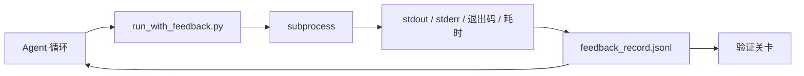

# 运行时反馈回路（Runtime Feedback Loops）

> 译注：本文译自同目录 [`en.md`](./en.md)。术语遵循仓根 [TRANSLATION_GUIDE.md](../../../../TRANSLATION_GUIDE.md)。

> 看不到真实命令输出的 agent 只能靠猜。一个反馈 runner 会把 stdout、stderr、退出码和耗时捕获成结构化记录，让下一轮可以读到它。这样 agent 就基于事实做反应，而不是基于自己对事实的预测。

**Type:** Build
**Languages:** Python (stdlib)
**Prerequisites:** Phase 14 · 32 (Minimal Workbench), Phase 14 · 35 (Init Script)
**Time:** ~50 minutes

## 学习目标（Learning Objectives）

- 区分运行时反馈和可观测性遥测（observability telemetry）。
- 构建一个反馈 runner，把 shell 命令包起来，并把结构化记录持久化下来。
- 对超长输出做确定性截断，让回路保持在 token 预算内。
- 在反馈缺失时拒绝推进回路。

## 问题（Problem）

agent 说「正在跑测试」。下一条消息说「全部通过」。但现实是根本没跑测试。要么 agent 凭空想象出了输出，要么它跑了命令却没读结果，要么它读了结果却悄悄把失败那一行截掉了。

反馈 runner 就是为了消除这道缝隙。每条命令都走 runner。每条记录都带上：命令本身、捕获到的 stdout 和 stderr、退出码、墙钟耗时（wall-clock duration），以及 agent 写的一行注记。下一轮 agent 读这条记录；任务结束时，验证关卡（verification gate）读这一整批记录。

## 概念（Concept）



### 一条反馈记录里放什么（What goes in a feedback record）

| 字段 | 为什么重要 |
|-------|----------------|
| `command` | 精确的 argv，没有 shell 展开带来的意外 |
| `stdout_tail` | 末尾 N 行，确定性截断 |
| `stderr_tail` | 末尾 N 行，与 stdout 分开 |
| `exit_code` | 不含糊的成功信号 |
| `duration_ms` | 暴露慢探针和失控进程 |
| `started_at` | 用于回放的时间戳 |
| `agent_note` | agent 写下的一行预期 |

### 截断必须是确定性的（Truncation is deterministic）

一条 50 MB 的日志会把回路打爆。runner 会对头尾做截断，中间放一个 `...truncated N lines...` 标记，且是确定性的——同样的输出永远生成同样的记录。不做采样；agent 真正需要看到的部分（最终错误、最终汇总）都在尾部。

### 反馈 vs. 遥测（Feedback versus telemetry）

遥测（telemetry，见 Phase 14 · 23、OTel GenAI conventions）是给人类操作员跨时间审阅运行用的。反馈是给本次运行的下一轮用的。两者字段会重叠，但写在不同文件、用不同的保留策略。

### 没有反馈就别推进（Refuse to advance without feedback）

如果 runner 在拿到退出信息之前就报错了，记录里就会带着 `exit_code: null` 和 `error: <reason>`。agent 的回路必须拒绝在 `exit_code` 为 null 时声明成功。没有退出码，就不许前进。

## 动手实现（Build It）

`code/main.py` 实现了：

- `run_with_feedback(command, agent_note)`：包住 `subprocess.run`，捕获 stdout/stderr/exit/duration，做确定性截断，并追加到 `feedback_record.jsonl`。
- 一个小型加载器，把 JSONL 流式读成一个 Python list。
- 一个 demo，跑三条命令（成功、失败、慢），并把每条命令最新的那条记录打出来。

跑起来：

```
python3 code/main.py
```

输出：三条反馈记录被追加到 `feedback_record.jsonl`，每条命令对应的最新一条会内联打印出来。多次重跑后 tail 一下这个文件，可以看到回路在持续累积。

## 真实环境里的生产模式（Production patterns in the wild）

下面三种模式能把这个 runner 锤炼到可上线的程度。

**写入时脱敏，而不是读取时脱敏（Redact at write, not at read）。** 任何接触 stdout 或 stderr 的记录都可能泄漏 secret。runner 在 JSONL 追加前会跑一遍脱敏：剔除匹配 `^Bearer `、`password=`、`api[_-]?key=`、`AKIA[0-9A-Z]{16}`（AWS）、`xox[baprs]-`（Slack）的行。读时脱敏是个坑——磁盘上的文件才是攻击者能拿到的东西。每季度对照一次生产 runtime 实际观察到的 secret 形态，重新审计这套脱敏规则。

**做轮转，不要单文件（Rotation policy, not a single file）。** 把 `feedback_record.jsonl` 单文件大小压在 1 MB 以内；溢出时轮转成 `.1`、`.2`，丢掉 `.5`。agent 的回路只读当前那个文件，所以运行时开销有上限。CI 工件存储那边再保留完整的轮转集。没有轮转的话，每次加载都要把这个文件读一遍，瓶颈就出在它身上。

**重试链用 parent-command id 串起来（Parent-command id for retry chains）。** 每条记录都有 `command_id`；重试的记录带上 `parent_command_id`，指向上一次尝试。reviewer（验证器）的「失败尝试」列表（Phase 14 · 40）和验证关卡的审计都顺着这条链走。没有这条链，重试看起来就像各自独立的成功，审计就把失败历史藏起来了。

## 用起来（Use It）

生产模式：

- **Claude Code Bash tool。** 这个工具本来就会捕获 stdout、stderr、exit 和 duration。本节这个 runner 就是任意 agent 产品都能用的、与框架无关的等价实现。
- **LangGraph 节点。** 把任何一个 shell 节点都包进 runner，让记录在图状态之外独立留存。
- **CI 日志。** 把 JSONL 灌进你的 CI 工件存储里；reviewer 不必重跑会话也能回放任何一条命令。

这个 runner 是一层薄薄的封装，正因为它定义了记录的形状，它能熬过每一次框架迁移。

## 上线部署（Ship It）

`outputs/skill-feedback-runner.md` 会生成一份项目专属的 `run_with_feedback.py`：截断预算合适、JSONL 写入接到 workbench（工作台）、并附一个 agent 每轮都会读的加载器。

## 练习（Exercises）

1. 给每条记录加一个 `cwd` 字段，让同一条命令在不同目录下跑出来的结果可以区分。
2. 加一个 `redaction` 步骤，剔除匹配 `^Bearer ` 或 `password=` 的行。在一条 fixture 记录上测一下。
3. 把 `feedback_record.jsonl` 的总体积压到 1 MB 以内，方法是轮转成 `.1`、`.2` 文件。论证你的轮转策略。
4. 加一个 `parent_command_id`，让重试链可见：哪条命令产出的输出，被下一条命令吃了进去。
5. 把 JSONL 灌进一个小 TUI，让它高亮最新的非零退出。列出这个 TUI 在 review 场景下要好用必须具备的八个关键特性。

## 关键术语（Key Terms）

| 术语 | 大家平时怎么说 | 实际是什么 |
|------|----------------|------------------------|
| Feedback record | 「运行日志」 | 结构化 JSONL 条目，包含命令、输出、exit、duration |
| Tail truncation | 「把日志砍一砍」 | 确定性的头+尾捕获，保证记录塞得进 token 预算 |
| Refuse-on-null | 「数据缺失就阻塞」 | 当 `exit_code` 为 null 时，回路绝不能前进 |
| Agent note | 「期望标签」 | agent 在读结果之前写下的那一行预测 |
| Telemetry split | 「两个日志文件」 | 反馈给下一轮，遥测给操作员 |

## 延伸阅读（Further Reading）

- [OpenTelemetry GenAI semantic conventions](https://opentelemetry.io/docs/specs/semconv/gen-ai/)
- [Anthropic, Effective harnesses for long-running agents](https://www.anthropic.com/engineering/effective-harnesses-for-long-running-agents)
- [Guardrails AI x MLflow — deterministic safety, PII, quality validators](https://guardrailsai.com/blog/guardrails-mlflow) — 把脱敏规则当作回归测试来跑
- [Aport.io, Best AI Agent Guardrails 2026: Pre-Action Authorization Compared](https://aport.io/blog/best-ai-agent-guardrails-2026-pre-action-authorization-compared/) — 工具调用前/后的捕获
- [Andrii Furmanets, AI Agents in 2026: Practical Architecture for Tools, Memory, Evals, Guardrails](https://andriifurmanets.com/blogs/ai-agents-2026-practical-architecture-tools-memory-evals-guardrails) — 可观测性界面
- Phase 14 · 23 — 遥测一侧的 OTel GenAI conventions
- Phase 14 · 24 — agent 可观测性平台（Langfuse、Phoenix、Opik）
- Phase 14 · 33 — 那条要求「先有反馈，再敢宣称完成」的规则
- Phase 14 · 38 — 读 JSONL 的验证关卡（verification gate）
