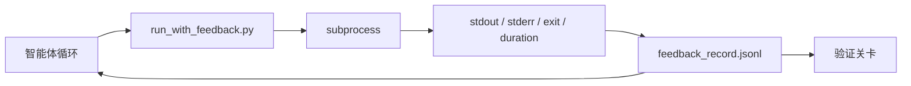

# 运行时反馈循环

> 无法看到真实命令输出的智能体只能靠猜测。反馈运行器将 stdout、stderr、退出码和耗时捕获为结构化记录，供下一轮读取。于是，智能体依据事实做出反应，而非依据自己对事实的预测。

**类型：** 构建  
**语言：** Python（标准库）  
**前置条件：** Phase 14 · 32（最小工作台）、Phase 14 · 35（初始化脚本）  
**时长：** 约 50 分钟

## 学习目标

- 区分运行时反馈与可观测性遥测。
- 构建一个包装 shell 命令并持久化结构化记录的反馈运行器。
- 确定性截断大输出，使循环保持在 Token 预算内。
- 在缺少反馈时拒绝推进循环。

## 问题

智能体说"正在运行测试"，下一条消息说"所有测试通过"。而现实是：没有运行任何测试。智能体想象了输出，或者它运行了命令但从未读取结果，又或者它读取了结果但默默地截断了失败行。

反馈运行器消除了这一差距。每条命令都通过运行器执行。每条记录都包含命令、捕获的 stdout 和 stderr、退出码、挂钟耗时以及一行智能体备注。智能体在下一轮读取记录。验证关卡在任务结束时读取记录。

## 概念


```mermaid
flowchart LR
  Agent[智能体循环] --> Runner[run_with_feedback.py]
  Runner --> Shell[subprocess]
  Shell --> Capture[stdout / stderr / exit / duration]
  Capture --> Record[feedback_record.jsonl]
  Record --> Agent
  Record --> Gate[验证关卡]
```

### 反馈记录包含什么

| 字段 | 为什么重要 |
|-------|----------------|
| `command` | 精确的 argv，无 shell 展开意外 |
| `stdout_tail` | 最后 N 行，确定性截断 |
| `stderr_tail` | 最后 N 行，与 stdout 分开 |
| `exit_code` | 明确无误的成功信号 |
| `duration_ms` | 显示慢速探测和失控进程 |
| `started_at` | 用于回放的时间戳 |
| `agent_note` | 智能体撰写的一行预期说明 |

### 截断是确定性的

一条 50 MB 的日志会破坏整个循环。运行器使用 `...truncated N lines...` 标记对头部和尾部进行截断，且截断是确定性的——相同的输出总是产生相同的记录。不做采样；智能体需要看到的部分（最终错误、最终摘要）位于尾部。

### 反馈与遥测

遥测（Phase 14 · 23，OTel GenAI 约定）供人类操作员跨时间审查运行情况。反馈供本轮下一次循环使用。它们共享字段，但存放在不同文件中，保留策略也不同。

### 无反馈则拒绝推进

如果运行器在捕获退出码之前出错，记录会携带 `exit_code: null` 和 `error: <原因>`。智能体循环必须在遇到 `null` 退出码时拒绝声称成功。没有退出码，就没有进展。

## 构建

`code/main.py` 实现了：

- `run_with_feedback(command, agent_note)`：包装 `subprocess.run`，捕获 stdout/stderr/退出码/耗时，确定性截断，追加到 `feedback_record.jsonl`。
- 一个小型加载器，将 JSONL 流式读取为 Python 列表。
- 一个演示，运行三个命令（成功、失败、慢速）并打印每个命令的最后一条记录。

运行方式：

```
python3 code/main.py
```

输出：三条反馈记录追加到 `feedback_record.jsonl`，每条的最后一条记录内联打印。跨多次运行查看文件尾部，观察循环如何累积。

## 生产模式

以下三种模式可将运行器加固到可交付的水平。

**在写入时脱敏，而非读取时。** 任何接触 stdout 或 stderr 的记录都可能泄漏密钥。运行器在追加 JSONL 之前执行脱敏处理：删除匹配 `^Bearer `、`password=`、`api[_-]?key=`、`AKIA[0-9A-Z]{16}`（AWS）、`xox[baprs]-`（Slack）的行。在读取时脱敏是自掘坟墓；磁盘上的文件才是攻击者能够触及的目标。每季度对照生产运行时观察到的密钥格式审计一次脱敏模式。

**轮换策略，而非单一文件。** 每个 `feedback_record.jsonl` 文件上限为 1 MB；超限时轮换为 `.1`、`.2`，丢弃 `.5`。智能体循环只读取当前文件，因此运行时成本是有界的。CI 制品存储则保留完整的轮换集。没有轮换，文件会成为每次加载器调用的瓶颈。

**父命令 ID 用于重试链。** 每条记录都包含 `command_id`；重试时携带 `parent_command_id` 指向上一次尝试。审查者的"失败尝试"列表（Phase 14 · 40）和验证关卡的审计都会追踪此链。没有这个链接，重试看起来就像是独立的成功，审计过程会隐藏失败历史。

## 使用

生产模式：

- **Claude Code Bash 工具。** 该工具已捕获 stdout、stderr、退出码和耗时。本课程中的运行器是适用于任何智能体产品的框架无关等价实现。
- **LangGraph 节点。** 将任何 shell 节点包装在运行器中，使记录在图状态之外持久化。
- **CI 日志。** 将 JSONL 管道接入 CI 制品存储；审查者无需重开会话即可回放任何命令。

运行器是一个轻量包装器，因为它定义了记录的结构，所以能在任何框架迁移中存活下来。

## 交付

`outputs/skill-feedback-runner.md` 生成一个项目专属的 `run_with_feedback.py`，包含合适的截断预算、连接到工作台的 JSONL 写入器，以及智能体每轮都会读取的加载器。

## 练习

1. 为每条记录添加 `cwd` 字段，使同一命令在不同目录下运行时可以区分。
2. 添加 `redaction` 步骤，删除匹配 `^Bearer ` 或 `password=` 的行。在测试夹具记录上验证。
3. 将 `feedback_record.jsonl` 总大小上限设为 1 MB，通过轮换为 `.1`、`.2` 文件来实现。论证轮换策略的合理性。
4. 添加 `parent_command_id`，使重试链可见：哪个命令产生的结果被下一个命令消费。
5. 将 JSONL 管道接入一个小型 TUI，高亮显示最近的非零退出码。列出该 TUI 在审查中必须具备的八个关键特性。

## 关键术语

| 术语 | 人们常说的 | 实际含义 |
|------|----------------|------------------------|
| 反馈记录 | "运行日志" | 包含命令、输出、退出码、耗时的结构化 JSONL 条目 |
| 尾部截断 | "截断日志" | 确定性捕获头部和尾部，使记录适配 Token 预算 |
| 空拒绝 | "缺少数据时阻塞" | 当 `exit_code` 为 null 时，循环不得推进 |
| 智能体备注 | "预期标签" | 智能体在读取结果前撰写的一行预测说明 |
| 遥测分离 | "两个日志文件" | 反馈供下一轮使用，遥测供操作员使用 |

## 延伸阅读

- [OpenTelemetry GenAI 语义约定](https://opentelemetry.io/docs/specs/semconv/gen-ai/)
- [Anthropic — 长运行智能体的有效护栏](https://www.anthropic.com/engineering/effective-harnesses-for-long-running-agents)
- [Guardrails AI × MLflow — 确定性安全、PII、质量验证器](https://guardrailsai.com/blog/guardrails-mlflow) —— 将脱敏模式作为回归测试
- [Aport.io — 2026 年最佳 AI 智能体护栏：执行前授权比较](https://aport.io/blog/best-ai-agent-guardrails-2026-pre-action-authorization-compared/) —— 工具前/工具后捕获
- [Andrii Furmanets — 2026 年的 AI 智能体：工具、记忆、评估、护栏的实用架构](https://andriifurmanets.com/blogs/ai-agents-2026-practical-architecture-tools-memory-evals-guardrails) —— 可观测性表面
- Phase 14 · 23 —— 遥测侧的 OTel GenAI 约定
- Phase 14 · 24 —— 智能体可观测性平台（Langfuse、Phoenix、Opik）
- Phase 14 · 33 —— 要求在声明完成之前提供反馈的规则
- Phase 14 · 38 —— 读取 JSONL 的验证关卡
