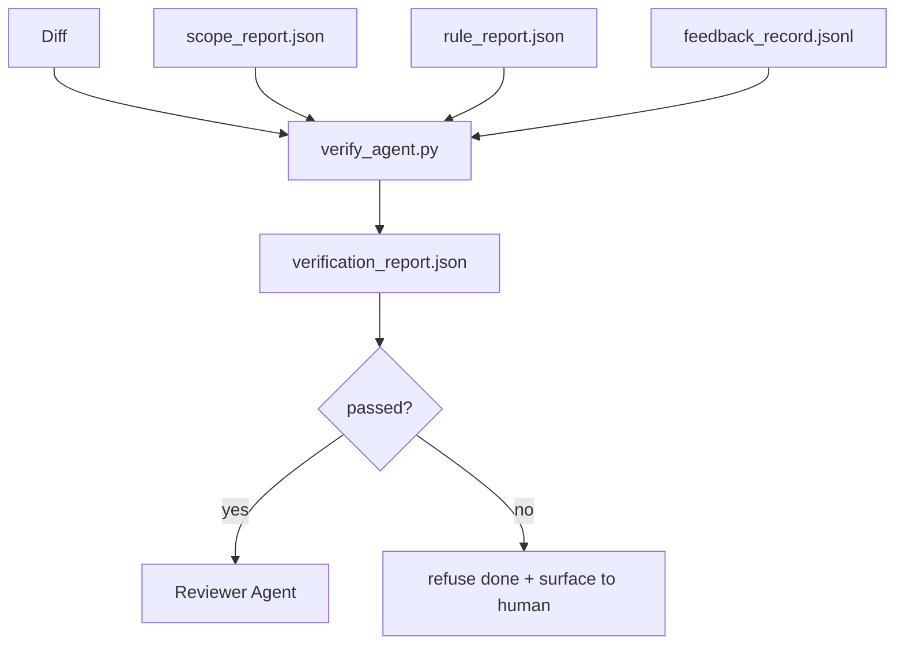

# Verification Gates

> エージェントは自分の作業を自分で done にしてはいけません。verification gate は scope contract、feedback log、rule report、diff を読み、1つの問いに答えます。この task は本当に完了しているか。gate が no と言うなら、chat が何と言っていても task は done ではありません。

**種類:** Build
**言語:** Python (stdlib)
**前提:** Phase 14 · 33 (Rules), Phase 14 · 36 (Scope), Phase 14 · 37 (Feedback)
**時間:** 約55分

## 学習目標

- verification gate を、workbench artifacts に対する決定的関数として定義する。
- rule report、scope report、feedback records、diff を1つの verdict に統合する。
- reviewer agent と CI の両方が読める `verification_report.json` を emit する。
- block severity の failure が1つでもあれば、例外なく task の前進を拒否する。

## 問題

エージェントはあまりにも簡単に成功を宣言します。主な failure shape は3つあります。

- 「よさそうです」。model が自分の diff を読んで正しいと判断した。
- 「tests passed」。自信満々だが、test が実際に実行された record はない。
- 「acceptance met」。acceptance criteria を「done に見えるものなら何でもよい」というくらい緩く解釈した。

workbench の修正は、エージェントがすでに作った artifacts を読んで判断する単一の verification gate です。gate は決定的です。gate は version control に入っています。gate は CI に接続されています。エージェントは gate を買収できません。

## コンセプト



### gate が check するもの

| Check | Source artifact | Severity |
|-------|-----------------|----------|
| すべての acceptance command が実行された | `feedback_record.jsonl` | block |
| すべての acceptance command が exit zero だった | `feedback_record.jsonl` | block |
| Scope check に forbidden writes がない | `scope_report.json` | block |
| Scope check に off-scope writes がない | `scope_report.json` | block or warn |
| すべての block-severity rules が pass している | `rule_report.json` | block |
| feedback に `null` exit code がない | `feedback_record.jsonl` | block |
| touched files が `scope.allowed_files` と一致する | both | warn |

`warn` finding は verdict に注釈を付けます。`block` finding は `passed: true` を防ぎます。

### probabilistic ではなく deterministic

gate は同じ artifact set に対して毎回同じ verdict を出さなければなりません。LLM judge は使いません。LLM judge は reviewer 側 (Phase 14 · 39) に置きます。そこでは goal が status ではなく qualitative evaluation だからです。

### 1つの report、1つの path

gate は task close-out ごとに1つの `verification_report.json` を emit し、`outputs/verification/<task_id>.json` に書きます。CI も同じ path を consume します。path の異なる複数 gate は source of truth を分岐させます。

### 例外なく拒否する

Block-severity findings はエージェントが override できません。override できるのは人間だけで、記録された `override_reason` と `overridden_by` user id が必要です。override は署名された change であり、agent decision ではありません。

## 作ってみる

`code/main.py` は次を実装しています。

- 各 input artifact の loader。lesson を self-contained にするためすべて local stub。
- `verify(task_id, artifacts) -> VerdictReport` pure function。
- check ごとの result と最終 pass/fail を表示する printer。
- 3つの task scenario demo: clean pass、scope creep、missing acceptance。

実行:

```
python3 code/main.py
```

出力: 3つの verdict report が、それぞれ script の隣に保存されます。

## 現場の production pattern

gate を「もう1つの lint job」から「判断を下す edge」に引き上げる pattern は4つあります。

**単一 gate ではなく defense-in-depth。** pre-commit hook → CI status check → pre-tool authz hook → pre-merge gate。各 layer は deterministic なので、ある layer の failure は次の layer で捕捉されます。microservices.io の 2026年3月 playbook は明確です。pre-commit hook は model-side skill と違ってエージェントが instruction に従うかに依存しないため bypass できません。verification gate は CI / pre-merge layer に置かれます。

**deterministic check で防御し、model-judge は nuance だけに使う。** Anthropic の 2026 Hybrid Norm pairing: verifiable rewards (unit tests、schema checks、exit codes) は「code は問題を解いたか？」に答え、LLM rubrics は「code は読みやすく、安全で、style に合っているか？」に答えます。gate は前者を実行し、reviewer (Phase 14 · 39) は後者を実行します。混ぜると signal が崩れます。

**Slack thread ではなく signed override log。** すべての override は `outputs/verification/overrides.jsonl` に row を emit します。含めるものは timestamp、finding code、reason、signing user、current HEAD commit です。runtime は signature のない override を拒否します。audit trail は git-tracked です。これが override policy と override theater の境目です。

**coverage floor を first-class check にする。** `coverage_report.json` が `coverage_floor` (default 80%) check に供給されます。measured coverage が floor を下回った場合、または previous merge の floor から 1 percentage point 超下がった場合、gate は fail します。この check がなければ、agent は失敗する test を黙って削除し、verification report は green のままになります。

**`--strict` mode は warn を block に昇格する。** release branch、ship-blocking PR、post-incident triage では、`--strict` によりすべての warning が hard fail になります。この flag は branch ごとの opt-in です。global default ではありません。strict-on-everything は日々の flow を腐食させるからです。

## 使い方

Production pattern:

- **CI step。** `verify_agent` job が agent の final artifacts に対して gate を実行します。merge protection は `passed: true` なしでは拒否します。
- **Pre-handoff hook。** agent runtime は handoff doc を生成する前に gate を呼びます。green verdict がなければ handoff もありません。
- **Manual triage。** agent が success を主張し、人間が疑っているとき、operator は report を読みます。

gate は workbench flow における判断の edge です。他の surface はすべてその上流にあります。

## 出荷する

`outputs/skill-verification-gate.md` は、どの acceptance command を feed するか、どの rule を block-severity にするか、どの off-scope write を許容するか、override audit log をどう保存するかを特定 project に接続します。

## 演習

1. `coverage_floor` check を追加する。test command は少なくとも 80% の coverage report を生成しなければならない。floor をどの artifact に持たせるか決める。
2. すべての `warn` を `block` に昇格する `--strict` mode を support する。strict mode を default にすべき case を document する。
3. JSON に加えて Markdown summary を生成する。summary に入れるべき field を説明する。
4. `time_since_last_human_touch` check を追加する。人間の keystroke から60秒以内に編集された file は off-scope flag から exempt する。
5. product の real agent diff に gate を実行する。finding のうち real はいくつ、noise はいくつか。gate はどこを伸ばす必要があるか。

## 重要用語

| 用語 | よくある言い方 | 実際の意味 |
|------|----------------|------------|
| Verification gate | 「止める check」 | workbench artifacts に対する決定的関数で pass/fail verdict を生成する |
| Block severity | 「Hard fail」 | `passed: true` を防ぎ、signed override を要求する finding |
| Override log | 「なぜ通したか」 | reason と user id を持つ signed entries。review で audit される |
| Acceptance command | 「証明」 | zero exit が `done` を意味する shell command |
| One report path | 「Source of truth」 | CI と人間が同じように consume する `outputs/verification/<task_id>.json` |

## 参考文献

- [Anthropic, Harness design for long-running application development](https://www.anthropic.com/engineering/harness-design-long-running-apps)
- [OpenAI Agents SDK guardrails](https://platform.openai.com/docs/guides/agents-sdk/guardrails)
- [microservices.io, GenAI dev platform: guardrails](https://microservices.io/post/architecture/2026/03/09/genai-development-platform-part-1-development-guardrails.html) — pre-commit と CI の間の defense in depth
- [ICMD, The 2026 Playbook for Agentic AI Ops](https://icmd.app/article/the-2026-playbook-for-agentic-ai-ops-guardrails-costs-and-reliability-at-scale-1776661990431) — approval-gate ladder (draft → approval → auto under thresholds)
- [Type-Checked Compliance: Deterministic Guardrails (arXiv 2604.01483)](https://arxiv.org/pdf/2604.01483) — deterministic gating の上限としての Lean 4
- [logi-cmd/agent-guardrails — merge gate spec](https://github.com/logi-cmd/agent-guardrails) — scope + mutation-testing gates
- [Guardrails AI x MLflow](https://guardrailsai.com/blog/guardrails-mlflow) — CI scorer としての deterministic validators
- [Akira, Real-Time Guardrails for Agentic Systems](https://www.akira.ai/blog/real-time-guardrails-agentic-systems) — pre/post-tool gates
- Phase 14 · 27 — prompt injection defenses (gate の adversarial pair)
- Phase 14 · 36 — この gate が enforce する scope contract
- Phase 14 · 37 — この gate が score する feedback log
- Phase 14 · 39 — gate が handoff する reviewer agent
