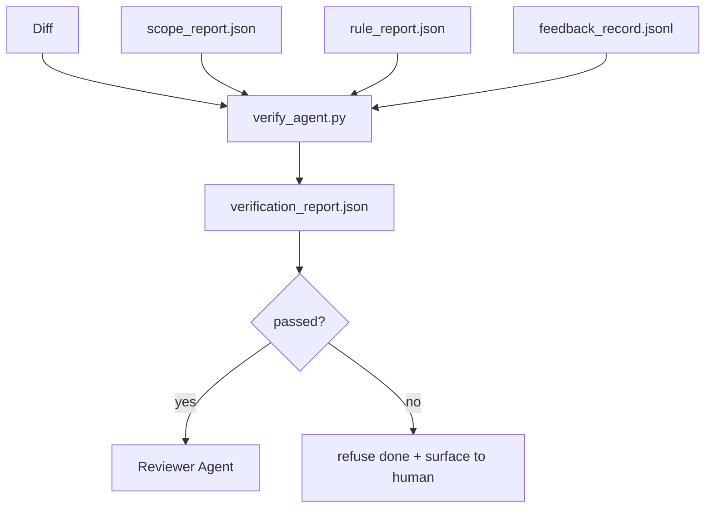

# Verification Gates

> The agent does not get to mark its own work as done. A verification gate reads the scope contract, the feedback log, the rule report, and the diff, and answers a single question: is this task actually complete? If the gate says no, the task is not done, no matter what the chat says.

**Type:** Build
**Languages:** Python (stdlib)
**Prerequisites:** Phase 14 · 33 (Rules), Phase 14 · 36 (Scope), Phase 14 · 37 (Feedback)
**Time:** ~55 minutes

## Learning Objectives

- Define a verification gate as a deterministic function over workbench artifacts.
- Combine rule report, scope report, feedback records, and diff into a single verdict.
- Emit a `verification_report.json` the reviewer agent and CI can both read.
- Refuse to advance a task on any block-severity failure, without exception.

## The Problem

Agents declare success too easily. Three failure shapes dominate:

- "Looks good." The model read its own diff and decided it was correct.
- "Tests passed." Said with confidence. No record of the test actually running.
- "Acceptance met." Acceptance criteria interpreted loosely enough to mean "anything resembling done."

The workbench fix is a single verification gate that reads the artifacts the agent has already produced and makes the call. The gate is deterministic. The gate is in version control. The gate is wired into CI. The agent cannot bribe it.

## The Concept



### What the gate checks

| Check | Source artifact | Severity |
|-------|-----------------|----------|
| All acceptance commands ran | `feedback_record.jsonl` | block |
| All acceptance commands exited zero | `feedback_record.jsonl` | block |
| Scope check has no forbidden writes | `scope_report.json` | block |
| Scope check has no off-scope writes | `scope_report.json` | block or warn |
| All block-severity rules pass | `rule_report.json` | block |
| No `null` exit codes in feedback | `feedback_record.jsonl` | block |
| Touched files match `scope.allowed_files` | both | warn |

A `warn` finding annotates the verdict; a `block` finding prevents `passed: true`.

### Deterministic, not probabilistic

The gate must produce the same verdict for the same artifact set every time. No LLM judges. LLM judges belong on the reviewer side (Phase 14 · 39) where the goal is qualitative evaluation, not status.

### One report, one path

The gate emits one `verification_report.json` per task close-out, written under `outputs/verification/<task_id>.json`. CI consumes the same path. Multiple gates with different paths fork the source of truth.

### Refuse without exception

Block-severity findings cannot be overridden by the agent. They can only be overridden by a human, with a recorded `override_reason` and an `overridden_by` user id. The override is a signed change, not an agent decision.

## Build It

`code/main.py` implements:

- A loader for each input artifact, all stubbed locally so the lesson is self-contained.
- A `verify(task_id, artifacts) -> VerdictReport` pure function.
- A printer that shows the per-check results and the final pass/fail.
- A demo with three task scenarios: clean pass, scope creep, missing acceptance.

Run it:

```
python3 code/main.py
```

Output: three verdict reports, each saved next to the script.

## Use It

Production patterns:

- **CI step.** A `verify_agent` job runs the gate against the agent's final artifacts. Merge protection refuses without `passed: true`.
- **Pre-handoff hook.** The agent runtime calls the gate before generating the handoff doc. No green verdict, no handoff.
- **Manual triage.** Operators read the report when an agent claims success and a human suspects it.

The gate is the deciding edge in the workbench flow. Every other surface is upstream of it.

## Ship It

`outputs/skill-verification-gate.md` wires the gate into a specific project: which acceptance commands feed it, which rules are block-severity, which off-scope writes are tolerated, how the override audit log is stored.

## Exercises

1. Add a `coverage_floor` check: the test command must produce a coverage report with at least 80%. Decide which artifact carries the floor.
2. Support a `--strict` mode that promotes every `warn` to `block`. Document the cases where strict mode is the right default.
3. Make the gate produce a Markdown summary in addition to JSON. Defend which fields belong in the summary.
4. Add a `time_since_last_human_touch` check: any file edited within 60 seconds of a human keystroke is exempt from off-scope flags.
5. Run the gate on a real agent diff from your product. How many findings are real and how many are noise? Where does the gate need to grow?

## Key Terms

| Term | What people say | What it actually means |
|------|----------------|------------------------|
| Verification gate | "The check that stops things" | Deterministic function over workbench artifacts producing a pass/fail verdict |
| Block severity | "Hard fail" | A finding that prevents `passed: true` and requires a signed override |
| Override log | "Why we let it through" | Signed entries with reason and user id, audited by review |
| Acceptance command | "The proof" | A shell command whose zero exit is what `done` means |
| One report path | "Source of truth" | `outputs/verification/<task_id>.json`, consumed by CI and humans alike |

## Further Reading

- [Anthropic, Harness design for long-running application development](https://www.anthropic.com/engineering/harness-design-long-running-apps)
- [OpenAI Agents SDK guardrails](https://platform.openai.com/docs/guides/agents-sdk/guardrails)
- Phase 14 · 36 — the scope contract this gate enforces
- Phase 14 · 37 — the feedback log this gate scores
- Phase 14 · 39 — the reviewer agent the gate hands off to
