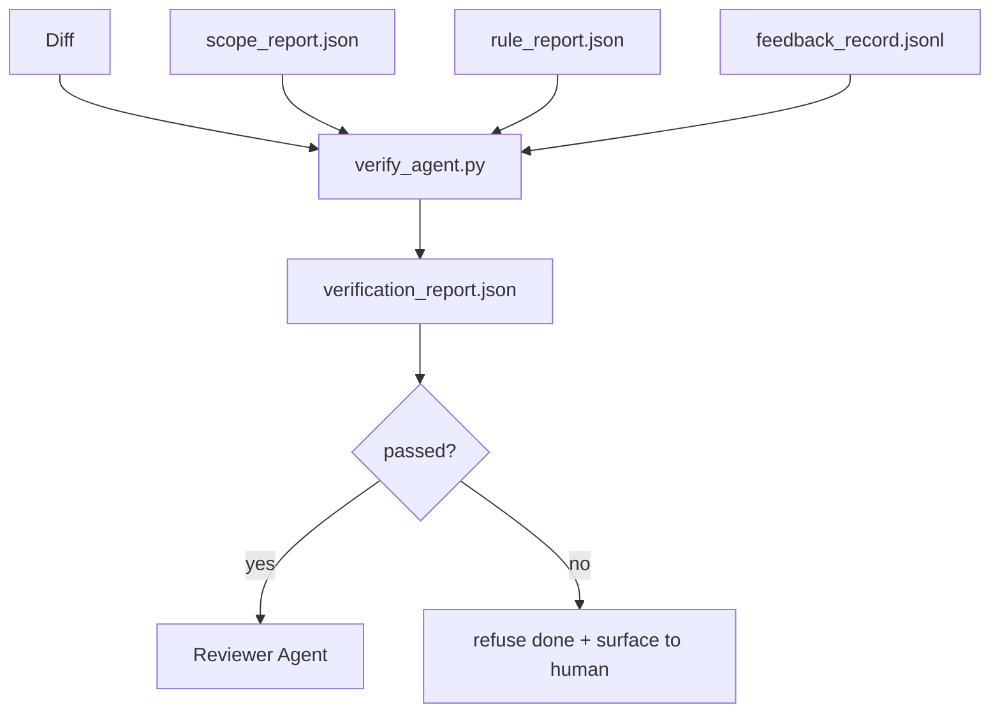

# Verification Gates

> O agente não tem autoridade pra marcar o próprio trabalho como pronto. Um verification gate lê o contrato de escopo, o log de feedback, o relatório de regras e o diff, e responde uma única pergunta: essa tarefa tá realmente concluída? Se o gate diz que não, a tarefa não tá pronta, não importa o que o chat diz.

**Tipo:** Construção
**Linguagens:** Python (stdlib)
**Pré-requisitos:** Fase 14 · 33 (Regras), Fase 14 · 36 (Escopo), Fase 14 · 37 (Feedback)
**Tempo:** ~55 minutos

## Objetivos de Aprendizado

- Definir um verification gate como uma função determinística sobre artifacts do workbench.
- Combinar relatório de regras, relatório de escopo, registros de feedback e diff num único veredicto.
- Emitir um `verification_report.json` que tanto o agente revisor quanto o CI possam ler.
- Recusar avançar uma tarefa em qualquer falha de severidade bloqueante, sem exceção.

## O Problema

Agents declaram sucesso fácil demais. Três formatos de falha dominam:

- "Tá bom." O modelo leu o próprio diff e decidiu que tava correto.
- "Testes passaram." Dito com confiança. Sem registro do teste realmente tendo rodado.
- "Aceitação cumprida." Critérios de aceitação interpretados de forma tão solta que significam "qualquer coisa parecida com pronto."

A solução no workbench é um único verification gate que lê os artifacts que o agente já produziu e toma a decisão. O gate é determinístico. O gate tá no version control. O gate tá conectado no CI. O agente não pode suborná-lo.

## O Conceito



### O que o gate verifica

| Verificação | Artifact de origem | Severidade |
|-------------|-------------------|------------|
| Todos os comandos de aceitação rodaram | `feedback_record.jsonl` | bloqueante |
| Todos os comandos de aceitação saíram com zero | `feedback_record.jsonl` | bloqueante |
| Verificação de escopo não tem escritas proibidas | `scope_report.json` | bloqueante |
| Verificação de escopo não tem escritas fora do escopo | `scope_report.json` | bloqueante ou aviso |
| Todas as regras de severidade bloqueante passaram | `rule_report.json` | bloqueante |
| Sem códigos de saída `null` no feedback | `feedback_record.jsonl` | bloqueante |
| Arquivos tocados batem com `scope.allowed_files` | ambos | aviso |

Uma constatação de `aviso` anota o veredicto; uma constatação de `bloqueante` impede `passed: true`.

### Determinístico, não probabilístico

O gate precisa produzir o mesmo veredicto pro mesmo conjunto de artifacts toda vez. Sem juízes LLM. Juízes LLM pertencem ao lado do revisor (Fase 14 · 39) onde o objetivo é avaliação qualitativa, não status.

### Um relatório, um caminho

O gate emite um `verification_report.json` por fechamento de tarefa, gravado em `outputs/verification/<task_id>.json`. CI consome o mesmo caminho. Vários gates com caminhos diferentes bifurcam a fonte da verdade.

### Recuse sem exceção

Constatações de severidade bloqueante não podem ser sobrescritas pelo agent. Só podem ser sobrescritas por um humano, com um `override_reason` gravado e um `overridden_by` com id de usuário. O override é uma mudança assinada, não uma decisão do agent.

## Construa

`code/main.py` implementa:

- Um loader pra cada artifact de entrada, todos stubados localmente pra que a aula seja autossuficiente.
- Uma função pura `verify(task_id, artifacts) -> VerdictReport`.
- Uma impressora que mostra os resultados por verificação e o pass/fail final.
- Uma demo com três cenários de tarefa: pass limpo, scope creep, aceitação faltando.

Rode:

```
python3 code/main.py
```

Saída: três relatórios de veredicto, cada um salvo ao lado do script.

## Padrões de produção no mundo real

Quatro padrões elevam o gate de "mais um lint" pra "a borda decisiva."

**Defesa em profundidade, não gate único.** Pre-commit hook → CI status check → pre-tool authz hook → pre-merge gate. Cada camada é determinística pra que uma falha numa camada seja pega pela próxima. O playbook de março de 2026 do microservices.io é explícito: o pre-commit hook é incontornável porque, diferente de uma skill do lado do modelo, não depende do agente seguir instruções. O verification gate fica na camada CI / pre-merge.

**Defesa por verificação determinística, modelo-judge só pra nuance.** O Hybrid Pairing de 2026 da Anthropic: recompensas verificáveis (testes unitários, checks de schema, códigos de saída) respondem "o código resolveu o problema?" — rubricas LLM respondem "o código é legível, seguro, no estilo?" O gate roda a primeira classe; o revisor (Fase 14 · 39) roda a segunda. Misturar as duas colapsa o sinal.

**Log de override assinado, não threads de Slack.** Cada override emite uma linha em `outputs/verification/overrides.jsonl` com: timestamp, código da constatação, motivo, usuário que assinou, commit HEAD atual. O runtime recusa qualquer override que falte a assinatura; o trilho de auditoria é rastreado por git. Essa é a linha entre uma política de override e teatro de override.

**Piso de cobertura como verificação de primeira classe.** Um `coverage_report.json` alimenta um check de `coverage_floor` (padrão 80%). O gate falha se a cobertura medida cair abaixo do piso ou abaixo do piso do merge anterior por mais de 1 ponto percentual. Sem esse check, agentes silenciosamente deletam testes que falham e os relatórios de verificação continuam verdes.

**Modo `--strict` promove avisos a bloqueios.** Pra branches de release, PRs que bloqueiam release ou triagem pós-incidente, `--strict` transforma todo aviso em falha forte. A flag é opt-in por branch; não o padrão global, porque strict em tudo corrói o fluxo do dia a dia.

## Use

Padrões de produção:

- **Etapa de CI.** Um job `verify_agent` roda o gate contra os artifacts finais do agent. Proteção de merge recusa sem `passed: true`.
- **Hook pré-handoff.** O runtime do agente chama o gate antes de gerar o documento de handoff. Sem veredicto verde, sem handoff.
- **Triagem manual.** Operadores leem o relatório quando um agente declara sucesso e um humano desconfia.

O gate é a borda decisiva no fluxo do workbench. Toda outra superfície fica a montante dele.

## Entregue

`outputs/skill-verification-gate.md` conecta o gate num projeto eespecificaçãoífico: quais comandos de aceitação o alimentam, quais regras são de severidade bloqueante, quais escritas fora do escopo são toleradas, como o log de auditoria de override é armazenado.

## Exercícios

1. Adicione um check de `coverage_floor`: o comando de teste precisa produzir um relatório de cobertura com pelo menos 80%. Defina qual artifact carrega o piso.
2. Suporte um modo `--strict` que promove cada `aviso` pra `bloqueante`. Documente os casos onde o modo strict é o padrão correto.
3. Faça o gate produzir um resumo em Markdown além do JSON. Defenda quais campos pertencem ao resumo.
4. Adicione um check de `time_since_last_human_touch`: qualquer arquivo editado dentro de 60 segundos de uma teclada humana é isento de flags de fora-do-escopo.
5. Rode o gate num diff real de agente do seu produto. Quantas constatações são reais e quantas são ruído? Onde o gate precisa crescer?

## Termos-Chave

| Termo | O que a galera fala | O que realmente significa |
|-------|---------------------|--------------------------|
| Verification gate | "A verificação que para as coisas" | Função determinística sobre artifacts do workbench que produz um veredicto pass/fail |
| Severidade bloqueante | "Falha forte" | Uma constatação que impede `passed: true` e exige override assinado |
| Log de override | "Por que deixamos passar" | Entradas assinadas com motivo e id de usuário, auditadas por review |
| Comando de aceitação | "A prova" | Um comando de shell cujo exit zero é o que "pronto" significa |
| Um caminho de relatório | "Fonte da verdade" | `outputs/verification/<task_id>.json`, consumido por CI e humanos igualmente |

## Leitura Complementar

- [Anthropic, Harness design for long-running application development](https://www.anthropic.com/engineering/harness-design-long-running-apps)
- [OpenAI Agents SDK guardrails](https://platform.openai.com/docs/guides/agents-sdk/guardrails)
- [microservices.io, GenAI dev platform: guardrails](https://microservices.io/post/architecture/2026/03/09/genai-development-platform-part-1-development-guardrails.html) — defesa em profundidade entre pre-commit e CI
- [ICMD, The 2026 Playbook for Agentic AI Ops](https://icmd.app/article/the-2026-playbook-for-agentic-ai-ops-guardrails-costs-and-reliability-at-scale-1776661990431) — escada de approval-gate (draft → approval → auto sob limiares)
- [Type-Checked Compliance: Deterministic Guardrails (arXiv 2604.01483)](https://arxiv.org/pdf/2604.01483) — Lean 4 como limite superior de gating determinístico
- [logi-cmd/agent-guardrails — merge gate especificação](https://github.com/logi-cmd/agent-guardrails) — gates de escopo + mutation-testing
- [Guardrails AI x MLflow](https://guardrailsai.com/blog/guardrails-mlflow) — validadores determinísticos como scoring no CI
- [Akira, Real-Time Guardrails for Agentic Systems](https://www.akira.ai/blog/real-time-guardrails-agentic-systems) — gates pré/pós-ferramenta
- Fase 14 · 27 — defesas contra prompt injection (o par adversarial do gate)
- Fase 14 · 36 — o contrato de escopo que o gate aplica
- Fase 14 · 37 — o log de feedback que o gate pontua
- Fase 14 · 39 — o agente revisor pra quem o gate transfere
