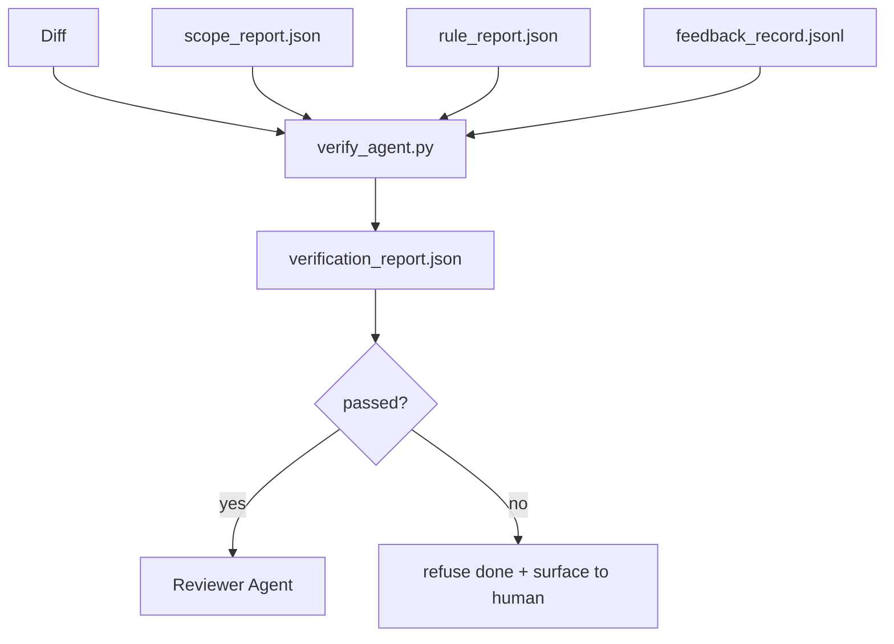

# Doğrulama Kapıları

> agent kendi işini tamamlandı olarak işaretleyemez. Doğrulama kapısı kapsam sözleşmesini, geri bildirim günlüğünü, kural raporunu ve farkı okur ve tek bir soruyu yanıtlar: Bu görev gerçekten tamamlandı mı? Kapı hayır derse, sohbet ne derse desin görev tamamlanmaz.

**Tür:** Yapım
**Diller:** Python (stdlib)
**Önkoşullar:** Aşama 14 · 33 (Kurallar), Aşama 14 · 36 (Kapsam), Aşama 14 · 37 (Geri Bildirim)
**Süre:** ~55 dakika

## Öğrenme Hedefleri

- Tezgah artifact'lar üzerinde deterministik bir fonksiyon olarak bir doğrulama geçidi tanımlayın.
- Kural raporunu, kapsam raporunu, geri bildirim kayıtlarını ve farkları tek bir kararda birleştirin.
- İnceleyenin agent ve CI'nın her ikisinin de okuyabileceği bir `verification_report.json` yayınlayın.
- İstisnasız olarak herhangi bir blok ciddiyeti arızasında bir görevi ilerletmeyi reddedin.

## Sorun

Agent'lar başarıyı çok kolay ilan ediyorlar. Üç başarısızlık şekli hakimdir:

- "İyi görünüyor." Model kendi farkını okudu ve doğru olduğuna karar verdi.
- "Testler geçti." Güvenle söyledi. Gerçekte çalışan testin kaydı yok.
- "Kabul karşılandı." Kabul kriterleri "yapılmışa benzeyen herhangi bir şey" anlamına gelecek kadar gevşek bir şekilde yorumlanır.

Tezgah düzeltmesi, agent'nin zaten üretmiş olduğu artifact'ları okuyan ve çağrıyı yapan tek bir doğrulama kapısıdır. Kapı deterministiktir. Kapı versiyon kontrolündedir. Geçit CI'ya bağlı. agent ona rüşvet veremez.

## Konsept



### Kapı neyi kontrol ediyor?

| Kontrol Et | Kaynak artifact | Şiddet |
|-------|-----------------|----------|
| Tüm kabul komutları çalıştırıldı | `feedback_record.jsonl` | blok |
| Tüm kabul komutları sıfırdan çıktı | `feedback_record.jsonl` | blok |
| Kapsam kontrolünde yasak yazma yoktur | `scope_report.json` | blok |
| Kapsam kontrolünde kapsam dışı yazma yoktur | `scope_report.json` | engelle veya uyar |
| Tüm blok önem derecesi kuralları başarılı | `rule_report.json` | blok |
| Geri bildirimde `null` çıkış kodu yok | `feedback_record.jsonl` | blok |
| Dokunulan dosyalar `scope.allowed_files` ile eşleşiyor | ikisi de | uyar |

`warn` bulgusu karara açıklama getiriyor; bir `block` bulgusu {`passed: true`'yi engeller.

### Olasılığa dayalı değil deterministik

Kapı her seferinde aynı artifact seti için aynı kararı vermelidir. Yüksek Lisans jürisi yok. Yüksek Lisans jürileri, amacın statü değil niteliksel değerlendirme olduğu hakem tarafına (Aşama 14 · 39) aittir.

### Tek rapor, tek yol

Kapı, görev kapanışı başına, `outputs/verification/<task_id>.json` altında yazılan bir `verification_report.json` yayar. CI aynı yolu tüketir. Farklı yollara sahip birden fazla kapı, gerçeğin kaynağını çatallar.

### İstisnasız reddet

Blok önem derecesi bulguları agent tarafından geçersiz kılınamaz. Bunlar yalnızca kayıtlı bir `override_reason` ve `overridden_by` kullanıcı kimliğine sahip bir insan tarafından geçersiz kılınabilir. Geçersiz kılma, imzalanmış bir değişikliktir, bir agent kararı değildir.

## İnşa Et

`code/main.py` şunu uygular:

- Her giriş için bir yükleyici artifact, hepsi yerel olarak stublanmış, böylece ders kendi kendine yetiyor.
- Bir `verify(task_id, artifacts) -> VerdictReport` saf fonksiyonu.
- Kontrol başına sonuçları ve son başarılı/başarısız durumunu gösteren bir yazıcı.
- Üç görev senaryosu içeren bir demo: temiz geçiş, kapsam kayması, eksik kabul.

Çalıştır:

```
python3 code/main.py
```

Çıktı: Her biri betiğin yanında kaydedilen üç karar raporu.

## Vahşi doğada üretim modelleri

Dört desen, kapıyı "başka bir tiftik işi"nden "belirleyici kenara" yükseltir.

**Derinlemesine savunma, tek kapı değil.** Ön işleme kancası → CI durum kontrolü → ön araç kimlik doğrulama kancası → ön birleştirme kapısı. Her katman deterministik olduğundan bir katmandaki hata diğer katman tarafından yakalanır. microservices.io'nin Mart 2026 başucu kitabı açık: ön işleme kancası atlanamaz çünkü model tarafı becerisinin aksine, aşağıdaki agent talimatlarına bağlı değildir. Doğrulama kapısı CI / birleştirme öncesi katmanında bulunur.

**Belirleyici kontrol yoluyla savunma, yalnızca nüans için model-yargılama.** Anthropic'in 2026 Hibrit Norm eşleştirmesi: doğrulanabilir ödüller (birim testleri, şema kontrolleri, çıkış kodları) "kod sorunu çözdü mü?" — LLM değerlendirme listeleri "kod okunabilir mi, güvenli mi ve tarzına uygun mu?" Kapı birinci sınıfta çalışıyor; incelemeyi yapan kişi (Aşama 14 · 39) ikinciyi yürütür. Bunları karıştırmak sinyali çökertir.

**İmzalı geçersiz kılma günlüğü, Slack iş parçacıkları değil.** Her geçersiz kılma, `outputs/verification/overrides.jsonl` içinde şu bilgileri içeren bir satır yayınlar: zaman damgası, bulma kodu, neden, imzalayan kullanıcı, mevcut HEAD taahhüdü. Çalışma zamanı, imzanın eksik olduğu tüm geçersiz kılmaları reddeder; denetim izi git ile izlenir. Bu, geçersiz kılma politikası ile geçersiz kılma tiyatrosu arasındaki çizgidir.

**Birinci sınıf çek olarak kapsama tabanı.** Bir `coverage_report.json`, bir `coverage_floor` (varsayılan %80) kontrolünü besler. Ölçülen kapsama alanı tabanın altına veya önceki birleştirme tabanının yüzde 1'inden fazla altına düşerse geçit başarısız olur. Bu kontrol olmadan, agentbaşarısız olan testleri sessizce siler ve doğrulama raporları yeşil kalır.

**`--strict` modu, uyarıların bloke edilmesini teşvik eder.** Serbest bırakma dalları, gemi engelleme PR'leri veya olay sonrası önceliklendirme için, `--strict` her uyarıyı kesin bir başarısızlık haline getirir. Bayrak şubeye göre tercih edilir; küresel varsayılan değil, çünkü her şeyin katı olması günlük akışı yıpratıyor.

## Kullan onu

Üretim modelleri:

- **CI adımı.** Bir `verify_agent` işi, kapıyı agent'nin son artifact'larına karşı çalıştırır. Birleştirme koruması `passed: true` olmadan reddediliyor.
- **Ön geçiş kancası.** agent çalışma zamanı, geçiş belgesini oluşturmadan önce kapıyı çağırır. Yeşil karar yok, devir yok.
- **Manuel öncelik belirleme.** Bir agent başarılı olduğunu iddia ettiğinde ve bir insan bundan şüphelendiğinde operatörler raporu okur.

Kapı, tezgah akışında belirleyici kenardır. Diğer tüm yüzeyler onun yukarısındadır.

## Gönderin

`outputs/skill-verification-gate.md`, kapıyı belirli bir projeye bağlar: hangi kabul komutları onu besler, hangi kurallar blok ciddiyetine sahiptir, hangi kapsam dışı yazma işlemlerine izin verilir, geçersiz kılma denetim günlüğünün nasıl depolandığı.

## Egzersizler

1. Bir `coverage_floor` kontrolü ekleyin: test komutu en az %80'lik bir kapsam raporu üretmelidir. Hangi artifact'nin zemini taşıdığına karar verin.
2. Her `warn`'yi {`block`'ye yükselten bir `--strict` modunu destekleyin. Katı modun doğru varsayılan olduğu durumları belgeleyin.
3. Kapının JSON'a ek olarak Markdown özeti üretmesini sağlayın. Özette hangi alanların yer aldığını savunun.
4. Bir `time_since_last_human_touch` kontrolü ekleyin: Bir insan tuş vuruşundan sonra 60 saniye içinde düzenlenen herhangi bir dosya kapsam dışı işaretlerden muaftır.
5. Kapıyı ürününüzden gerçek agent farkla çalıştırın. Bulguların kaçı gerçek, kaçı gürültü? Kapının nerede büyümesi gerekiyor?

## Anahtar Terimler

| Dönem | İnsanlar ne diyor | Aslında ne anlama geliyor |
|------|----------------|------------------------|
| Doğrulama kapısı | "İşleri durduran kontrol" | Tezgah üzerindeki deterministik fonksiyon artifactgeçti/kaldı kararı üretiyor |
| Engelleme ciddiyeti | "Zor başarısızlık" | `passed: true`'ı engelleyen ve imzalı geçersiz kılma gerektiren bir bulgu |
| Günlüğü geçersiz kıl | "Neden bunun geçmesine izin verdik" | Nedeni ve kullanıcı kimliğini içeren imzalı girişler, incelenerek denetlendi |
| Kabul komutu | "Kanıt" | Sıfır çıkışı `done` anlamına gelen bir kabuk komutu |
| Tek rapor yolu | "Gerçeğin kaynağı" | `outputs/verification/<task_id>.json`, hem CI hem de insanlar tarafından tüketiliyor |

## Daha Fazla Okuma

- [Uzun süreli uygulama geliştirme için Antropik, Harness tasarımı](https://www.anthropic.com/engineering/harness-design-long-running-apps)
- [OpenAI Agent'nin SDK korkulukları](https://openai.github.io/openai-agents-python/guardrails/)
- [microservices.io, GenAI geliştirme platformu: guardrails](https://microservices.io/post/architecture/2026/03/09/genai-development-platform-part-1-development-guardrails.html) — ön taahhüt ile CI arasında derinlemesine savunma
- [ICMD, The 2026 Playbook for Agentic AI Ops](https://icmd.app/article/the-2026-playbook-for-agentic-ai-ops-guardrails-costs-and-reliability-at-scale-1776661990431) — onay kapısı merdiveni (taslak → onay → eşiklerin altında otomatik)
- [Tip Kontrollü Uyumluluk: Deterministik Korkuluklar (arXiv 2604.01483)](https://arxiv.org/pdf/2604.01483) — Belirleyici geçitlemenin üst sınırı olarak Yalın 4
- [logi-cmd/agent-guardrails — birleştirme kapısı spesifikasyonu](https://github.com/logi-cmd/agent-guardrails) — kapsam + mutasyon testi kapıları
- [Guardrails AI x MLflow](https://guardrailsai.com/blog/guardrails-mlflow) — CI puanlayıcıları olarak deterministik doğrulayıcılar
- [Akira, Agentic Sistemleri için Gerçek Zamanlı Korkuluklar](https://www.akira.ai/blog/real-time-guardrails-agentic-systems) — alet öncesi/sonrası geçitler
- Aşama 14 · 27 — prompt enjeksiyon savunması (kapının rakip çifti)
- Aşama 14 · 36 — bu geçidin uyguladığı kapsam sözleşmesi
- Aşama 14 · 37 — bu kapının puanladığı geri bildirim günlüğü
- Aşama 14 · 39 — incelemeci agent kapıyı devreder
