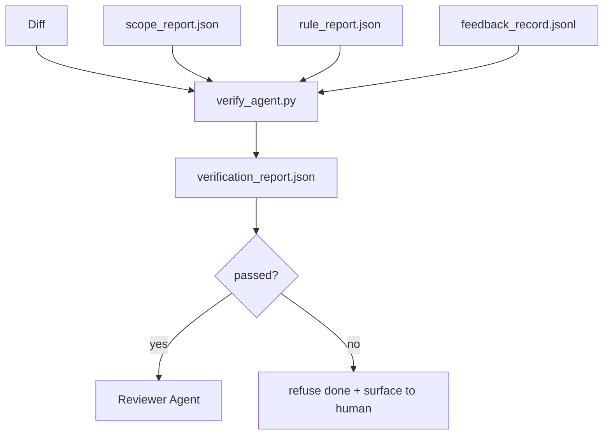

# 38 · 验证闸门

> 智能体（agent）无权把自己的工作标记为「完成」。验证闸门（verification gate）会读取范围契约（scope contract）、反馈日志（feedback log）、规则报告（rule report）和差异（diff），并回答唯一的问题：这个任务真的完成了吗？如果闸门说否，那么任务就没完成，无论对话里怎么说。

**类型：** 构建
**语言：** Python（标准库）
**前置：** 阶段 14 · 33（规则）、阶段 14 · 36（范围）、阶段 14 · 37（反馈）
**时长：** 约 55 分钟

## 学习目标

- 把验证闸门定义为一个对工作台产物（workbench artifacts）求值的确定性函数。
- 将规则报告、范围报告、反馈记录和差异合并成单一裁决（verdict）。
- 产出一份审查者智能体和 CI 都能读取的 `verification_report.json`。
- 对任何阻断级别（block-severity）的失败一律拒绝推进任务，绝无例外。

## 问题所在

智能体太容易宣称成功了。三种失败形态最为常见：

- 「看起来不错。」模型读了自己的差异，然后判定它是正确的。
- 「测试通过了。」说得信誓旦旦，却没有任何测试实际运行过的记录。
- 「验收满足了。」验收标准被解读得足够宽松，以至于「任何貌似完成的东西」都算数。

工作台的解法是一个单一的验证闸门，它读取智能体已经产出的产物并作出判断。这个闸门是确定性的。这个闸门在版本控制中。这个闸门被接入 CI。智能体无法收买它。

## 核心概念



### 闸门检查什么

| 检查 | 来源产物 | 严重级别 |
|-------|-----------------|----------|
| 所有验收命令都已运行 | `feedback_record.jsonl` | block |
| 所有验收命令都以零码退出 | `feedback_record.jsonl` | block |
| 范围检查没有禁止性写入 | `scope_report.json` | block |
| 范围检查没有越界写入 | `scope_report.json` | block 或 warn |
| 所有阻断级别的规则都通过 | `rule_report.json` | block |
| 反馈中没有 `null` 退出码 | `feedback_record.jsonl` | block |
| 触及的文件匹配 `scope.allowed_files` | 两者 | warn |

一个 `warn` 发现会给裁决加注；一个 `block` 发现会阻止 `passed: true`。

### 确定性，而非概率性

闸门必须对同一组产物每次都产出相同的裁决。不用 LLM 裁判。LLM 裁判属于审查者一侧（阶段 14 · 39），那里的目标是定性评估，而非状态判定。

### 一份报告，一条路径

每次任务收尾，闸门产出一份 `verification_report.json`，写入 `outputs/verification/<task_id>.json` 之下。CI 消费同一条路径。多个使用不同路径的闸门会让事实来源（source of truth）分叉。

### 拒绝，绝无例外

阻断级别的发现无法被智能体覆盖（override）。它们只能被人类覆盖，并附带一条记录在案的 `override_reason` 和一个 `overridden_by` 用户 id。覆盖是一次签名变更，而非智能体的决定。

## 动手构建

`code/main.py` 实现了：

- 针对每个输入产物的加载器，全部在本地打桩（stub），使本课自成一体。
- 一个 `verify(task_id, artifacts) -> VerdictReport` 纯函数。
- 一个打印器，展示逐项检查结果以及最终的通过/失败。
- 一个包含三种任务场景的演示：干净通过、范围蔓延（scope creep）、缺失验收。

运行它：

```
python3 code/main.py
```

输出：三份裁决报告，各自保存在脚本旁边。

## 业界的生产模式

有四种模式能把闸门从「又一个 lint 作业」提升为「决定性的临界点」。

**纵深防御，而非单一闸门。** 预提交钩子（pre-commit hook）→ CI 状态检查 → 工具前授权钩子（pre-tool authz hook）→ 合并前闸门（pre-merge gate）。每一层都是确定性的，因此某一层的失败会被下一层捕获。microservices.io 的 2026 年 3 月攻略说得很明确：预提交钩子是不可绕过的，因为与模型侧的技能不同，它不依赖智能体遵守指令。验证闸门位于 CI / 合并前这一层。

**用确定性检查防御，仅在细微之处用模型裁判。** Anthropic 的 2026 年「混合规范（Hybrid Norm）」搭配：可验证奖励（单元测试、模式检查、退出码）回答「代码解决了问题吗？」——LLM 评分表（rubric）回答「代码可读吗、安全吗、合乎风格吗？」。闸门跑前一类；审查者（阶段 14 · 39）跑后一类。把两者混在一起会让信号坍缩。

**签名的覆盖日志，而非 Slack 讨论串。** 每次覆盖都会在 `outputs/verification/overrides.jsonl` 中产出一行，包含：时间戳、发现代码、原因、签名用户、当前 HEAD 提交。运行时拒绝任何缺少签名的覆盖；审计轨迹由 git 追踪。这就是「覆盖策略」与「覆盖表演」之间的分界线。

**把覆盖率底线当作一等检查。** 一份 `coverage_report.json` 喂给一个 `coverage_floor`（默认 80%）检查。如果实测覆盖率跌破底线，或比上一次合并的底线低出超过 1 个百分点，闸门就失败。没有这项检查，智能体会悄悄删掉失败的测试，而验证报告依旧保持绿色。

**`--strict` 模式把 warn 升级为 block。** 对于发布分支、阻断上线的 PR，或事故后的分诊（triage），`--strict` 会让每一个警告变成硬失败。该标志按分支选择性启用；并非全局默认，因为对所有东西都开启 strict 会侵蚀日常流程。

## 用起来

生产模式：

- **CI 步骤。** 一个 `verify_agent` 作业针对智能体的最终产物运行闸门。合并保护在没有 `passed: true` 时拒绝合并。
- **交接前钩子。** 智能体运行时在生成交接文档之前调用闸门。没有绿色裁决，就没有交接。
- **手动分诊。** 当智能体宣称成功而人类有所怀疑时，操作者去读这份报告。

闸门是工作台流程中的决定性临界点。其他所有环节都在它的上游。

## 交付

`outputs/skill-verification-gate.md` 把闸门接入一个具体项目：哪些验收命令喂给它、哪些规则是阻断级别、哪些越界写入可以容忍、覆盖审计日志如何存储。

## 练习

1. 增加一个 `coverage_floor` 检查：测试命令必须产出一份至少 80% 的覆盖率报告。决定由哪个产物承载这个底线。
2. 支持一个 `--strict` 模式，把每个 `warn` 升级为 `block`。记录哪些情形下 strict 模式才是正确的默认值。
3. 让闸门在 JSON 之外再产出一份 Markdown 摘要。论证哪些字段应当进入摘要。
4. 增加一个 `time_since_last_human_touch` 检查：任何在人类按键 60 秒内被编辑的文件，都豁免于越界标记。
5. 在你产品里一份真实的智能体差异上运行闸门。有多少发现是真的、有多少是噪声？闸门需要在哪些地方成长？

## 关键术语

| 术语 | 人们怎么说 | 它实际意味着什么 |
|------|----------------|------------------------|
| 验证闸门（Verification gate） | 「那个叫停一切的检查」 | 对工作台产物求值、产出通过/失败裁决的确定性函数 |
| 阻断级别（Block severity） | 「硬失败」 | 一个阻止 `passed: true` 并要求签名覆盖的发现 |
| 覆盖日志（Override log） | 「我们为什么放它过去」 | 带原因和用户 id 的签名条目，受审查审计 |
| 验收命令（Acceptance command） | 「证据」 | 一条 shell 命令，其零退出即「完成」的含义 |
| 单一报告路径（One report path） | 「事实来源」 | `outputs/verification/<task_id>.json`，由 CI 和人类共同消费 |

## 延伸阅读

- [Anthropic，长周期应用开发的 harness 设计](https://www.anthropic.com/engineering/harness-design-long-running-apps)
- [OpenAI Agents SDK 护栏（guardrails）](https://platform.openai.com/docs/guides/agents-sdk/guardrails)
- [microservices.io，GenAI 开发平台：护栏](https://microservices.io/post/architecture/2026/03/09/genai-development-platform-part-1-development-guardrails.html) —— 预提交与 CI 之间的纵深防御
- [ICMD，2026 智能体 AI 运维攻略](https://icmd.app/article/the-2026-playbook-for-agentic-ai-ops-guardrails-costs-and-reliability-at-scale-1776661990431) —— 审批闸门阶梯（草稿 → 审批 → 阈值内自动）
- [类型校验的合规：确定性护栏（arXiv 2604.01483）](https://arxiv.org/pdf/2604.01483) —— 把 Lean 4 作为确定性闸门的上界
- [logi-cmd/agent-guardrails —— 合并闸门规范](https://github.com/logi-cmd/agent-guardrails) —— 范围 + 变异测试（mutation-testing）闸门
- [Guardrails AI x MLflow](https://guardrailsai.com/blog/guardrails-mlflow) —— 把确定性验证器作为 CI 评分器
- [Akira，智能体系统的实时护栏](https://www.akira.ai/blog/real-time-guardrails-agentic-systems) —— 工具前/后闸门
- 阶段 14 · 27 —— 提示注入（prompt injection）防御（闸门的对抗搭档）
- 阶段 14 · 36 —— 此闸门所执行的范围契约
- 阶段 14 · 37 —— 此闸门所评分的反馈日志
- 阶段 14 · 39 —— 闸门交接给的审查者智能体
