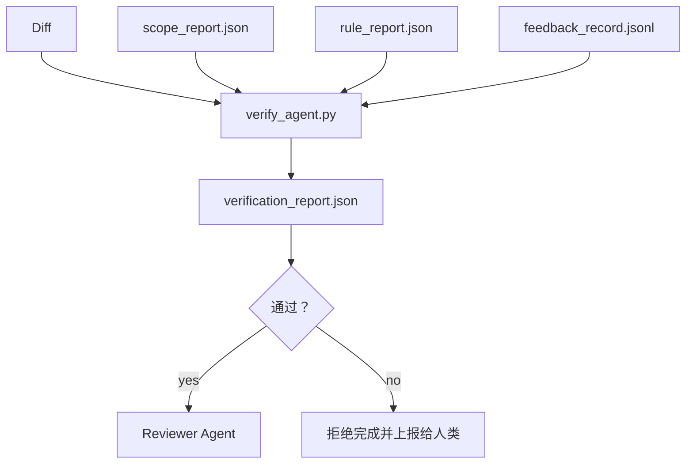

# 验证关卡（Verification Gates）

> 译注：本文译自同目录 [`en.md`](./en.md)。术语遵循仓根 [TRANSLATION_GUIDE.md](../../../../TRANSLATION_GUIDE.md)。

> agent 没资格自己给自己盖「完成」章。一道验证关卡（verification gate）会读取 scope 契约、feedback 日志、规则报告和 diff，然后只回答一个问题：这个任务真的完成了吗？关卡说没完成，那就是没完成，无论聊天里说得多漂亮。

**Type:** Build
**Languages:** Python (stdlib)
**Prerequisites:** Phase 14 · 33 (Rules), Phase 14 · 36 (Scope), Phase 14 · 37 (Feedback)
**Time:** ~55 minutes

## 学习目标（Learning Objectives）

- 把 verification gate 定义为「在 workbench（工作台）产物之上的确定性函数」。
- 把规则报告、scope 报告、feedback 记录、diff 整合为一份 verdict（裁决）。
- 产出一份 `verification_report.json`，让 reviewer（验证器）agent 和 CI 都能读。
- 任何 block 级别（block-severity）失败都拒绝放行，毫无例外。

## 问题（The Problem）

agent 太轻易宣布成功。三种典型失败模式：

- 「看起来没问题。」模型读了自己的 diff，自己拍板说对。
- 「测试通过了。」语气坚定，但没有任何「测试真的跑过」的记录。
- 「acceptance（验收）满足了。」验收标准被解读得足够松，松到「任何长得像完成的东西」都能算数。

workbench 的解法是一道单一的 verification gate：它读取 agent 已经产出的产物，然后做出判定。这道关卡是确定性的（deterministic），是进了版本控制的，是接进 CI 的。agent 没法贿赂它。

## 概念（The Concept）



### 关卡检查什么（What the gate checks）

| 检查 | 来源产物 | 严重等级 |
|-------|-----------------|----------|
| 所有验收命令都跑过 | `feedback_record.jsonl` | block |
| 所有验收命令退出码都是 0 | `feedback_record.jsonl` | block |
| Scope 检查里没有禁止写入 | `scope_report.json` | block |
| Scope 检查里没有越界写入 | `scope_report.json` | block 或 warn |
| 所有 block 级规则都通过 | `rule_report.json` | block |
| feedback 里没有 `null` 退出码 | `feedback_record.jsonl` | block |
| 改动文件在 `scope.allowed_files` 内 | 两者结合 | warn |

`warn` 类型的发现会被标注进 verdict；`block` 类型的发现会阻止 `passed: true`。

### 确定性，而不是概率性（Deterministic, not probabilistic）

同一组产物，关卡每次都得给出同一份 verdict。不要 LLM 当法官。LLM 法官属于 reviewer 那一侧（Phase 14 · 39），那里的目标是定性评估，而不是状态判定。

### 一份报告，一条路径（One report, one path）

每次任务收尾时，关卡只产出一份 `verification_report.json`，写到 `outputs/verification/<task_id>.json`。CI 也消费同一个路径。多道关卡用不同路径，等于把「事实唯一来源」分叉了。

### 拒绝，没有例外（Refuse without exception）

block 级的发现，agent 自己没法覆盖。只能由人来覆盖，而且必须留下 `override_reason` 以及 `overridden_by` 用户 id。覆盖是一次签名变更，不是 agent 的决定。

## 动手实现（Build It）

`code/main.py` 实现：

- 每个输入产物的加载器，全部本地 stub 让本课自洽。
- 一个 `verify(task_id, artifacts) -> VerdictReport` 纯函数。
- 一个打印器，逐项展示每条检查结果以及最终 pass/fail。
- 一个演示，跑三种任务情景：干净通过、scope 越界、缺失验收。

跑起来：

```
python3 code/main.py
```

输出：三份 verdict 报告，分别保存到脚本旁边。

## 生产实践（Production patterns in the wild）

四种实战模式，把这道关卡从「又一个 lint 任务」抬升到「最终拍板的边界」。

**纵深防御，而不是单点关卡。** Pre-commit hook → CI 状态检查 → pre-tool 鉴权 hook → pre-merge 关卡。每一层都是确定性的，所以一层失手下一层能接住。microservices.io 在 2026 年 3 月那份 playbook 写得很明白：pre-commit hook 是不可绕过的，因为它不像模型侧的某个 skill，它不依赖 agent 听话。verification gate 处在 CI / pre-merge 那一层。

**确定性检查打主力，模型法官只管细微判断。** Anthropic 2026 年的 Hybrid Norm（混合范式）配对：可验证奖励（单元测试、schema 检查、退出码）回答「这段代码解决问题了吗？」——LLM 量表回答「这段代码可读吗、安全吗、风格对吗？」。关卡跑前一类，reviewer（Phase 14 · 39）跑后一类。混在一起，信号就糊了。

**签名 override 日志，而不是 Slack 串。** 每次覆盖都往 `outputs/verification/overrides.jsonl` 里追一行，含：时间戳、finding 编码、原因、签名用户、当前 HEAD commit。运行时拒绝任何缺签名的覆盖；审计轨迹由 git 跟踪。这就是「真有覆盖策略」和「演给人看的覆盖剧场」之间的分界线。

**覆盖率底线作为一等检查。** 一份 `coverage_report.json` 喂给 `coverage_floor`（默认 80%）这道检查。如果测得的覆盖率掉到底线以下，或比上一次合并的底线低超过 1 个百分点，关卡就 fail。没这道检查，agent 会偷偷删掉跑挂的测试，验证报告还能一片绿。

**`--strict` 模式把 warn 升级为 block。** 对于发布分支、阻塞上线的 PR、或事故复盘，`--strict` 把每条警告都变成硬失败。这个标志按分支选择启用；不做全局默认值，因为「啥都 strict」会腐蚀日常流。

## 用起来（Use It）

生产用法：

- **CI 步骤。** 一个 `verify_agent` job 用关卡跑 agent 的最终产物。Merge 保护在 `passed: true` 之前一律拒绝。
- **Pre-handoff hook。** agent 运行时在生成 handoff（交接包）文档之前调用关卡。没拿到 verdict 绿灯，就不准 handoff。
- **人工 triage。** 当 agent 声称成功而人类怀疑时，运维人员就读这份报告。

关卡是 workbench 流里那道做最终拍板的边界。其他所有界面都在它的上游。

## 上线部署（Ship It）

`outputs/skill-verification-gate.md` 把关卡接到一个具体项目里：哪些验收命令喂给它、哪些规则属于 block 级、哪些越界写入可以容忍、override 审计日志怎么存。

## 练习（Exercises）

1. 加一道 `coverage_floor` 检查：测试命令必须产出一份覆盖率报告，且至少 80%。决定底线该由哪个产物承载。
2. 支持 `--strict` 模式，把每条 `warn` 升级成 `block`。文档化「什么场景应该把 strict 当默认」。
3. 让关卡在 JSON 之外再产出一份 Markdown 摘要。给出理由说明哪些字段该进摘要。
4. 加一道 `time_since_last_human_touch` 检查：在人类按键 60 秒内被编辑的文件，豁免越界标记。
5. 在你产品里的真实 agent diff 上跑这道关卡。多少 finding 是真的，多少是噪声？关卡需要在哪里继续长大？

## 关键术语（Key Terms）

| 术语 | 大家嘴上说的 | 实际意思 |
|------|----------------|------------------------|
| Verification gate | 「拦事的那道检查」 | 在 workbench 产物之上、产出 pass/fail verdict 的确定性函数 |
| Block severity | 「硬挂」 | 阻止 `passed: true`、且需签名覆盖的 finding |
| Override log | 「我们为什么放行」 | 含原因和用户 id 的签名条目，由 review 审计 |
| Acceptance command | 「证据」 | 退出码为 0 即代表「完成」的 shell 命令 |
| One report path | 「事实唯一来源」 | `outputs/verification/<task_id>.json`，CI 和人都从它消费 |

## 延伸阅读（Further Reading）

- [Anthropic, Harness design for long-running application development](https://www.anthropic.com/engineering/harness-design-long-running-apps)
- [OpenAI Agents SDK guardrails](https://platform.openai.com/docs/guides/agents-sdk/guardrails)
- [microservices.io, GenAI dev platform: guardrails](https://microservices.io/post/architecture/2026/03/09/genai-development-platform-part-1-development-guardrails.html) — pre-commit 与 CI 之间的纵深防御
- [ICMD, The 2026 Playbook for Agentic AI Ops](https://icmd.app/article/the-2026-playbook-for-agentic-ai-ops-guardrails-costs-and-reliability-at-scale-1776661990431) — 审批关卡阶梯（draft → approval → 阈值下自动）
- [Type-Checked Compliance: Deterministic Guardrails (arXiv 2604.01483)](https://arxiv.org/pdf/2604.01483) — Lean 4 作为确定性 gating 的上限
- [logi-cmd/agent-guardrails — merge gate spec](https://github.com/logi-cmd/agent-guardrails) — scope + 变异测试关卡
- [Guardrails AI x MLflow](https://guardrailsai.com/blog/guardrails-mlflow) — 把确定性 validator（验证器）当作 CI 评分器
- [Akira, Real-Time Guardrails for Agentic Systems](https://www.akira.ai/blog/real-time-guardrails-agentic-systems) — 工具调用前后的关卡
- Phase 14 · 27 — prompt 注入防御（这道关卡的对抗搭档）
- Phase 14 · 36 — 这道关卡执行的 scope 契约
- Phase 14 · 37 — 这道关卡评分的 feedback 日志
- Phase 14 · 39 — 这道关卡交接给的 reviewer agent
