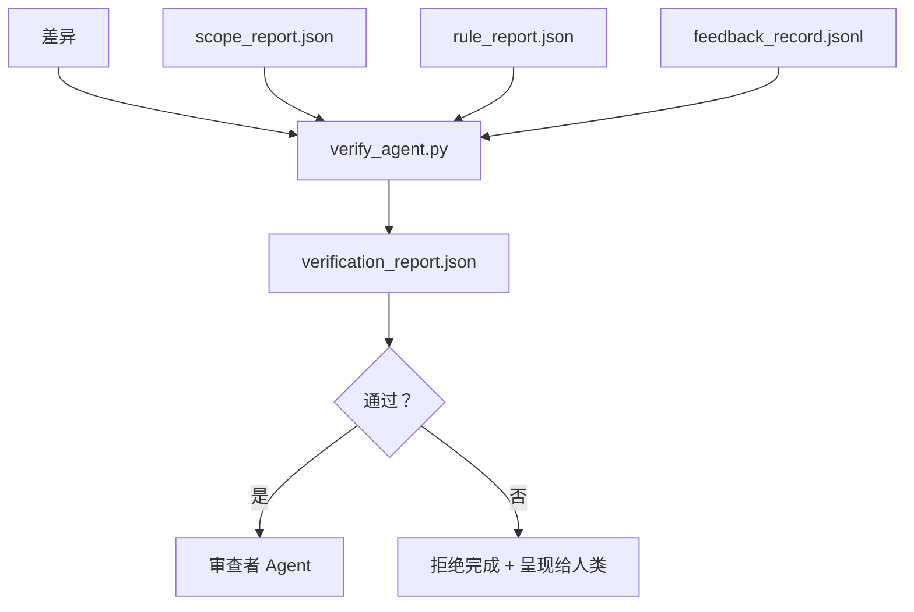

# 验证门控

> Agent 不能标记自己的工作为完成。验证门控读取范围合约、反馈日志、规则报告和差异，并回答一个单一问题：这个任务真的完成了吗？如果门控说不，任务就没有完成，无论聊天说什么。

**类型：** 构建
**语言：** Python（标准库）
**前置条件：** 第 14 阶段 · 33（规则），第 14 阶段 · 36（范围），第 14 阶段 · 37（反馈）
**时间：** ~55 分钟

## 学习目标

- 将验证门控定义为工作台工件上的确定性函数。
- 将规则报告、范围报告、反馈记录和差异组合成单一裁决。
- 发出审查者 agent 和 CI 都可以读取的 `verification_report.json`。
- 在任何 block 严重度失败时拒绝推进任务，无例外。

## 问题

Agent 太容易宣布成功。三种失败形态主导：

- "看起来不错。"模型读取自己的差异并决定它是正确的。
- "测试通过。"自信地说。没有测试实际运行的记录。
- "验收满足。"验收标准解释得足够宽松，意味着"任何类似完成的东西"。

工作台修复是一个单一的验证门控，读取 agent 已经产生的工件并做出判断。门控是确定性的。门控在版本控制中。门控接入 CI。Agent 无法贿赂它。

## 概念



### 门控检查什么

| 检查 | 来源工件 | 严重度 |
|------|---------|--------|
| 所有验收命令已运行 | `feedback_record.jsonl` | block |
| 所有验收命令零退出 | `feedback_record.jsonl` | block |
| 范围检查无禁止写入 | `scope_report.json` | block |
| 范围检查无范围外写入 | `scope_report.json` | block 或 warn |
| 所有 block 严重度规则通过 | `rule_report.json` | block |
| 反馈中无 `null` 退出代码 | `feedback_record.jsonl` | block |
| 触碰文件匹配 `scope.allowed_files` | 两者 | warn |

`warn` 发现注释裁决；`block` 发现阻止 `passed: true`。

### 确定性的，不是概率性的

门控必须对相同的工件集每次产生相同的裁决。无 LLM 评判。LLM 评判属于审查者侧（第 14 阶段 · 39），目标是定性评估，不是状态。

### 一份报告，一条路径

门控每次任务关闭发出一份 `verification_report.json`，写在 `outputs/verification/<task_id>.json` 下。CI 消费相同路径。多个门控带不同路径会分叉事实来源。

### 无例外拒绝

Block 严重度发现不能被 agent 覆盖。它们只能被人类覆盖，带记录的 `override_reason` 和 `overridden_by` 用户 id。覆盖是签名变更，不是 agent 决定。

## 构建

`code/main.py` 实现：

- 每个输入工件的加载器，全部本地存根以便课程自包含。
- `verify(task_id, artifacts) -> VerdictReport` 纯函数。
- 显示每检查结果和最终通过/失败的打印机。
- 三个任务场景的演示：干净通过、范围蔓延、缺失验收。

运行：

```
python3 code/main.py
```

输出：三份裁决报告，每份保存在脚本旁边。

## 野外生产模式

四种模式将门控从"另一个 lint 作业"提升为"决定性边缘"。

**纵深防御，不是单一门控。** 预提交钩子 → CI 状态检查 → 预工具授权钩子 → 预合并门控。每层都是确定性的，因此一层的失败被下一层捕获。microservices.io 的 2026 年 3 月剧本是明确的：预提交钩子不可绕过，因为与模型侧技能不同，它不依赖 agent 遵循指令。验证门控位于 CI / 预合并层。

**确定性检查防御，模型评判仅用于细微差别。** Anthropic 的 2026 年混合规范配对：可验证奖励（单元测试、模式检查、退出代码）回答"代码解决了问题吗？"—— LLM 评分标准回答"代码可读、安全、符合风格吗？"门控运行第一类；审查者（第 14 阶段 · 39）运行第二类。混合它们会坍缩信号。

**签名覆盖日志，不是 Slack 线程。** 每次覆盖在 `outputs/verification/overrides.jsonl` 中发出一行，包含：时间戳、发现代码、原因、签名用户、当前 HEAD 提交。运行时拒绝任何缺乏签名的覆盖；审计跟踪是 git 跟踪的。这是覆盖政策和覆盖剧场之间的界限。

**覆盖率底线作为一等检查。** `coverage_report.json` 提供 `coverage_floor`（默认 80%）检查。如果测量覆盖率低于底线或低于上次合并的底线超过 1 个百分点，门控失败。没有这个检查，agent 静默删除失败的测试，验证报告保持绿色。

**`--strict` 模式将警告提升为阻止。** 对于发布分支、发布阻止 PR 或事件后分类，`--strict` 使每个警告成为硬失败。该标志按分支选择加入；不是全局默认，因为一切严格会腐蚀日常流程。

## 使用

生产模式：

- **CI 步骤。** `verify_agent` 作业针对 agent 的最终工件运行门控。合并保护拒绝没有 `passed: true` 的情况。
- **预交接钩子。** Agent 运行时在生成交接文档之前调用门控。无绿色裁决，无交接。
- **手动分类。** 当 agent 声称成功而人类怀疑时，操作员读取报告。

门控是工作台流中的决定性边缘。每个其他表面都在它上游。

## 交付

`outputs/skill-verification-gate.md` 将门控接入特定项目：哪些验收命令供给它、哪些规则是 block 严重度、哪些范围外写入被容忍、覆盖审计日志如何存储。

## 练习

1. 添加 `coverage_floor` 检查：测试命令必须产生至少 80% 的覆盖率报告。决定哪个工件承载底线。
2. 支持将每个 `warn` 提升为 `block` 的 `--strict` 模式。记录严格模式是正确默认的情况。
3. 使门控除 JSON 外还产生 Markdown 摘要。为哪些字段属于摘要辩护。
4. 添加 `time_since_last_human_touch` 检查：人工按键后 60 秒内编辑的任何文件免于范围外标志。
5. 针对你产品的真实 agent 差异运行门控。多少发现是真实的，多少是噪声？门控需要在哪里成长？

## 关键术语

| 术语 | 人们怎么说 | 实际含义 |
|------|-----------|---------|
| Verification gate | "阻止事情的检查" | 工作台工件上的确定性函数，产生通过/失败裁决 |
| Block severity | "硬失败" | 阻止 `passed: true` 并需要签名覆盖的发现 |
| Override log | "我们为什么让它通过" | 带原因和用户 id 的签名条目，由审查审计 |
| Acceptance command | "证明" | 零退出意味着 `完成` 的 shell 命令 |
| One report path | "事实来源" | `outputs/verification/<task_id>.json`，由 CI 和人类共同消费 |

## 延伸阅读

- [Anthropic, 长程应用开发的工具设计](https://www.anthropic.com/engineering/harness-design-long-running-apps)
- [OpenAI Agents SDK 护栏](https://platform.openai.com/docs/guides/agents-sdk/guardrails)
- [microservices.io, GenAI 开发平台：护栏](https://microservices.io/post/architecture/2026/03/09/genai-development-platform-part-1-development-guardrails.html) —— 预提交和 CI 之间的纵深防御
- [ICMD, 2026 年 Agentic AI 运维剧本](https://icmd.app/article/the-2026-playbook-for-agentic-ai-ops-guardrails-costs-and-reliability-at-scale-1776661990431) —— 审批门阶梯（草稿 → 审批 → 阈值下自动）
- [Type-Checked Compliance: Deterministic Guardrails (arXiv 2604.01483)](https://arxiv.org/pdf/2604.01483) —— Lean 4 作为确定性门控的上界
- [logi-cmd/agent-guardrails — 合并门规范](https://github.com/logi-cmd/agent-guardrails) —— 范围 + 变异测试门控
- [Guardrails AI x MLflow](https://guardrailsai.com/blog/guardrails-mlflow) —— 确定性验证器作为 CI 评分器
- [Akira, Agentic 系统的实时护栏](https://www.akira.ai/blog/real-time-guardrails-agentic-systems) —— 预/后工具门控
- 第 14 阶段 · 27 —— 提示注入防御（门控的对抗对）
- 第 14 阶段 · 36 —— 此门控强制执行的范围合约
- 第 14 阶段 · 37 —— 此门控评分的反馈日志
- 第 14 阶段 · 39 —— 门控交接给的审查者 agent