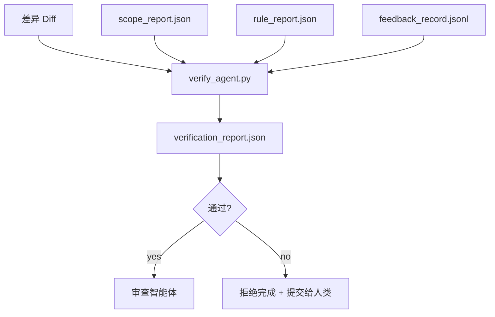

# 验证门 (Verification Gates)

> 智能体不能自行标记自己的工作为完成。验证门读取范围契约、反馈日志、规则报告和差异（diff），回答一个问题：这个任务真的完成了吗？如果门说"否"，那么无论对话怎么说，任务都未完成。

**类型：** 构建（Build）
**语言：** Python（标准库）
**前置条件：** 阶段 14 · 33（规则）、阶段 14 · 36（范围）、阶段 14 · 37（反馈）
**预计用时：** ~55 分钟

## 学习目标

- 将验证门定义为工作台工件上的确定性函数。
- 将规则报告、范围报告、反馈记录和差异（diff）合并为单一的裁决结果。
- 生成审查智能体和 CI 都能读取的 `verification_report.json`。
- 在任何阻塞级（block-severity）失败上拒绝推进任务，无一例外。

## 问题

智能体太容易宣称成功。三种失败形态最为常见：

- **"看起来没问题。"** 模型读取了自己的差异，并判定它是正确的。
- **"测试通过了。"** 说得很自信，但没有测试实际运行的记录。
- **"验收已满足。"** 验收标准被松解释到几乎等同于"任何像完成了的东西"。

工作台的解决方案是一个单一的验证门：读取智能体已经产出的工件，做出裁决。这个门是确定性的。这个门受版本控制。这个门接入 CI。智能体无法收买它。

## 概念


```mermaid
flowchart TD
  Diff[差异 Diff] --> Gate[verify_agent.py]
  Scope[scope_report.json] --> Gate
  Rules[rule_report.json] --> Gate
  Feedback[feedback_record.jsonl] --> Gate
  Gate --> Verdict[verification_report.json]
  Verdict --> Pass{通过?}
  Pass -- yes --> Review[审查智能体]
  Pass -- no --> Refuse[拒绝完成 + 提交给人类]
```

### 门检查的内容

| 检查项 | 来源工件 | 严重级别 |
|--------|----------|----------|
| 所有验收命令均已运行 | `feedback_record.jsonl` | block（阻塞） |
| 所有验收命令均以零退出 | `feedback_record.jsonl` | block |
| 范围检查无禁止写入 | `scope_report.json` | block |
| 范围检查无范围外写入 | `scope_report.json` | block 或 warn（警告） |
| 所有阻塞级规则均通过 | `rule_report.json` | block |
| 反馈中无 `null` 退出码 | `feedback_record.jsonl` | block |
| 触及的文件与 `scope.allowed_files` 匹配 | 两者 | warn |

`warn`（警告）发现会注释裁决结果；`block`（阻塞）发现会阻止 `passed: true`。

### 确定性，而非概率性

门必须对同一组工件每次产生相同的裁决结果。不允许 LLM 裁判。LLM 裁判属于审查一侧（阶段 14 · 39），其目标是定性评估，而非状态判定。

### 单一报告，单一路径

门在每个任务关闭时生成一个 `verification_report.json`，写入 `outputs/verification/<task_id>.json`。CI 消费同一路径。多个门使用不同路径会分裂事实来源。

### 无一例外地拒绝

阻塞级发现不能被智能体覆盖。只能由人类覆盖，且必须记录 `override_reason`（覆盖原因）和 `overridden_by`（覆盖者用户 ID）。覆盖是一个带签名的变更，而非智能体的决策。

## 构建它

`code/main.py` 实现：

- 每个输入工件的加载器，全部在本地使用桩（stub）实现，使课程自包含。
- 一个 `verify(task_id, artifacts) -> VerdictReport` 纯函数。
- 一个打印器，显示每个检查项的结果以及最终的通过/失败。
- 一个包含三个任务场景的演示：干净通过、范围蔓延、缺少验收。

运行它：

```
python3 code/main.py
```

输出：三个裁决报告，每个保存在脚本旁边。

## 生产环境中的实战模式

四种模式将门从"另一个 lint 任务"提升为"决胜边缘"。

**纵深防御，而非单门。** 预提交钩子 → CI 状态检查 → 预工具授权钩子 → 预合并门。每一层都是确定性的，因此一层的失败会被下一层捕获。microservices.io 的 2026 年 3 月操作手册明确指出：预提交钩子不可绕过，因为它不像模型侧的技能那样依赖于智能体遵循指令。验证门位于 CI / 预合并层。

**确定性检查为防御主体，模型裁判仅用于细微之处。** Anthropic 2026 年混合规范配对：可验证奖励（单元测试、模式检查、退出码）回答"代码是否解决了问题？"—LLM 评分标准回答"代码是否可读、安全、符合风格？"门运行第一类；审查者（阶段 14 · 39）运行第二类。混在一起会淹没信号。

**签名覆盖日志，而非 Slack 讨论串。** 每次覆盖在 `outputs/verification/overrides.jsonl` 中输出一行，包含：时间戳、发现代码、原因、签名用户、当前 HEAD 提交。运行时拒绝任何缺少签名的覆盖；审计追踪由 Git 追踪。这就是覆盖策略与覆盖表演之间的界限。

**覆盖率下限作为一等检查项。** `coverage_report.json` 为 `coverage_floor`（默认 80%）检查提供输入。如果测量覆盖率低于下限或低于上次合并的覆盖率下限超过 1 个百分点，则门失败。没有这个检查，智能体就会悄悄删除失败的测试，而验证报告依然保持绿色。

**`--strict` 模式将警告提升为阻塞。** 对于发布分支、阻塞发版的 PR 或事件事后分析，`--strict` 使每个警告成为硬性失败。该标志按分支选择启用，并非全局默认——因为事事严格会腐蚀日常流程。

## 使用它

生产场景：

- **CI 步骤。** 一个 `verify_agent` 作业针对智能体的最终工件运行门。合并保护在没有 `passed: true` 时拒绝合并。
- **预交接钩子。** 智能体运行时在生成交接文档之前调用门。没有绿色裁决，就没有交接。
- **手动分类。** 当智能体声称成功而人类怀疑时，操作员读取报告。

门是工作台流程中的决胜边缘。其他所有表面都是它的上游。

## 交付它

`outputs/skill-verification-gate.md` 将门接入特定项目：哪些验收命令为其提供输入、哪些规则是阻塞级、哪些范围外写入被容忍、覆盖审计日志如何存储。

## 练习

1. 添加一个 `coverage_floor` 检查：测试命令必须生成至少 80% 的覆盖率报告。确定哪个工件承载覆盖率下限。
2. 支持一个 `--strict` 模式，将每个 `warn` 提升为 `block`。记录严格模式作为正确默认值的情况。
3. 让门除了 JSON 之外还生成 Markdown 摘要。论证哪些字段应属于摘要。
4. 添加一个 `time_since_last_human_touch` 检查：任何在人类按键 60 秒内编辑过的文件，免除范围外标记。
5. 在实际产品的智能体差异上运行门。有多少发现是真实的，有多少是噪音？门需要在哪些方面扩展？

## 关键术语

| 术语 | 人们说的 | 实际含义 |
|------|----------|----------|
| 验证门（Verification gate） | "那个阻止事情发生的检查" | 对工作台工件产生通过/失败裁决的确定性函数 |
| 阻塞级（Block severity） | "硬性失败" | 阻止 `passed: true` 并需要签名覆盖的发现 |
| 覆盖日志（Override log） | "为什么我们放行了" | 带有原因和用户 ID 的签名条目，经审查审计 |
| 验收命令（Acceptance command） | "证据" | 其零退出码定义了"完成"含义的 Shell 命令 |
| 单一报告路径（One report path） | "事实来源" | `outputs/verification/<task_id>.json`，供 CI 和人类共同消费 |

## 延伸阅读

- [Anthropic, Harness design for long-running application development](https://www.anthropic.com/engineering/harness-design-long-running-apps)
- [OpenAI Agents SDK guardrails](https://platform.openai.com/docs/guides/agents-sdk/guardrails)
- [microservices.io, GenAI dev platform: guardrails](https://microservices.io/post/architecture/2026/03/09/genai-development-platform-part-1-development-guardrails.html) — 预提交与 CI 之间的纵深防御
- [ICMD, The 2026 Playbook for Agentic AI Ops](https://icmd.app/article/the-2026-playbook-for-agentic-ai-ops-guardrails-costs-and-reliability-at-scale-1776661990431) — 审批门阶梯（草稿 → 审批 → 阈值下自动）
- [Type-Checked Compliance: Deterministic Guardrails (arXiv 2604.01483)](https://arxiv.org/pdf/2604.01483) — Lean 4 作为确定性门控的上界
- [logi-cmd/agent-guardrails — merge gate spec](https://github.com/logi-cmd/agent-guardrails) — 范围 + 变异测试门
- [Guardrails AI x MLflow](https://guardrailsai.com/blog/guardrails-mlflow) — 作为 CI 评分器的确定性验证器
- [Akira, Real-Time Guardrails for Agentic Systems](https://www.akira.ai/blog/real-time-guardrails-agentic-systems) — 前/后工具门
- 阶段 14 · 27 — 提示注入防御（验证门的对抗配对）
- 阶段 14 · 36 — 本门强制执行的范围契约
- 阶段 14 · 37 — 本门评分的反馈日志
- 阶段 14 · 39 — 门交接给的审查智能体
