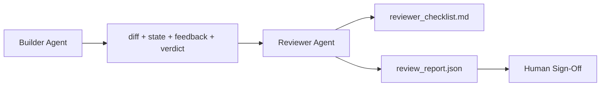

# Reviewer Agent: Builder と Marker を分ける

> code を書いた agent がそれを採点してはいけません。reviewer は、別の system prompt、別の goal、builder が生成したすべてに対する read-only access を持つ第2の loop です。builder と reviewer の間の gap に reliability の大半があります。

**種類:** Build
**言語:** Python (stdlib)
**前提:** Phase 14 · 38 (Verification Gate)
**時間:** 約55分

## 学習目標

- 同じ agent が自分の作業を reliable に review できない理由を説明する。
- builder artifacts を consume し、構造化 review report を emit する reviewer agent loop を構築する。
- vibes ではなく specific dimension を採点する reviewer rubric を作成する。
- human review step が実 artifact から始まるよう、reviewer を workbench に接続する。

## 問題

agent に bug fix を頼みます。agent は4つの file を編集し、tests を実行し、done と報告します。verification gate (Phase 14 · 38) は acceptance が実行され scope が守られたことを確認します。gate は `passed: true` と言います。あなたは merge します。2日後、その fix が bug の間違った半分を解いていたことに気づきます。

acceptance は必要ですが十分ではありません。reviewer は acceptance が問えない質問をします。これは正しい問題を解いたのか。scope を flag なしで広げていないか。疑問視すべき assumptions を document したか。次の session が引き継げる状態で workbench を残したか。

## コンセプト



### Reviewer rubric

5つの dimension を、それぞれ 0 から 2 で採点します。

| Dimension | Question |
|-----------|----------|
| Problem fit | stated task そのものを解いたか。近い別 task ではないか |
| Scope discipline | edit は contract 内に収まったか、または deliberate に contract を広げたか |
| Assumptions | hidden assumptions は review 可能な場所に書かれているか |
| Verification quality | acceptance command は goal を実際に証明しているか。それとも弱い version だけを証明したか |
| Handoff readiness | 次の session が現在 state から clean に再開できるか |

合計10点。7点未満は soft fail、5点未満は hard fail です。

### reviewer は別 model ではなく別 role

reviewer は builder と同じ model で実行できます。discipline は role separation にあります。異なる system prompt、異なる inputs、diff への write access なし。posture の変化が signal の変化です。

### reviewer は diff を編集できない

reviewer は diff、state、feedback、verdict を読みます。report を書きます。diff には patch を当てません。report が「これを fix せよ」と言うなら、次の builder turn が fix します。reviewer は review に戻ります。role を混ぜると gap が壊れます。

### Reviewer rubric と verification gate

gate (Phase 14 · 38) は deterministic facts を check します。acceptance は実行されたか、rules は pass したか、scope は守られたか。reviewer は qualitative judgments を行います。これは正しい work だったか、document されているか、handoff は usable か。両方が必要です。

## 作ってみる

`code/main.py` は次を実装しています。

- reviewer が読む artifacts をまとめる `ReviewerInputs` dataclass。
- dimension ごとに1つの function を持つ rubric scorer。lesson では deterministic で stub-grade。実装では LLM を呼びます。
- 5つの scores、total、verdict (`pass`, `soft_fail`, `hard_fail`) を持つ `review_report.json` writer。
- 2つの demo cases: clean change と「tests は正しいが problem が間違っている」change。

実行:

```
python3 code/main.py
```

出力: 2つの review report が disk に書かれ、dimension scores の console table が表示されます。

## 現場の production pattern

実績値として、Cloudflare の 2026年4月 AI Code Review system は、30日間で 5,169 repos の 48,095 merge requests に対して 131,246 review runs を実行しました。median review は 3分39秒で完了しました。最大7つの specialist reviewers (security、performance、code quality、docs、release management、compliance、Engineering Codex) が Review Coordinator の下で並列に動き、findings を deduplicate し severity を判断しました。top-tier model は coordinator 専用、specialists はより安価な tier で動きました。

scale させる pattern は4つあります。

**巨大 reviewer 1つではなく specialist pool。** 5-dimension rubric の reviewer 1つで solo repo には十分です。codebase に security-critical、performance-critical、docs surface があるなら、小さな prompt を持つ specialists に分けます。coordinator が deduplication を行い、specialists は full rubric を実行しません。model-tier separation も自然に出ます。安価な specialists、高価な coordinator です。

**optimization ではなく design requirement としての bias mitigation。** LLM judge には4つの再現性ある bias があります (Adnan Masood, 2026年4月): position bias (GPT-4 は (A,B) と (B,A) の順序で約40% inconsistent)、verbosity bias (長い output に約15% score inflation)、self-preference (同じ model family の output を好む)、authority (known authors への参照を過大評価)。mitigation: 両方の order を評価し consistent wins だけを数える、conciseness を明示的に reward する 1-4 scale を使う、model family をまたいで judges を rotate する、scoring 前に author names を strip する。

**vibes ではなく calibration set。** 正しい verdict が既知の historical set を 10-20 tasks 用意します。prompt change ごとに reviewer をその set 上で実行します。historical record との agreement が 80% 未満なら、reviewer を出荷する前に rubric を修正します。これはあらゆる team がいずれ再発見することです。最初から始める方がよいです。

**gate との Hybrid norm。** Verification gate (Phase 14 · 38) は deterministic checks (acceptance は実行されたか、tests は pass したか、scope は守られたか) を扱います。reviewer は semantic checks (これは正しい work だったか、assumptions は document されたか、handoff は usable か) を扱います。Anthropic の 2026 guidance はこの分離を明示しています。gate がすでに証明するものを reviewer に再実行させないでください。

## 使い方

Production pattern:

- **Claude Code subagents。** builder が task を close した後に reviewer subagent が走ります。rubric scores を PR comment として投稿します。
- **OpenAI Agents SDK handoffs。** builder は task completion 時に Reviewer へ hand off します。Reviewer は findings list を持って返すか、人間へ上げます。
- **Two-model pairing。** Builder は速く安い model で走ります。Reviewer はより強い model を小さめの context で使い、judgment に集中します。

reviewer は、人間がすべての review を自分で行えないときに workbench が育てる第2の目線です。

## 出荷する

`outputs/skill-reviewer-agent.md` は、project-specific な reviewer rubric、builder artifacts に接続された reviewer agent stub、そして human review が blank page ではなく written report から始まるようにする verification gate との integration を生成します。

## 演習

1. product domain 固有の6つ目の dimension を追加する。既存5つに吸収されない理由を説明する。
2. reviewer を2つの異なる system prompts (terse、verbose) で実行する。どちらの report が人間に読まれやすいか。
3. dimension ごとに `confidence` field を追加する。lowest dimension の confidence が 0.6 未満なら report の出荷を拒否する。
4. calibration set を作る。正しい verdict が既知の 10 historical task close-outs を用意し、reviewer を実行する。historical record とどこで不一致になるか。
5. "request more evidence" affordance を追加する。reviewer は scoring 前に builder に特定 test run を要求できる。loop させないための適切な back-off は何か。

## 重要用語

| 用語 | よくある言い方 | 実際の意味 |
|------|----------------|------------|
| Reviewer rubric | 「Checklist」 | dimension ごとに written question を持つ5次元 0-2 scoring |
| Soft fail | 「Needs revisions」 | total 7 未満。builder は address すべき findings を受け取る |
| Hard fail | 「Reject」 | total 5 未満、またはいずれかの dimension が 0。halt して human に surface する |
| Role separation | 「Different prompt」 | 同じ model でも両 role を担える。discipline は inputs と posture にある |
| Confidence floor | 「low-signal report を出荷しない」 | rubric が uncertain なときは verdict の emit を拒否する |

## 参考文献

- [OpenAI Agents SDK handoffs](https://platform.openai.com/docs/guides/agents-sdk/handoffs)
- [Anthropic Claude Code subagents](https://docs.anthropic.com/en/docs/agents-and-tools/claude-code/sub-agents)
- [Cloudflare, Orchestrating AI Code Review at Scale](https://blog.cloudflare.com/ai-code-review/) — 7-specialist + coordinator architecture、30日で 131k runs
- [Agent-as-a-Judge: Evaluating Agents with Agents (OpenReview / ICLR)](https://openreview.net/forum?id=DeVm3YUnpj) — DevAI benchmark、366 hierarchical solution requirements
- [Adnan Masood, Rubric-Based Evaluations and LLM-as-a-Judge: Methodologies, Biases, Empirical Validation](https://medium.com/@adnanmasood/rubric-based-evals-llm-as-a-judge-methodologies-and-empirical-validation-in-domain-context-71936b989e80) — 4つの bias と mitigations
- [MLflow, LLM-as-a-Judge Evaluation](https://mlflow.org/llm-as-a-judge) — separated builder/evaluator の production tooling
- [LangChain, How to Calibrate LLM-as-a-Judge with Human Corrections](https://www.langchain.com/articles/llm-as-a-judge) — calibration-set workflow
- [Evidently AI, LLM-as-a-judge: a complete guide](https://www.evidentlyai.com/llm-guide/llm-as-a-judge)
- [Arize, LLM as a Judge — Primer and Pre-Built Evaluators](https://arize.com/llm-as-a-judge/)
- Phase 14 · 05 — Self-Refine and CRITIC (single-agent self-review baseline)
- Phase 14 · 30 — Eval-driven agent development (calibration set generator)
- Phase 14 · 38 — reviewer が読む verification gate
- Phase 14 · 40 — reviewer report が feed する handoff packet
