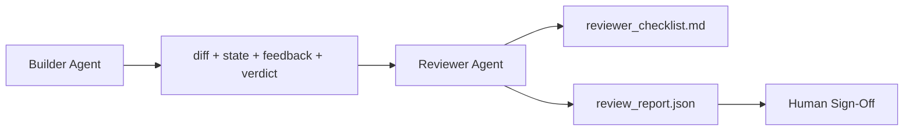

# Reviewer Agent: Separar Construtor de Avaliador

> O agent que escreveu o código não pode avaliá-lo. Um reviewer é um segundo loop com um system prompt diferente, um objetivo diferente, e acesso somente leitura a tudo que o construtor produziu. A distância entre construtor e reviewer é onde mora a maior parte da confiabilidade.

**Tipo:** Construção
**Linguagens:** Python (stdlib)
**Pré-requisitos:** Fase 14 · 38 (Gate de Verificação)
**Tempo:** ~55 minutos

## Objetivos de Aprendizado

- Explicar por que o mesmo agent não pode avaliar seu próprio trabalho de forma confiável.
- Construir um agent loop de reviewer que consome artefatos do construtor e emite um relatório de revisão estruturado.
- Criar um rubrica de reviewer que avalia dimensões específicas, não vibes.
- Integrar o reviewer ao workbench para que o passo de revisão humana comece a partir de um artefato real.

## O Problema

Você pede pro agent pra corrigir um bug. Ele edita quatro arquivos, roda os testes e reporta "feito". O gate de verificação (Fase 14 · 38) confirma que a aceitação rodou e que o escopo se manteve. O gate diz `passed: true`. Você faz merge. Dois dias depois descobre que a correção resolveu a metade errada do bug.

Aceitação é necessária, mas não suficiente. O reviewer faz as perguntas que a aceitação não consegue fazer: isso resolveu o problema certo? Expandiu o escopo sem sinalizar? Documentou premissas que deveriam ter sido questionadas? Deixou o workbench num estado que a próxima sessão consegue pegar?

## O Conceito



### Rubrica do reviewer

Cinco dimensões, cada uma pontuada de 0 a 2.

| Dimensão | Pergunta |
|-----------|----------|
| Adequação ao problema | A mudança resolveu a tarefa como descrita, ou uma tarefa diferente? |
| Disciplina de escopo | As edições ficaram restritas ao contrato, ou o contrato foi expandido deliberadamente? |
| Premissas | Todas as premissas implícitas estão documentadas em algum lugar revisável? |
| Qualidade da verificação | O comando de aceitação realmente prova o objetivo, ou provou uma versão mais fraca? |
| Prontidão de handoff | A próxima sessão consegue pegar limpo a partir do estado atual? |

Total de 10. Uma nota abaixo de 7 é um soft fail; abaixo de 5 é um hard fail.

### O reviewer é um papel separado, não um modelo separado

Você pode rodar o reviewer com o mesmo modelo do construtor. A disciplina é a separação de papéis: system prompt diferente, entradas diferentes, sem acesso de escrita ao diff. A mudança de postura é a mudança de sinal.

### O reviewer não pode editar o diff

O reviewer lê o diff, o estado, o feedback, o veredicto. Ele escreve um relatório. Ele não edita o diff. Se o relatório diz "corrigir isso", o próximo turno do construtor faz a correção; o reviewer volta a revisar. Misturar papéis anula a separação.

### Rubrica do reviewer vs. gate de verificação

O gate (Fase 14 · 38) verifica fatos determinísticos: a aceitação rodou, as regras passaram, o escopo se manteve. O reviewer faz julgamentos qualitativos: esse era o trabalho certo, está documentado, o handoff é utilizável. Ambos são necessários.

## Construa

`code/main.py` implementa:

- Uma dataclass `ReviewerInputs` que agrupa os artefatos que o reviewer lê.
- Um scoring da rubrica com uma função por dimensão. Cada função é determinística e usa valores placeholder pra aula; implementações reais chamariam um LLM.
- Um gravador de `review_report.json` com as cinco notas, o total e um veredicto (`pass`, `soft_fail`, `hard_fail`).
- Dois casos de demo: uma mudança limpa e uma mudança "testes certos, problema errado".

Execute:

```
python3 code/main.py
```

Saída: dois relatórios de revisão gravados em disco e uma tabela no console com as notas por dimensão.

## Padrões de produção no mundo real

Os números: o sistema de AI Code Review da Cloudflare de abril de 2026 rodou 131.246 revisões em 48.095 merge requests em 5.169 repos em 30 dias. A revisão mediana completou em 3 minutos 39 segundos. Até sete revisores especialistas (segurança, performance, qualidade de código, docs, gestão de release, compliance, Engineering Codex) rodaram em paralelo sob um Coordenador de Revisão que deduplicou achados e julgou severidade. Modelo de topo reservado exclusivamente para o coordenador; especialistas rodaram em tiers mais baratas.

Quatro padrões tornam isso possível em escala:

**Pool de especialistas, não um reviewer grande.** Um reviewer com rubrica de 5 dimensões funciona para repos solo. Quando o codebase tem superfícies de segurança, performance e documentação, divida em especialistas com prompts menores. O coordenador faz a deduplicação; os especialistas nunca rodam a rubrica inteira. A separação de tiers de modelo acontece naturalmente: especialistas baratos, coordenador caro.

**Mitigação de viés como requisito de design, não otimização.** LLMs julgadores mostram quatro vieses confiáveis (Adnan Masood, abril de 2026): viés de posição (GPT-4 ~40% inconsistente na ordenação (A,B) vs (B,A)), viés de verbosidade (~15% inflação de nota para saídas mais longas), autpreferência (julgadores preferem saídas do mesmo modelo), autoridade (julgadores superestimam referências a autores conhecidos). Mitigações: avaliar ambas as ordenações e contar apenas vitórias consistentes; usar escalas de 1-4 que recompensem explicitamente a concisão; rotacionar julgadores entre famílias de modelos; remover nomes de autores antes de pontuar.

**Conjunto de calibração, não vibes.** Um conjunto histórico de 10-20 tarefas com veredictos corretos conhecidos. Execute o reviewer sobre ele a cada mudança de prompt. Se a concordância com o registro histórico cair abaixo de 80%, a rubrica precisa de revisão antes do reviewer ser entregue. Isso é o que todo time acaba redescobrindo; melhor começar com isso.

**Híbrido normal com o gate.** O gate de verificação (Fase 14 · 38) lida com verificações determinísticas (aceitação rodou, testes passaram, escopo se manteve). O reviewer lida com verificações semânticas (era o trabalho certo, premissas documentadas, handoff utilizável). A orientação da Anthropic de 2026 é clara sobre essa divisão: não peça ao reviewer pra refazer o que o gate já provou.

## Use

Padrões de produção:

- **Subagents do Claude Code.** Um subagent reviewer roda depois que o construtor fecha uma tarefa. Ele posta um comentário no PR com as notas da rubrica.
- **Handoffs do OpenAI Agents SDK.** O construtor faz handoff pro Reviewer ao concluir a tarefa. O Reviewer pode devolver com uma lista de achados ou escalar pro humano.
- **Pareamento de dois modelos.** O construtor roda num modelo mais rápido e barato. O Reviewer roda num modelo mais forte com contexto menor, focado em julgamento.

O reviewer é o segundo par de olhos que o workbench ganha quando os humanos não conseguem fazer todas as revisões sozinhos.

## Entregue

`outputs/skill-reviewer-agent.md` gera uma rubrica de reviewer específica para o projeto, um stub de agent reviewer integrado aos artefatos do construtor, e uma integração com o gate de verificação para que a revisão humana comece a partir de um relatório escrito em vez de uma página em branco.

## Exercícios

1. Adicione uma sexta dimensão específica para seu domínio de produto. Defenda por que ela não é absorvida pelas cinco existentes.
2. Rode o reviewer com dois system prompts diferentes (conciso, verboso). Qual produz um relatório que um humano é mais propenso a ler?
3. Adicione um campo `confidence` por dimensão. Recuse-se a entregar o relatório quando a confiança na dimensão mais baixa estiver abaixo de 0.6.
4. Construa um conjunto de calibração: 10 fechamentos históricos de tarefas com veredictos corretos conhecidos. Execute o reviewer sobre eles. Onde ele discorda do registro histórico?
5. Adicione um recurso de "solicitar mais evidências": o reviewer pode pedir ao construtor um teste específico antes de pontuar. Qual o backoff correto para isso não entrar em loop?

## Termos-Chave

| Termo | O que a galera fala | O que realmente significa |
|-------|---------------------|--------------------------|
| Reviewer rubric | "Checklist" | Scoring de 5 dimensões (0-2) com uma pergunta escrita por dimensão |
| Soft fail | "Precisa de revisões" | Total abaixo de 7; construtor recebe achados pra corrigir |
| Hard fail | "Rejeitar" | Total abaixo de 5 ou qualquer dimensão em 0; pausar e escalar pro humano |
| Role separation | "Prompt diferente" | O mesmo modelo pode ser ambos os papéis; a disciplina é nas entradas e na postura |
| Confidence floor | "Não entregar relatórios de sinal fraco" | Recusar-se a emitir veredicto quando a rubrica é incerta |

## Leitura Complementar

- [OpenAI Agents SDK handoffs](https://platform.openai.com/docs/guides/agents-sdk/handoffs)
- [Anthropic Claude Code subagents](https://docs.anthropic.com/en/docs/agents-and-tools/claude-code/sub-agents)
- [Cloudflare, Orchestrating AI Code Review at Scale](https://blog.cloudflare.com/ai-code-review/) — arquitetura de 7 especialistas + coordenador, 131k execuções / 30 dias
- [Agent-as-a-Judge: Evaluating Agents with Agents (OpenReview / ICLR)](https://openreview.net/forum?id=DeVm3YUnpj) — DevAI benchmark, 366 requirements hierárquicos de solução
- [Adnan Masood, Rubric-Based Evaluations and LLM-as-a-Judge: Methodologies, Biases, Empirical Validation](https://medium.com/@adnanmasood/rubric-based-evals-llm-as-a-judge-methodologies-and-empirical-validation-in-domain-context-71936b989e80) — os 4 vieses e mitigações
- [MLflow, LLM-as-a-Judge Evaluation](https://mlflow.org/llm-as-a-judge) — ferramenta de produção para separação construtor/avaliador
- [LangChain, How to Calibrate LLM-as-a-Judge with Human Corrections](https://www.langchain.com/articles/llm-as-a-judge) — workflow de conjunto de calibração
- [Evidently AI, LLM-as-a-judge: a complete guide](https://www.evidentlyai.com/llm-guide/llm-as-a-judge)
- [Arize, LLM as a Judge — Primer and Pre-Built Evaluators](https://arize.com/llm-as-a-judge/)
- Fase 14 · 05 — Self-Refine e CRITIC (baseline de autoavaliação com agent único)
- Fase 14 · 30 — Desenvolvimento de agentes orientado a evals (gerador de conjunto de calibração)
- Fase 14 · 38 — o gate de verificação que o reviewer lê
- Fase 14 · 40 — o pacote de handoff que o relatório do reviewer alimenta
