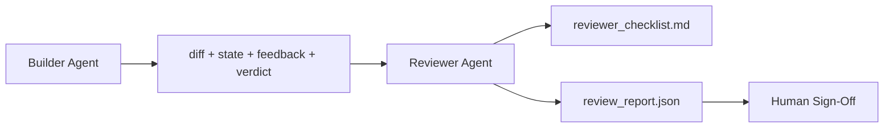

# İncelemeci Agent: Oluşturucuyu İşaretçiden Ayırın

> Kodu yazan agent not veremez. İnceleyici, farklı bir sisteme prompt, farklı bir hedefe ve geliştiricinin ürettiği her şeye salt okunur erişime sahip ikinci bir döngüdür. Oluşturucu ve inceleyen arasındaki boşluk, güvenilirliğin çoğunun yaşadığı yerdir.

**Tür:** Yapım
**Diller:** Python (stdlib)
**Önkoşullar:** Aşama 14 · 38 (Doğrulama Kapısı)
**Süre:** ~55 dakika

## Öğrenme Hedefleri

- Aynı agent'nin neden kendi çalışmasını güvenilir bir şekilde inceleyemediğini belirtin.
- Oluşturucu artifact'ları tüketen ve yapılandırılmış bir inceleme raporu yayınlayan bir incelemeci agent loop oluşturun.
- Titreşimleri değil, belirli boyutları derecelendiren bir inceleme değerlendirme listesi yazın.
- İnsan tarafından yapılan inceleme adımının gerçek bir artifact ile başlaması için incelemeciyi çalışma tezgahına bağlayın.

## Sorun

agent'dan bir hatayı düzeltmesini istersiniz. Dört dosyayı düzenler, testleri çalıştırır ve raporlar hazırlanır. Doğrulama kapısı (Aşama 14 · 38) kabulün gerçekleştirildiğini ve kapsamın tutulduğunu doğrular. Kapıda `passed: true` yazıyor. Sen birleş. İki gün sonra düzeltmenin hatanın yanlış yarısını çözdüğünü görüyorsunuz.

Kabul gerekli, yeterli değil. İncelemeyi yapan kişi, kabulün soramayacağı soruları sorar: Bu doğru sorunu çözdü mü? Kapsamı işaretlemeden genişletti mi? Sorgulanması gereken varsayımları belgeledi mi? Tezgahı bir sonraki oturumun alabileceği bir durumda mı bıraktı?

## Konsept



### İnceleme değerlendirme anahtarı

Her biri 0'dan 2'ye kadar puan alan beş boyut.

| Boyut | Soru |
|-----------|----------|
| Sorun uyumu | Değişiklik, yakındaki bir görevi değil, belirtildiği gibi görevi çözdü mü? |
| Kapsam disiplini | Düzenlemeler sözleşmeyle sınırlı mıydı yoksa sözleşme kasıtlı olarak mı genişletildi? |
| Varsayımlar | Tüm gizli varsayımlar incelenebilir bir yere yazılmış mı? |
| Doğrulama kalitesi | Kabul komutu gerçekten amacı mı kanıtlıyor yoksa daha zayıf bir versiyonunu mu kanıtlıyor? |
| Devir teslimine hazırlık | Bir sonraki oturum mevcut durumdan temiz bir şekilde devam edebilir mi? |

Toplam 10 üzerinden. 7'nin altındaki bir sayı geçici başarısızlıktır; 5'in altında bir koşu zor bir başarısızlıktır.

### İncelemeci ayrı bir model değil, ayrı bir roldür

İnceleyiciyi oluşturucuyla aynı modelle çalıştırabilirsiniz. Disiplin, rol ayrımıdır: farklı sistem prompt, farklı girişler, farka yazma erişimi yok. Duruştaki değişiklik sinyaldeki değişikliktir.

### Gözden geçiren kişi farkı düzenleyemez

İncelemeyi yapan kişi farkı, durumu, geri bildirimi ve kararı okur. Bir rapor yazıyor. Farkı düzeltmez. Raporda "bunu düzeltin" yazıyorsa, bir sonraki inşaatçı sırası düzeltmeyi yapar; gözden geçiren kişi incelemeye geri döner. Rolleri karıştırmak aradaki farkı ortadan kaldırır.

### İnceleme değerlendirme tablosu ve doğrulama kapısı

Kapı (Aşama 14.38) deterministik gerçekleri kontrol eder: kabul gerçekleşti mi, kurallar geçti mi, kapsam tutuldu mu? İncelemeyi yapan kişi niteliksel yargılarda bulunur: bu doğru iş miydi, belgelendi mi, devir kullanılabilir mi? Her ikisi de gereklidir.

## İnşa Et

`code/main.py` şunu uygular:

- İnceleyenin okuduğu artifact'ları paketleyen bir `ReviewerInputs` veri sınıfı.
- Boyut başına bir işleve sahip bir değerlendirme listesi puanlayıcı. Her işlev deterministiktir ve ders için saplama niteliğindedir; gerçek uygulamalara LLM denir.
- Beş puanı, toplamı ve hükmü olan bir `review_report.json` yazarı (`pass`, {`soft_fail`, `hard_fail`).
- İki demo durumu: temiz bir değişiklik ve "doğru testler, yanlış problem" değişikliği.

Çalıştır:

```
python3 code/main.py
```

Çıktı: diske yazılan iki inceleme raporu ve boyutsal puanların bir konsol tablosu.

## Vahşi doğada üretim modelleri

Makbuzlar: Cloudflare'in Nisan 2026 AI Kod İnceleme sistemi, 30 gün içinde 5.169 depoda 48.095 birleştirme isteğinde 131.246 inceleme çalıştırması gerçekleştirdi. Medyan inceleme 3 dakika 39 saniyede tamamlandı. Yediye kadar uzman incelemeci (güvenlik, performans, kod kalitesi, belgeler, sürüm yönetimi, uyumluluk, Mühendislik Kodeksi), bulguları tekilleştiren ve ciddiyeti değerlendiren bir İnceleme Koordinatörü altında paralel olarak çalıştı. Yalnızca koordinatöre ayrılmış üst düzey model; uzmanlar daha ucuz katmanlarda koşuyordu.

Dört model bu işi geniş ölçekte gerçekleştirir.

**Uzman havuzu, tek bir büyük incelemeci değil.** 5 boyutlu değerlendirme tablosuna sahip bir incelemeci, solo depolar için işe yarar. Kod tabanı güvenlik açısından kritik, performans açısından kritik ve dokümanlar yüzeylerine sahip olduğunda, daha küçük prompt'lere sahip uzmanlara bölünür. Koordinatör tekilleştirmeyi yapar; uzmanlar asla değerlendirme listesinin tamamını yürütmezler. Model kademesi ayrımı ortadan kalkıyor: ucuz uzmanlar, pahalı koordinatörler.

**Optimizasyon değil, tasarım gereği olarak yanlılığın azaltılması.** Yüksek Lisans jürileri dört güvenilir önyargı göstermektedir (Adnan Masood, Nisan 2026): konum önyargısı (GPT-4 ~(A,B) ve (B,A) sıralamasında ~%40 tutarsızdır), ayrıntı yanlılığı (~%15 daha uzun çıktılara yönelik puan enflasyonu), kişisel tercih (yargıçlar aynı model aileden çıktıları tercih eder), otorite (yargıçlar bilinen yazarlara aşırı oranlı referanslar verir). Azaltmalar: Her iki sıralamayı da değerlendirin ve yalnızca tutarlı kazançları sayın; Kısa ve öz olmayı açıkça ödüllendiren 1-4 arası ölçekler kullanın; Jürileri model aileler arasında dönüşümlü olarak kullanın; puanlamadan önce yazar adlarını çıkarın.

**Titreşimler değil, kalibrasyon seti.** Bilinen doğru kararlara sahip 10-20 görev geçmiş seti. Her prompt değişiklikte incelemeciyi bunun üzerinden geçirin. Geçmiş kayıtlarla uyum %80'in altına düşerse, incelemeyi yapan kişi gönderilmeden önce değerlendirme listesinin revize edilmesi gerekir. Her takımın sonunda yeniden keşfettiği şey budur; onunla başlamak daha iyi.

**Kapı ile hibrit norm.** Doğrulama kapısı (Aşama 14 · 38) deterministik kontrolleri yönetir (kabul çalıştırıldı mı, testler geçti mi, kapsam tutuldu mu). Gözden geçiren kişi anlamsal kontrolleri gerçekleştirir (bu doğru çalışma mıydı, varsayımlar belgelendi mi, aktarım kullanılabilir mi). Anthropic'in 2026 kılavuzu bu bölünmeyle ilgili çok açık: İncelemeciden, kapının zaten kanıtladığı şeyi tekrarlamasını istemeyin.

## Kullan onu

Üretim modelleri:

- **Claude Code subagents.** Bir gözden geçiren altagent, oluşturucu bir görevi kapattıktan sonra çalışır. Dereceli puanlama anahtarı puanlarıyla PR hakkında bir yorum yayınlar.
- **OpenAI Agent'nin SDK aktarımları.** Oluşturucu, görev tamamlandığında Gözden Geçiren'e devreder. İncelemeyi yapan kişi bulguların bir listesini veya bir kişiye teslim edebilir.
- **İki modelli eşleştirme.** Builder daha hızlı ve daha ucuz bir model üzerinde çalışır. İncelemeyi yapan kişi, daha küçük bağlama sahip, daha güçlü bir model üzerinde çalışır ve yargıya odaklanır.

Gözden geçiren kişi, insanların her incelemeyi kendi başına yapamadığı durumlarda tezgahta büyüyen ikinci çift gözdür.

## Gönderin

`outputs/skill-reviewer-agent.md`, projeye özel bir inceleme değerlendirme listesi, oluşturucunun artifact'lerine bağlı bir incelemeci agent saplaması oluşturur ve doğrulama kapısıyla bir entegrasyon sağlar; böylece insan incelemesi boş bir sayfa yerine yazılı bir rapordan başlar.

## Egzersizler

1. Ürün alanınıza özel altıncı bir boyut ekleyin. Neden mevcut beş tarafından absorbe edilmediğini savunun.
2. İnceleyiciyi iki farklı sistem prompt'yle (kısa, ayrıntılı) çalıştırın. Hangisi bir insanın okuma olasılığının daha yüksek olduğu bir rapor üretir?
3. Boyut başına bir `confidence` alanı ekleyin. En düşük boyuttaki güven 0,6'nın altında olduğunda raporu göndermeyi reddedin.
4. Bir kalibrasyon seti oluşturun: Bilinen doğru kararlara sahip 10 geçmiş görev kapanışı. İncelemeciyi bunların üzerinden geçirin. Tarihsel kayıtlarla nerede çelişiyor?
5. "Daha fazla kanıt talep etme" olanağı ekleyin: Gözden geçiren kişi, puanlamadan önce inşaatçıdan belirli bir test çalıştırması isteyebilir. Bunun döngüye girmemesi için sağ geri çekilme nedir?

## Anahtar Terimler

| Dönem | İnsanlar ne diyor | Aslında ne anlama geliyor |
|------|----------------|------------------------|
| İnceleyici değerlendirme tablosu | "Kontrol Listesi" | Her boyut için yazılı soruyla beş boyutlu 0-2 puanlama |
| Yumuşak başarısızlık | "Revizyon gerekiyor" | Toplam 7'nin altında; inşaatçı bulguları ele alıyor |
| Zor başarısızlık | "Reddet" | Toplam 5'in altında veya herhangi bir boyut 0'da; dur ve insana yüzeye çık |
| Rol ayrımı | "Farklı prompt" | Aynı model her iki rol de olabilir; disiplin girdiler ve duruştur |
| Güven zemini | "Düşük sinyal raporlarını göndermeyin" | Değerlendirme listesi belirsiz olduğunda karar vermeyi reddedin |

## Daha Fazla Okuma

- [OpenAI Agent'nin SDK aktarımları](https://openai.github.io/openai-agents-python/handoffs/)
- [Antropik Claude Kodu altagent'ları](https://code.claude.com/docs/en/sub-agents)
- [Cloudflare, Yapay Zeka Kod İncelemesini Geniş Ölçekte Düzenleme](https://blog.cloudflare.com/ai-code-review/) — 7 uzman + koordinatör mimarisi, 131 bin çalıştırma / 30 gün
- [Agent-as-a-Judge: Agent'leri Agent'larla değerlendirmek (OpenReview / ICLR)](https://openreview.net/forum?id=DeVm3YUnpj) — DevAI benchmark, 366 hiyerarşik çözüm gereksinimleri
- [Adnan Masood, Değerlendirme Listesi Tabanlı Değerlendirmeler ve Hakim Olarak Yüksek Lisans: Metodolojiler, Önyargılar, Deneysel Doğrulama](https://medium.com/@adnanmasood/rubric-based-evals-llm-as-a-judge-methodologies-and-empirical-validation-in-domain-context-71936b989e80) — 4 önyargı ve hafifletme
- [MLflow, Yargıç Olarak Yüksek Lisans Değerlendirmesi](https://mlflow.org/llm-as-a-judge) — ayrı oluşturucu/değerlendirici için üretim araçları
- [LangChain, Yüksek Lisans Lisansını İnsani Düzeltmelerle Hakim Olarak Kalibre Etme](https://www.langchain.com/articles/llm-as-a-judge) — kalibrasyon seti iş akışı
- [Açıkçası yapay zeka, yargıç olarak yüksek lisans: eksiksiz bir rehber](https://www.evidentlyai.com/llm-guide/llm-as-a-judge)
- [Arize, Yargıç Olarak Yüksek Lisans - Başlangıç ​​ve Hazır Değerlendiriciler](https://arize.com/llm-as-a-judge/)
- Aşama 14 · 05 — Kendini Geliştirme ve ELEŞTİRME (tek-agent kendi kendini inceleme temel çizgisi)
- Aşama 14 · 30 — Değerlendirme odaklı agent geliştirme (kalibrasyon seti oluşturucu)
- Aşama 14 · 38 — inceleyenin okuduğu doğrulama kapısı
- Aşama 14 · 40 — inceleyen raporun beslediği aktarım paketi
