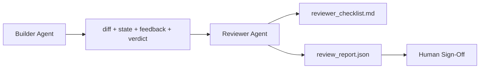

# 39 · 评审 Agent：把建造者与评分者分开

> 写代码的 Agent 无法给自己的代码打分。评审者（reviewer）是第二个循环，它有不同的系统提示、不同的目标，并且对建造者产出的一切只拥有只读访问权。建造者与评审者之间的这道缝隙，正是大部分可靠性的来源。

**类型：** 实战构建
**语言：** Python（标准库）
**前置：** 阶段 14 · 38（验证门禁）
**时长：** 约 55 分钟

## 学习目标

- 阐明为什么同一个 Agent 无法可靠地评审自己的工作。
- 构建一个评审 Agent 循环，它消费建造者产出的工件（artifact），并输出一份结构化的评审报告。
- 编写一份评审评分量表（rubric），针对具体维度打分，而不是凭感觉。
- 把评审者接入工作台（workbench），让人工评审环节从一份真实的工件开始，而不是从一张白纸开始。

## 问题所在

你让 Agent 修一个 bug。它改了四个文件，跑了测试，报告完成。验证门禁（阶段 14 · 38）确认验收命令跑过了，作用域也守住了。门禁返回 `passed: true`。你合并了代码。两天后你发现：这个修复解决的是 bug 错误的那一半。

验收是必要的，但不是充分的。评审者会去问那些验收无法回答的问题：这是否解决了正确的问题？它是否在没有明示的情况下扩大了作用域？它是否记录了那些本该被质疑的假设？它有没有把工作台留在下一次会话可以接手的状态？

## 核心概念



### 评审评分量表

五个维度，每个维度打 0 到 2 分。

| 维度 | 问题 |
|-----------|----------|
| 问题契合度 | 这次改动解决的是任务所陈述的问题，还是一个相邻的问题？ |
| 作用域纪律 | 改动是否限定在契约（contract）范围内，还是契约被有意识地扩大了？ |
| 假设 | 所有隐含假设是否都写在了某个可供评审的地方？ |
| 验证质量 | 验收命令是否真正证明了目标，还是只证明了一个更弱的版本？ |
| 交接就绪度 | 下一次会话能否从当前状态干净利落地接手？ |

总分 10 分。低于 7 分的运行是软失败（soft fail）；低于 5 分的运行是硬失败（hard fail）。

### 评审者是一个独立的角色，而不是一个独立的模型

你完全可以用与建造者相同的模型来运行评审者。纪律在于角色分离（role separation）：不同的系统提示、不同的输入、对 diff 没有写入权限。姿态的改变就是信号的改变。

### 评审者不能编辑 diff

评审者读取 diff、state、feedback、verdict，然后写出一份报告。它不打补丁去改 diff。如果报告说「修掉这个」，那么由下一轮建造者来做修复；评审者继续回去做评审。混淆角色会毁掉这道缝隙。

### 评审评分量表与验证门禁的区别

门禁（阶段 14 · 38）检查的是确定性事实：验收有没有跑、规则有没有通过、作用域有没有守住。评审者做的是定性判断：这是不是正确的工作、有没有记录、交接是否可用。两者都不可或缺。

## 动手构建

`code/main.py` 实现了：

- 一个 `ReviewerInputs` 数据类（dataclass），把评审者要读取的工件打包在一起。
- 一个评分量表打分器，每个维度对应一个函数。出于教学目的，每个函数都是确定性的、桩级别（stub-grade）的实现；真实实现会调用 LLM。
- 一个 `review_report.json` 写入器，包含五项分数、总分以及一个判定结果（`pass`、`soft_fail`、`hard_fail`）。
- 两个演示用例：一个干净的改动，以及一个「测试写对了，问题搞错了」的改动。

运行它：

```
python3 code/main.py
```

输出：两份评审报告写入磁盘，以及一张各维度分数的控制台表格。

## 业界的生产实践模式

实证依据：Cloudflare 在 2026 年 4 月的 AI 代码评审系统，在 30 天内、横跨 5,169 个仓库的 48,095 个合并请求上，跑了 131,246 次评审运行。评审完成时间的中位数为 3 分 39 秒。至多七个专家评审者（安全、性能、代码质量、文档、发布管理、合规、Engineering Codex）在一个 Review Coordinator（评审协调者）的统筹下并行运行，协调者负责对发现去重并判定严重程度。顶级模型专门留给协调者使用；专家评审者跑在更便宜的层级上。

有四种模式让这套体系在规模化时仍然奏效。

**专家池，而非一个大而全的评审者。** 对于单人维护的仓库，一个带 5 维量表的评审者就够了。一旦代码库出现安全关键、性能关键以及文档等不同面向，就拆分成各自带较小提示的专家。协调者负责去重；专家从不运行完整的量表。模型层级分离也随之自然落地：便宜的专家、昂贵的协调者。

**偏差缓解是设计要求，而非优化项。** LLM 评委（judge）表现出四种稳定的偏差（Adnan Masood，2026 年 4 月）：位置偏差（position bias，GPT-4 在 (A,B) 与 (B,A) 排序上约有 40% 不一致）、冗长偏差（verbosity bias，对更长的输出约有 15% 的分数虚高）、自我偏好（self-preference，评委偏好来自同一模型家族的输出）、权威偏差（authority，评委会高估对知名作者的引用）。缓解办法：对两种排序都评估，只统计一致胜出的情形；采用 1–4 分制并明确奖励简洁；在不同模型家族间轮换评委；打分前剥离作者姓名。

**校准集，而非凭感觉。** 一个由 10–20 个任务组成、判定结果已知正确的历史任务集。每次改提示时都让评审者在它上面跑一遍。如果与历史记录的一致率掉到 80% 以下，那么这套量表在评审者上线前需要修订。这是每个团队最终都会重新发现的道理；不如一开始就这么做。

**与门禁形成混合规范。** 验证门禁（阶段 14 · 38）处理确定性检查（验收有没有跑、测试有没有通过、作用域有没有守住）。评审者处理语义检查（这是不是正确的工作、假设有没有记录、交接是否可用）。Anthropic 在 2026 年的指南中对这种分工说得很明确：不要让评审者去重做门禁已经证明过的事情。

## 用起来

生产实践模式：

- **Claude Code 子 Agent（subagents）。** 一个评审子 Agent 在建造者关闭任务后运行。它会在 PR 上贴一条评论，附上量表分数。
- **OpenAI Agents SDK 交接（handoffs）。** 建造者在任务完成时交接给评审者。评审者可以带着一份发现清单交接回去，或者上交给人类。
- **双模型配对。** 建造者跑在更快更便宜的模型上。评审者跑在更强的模型上，上下文较小，专注于判断。

当人类无法亲自做每一次评审时，评审者就是工作台长出的第二双眼睛。

## 交付

`outputs/skill-reviewer-agent.md` 会生成一份项目专属的评审评分量表、一个接入建造者工件的评审 Agent 桩，以及一个与验证门禁的集成，使人工评审从一份书面报告开始，而不是从一张白纸开始。

## 练习

1. 添加一个针对你产品领域的第六个维度。论证为什么它没有被现有五个维度吸收掉。
2. 用两种不同的系统提示（简练版、冗长版）运行评审者。哪一种产出的报告更可能被人读完？
3. 给每个维度添加一个 `confidence`（置信度）字段。当最低维度的置信度低于 0.6 时，拒绝交付该报告。
4. 构建一个校准集：10 个判定结果已知正确的历史任务收尾。让评审者在它们上面跑一遍。它在哪里与历史记录产生了分歧？
5. 添加一个「请求更多证据」的能力：评审者可以在打分前向建造者索要某次特定的测试运行。怎样的退避（back-off）策略才合适，才不会让它陷入循环？

## 关键术语

| 术语 | 人们的说法 | 实际含义 |
|------|----------------|------------------------|
| 评审评分量表（Reviewer rubric） | 「清单」 | 五维度 0–2 分制，每个维度配一个书面问题 |
| 软失败（Soft fail） | 「需要修订」 | 总分低于 7；建造者拿到发现去处理 |
| 硬失败（Hard fail） | 「拒绝」 | 总分低于 5，或任一维度为 0；停下并上交给人类 |
| 角色分离（Role separation） | 「不同的提示」 | 同一模型可以同时担任两个角色；纪律在于输入与姿态 |
| 置信度下限（Confidence floor） | 「别交付低信号的报告」 | 当量表不确定时，拒绝给出判定结果 |

## 延伸阅读

- [OpenAI Agents SDK 交接](https://platform.openai.com/docs/guides/agents-sdk/handoffs)
- [Anthropic Claude Code 子 Agent](https://docs.anthropic.com/en/docs/agents-and-tools/claude-code/sub-agents)
- [Cloudflare，规模化编排 AI 代码评审](https://blog.cloudflare.com/ai-code-review/) — 7 专家 + 协调者架构，30 天内 13.1 万次运行
- [Agent-as-a-Judge：用 Agent 评估 Agent（OpenReview / ICLR）](https://openreview.net/forum?id=DeVm3YUnpj) — DevAI 基准，366 条分层解决方案需求
- [Adnan Masood，基于量表的评估与 LLM-as-a-Judge：方法论、偏差与实证验证](https://medium.com/@adnanmasood/rubric-based-evals-llm-as-a-judge-methodologies-and-empirical-validation-in-domain-context-71936b989e80) — 四种偏差及其缓解办法
- [MLflow，LLM-as-a-Judge 评估](https://mlflow.org/llm-as-a-judge) — 用于分离建造者/评估者的生产工具
- [LangChain，如何用人工修正校准 LLM-as-a-Judge](https://www.langchain.com/articles/llm-as-a-judge) — 校准集工作流
- [Evidently AI，LLM-as-a-judge：完整指南](https://www.evidentlyai.com/llm-guide/llm-as-a-judge)
- [Arize，LLM as a Judge — 入门与预置评估器](https://arize.com/llm-as-a-judge/)
- 阶段 14 · 05 — Self-Refine 与 CRITIC（单 Agent 自我评审基线）
- 阶段 14 · 30 — 评估驱动的 Agent 开发（校准集生成器）
- 阶段 14 · 38 — 评审者要读取的验证门禁
- 阶段 14 · 40 — 由评审者报告喂入的交接包（handoff packet）
