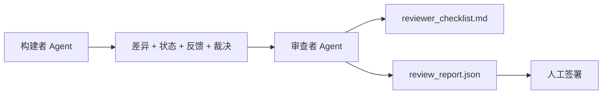

# 审查者 Agent：将构建者与评分者分开

> 编写代码的 agent 不能给它评分。审查者是具有不同系统提示、不同目标和只读访问构建者所产出一切内容的第二个循环。构建者与审查者之间的差距是大多数可靠性的所在。

**类型：** 构建
**语言：** Python（标准库）
**前置条件：** 第 14 阶段 · 38（验证门控）
**时间：** ~55 分钟

## 学习目标

- 说明为什么同一个 agent 不能可靠地审查自己的工作。
- 构建一个消费构建者工件并发出结构化审查报告的审查者 agent 循环。
- 编写一个针对特定维度而非感觉的审查者评分标准。
- 将审查者接入工作台，使人工审查步骤从真实工件开始。

## 问题

你要求 agent 修复一个 bug。它编辑四个文件，运行测试，并报告完成。验证门控（第 14 阶段 · 38）确认验收已运行且范围保持。门控说 `passed: true`。你合并。两天后你发现修复解决了 bug 的错误一半。

验收是必要但不充分的。审查者提出验收无法提出的问题：这解决了正确的问题吗？它是否在没有标记的情况下扩展了范围？它是否记录了应该被质疑的假设？它是否将工作台留在下一个会话可以继续的状态？

## 概念



### 审查者评分标准

五个维度，每个评分 0 到 2。

| 维度 | 问题 |
|------|------|
| 问题契合 | 变更是否解决了所述任务，而非附近的任务？ |
| 范围纪律 | 编辑是否限于合约，还是合约被故意扩大？ |
| 假设 | 所有隐藏假设是否都写在某个可审查的地方？ |
| 验证质量 | 验收命令是否实际证明了目标，还是证明了更弱的版本？ |
| 交接就绪 | 下一个会话能否从当前状态干净地继续？ |

总分 10 分。低于 7 分的运行是软失败；低于 5 分的运行是硬失败。

### 审查者是单独的角色，不是单独的模型

你可以用与构建者相同的模型运行审查者。纪律是角色分离：不同的系统提示、不同的输入、对差异无写入访问。姿态的改变就是信号的改变。

### 审查者不能编辑差异

审查者读取差异、状态、反馈、裁决。它写入报告。它不修补差异。如果报告说"修复这个"，下一个构建者轮次进行修复；审查者回到审查。混合角色会破坏差距。

### 审查者评分标准与验证门控

门控（第 14 阶段 · 38）检查确定性事实：验收是否运行、规则是否通过、范围是否保持。审查者做出定性判断：这是否是正确的工作、是否有文档记录、交接是否可用。两者都是必需的。

## 构建

`code/main.py` 实现：

- 一个 `ReviewerInputs` 数据类，捆绑审查者读取的工件。
- 一个评分标准评分器，每个维度一个函数。每个函数是确定性的，为课程存根评分；真实实现会调用 LLM。
- 一个 `review_report.json` 写入器，包含五个分数、总分和裁决（`pass`、`soft_fail`、`hard_fail`）。
- 两个演示案例：一个干净变更和一个"测试正确、问题错误"的变更。

运行：

```
python3 code/main.py
```

输出：两份写入磁盘的审查报告和维度分数的控制台表格。

## 野外生产模式

收据：Cloudflare 的 2026 年 4 月 AI 代码审查系统在 30 天内跨 5,169 个仓库的 48,095 个合并请求中运行了 131,246 次审查运行。中位审查在 3 分 39 秒内完成。多达七名专家审查者（安全、性能、代码质量、文档、发布管理、合规、工程法典）在审查协调器下并行运行，协调器去重发现并判断严重度。顶级模型专门保留给协调器；专家在更便宜的层级上运行。

四种模式使其在大规模下工作。

**专家池，不是一个大审查者。** 一个带 5 维度评分标准的审查者适用于个人仓库。一旦代码库有安全关键、性能关键和文档表面，拆分为带更小提示的专家。协调器做去重；专家从不运行完整评分标准。模型层级分离随之而来：便宜的专家，昂贵的协调器。

**偏见缓解作为设计要求，不是优化。** LLM 评判显示四种可靠偏见（Adnan Masood，2026 年 4 月）：位置偏见（GPT-4 在 (A,B) 与 (B,A) 排序上约 40% 不一致）、冗长偏见（~15% 分数膨胀向更长输出）、自我偏好（评判者偏好来自同模型家族的输出）、权威（评判者高估对已知作者的引用）。缓解措施：评估两种排序并只计算一致胜利；使用明确奖励简洁性的 1-4 量表；跨模型家族轮换评判者；评分前剥离作者姓名。

**校准集，不是感觉。** 一个 10-20 任务的已知正确裁决的历史集。每次提示变更时在其上运行审查者。如果与历史记录的一致性低于 80%，评分标准需要在审查者发布前修订。这是每个团队最终重新发现的；最好从它开始。

**与门控的混合规范。** 验证门控（第 14 阶段 · 38）处理确定性检查（验收是否运行、测试是否通过、范围是否保持）。审查者处理语义检查（这是否是正确的工作、假设是否有文档记录、交接是否可用）。Anthropic 的 2026 年指导对此分割是明确的：不要要求审查者重做门控已经证明的。

## 使用

生产模式：

- **Claude Code 子 agent。** 构建者关闭任务后，审查者子 agent 运行。它在 PR 上发布带评分标准分数的评论。
- **OpenAI Agents SDK 交接。** 构建者在任务完成时交接给审查者。审查者可以带着发现列表交接回去，或上报给人类。
- **双模型配对。** 构建者在更快更便宜的模型上运行。审查者在更小的上下文上在更强的模型上运行，专注于判断。

审查者是当人类无法自己做每次审查时工作台成长的第二双眼睛。

## 交付

`outputs/skill-reviewer-agent.md` 生成项目特定的审查者评分标准、连接到构建者工件的审查者 agent 存根，以及与验证门控的集成，使人工审查从书面报告而非空白页开始。

## 练习

1. 添加一个特定于你产品领域的第六个维度。证明为什么它不被现有五个吸收。
2. 用两个不同的系统提示（简洁、冗长）运行审查者。哪个产生人类更可能阅读的报告？
3. 为每个维度添加 `confidence` 字段。当最低维度的置信度低于 0.6 时，拒绝发布报告。
4. 构建一个校准集：10 个已知正确裁决的历史任务关闭。在其上运行审查者。它在哪些地方与历史记录不一致？
5. 添加一个"请求更多证据"功能：审查者可以要求构建者在评分前进行特定测试运行。正确的回退是什么，使这不会循环？

## 关键术语

| 术语 | 人们怎么说 | 实际含义 |
|------|-----------|---------|
| Reviewer rubric | "检查清单" | 五维度 0-2 评分，每个维度一个书面问题 |
| Soft fail | "需要修订" | 总分低于 7；构建者获得要解决的发现 |
| Hard fail | "拒绝" | 总分低于 5 或任何维度为 0；停止并呈现给人类 |
| Role separation | "不同提示" | 相同模型可以是两个角色；纪律是输入和姿态 |
| Confidence floor | "不发布低信号报告" | 当评分标准不确定时拒绝发出裁决 |

## 延伸阅读

- [OpenAI Agents SDK 交接](https://platform.openai.com/docs/guides/agents-sdk/handoffs)
- [Anthropic Claude Code 子 agent](https://docs.anthropic.com/en/docs/agents-and-tools/claude-code/sub-agents)
- [Cloudflare, 大规模编排 AI 代码审查](https://blog.cloudflare.com/ai-code-review/) —— 7 专家 + 协调器架构，131k 运行 / 30 天
- [Agent-as-a-Judge: Evaluating Agents with Agents (OpenReview / ICLR)](https://openreview.net/forum?id=DeVm3YUnpj) —— DevAI 基准，366 层次解决方案需求
- [Adnan Masood, 基于评分标准的评估和 LLM-as-a-Judge：方法论、偏见、经验验证](https://medium.com/@adnanmasood/rubric-based-evals-llm-as-a-judge-methodologies-and-empirical-validation-in-domain-context-71936b989e80) —— 4 种偏见和缓解措施
- [MLflow, LLM-as-a-Judge 评估](https://mlflow.org/llm-as-a-judge) —— 分离构建者/评估者的生产工具
- [LangChain, 如何用人工校正校准 LLM-as-a-Judge](https://www.langchain.com/articles/llm-as-a-judge) —— 校准集工作流
- [Evidently AI, LLM-as-a-judge: 完整指南](https://www.evidentlyai.com/llm-guide/llm-as-a-judge)
- [Arize, LLM as a Judge — 入门和预构建评估器](https://arize.com/llm-as-a-judge/)
- 第 14 阶段 · 05 —— Self-Refine 和 CRITIC（单 agent 自我审查基线）
- 第 14 阶段 · 30 —— 评估驱动的 agent 开发（校准集生成器）
- 第 14 阶段 · 38 —— 审查者读取的验证门控
- 第 14 阶段 · 40 —— 审查者报告供给的交接包