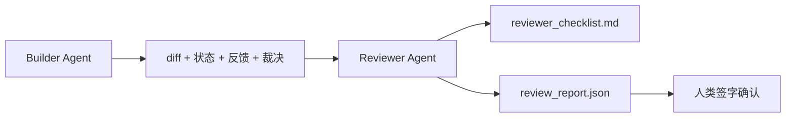

# Reviewer Agent：把「写代码」和「打分」分开

> 译注：本文译自同目录 [`en.md`](./en.md)。术语遵循仓根 [TRANSLATION_GUIDE.md](../../../../TRANSLATION_GUIDE.md)。

> 写代码的那个 agent 没法给自己打分。reviewer（验证器）是另一个循环：不同的 system prompt、不同的目标、对 builder 产物只读访问。builder 和 reviewer 之间的那道缝，正是大多数可靠性的来源。

**Type:** Build
**Languages:** Python (stdlib)
**Prerequisites:** Phase 14 · 38 (Verification Gate)
**Time:** ~55 分钟

## 学习目标（Learning Objectives）

- 说清楚为什么同一个 agent 没法可靠地审自己的活。
- 实现一个 reviewer agent loop，消费 builder 的 artifact，输出一份结构化 review 报告。
- 写一份 reviewer rubric（评分标尺），按具体维度打分，而不是凭感觉。
- 把 reviewer 接进 workbench（工作台），让人工 review 这一步从一份真实的 artifact 开始，而不是从一张白纸开始。

## 问题（The Problem）

你让 agent 修一个 bug。它改了四个文件、跑了测试、报告完成。verification gate（Phase 14 · 38）确认 acceptance 跑过了、scope 没越界。gate 给出 `passed: true`。你 merge 了。两天后你发现：这个修复解决的是 bug 中错的那一半。

acceptance 是必要条件，不是充分条件。reviewer 要问的是 acceptance 问不出来的问题：这是不是解决了对的问题？是不是悄悄扩了 scope 没说？该被质疑的隐含假设有没有写下来？workbench 留下的状态，下一个 session 接得住吗？

## 概念（The Concept）



### Reviewer rubric（评分标尺）

五个维度，每个 0–2 分。

| 维度 | 问题 |
|-----------|----------|
| Problem fit（命题契合） | 这次改动解决的是任务陈述里的那个问题，还是一个邻近的问题？ |
| Scope discipline（范围纪律） | 编辑是否限制在契约范围内？如果扩了，是不是有意识地扩的？ |
| Assumptions（假设） | 所有隐含假设是不是都写在某个能被 review 的地方？ |
| Verification quality（验证质量） | acceptance 命令是不是真的证明了目标？还是只证明了一个弱化版？ |
| Handoff readiness（交接就绪） | 下一个 session 能不能从当前状态干净地接上？ |

总分 10。低于 7 是 soft fail（软失败）；低于 5 是 hard fail（硬失败）。

### reviewer 是另一个角色，不是另一个模型

reviewer 完全可以和 builder 用同一个模型。纪律体现在角色分离上：不同的 system prompt、不同的输入、对 diff 没有写权限。换的是姿态，换出来的是信号。

### reviewer 不能改 diff

reviewer 读 diff、读 state、读 feedback、读 verdict（裁决）。它写一份报告。它不去 patch diff。如果报告说「修这里」，那就由下一轮 builder 去修；reviewer 回头继续 review。角色一旦混起来，这道缝就废了。

### Reviewer rubric 与 verification gate 的区别

gate（Phase 14 · 38）检查的是确定性事实：acceptance 跑没跑、规则过没过、scope 守没守。reviewer 做的是定性判断：这是不是该做的活、有没有写文档、handoff 能不能用。两者都不可少。

## 动手实现（Build It）

`code/main.py` 实现：

- 一个 `ReviewerInputs` dataclass，把 reviewer 要读的 artifact 打包。
- 一个 rubric 评分器，每个维度一个函数。每个函数都是确定性的、本课程级别的桩实现；真实实现会去调 LLM。
- 一个 `review_report.json` writer，写入五个分数、总分、verdict（`pass`、`soft_fail`、`hard_fail`）。
- 两个 demo case：一个是干净的改动，一个是「测试对了，但解决的是错的问题」的改动。

跑：

```
python3 code/main.py
```

输出：两份 review 报告写到磁盘，再在控制台打印一张维度分数表。

## 工业界的实战范式（Production patterns in the wild）

证据：Cloudflare 在 2026 年 4 月的 AI Code Review 系统，30 天内在 5,169 个 repo、48,095 个 merge request 上跑了 131,246 次 review。中位完成时间 3 分 39 秒。最多 7 个 specialist reviewer（安全、性能、代码质量、文档、发布管理、合规、Engineering Codex）在一个 Review Coordinator 之下并行，由 coordinator 去重并裁判严重程度。顶配模型只留给 coordinator；specialist 跑在更便宜的层级。

四个 pattern 让它在规模上能跑通。

**specialist 池，而不是一个大 reviewer。** 一个 reviewer 配一份 5 维 rubric，对单仓库够用。一旦代码库出现安全敏感、性能敏感、文档敏感的多个面，就拆成多个 specialist，每个 prompt 更小。coordinator 负责去重；specialist 不去跑完整 rubric。模型层级分离自然落地：specialist 便宜、coordinator 贵。

**bias 缓解作为设计要求，而不是优化项。** LLM judge 表现出四种稳定 bias（Adnan Masood，2026 年 4 月）：position bias（GPT-4 在 (A,B) 与 (B,A) 顺序下约 40% 不一致）、verbosity bias（输出更长就被加分约 15%）、self-preference（judge 偏爱同一模型族的输出）、authority（judge 高估对知名作者的引用）。缓解：两种顺序都评，只算一致赢的；用 1–4 标尺并显式奖励简洁；judge 跨模型族轮换；评分前剥掉作者名。

**calibration set（标定集），不是凭感觉。** 一份 10–20 个任务的历史集，verdict 已知正确。每次 prompt 改动都让 reviewer 跑一遍。如果与历史记录的一致率掉到 80% 以下，rubric 必须先修再上线。这条规律每个团队最后都会重新发现一遍；不如一开始就这么干。

**与 gate 的混合规范。** verification gate（Phase 14 · 38）处理确定性检查（acceptance 跑没跑、测试过没过、scope 守没守）。reviewer 处理语义性检查（这是不是该做的活、假设有没有文档、handoff 能不能用）。Anthropic 在 2026 年的指南里对这种切分讲得很明确：别让 reviewer 去重做 gate 已经证过的事。

## 用起来（Use It）

工业界 pattern：

- **Claude Code subagent。** builder 关掉一个任务后，由 reviewer subagent 接手。它在 PR 上发一条评论，附上 rubric 分数。
- **OpenAI Agents SDK handoff。** builder 在任务完成时把 handoff 交给 reviewer。reviewer 可以带一份发现回交，也可以上交给人。
- **双模型搭配。** builder 跑在更快更便宜的模型上；reviewer 跑在更强的模型上、context 更小，专注于判断。

reviewer 是 workbench 长出的「第二双眼睛」——当人没法每条都亲自 review 时，就靠它。

## 上线部署（Ship It）

`outputs/skill-reviewer-agent.md` 会生成：一份针对你项目的 reviewer rubric、一个连到 builder artifact 的 reviewer agent 桩、以及与 verification gate 的集成——让人工 review 从一份写好的报告开始，而不是从一张白纸开始。

## 练习（Exercises）

1. 加一个针对你产品领域的第六个维度。说清楚为什么它不能被现有五个维度吸收。
2. 用两份不同 system prompt 跑 reviewer（一份简洁、一份啰嗦）。哪一份产出的报告人更可能真去读？
3. 给每个维度加一个 `confidence` 字段。当最低维度的置信度低于 0.6 时，拒绝出报告。
4. 搭一个 calibration set：10 个历史任务收尾，verdict 已知正确。让 reviewer 跑一遍。它在哪里和历史记录不一致？
5. 加一个「请求更多证据」的能力：reviewer 可以在打分前要求 builder 跑某个具体测试。怎么设计 back-off（退避）才能不死循环？

## 关键术语（Key Terms）

| 术语 | 别人怎么说 | 实际是什么 |
|------|----------------|------------------------|
| Reviewer rubric | 「checklist」 | 五维 0–2 评分，每个维度配一个写明的问题 |
| Soft fail | 「需要返工」 | 总分低于 7；builder 拿到 finding 去处理 |
| Hard fail | 「Reject」 | 总分低于 5、或任一维度为 0；停下来交给人 |
| Role separation | 「换个 prompt」 | 同一个模型可以兼任两个角色；纪律体现在输入和姿态 |
| Confidence floor | 「别上低信号报告」 | rubric 不确定时，拒绝出 verdict |

## 延伸阅读（Further Reading）

- [OpenAI Agents SDK handoffs](https://platform.openai.com/docs/guides/agents-sdk/handoffs)
- [Anthropic Claude Code subagents](https://docs.anthropic.com/en/docs/agents-and-tools/claude-code/sub-agents)
- [Cloudflare, Orchestrating AI Code Review at Scale](https://blog.cloudflare.com/ai-code-review/) — 7 specialist + coordinator 架构，131k 次运行 / 30 天
- [Agent-as-a-Judge: Evaluating Agents with Agents (OpenReview / ICLR)](https://openreview.net/forum?id=DeVm3YUnpj) — DevAI benchmark，366 条层级化解题需求
- [Adnan Masood, Rubric-Based Evaluations and LLM-as-a-Judge: Methodologies, Biases, Empirical Validation](https://medium.com/@adnanmasood/rubric-based-evals-llm-as-a-judge-methodologies-and-empirical-validation-in-domain-context-71936b989e80) — 四种 bias 与缓解
- [MLflow, LLM-as-a-Judge Evaluation](https://mlflow.org/llm-as-a-judge) — builder/evaluator 分离的工业级工具
- [LangChain, How to Calibrate LLM-as-a-Judge with Human Corrections](https://www.langchain.com/articles/llm-as-a-judge) — calibration set 工作流
- [Evidently AI, LLM-as-a-judge: a complete guide](https://www.evidentlyai.com/llm-guide/llm-as-a-judge)
- [Arize, LLM as a Judge — Primer and Pre-Built Evaluators](https://arize.com/llm-as-a-judge/)
- Phase 14 · 05 — Self-Refine 与 CRITIC（单 agent 自我 review 的基线）
- Phase 14 · 30 — eval 驱动的 agent 开发（calibration set 生成器）
- Phase 14 · 38 — reviewer 读取的那个 verification gate
- Phase 14 · 40 — reviewer 报告喂给的那个 handoff 包
