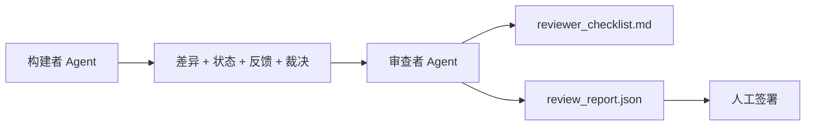

# 审查者 Agent：将构建者与评分者分离

> 编写代码的 Agent 无法为其评分。审查者是一个具有不同系统提示、不同目标，并对构建者产生的所有内容具有只读访问权限的第二循环。构建者与审查者之间的差距是大多数可靠性所在的地方。

**类型：** 构建
**语言：** Python（标准库）
**先决条件：** 阶段 14 · 38（验证门）
**时间：** ~55 分钟

## 学习目标

- 说明为何同一 Agent 无法可靠地审查其自身工作。
- 构建一个消费构建者制品并发出结构化审查报告的审查者 Agent 循环。
- 编写一个对特定维度评分而非印象的审查者评分标准。
- 将审查者接入工作台，以便人工审查步骤从真实制品开始。

## 问题

你要求 Agent 修复一个错误。它编辑了四个文件，运行测试，并报告完成。验证门（阶段 14 · 38）确认验收已运行且范围保持。门说 `passed: true`。你合并了。两天后你发现修复解决了错误的那一半错误。

验收是必要但不充分的。审查者询问验收无法询问的问题：这解决了正确的问题吗？它是否在未标记的情况下扩展了范围？它是否记录了本应被质疑的假设？它是否使工作台处于下一轮会话可以接续的状态？

## 概念



### 审查者评分标准

五个维度，每个评分 0 到 2。

| 维度 | 问题 |
|-------|------|
| Problem fit（问题适配） | 变更是否如所述解决了任务，而非附近的任务？ |
| Scope discipline（范围纪律） | 编辑是否限制在契约内，或者契约是否被故意扩展？ |
| Assumptions（假设） | 所有隐藏假设是否都记录在可审查的地方？ |
| Verification quality（验证质量） | 验收命令是否真正证明了目标，或者它证明了较弱的版本？ |
| Handoff readiness（交接就绪度） | 下一轮会话能否从当前状态干净地接续？ |

总分 10 分。低于 7 分的运行是软失败；低于 5 分是硬失败。

### 审查者是一个独立角色，而非独立模型

你可以使用与构建者相同的模型运行审查者。准则是角色分离：不同的系统提示、不同的输入、对差异无写入权限。姿态的变化就是信号的变化。

### 审查者无法编辑差异

审查者读取差异、状态、反馈、裁决。它编写报告。它不修补差异。如果报告说"修复此问题"，下一轮构建者回合进行修复；审查者返回审查。混合角色会破坏差距。

### 审查者评分标准与验证门

门（阶段 14 · 38）检查确定性事实：验收是否运行、规则是否通过、范围是否保持。审查者做出定性判断：这是否是正确的工作、是否有文档、交接是否可用。两者都需要。

## 构建

`code/main.py` 实现：

- 捆绑审查者读取制品的 `ReviewerInputs` 数据类。
- 每个维度一个函数的评分标准评分器。每个函数都是确定性的，本课程中为存根评分；真实实现会调用 LLM。
- 带有五个分数、总分和裁决（`pass`、`soft_fail`、`hard_fail`）的 `review_report.json` 写入器。
- 两个演示案例：干净变更和"正确测试，错误问题"变更。

运行：

```
python3 code/main.py
```

输出：写入磁盘的两个审查报告和维度分数的控制台表格。

## 生产模式

收据：Cloudflare 的 2026 年 4 月 AI 代码审查系统在 30 天内跨 5,169 个仓库运行了 131,246 次审查运行，覆盖 48,095 个合并请求。中位数审查在 3 分 39 秒内完成。多达七个专家审查者（安全、性能、代码质量、文档、发布管理、合规性、Engineering Codex）在去重发现并判断严重性的审查协调器下并行运行。顶级模型专为协调器保留；专家运行在更便宜的层级上。

四种模式使这在规模上工作。

**专家池，而非一个大型审查者。** 具有 5 维度评分标准的单个审查者适用于独立仓库。一旦代码库具有安全关键、性能关键和文档层面，就拆分为具有更小提示的专家。协调器进行去重；专家从不运行完整评分标准。模型层级分离随之而来：便宜的专家，昂贵的协调器。

**偏差缓解作为设计要求，而非优化。** LLM 裁判表现出四种可靠偏差（Adnan Masood，2026 年 4 月）：位置偏差（GPT-4 在 (A,B) 与 (B,A) 排序上约 40% 不一致）、冗长偏差（约 15% 分数膨胀向更长输出）、自我偏好（裁判更喜欢来自相同模型家族的输出）、权威（裁判对已知作者的引用过度评分）。缓解措施：评估两种排序并仅计算一致胜利；使用明确奖励简洁性的 1-4 量表；跨模型家族轮换裁判；在评分前剥离作者姓名。

**校准集，而非印象。** 具有已知正确裁决的 10-20 任务历史集。在每次提示变更时运行审查者。如果与历史记录的一致性低于 80%，在审查者交付前需要修订评分标准。这是每个团队最终都会重新发现的东西；最好从它开始。

**与门混合规范。** 验证门（阶段 14 · 38）处理确定性检查（验收是否运行、测试是否通过、范围是否保持）。审查者处理语义检查（这是否是正确的工作、假设是否有文档、交接是否可用）。Anthropic 的 2026 年指南在此拆分上很明确：不要要求审查者重做门已经证明的事情。

## 使用

生产模式：

- **Claude Code 子 Agent。** 审查者子 Agent 在构建者关闭任务后运行。它在 PR 上发布带有评分标准分数的评论。
- **OpenAI Agents SDK 交接。** 构建者在任务完成时交接给审查者。审查者可以带着发现列表交回或上升到人工。
- **双模型配对。** 构建者运行在更快更便宜的模型上。审查者运行在具有更小上下文、专注于判断的更强模型上。

审查者是当人类无法自己进行每次审查时，工作台成长的第二双眼睛。

## 部署

`outputs/skill-reviewer-agent.md` 生成项目特定的审查者评分标准、连接到构建者制品的审查者 Agent 存根，以及与验证门的集成，以便人工审查从书面报告而非空白页开始。

## 练习

1. 添加特定于你的产品领域的第六个维度。辩护为何它不被现有五个维度吸收。
2. 用两个不同的系统提示（简洁、冗长）运行审查者。哪个产生人类更可能阅读的报告？
3. 添加每个维度的 `confidence` 字段。当最低维度的置信度低于 0.6 时拒绝交付报告。
4. 构建校准集：具有已知正确裁决的 10 个历史任务结清。对它们运行审查者。它哪里与历史记录不一致？
5. 添加"请求更多证据"功能：审查者可以在评分前要求构建者进行特定测试运行。正确的退让是什么，以便这不会循环？

## 关键术语

| 术语 | 人们的说法 | 实际含义 |
|------|----------|----------|
| Reviewer rubric（审查者评分标准） | "检查清单" | 五维度 0-2 评分，每个维度附带书面问题 |
| Soft fail（软失败） | "需要修订" | 总分低于 7；构建者获得要处理的发现 |
| Hard fail（硬失败） | "拒绝" | 总分低于 5 或任何维度为 0；停止并呈现给人类 |
| Role separation（角色分离） | "不同提示" | 相同模型可以是两个角色；准则是输入和姿态 |
| Confidence floor（置信度下限） | "不要交付低信号报告" | 当评分标准不确定时拒绝发出裁决 |

## 延伸阅读

- [OpenAI Agents SDK 交接](https://platform.openai.com/docs/guides/agents-sdk/handoffs)
- [Anthropic Claude Code 子 Agent](https://docs.anthropic.com/en/docs/agents-and-tools/claude-code/sub-agents)
- [Cloudflare, 大规模编排 AI 代码审查](https://blog.cloudflare.com/ai-code-review/) — 7 专家 + 协调器架构，131k 次运行 / 30 天
- [Agent-as-a-Judge: 用 Agent 评估 Agent (OpenReview / ICLR)](https://openreview.net/forum?id=DeVm3YUnpj) — DevAI 基准，366 分层解决方案需求
- [Adnan Masood, 基于评分标准的评估和 LLM-as-a-Judge：方法、偏差、实证验证](https://medium.com/@adnanmasood/rubric-based-evals-llm-as-a-judge-methodologies-and-empirical-validation-in-domain-context-71936b989e80) — 4 种偏差和缓解措施
- [MLflow, LLM-as-a-Judge 评估](https://mlflow.org/llm-as-a-judge) — 分离的构建者/评估者的生产工具
- [LangChain, 如何用人工纠正校准 LLM-as-a-Judge](https://www.langchain.com/articles/llm-as-a-judge) — 校准集工作流
- [Evidently AI, LLM-as-a-Judge：完整指南](https://www.evidentlyai.com/llm-guide/llm-as-a-judge)
- [Arize, LLM as a Judge — 入门和预构建评估器](https://arize.com/llm-as-a-judge/)
- 阶段 14 · 05 — 自我精炼和 CRITIC（单 Agent 自我审查基线）
- 阶段 14 · 30 — 评估驱动的 Agent 开发（校准集生成器）
- 阶段 14 · 38 — 审查者读取的验证门
- 阶段 14 · 40 — 审查者报告馈送的交接数据包
