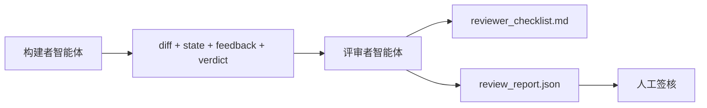

# 评审智能体：将构建者与评审者分离

> 编写代码的智能体不能给自己打分。评审者是一个具有不同系统提示、不同目标，并对构建者产生的所有内容拥有只读访问权限的第二循环。构建者与评审者之间的差距正是大多数可靠性的来源。

**类型：** 构建
**语言：** Python（标准库）
**前置条件：** 阶段 14 · 38（验证关卡）
**预计用时：** ~55 分钟

## 学习目标

- 说明为什么同一个智能体无法可靠地评审自己的工作。
- 构建一个评审智能体循环，该循环消费构建者的产物并输出结构化的评审报告。
- 编写一份评审评分标准，对特定维度进行评分，而非凭感觉。
- 将评审者接入工作台，使人工评审环节从真实的产物开始。

## 问题

你让智能体修复一个 Bug。它编辑了四个文件，运行了测试，然后报告完成。验证关卡（阶段 14 · 38）确认验收已执行且范围未变动。关卡显示 `passed: true`。你合并了代码。两天后你发现这次修复只解决了 Bug 的一半。

验收是必要条件，而非充分条件。评审者会提出验收无法提出的问题：这是否解决了正确的问题？它是否扩大了范围而没有标记？它是否记录了本应受到质疑的假设？它是否让工作台处于下一个会话可以继续的状态？

## 概念


```mermaid
flowchart LR
  Builder[构建者智能体] --> Artifacts[diff + state + feedback + verdict]
  Artifacts --> Reviewer[评审者智能体]
  Reviewer --> Rubric[reviewer_checklist.md]
  Reviewer --> Report[review_report.json]
  Report --> Human[人工签核]
```

### 评审评分标准

五个维度，每个维度评分 0 到 2。

| 维度 | 问题 |
|-----------|----------|
| 问题匹配度 | 变更是否解决了任务中陈述的问题，而非一个近似的问题？ |
| 范围纪律 | 编辑是否限于既定范围，或者范围是否被有意扩大？ |
| 假设 | 所有隐藏的假设是否都已记录在某个可供审查的地方？ |
| 验证质量 | 验收命令是否真正证明了目标，还是只证明了一个较弱版本？ |
| 交接就绪度 | 下一个会话能否从当前状态顺利接续？ |

满分 10 分。低于 7 分为软失败；低于 5 分为硬失败。

### 评审者是一个独立角色，而非独立模型

你可以使用与构建者相同的模型来运行评审者。关键在于角色分离：不同的系统提示、不同的输入、对 diff 没有写入权限。姿态的改变就是信号的改变。

### 评审者不能编辑 diff

评审者读取 diff、状态、反馈和结论。它撰写报告。它不修补 diff。如果报告说"修复此处"，则由下一轮构建者来执行修复，评审者则回到评审工作中。混合角色会破坏这一差距。

### 评审评分标准 vs 验证关卡

验证关卡（阶段 14 · 38）检查确定性事实：验收是否执行、规则是否通过、范围是否维持。评审者做出定性判断：工作是否做得对、是否有文档记录、交接是否可用。两者都是必需的。

## 构建它

`code/main.py` 实现了：

- 一个 `ReviewerInputs` 数据类，用于打包评审者读取的所有产物。
- 一个评分标准打分器，每个维度对应一个函数。每个函数都是确定性的，并且为教学目的保留了桩代码风格；真实实现会调用 LLM。
- 一个 `review_report.json` 写入器，包含五个分数、总分和结论（`pass`、`soft_fail`、`hard_fail`）。
- 两个演示案例：一个干净的变更，以及一个"测试正确但问题错误"的变更。

运行：

```
python3 code/main.py
```

输出：两个评审报告写入磁盘，以及一个维度分数的控制台表格。

## 生产环境中的实际模式

真实数据：Cloudflare 2026 年 4 月的 AI 代码评审系统在 30 天内，跨 5,169 个仓库的 48,095 个合并请求上运行了 131,246 次评审。中位评审完成时间为 3 分 39 秒。最多七个专业评审者（安全、性能、代码质量、文档、发布管理、合规、工程规范手册）在评审协调器下并行运行，协调器负责去重和判断严重程度。顶级模型仅保留给协调器使用；专业评审者运行在较便宜的模型层级上。

四种模式使其能够在规模上运行。

**专业评审者池，而非一个大而全的评审者。** 一个拥有 5 维度评分标准的评审者适用于独立仓库。一旦代码库涉及安全关键、性能关键和文档等层面，应拆分为多个提示更简短的专业评审者。协调器负责去重；专业评审者从不运行完整的评分标准。模型层级分离自然产生：便宜的专业评审者，昂贵的协调器。

**偏差缓解作为设计需求，而非优化。** LLM 评判者表现出四种可靠的偏差（Adnan Masood，2026 年 4 月）：位置偏差（GPT-4 在 (A,B) 与 (B,A) 排序上约 40% 的不一致）、冗长偏差（约 15% 的分数膨胀偏向更长的输出）、自我偏好（评判者偏好来自同一模型家族的输出）、权威性（评判者对已知作者的引用评分偏高）。缓解措施：评估两种排序并只计一致胜出；使用明确奖励简洁性的 1-4 分制；在不同模型家族间轮换评判者；评分前去除作者姓名。

**校准集，而非凭感觉。** 一个包含 10-20 个已知正确结论的历史任务集合。每次提示变更后，用评审者重新运行这个集合。如果与历史记录的一致性低于 80%，则评分标准需要在评审者上线前进行修订。这是每个团队最终都会重新发现的做法；最好从一开始就做。

**与验证关卡的混合规范。** 验证关卡（阶段 14 · 38）处理确定性检查（验收是否执行、测试是否通过、范围是否维持）。评审者处理语义检查（工作是否做得对、假设是否有文档记录、交接是否可用）。Anthropic 2026 年的指南明确指出了这种分工：不要让评审者重复关卡已经证明的内容。

## 使用它

生产模式：

- **Claude Code 子智能体。** 评审子智能体在构建者关闭任务后运行。它会在 PR 上发布一条包含评分标准分数的评论。
- **OpenAI Agents SDK 交接。** 构建者在任务完成时交接给评审者。评审者可以带着发现列表交回，或升级到人工。
- **双模型配对。** 构建者在更快更便宜的模型上运行。评审者使用更强的模型、更小的上下文，专注于判断。

评审者是工作台在人工无法完成每项评审时增长出的第二双眼睛。

## 交付

`outputs/skill-reviewer-agent.md` 生成一个项目特定的评审评分标准、一个连接到构建者产物的评审智能体桩代码，以及与验证关卡的集成，使得人工评审从一份书面报告而非空白页面开始。

## 练习

1. 增加一个特定于你产品领域的第六维度。论证为什么它不能被现有的五个维度吸收。
2. 使用两种不同的系统提示（简洁版、详细版）运行评审者。哪种提示生成的报告更容易被人工阅读？
3. 为每个维度增加一个 `confidence` 字段。当最低维度的置信度低于 0.6 时，拒绝提交报告。
4. 构建一个校准集：10 个已知正确结论的历史任务关闭记录。用评审者重新运行它们。评审者与历史记录在哪些地方不一致？
5. 增加一个"请求更多证据"机制：评审者可以在评分前请求构建者提供特定的测试运行。合适的退避策略是什么，以免陷入循环？

## 关键术语

| 术语 | 人们常说的 | 实际含义 |
|------|----------------|------------------------|
| 评审评分标准 | "检查清单" | 五个维度 0-2 分制，每个维度有一个书面问题 |
| 软失败 | "需要修改" | 总分低于 7；构建者收到需要处理的发现 |
| 硬失败 | "拒绝" | 总分低于 5 或任一维度为 0；停止并上报给人 |
| 角色分离 | "不同的提示" | 同一模型可以承担两种角色；关键在于输入和姿态 |
| 置信度下限 | "不要提交低信号报告" | 当评分标准不确定时，拒绝给出结论 |

## 延伸阅读

- [OpenAI Agents SDK 交接](https://platform.openai.com/docs/guides/agents-sdk/handoffs)
- [Anthropic Claude Code 子智能体](https://docs.anthropic.com/en/docs/agents-and-tools/claude-code/sub-agents)
- [Cloudflare, Orchestrating AI Code Review at Scale](https://blog.cloudflare.com/ai-code-review/) — 7 专业评审者 + 协调器架构，131k 次运行 / 30 天
- [Agent-as-a-Judge: Evaluating Agents with Agents (OpenReview / ICLR)](https://openreview.net/forum?id=DeVm3YUnpj) — DevAI 基准，366 个分层解决方案需求
- [Adnan Masood, Rubric-Based Evaluations and LLM-as-a-Judge: Methodologies, Biases, Empirical Validation](https://medium.com/@adnanmasood/rubric-based-evals-llm-as-a-judge-methodologies-and-empirical-validation-in-domain-context-71936b989e80) — 4 种偏差及缓解措施
- [MLflow, LLM-as-a-Judge 评估](https://mlflow.org/llm-as-a-judge) — 分离式构建者/评估者的生产工具
- [LangChain, 如何通过人工校正校准 LLM-as-a-Judge](https://www.langchain.com/articles/llm-as-a-judge) — 校准集工作流程
- [Evidently AI, LLM-as-a-judge: 完整指南](https://www.evidentlyai.com/llm-guide/llm-as-a-judge)
- [Arize, LLM as a Judge — 入门与预构建评估器](https://arize.com/llm-as-a-judge/)
- 阶段 14 · 05 — 自我优化与 CRITIC（单智能体自评审基线）
- 阶段 14 · 30 — 评估驱动的智能体开发（校准集生成器）
- 阶段 14 · 38 — 评审者读取的验证关卡
- 阶段 14 · 40 — 评审报告所输入的交接数据包
