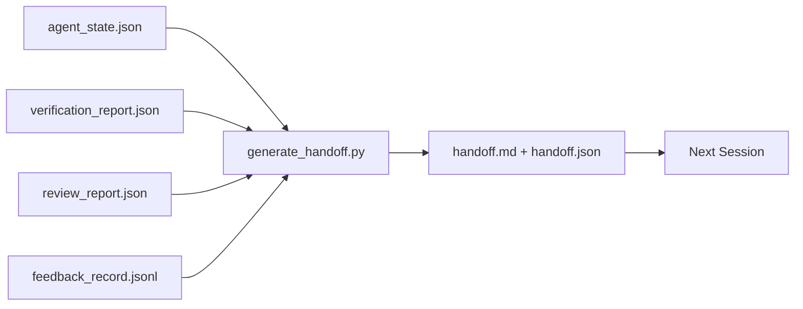

# Multi-Session Handoff

> session は終わります。work は終わりません。handoff packet は、「agent が1時間作業した」を「次の session が最初の1分から productive になる」に変える artifact です。後付けではなく、意図して作ります。

**種類:** Build
**言語:** Python (stdlib)
**前提:** Phase 14 · 34 (Repo Memory), Phase 14 · 38 (Verification), Phase 14 · 39 (Reviewer)
**時間:** 約50分

## 学習目標

- すべての handoff packet に必要な7つの fields を特定する。
- prose を手書きせず、workbench artifacts から handoff を生成する。
- 大きな feedback logs を handoff size の summary に trim する。
- 次 session の最初の action を deterministic にする。

## 問題

session が終わります。agent は「進捗がありました」と言います。次の session が開きます。次の agent は「どこまで進んでいましたか？」と尋ねます。最初の agent の答えは消えています。次の agent は再発見し、同じ command を再実行し、同じ質問を人間に聞き直し、前 session の最後の30秒を取り戻すために30分を燃やします。

悪い handoff の cost は、その task が続く限り毎 session 支払われます。修正は、session end に自動生成される packet です。何が変わったか、なぜ変えたか、何を試したか、何が失敗したか、何が残っているか、次回最初に何をするか。

## コンセプト



### すべての handoff が持つ7つの fields

| Field | 答える問い |
|-------|------------|
| `summary` | 何をしたかの1段落 |
| `changed_files` | diff の一覧 |
| `commands_run` | 実際に実行されたもの |
| `failed_attempts` | 何を試し、なぜうまくいかなかったか |
| `open_risks` | 次 session で問題になり得るもの。severity 付き |
| `next_action` | 次 session が最初に取る具体的な step |
| `verdict_pointer` | verification + review reports への path |

`next_action` field が load-bearing です。`next_action` 以外がすべて揃った handoff は status report であり、handoff ではありません。

### handoff は書くのではなく生成する

手書きの handoff は、厳しい日に skip される handoff です。generator は workbench artifacts を読み、packet を emit します。agent の仕事は summary を書くことではなく、generator が summarize できる state に workbench を残すことです。

### 2つの形式: human-readable と machine-readable

`handoff.md` は人間が読むものです。`handoff.json` は次の agent が load するものです。どちらも同じ source artifacts から生成されます。食い違った場合は JSON が勝ちます。

### feedback log trimming

完全な `feedback_record.jsonl` は数百 entries になるかもしれません。handoff は最後の K 件と、non-zero exit のすべての entry だけを含みます。次の session は必要なら full log を load できますが、packet は小さいままです。

## 作ってみる

`code/main.py` は次を実装しています。

- state、verdict、review、feedback を1つの `WorkbenchSnapshot` に集める loader。
- `generate_handoff(snapshot) -> (markdown, payload)` function。
- 最後の K feedback entries とすべての non-zero exits を選ぶ filter。
- `handoff.md` と `handoff.json` を script の隣に書く demo run。

実行:

```
python3 code/main.py
```

出力: handoff body が表示され、両方の file が disk に書かれます。

## 現場の production pattern

Codex CLI、Claude Code、OpenCode はそれぞれ異なる compaction story を持っています。structured handoff packet はその3つすべての上に乗ります。

**compaction strategy は変わっても packet schema は変わらない。** Codex CLI の POST /v1/responses/compact は server-side opaque AES blob です (OpenAI models 用の fast path)。fallback は local の「handoff summary」を `_summary` user-role message として append します。Claude Code は context の 95% で five-stage progressive compaction を実行します。OpenCode は timestamp-based message hiding と 5-heading LLM summary を使います。mechanism は3通りでも、必要なことは同じです。compression を生き残るものを portable artifact に serialize すること。packet がその artifact です。

**fresh-session handoff は compaction ではない。** compaction は session を伸ばします。handoff は session を clean に閉じ、次を開始します。Hermes Issue #20372 の framing (2026年4月) は正しいです。in-place compression が劣化し始めたら、agent は compact handoff を書き、session を終わらせ、fresh context で resume すべきです。その transition を安くするのが packet です。mistake は quality が崩れるまで compress し続けることです。fix は、早く clean に handoff する budget を取ることです。

**branch と topic ごとに active handoff は1つ。** Multi-agent coordination は bad model output より stale handoff で壊れます。必ず `branch`、`last_known_good_commit`、`active | superseded | archived` の `status` を含めます。stale handoffs は archived にし、active なものだけが次 session を駆動します。これが handoff-as-notes と handoff-as-state の違いです。

**context の壁ではなく 50-75% の前に wrap up する。** hand-written-pattern playbook (CLAUDE.md + HANDOVER.md) は、session を context budget の 95% ではなく 50-75% で終えるのが最良だと報告しています。packet generator は、compression artifact が source state を汚す前に clean に動きます。context が intact な間は書くのが安く、model がすでに位置を見失ってからでは高くつきます。

## 使い方

Production pattern:

- **Session-end hook。** user が chat を閉じると runtime が generator を起動します。packet は `outputs/handoff/<session_id>/` に入ります。
- **PR template。** generator の markdown は PR body としても使えます。reviewer は5つの別 file を開かずに読めます。
- **Cross-agent handoff。** ある product (Claude Code) で build し、別の product (Codex) で続けます。packet は lingua franca です。

packet は小さく、規則的で、安く作れます。cost saving は session のたびに複利で効きます。

## 出荷する

`outputs/skill-handoff-generator.md` は、project の artifact paths に合わせた generator、それを実行する end-of-session hook、次の agent が startup で読む `handoff.json` schema を生成します。

## 演習

1. builder が log したが reviewer が 1 を超えて score しなかった assumption をすべて surface する `assumptions_to_validate` field を追加する。
2. failing run と passing run で feedback summary の trim 方法を変える。その asymmetry を説明する。
3. "questions for the human" list を含める。packet に入れる question と chat message にする question の threshold は何か。
4. generator を idempotent にする。2回実行して同じ packet を生成する。何が stable である必要があるか。
5. "next session prereqs" section を追加し、次 session が action 前に load すべき artifacts を正確に列挙する。

## 重要用語

| 用語 | よくある言い方 | 実際の意味 |
|------|----------------|------------|
| Handoff packet | 「Session summary」 | 7つの fields を持ち、markdown と JSON の両方で生成される artifact |
| Next action | 「最初に何をするか」 | 次 session を始める1つの具体的 step |
| Feedback trim | 「Log summary」 | 最後の K records とすべての non-zero exit |
| Status report | 「何をしたか」 | `next_action` を欠く document。有用だが handoff ではない |
| Verdict pointer | 「Receipt」 | traceability のための verification + review reports への path |

## 参考文献

- [Anthropic, Effective harnesses for long-running agents](https://www.anthropic.com/engineering/effective-harnesses-for-long-running-agents)
- [OpenAI Agents SDK handoffs](https://platform.openai.com/docs/guides/agents-sdk/handoffs)
- [Codex Blog, Codex CLI Context Compaction: Architecture, Configuration, Managing Long Sessions](https://codex.danielvaughan.com/2026/03/31/codex-cli-context-compaction-architecture/) — POST /v1/responses/compact と local fallback
- [Justin3go, Shedding Heavy Memories: Context Compaction in Codex, Claude Code, OpenCode](https://justin3go.com/en/posts/2026/04/09-context-compaction-in-codex-claude-code-and-opencode) — 3 vendor の compaction 比較
- [JD Hodges, Claude Handoff Prompt: How to Keep Context Across Sessions (2026)](https://www.jdhodges.com/blog/ai-session-handoffs-keep-context-across-conversations/) — CLAUDE.md + HANDOVER.md、50-75% context budget
- [Mervin Praison, Managing Handoffs in Multi-Agent Coding Sessions: Fresh Context Without Losing Continuity](https://mer.vin/2026/04/managing-handoffs-in-multi-agent-coding-sessions-fresh-context-without-losing-continuity/) — distributed-systems framing
- [Hermes Issue #20372 — automatic fresh-session handoff when compression becomes risky](https://github.com/NousResearch/hermes-agent/issues/20372)
- [Hermes Issue #499 — Context Compaction Quality Overhaul](https://github.com/NousResearch/hermes-agent/issues/499) — Codex CLI の handoff-oriented prompts
- [Microsoft Agent Framework, Compaction](https://learn.microsoft.com/en-us/agent-framework/agents/conversations/compaction)
- [OpenCode, Context Management and Compaction](https://deepwiki.com/sst/opencode/2.4-context-management-and-compaction)
- [LangChain, Context Engineering for Agents](https://www.langchain.com/blog/context-engineering-for-agents)
- Phase 14 · 34 — generator が読む state file
- Phase 14 · 38 — packet が指す verification verdict
- Phase 14 · 39 — packet に bundle される reviewer report
