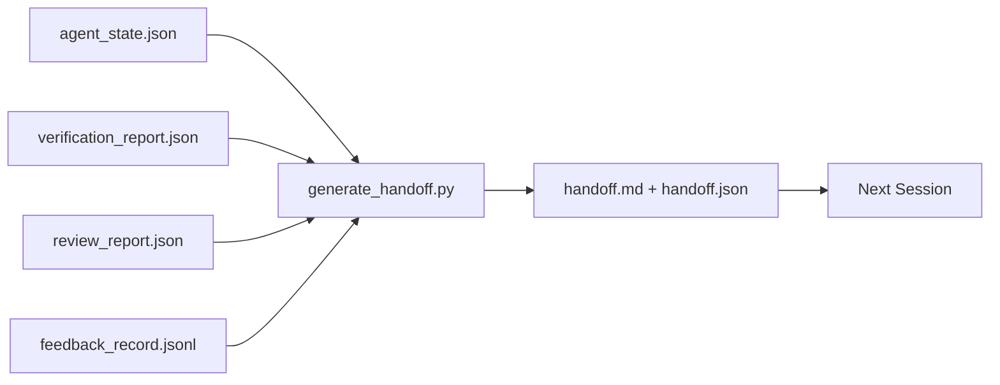

# Handoff Multi-Sessão

> A sessão vai acabar. O trabalho não. O pacote de handoff é o artefato que transforma "o agente trabalhou por uma hora" em "a próxima sessão é produtiva no primeiro minuto". Construa de propósito, não como reflexo tardio.

**Tipo:** Construção
**Linguagens:** Python (stdlib)
**Pré-requisitos:** Fase 14 · 34 (Memória de Repo), Fase 14 · 38 (Verificação), Fase 14 · 39 (Reviewer)
**Tempo:** ~50 minutos

## Objetivos de Aprendizado

- Identificar os sete campos que todo pacote de handoff precisa.
- Gerar um handoff a partir dos artefatos do workbench sem escrever texto manualmente.
- Reduzir logs grandes de feedback em um resumo do tamanho de um handoff.
- Tornar a primeira ação da próxima sessão determinística.

## O Problema

A sessão acaba. O agente diz "beleza, fizemos progresso". A próxima sessão abre. O próximo agente pergunta "onde paramos?". A resposta do primeiro agente sumiu. O próximo agente redescobre, re-executa os mesmos comandos, faz as mesmas perguntas pro humano de novo, e gasta trinta minutos recuperando os últimos trinta segundos da sessão anterior.

O custo de um handoff ruim é pago a cada sessão durante a vida da tarefa. A correção é um pacote gerado automaticamente no fim da sessão: o que mudou, por quê, o que foi tentado, o que falhou, o que falta, o que fazer primeiro na próxima vez.

## O Conceito



### Sete campos que todo handoff carrega

| Campo | Pergunta que responde |
|-------|----------------------|
| `summary` | Um parágrafo sobre o que foi feito |
| `changed_files` | O diff num relance |
| `commands_run` | O que realmente foi executado |
| `failed_attempts` | O que foi tentado e por que não funcionou |
| `open_risks` | O que pode dar problema na próxima sessão, com severidade |
| `next_action` | O primeiro passo concreto que a próxima sessão dá |
| `verdict_pointer` | Caminho para os relatórios de verificação + review |

O campo `next_action` é o que sustenta tudo. Um handoff com tudo menos `next_action` é um relatório de status, não um handoff.

### Handoffs são gerados, não escritos

Um handoff escrito à mão é um handoff que é pulado num dia difícil. O generator lê os artefatos do workbench e emite o pacote. O trabalho do agente é deixar o workbench num estado que o generator consegue resumir, não escrever o resumo.

### Duas formas: legível por humano e legível por máquina

`handoff.md` é o que o humano lê. `handoff.json` é o que o próximo agente carrega. Ambos vêm dos mesmos artefatos de origem. Se divergirem, o JSON ganha.

### Podagem do log de feedback

O `feedback_record.jsonl` completo pode ter centenas de entradas. O handoff carrega só os últimos K mais toda entrada com saída diferente de zero. A próxima sessão carrega o log completo se precisar, mas o pacote fica pequeno.

## Construa

`code/main.py` implementa:

- Um loader que reúne estado, veredicto, review e feedback num único `WorkbenchSnapshot`.
- Uma função `generate_handoff(snapshot) -> (markdown, payload)`.
- Um filtro que seleciona as últimas K entradas de feedback mais todas as saídas diferentes de zero.
- Uma demo que grava `handoff.md` e `handoff.json` ao lado do script.

Execute:

```
python3 code/main.py
```

Saída: o corpo do handoff impresso, mais os dois arquivos em disco.

## Padrões de produção no mundo real

Codex CLI, Claude Code e OpenCode cada um tem uma história diferente de compactação; o pacote de handoff estruturado senta em cima dos três.

**Estratégias de compactação variam; o schema do pacote não.** O POST /v1/responses/compact do Codex CLI é um blob AES opaco no servidor (caminho rápido para modelos OpenAI); o reserva é um "resumo de handoff" local anexado como mensagem `_summary` no role de usuário. O Claude Code roda compactação progressiva em cinco estágios a 95% do contexto. O OpenCode faz ocultação de mensagens baseada em timestamp mais um resumo de 5 cabeçalhos via LLM. Três mecanismos diferentes, mesma necessidade: serializar o que sobrevive à compressão num artefato portátil. O pacote é esse artefato.

**Handoff de sessão fresca não é compactação.** Compactação estende uma sessão; handoff fecha uma limpa e começa a próxima. O enquadramento do Hermes Issue #20372 (abril de 2026) está certo: quando a compressão in-place começa a degradar, o agente deve escrever um handoff compacto, encerrar a sessão e retomar em contexto fresco. O pacote é o que torna essa transição barata. O erro é continuar compactando até a qualidade colapsar; a correção é orçar um handoff limpo e antecipado.

**Um handoff ativo por branch e por tópico.** A coordenação multi-agent quebra mais em handoffs obsoletos do que em saída ruim de modelo. Sempre inclua `branch`, `last_known_good_commit` e um `status` de `active | superseded | archived`. Handoffs obsoletos são arquivados; apenas o ativo direciona a próxima sessão. Essa é a diferença entre handoff-como-notas e handoff-como-estado.

**Encerre antes de 50-75% do contexto, não na parede.** O playbook de padrão manuscrito (CLAUDE.md + HANDOVER.md) relata melhores resultados quando a sessão termina com 50-75% do orçamento de contexto em vez de 95%. O generator do pacote roda limpo antes que artefatos de compressão poluam o estado de origem. Barato de escrever enquanto o contexto está intacto; caro quando o modelo já está perdendo a referência.

## Use

Padrões de produção:

- **Hook de fim de sessão.** O runtime dispara o generator quando o usuário fecha o chat. O pacote vai para `outputs/handoff/<session_id>/`.
- **Template de PR.** O markdown do generator também serve de corpo de PR. Reviewers leem sem abrir cinco outros arquivos.
- **Handoff entre agents.** Comece com um produto (Claude Code), continue com outro (Codex). O pacote é a lingua franca.

O pacote é pequeno, regular e barato de produzir. A economia se acumula com cada sessão.

## Entregue

`outputs/skill-handoff-generator.md` produz um generator ajustado para os caminhos de artefatos do projeto, um hook de fim de sessão que o executa, e um schema `handoff.json` que o próximo agente lê na inicialização.

## Exercícios

1. Adicione um campo `assumptions_to_validate` que traz todas as premissas que o construtor registrou mas que o reviewer não pontuou acima de 1.
2. Reduza o resumo de feedback de forma diferente para execuções que falharam vs. que passaram. Defenda a assimetria.
3. Inclua uma lista de "perguntas pro humano". Qual é o limiar pra uma pergunta ir pro pacote vs. ficar numa mensagem de chat?
4. Torne o generator idempotente: rodar duas vezes produz o mesmo pacote. O que precisa ser estável pra isso valer?
5. Adicione uma seção "pré-requisitos da próxima sessão" listando exatamente os artefatos que a próxima sessão deve carregar antes de agir.

## Termos-Chave

| Termo | O que a galera fala | O que realmente significa |
|-------|---------------------|--------------------------|
| Handoff packet | "Resumo da sessão" | Artefato gerado carregando os sete campos, tanto em markdown quanto em JSON |
| Next action | "O que fazer primeiro" | O único passo concreto que inicia a próxima sessão |
| Feedback trim | "Resumo do log" | Últimos K registros mais toda saída diferente de zero |
| Status report | "O que fizemos" | Um documento faltando `next_action`; útil, mas não é um handoff |
| Verdict pointer | "Recibo" | Caminho para os relatórios de verificação + review para rastreabilidade |

## Leitura Complementar

- [Anthropic, Effective harnesses for long-running agents](https://www.anthropic.com/engineering/effective-harnesses-for-long-running-agents)
- [OpenAI Agents SDK handoffs](https://platform.openai.com/docs/guides/agents-sdk/handoffs)
- [Codex Blog, Codex CLI Context Compaction: Architecture, Configuration, Managing Long Sessions](https://codex.danielvaughan.com/2026/03/31/codex-cli-context-compaction-architecture/) — POST /v1/responses/compact e reserva local
- [Justin3go, Shedding Heavy Memories: Context Compaction in Codex, Claude Code, OpenCode](https://justin3go.com/en/posts/2026/04/09-context-compaction-in-codex-claude-code-and-opencode) — comparação de compactação entre três fornecedores
- [JD Hodges, Claude Handoff Prompt: How to Keep Context Across Sessions (2026)](https://www.jdhodges.com/blog/ai-session-handoffs-keep-context-across-conversations/) — CLAUDE.md + HANDOVER.md, orçamento de contexto 50-75%
- [Mervin Praison, Managing Handoffs in Multi-Agent Coding Sessions: Fresh Context Without Losing Continuity](https://mer.vin/2026/04/managing-handoffs-in-multi-agent-coding-sessions-fresh-context-without-losing-continuity/) — enquadramento de sistemas distribuídos
- [Hermes Issue #20372 — handoff automático de sessão fresca quando a compressão fica arriscada](https://github.com/NousResearch/hermes-agent/issues/20372)
- [Hermes Issue #499 — Context Compaction Quality Overhaul](https://github.com/NousResearch/hermes-agent/issues/499) — prompts orientados a handoff no Codex CLI
- [Microsoft Agent Framework, Compaction](https://learn.microsoft.com/en-us/agent-framework/agents/conversations/compaction)
- [OpenCode, Context Management and Compaction](https://deepwiki.com/sst/opencode/2.4-context-management-and-compaction)
- [LangChain, Context Engineering for Agents](https://www.langchain.com/blog/context-engineering-for-agents)
- Fase 14 · 34 — o arquivo de estado que o generator lê
- Fase 14 · 38 — o veredicto de verificação que o pacote aponta
- Fase 14 · 39 — o relatório do reviewer empacotado no handoff
