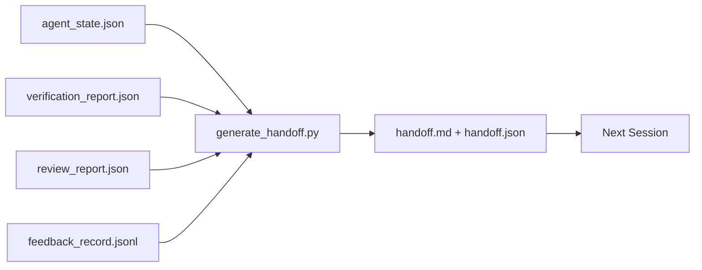

# Çoklu Oturum Aktarımı

> Oturum sona erecek. İş öyle değil. Aktarma paketi, "agent'nin bir saat boyunca çalışmasını" "bir sonraki oturumun ilk dakikada üretken olmasına" dönüştüren artifact'dir. Bunu sonradan düşünülerek değil, bilerek inşa edin.

**Tür:** Yapım
**Diller:** Python (stdlib)
**Önkoşullar:** Aşama 14 · 34 (Repo Belleği), Aşama 14 · 38 (Doğrulama), Aşama 14 · 39 (İnceleyen)
**Süre:** ~50 dakika

## Öğrenme Hedefleri

- Her aktarım paketinin ihtiyaç duyduğu yedi alanı tanımlayın.
- El yazısı düzyazı olmadan artifact çalışma tezgahından bir geçiş oluşturun.
- Büyük geri bildirim günlüklerini, aktarım boyutunda bir özete dönüştürün.
- Bir sonraki oturumun ilk eylemini belirleyici hale getirin.

## Sorun

Oturum sona erer. agent "harika, ilerleme kaydettik" diyor. Bir sonraki oturum açılır. Bir sonraki agent "nerede kaldık?" diye soruyor. İlk agent'nin cevabı gitti. Bir sonraki agent, aynı komutları yeniden keşfeder, yeniden çalıştırır, insana aynı soruları yeniden sorar ve önceki oturumun son otuz saniyesini kurtararak otuz dakika yakar.

Kötü bir devir işleminin maliyeti, görevin ömrü boyunca her oturumda ödenir. Düzeltme, oturumun sonunda otomatik olarak oluşturulan bir pakettir: ne değişti, neden, ne denendi, ne başarısız oldu, ne kaldı, bir dahaki sefere ilk olarak ne yapılmalı.

## Konsept



### Her aktarımda yedi alan bulunur

| Alan | Soru cevapları |
|-------|---------------------|
| `summary` | Yapılanlardan bir paragraf |
| `changed_files` | Bir bakışta fark |
| `commands_run` | Gerçekte ne idam edildi |
| `failed_attempts` | Neler denendi ve neden işe yaramadı |
| `open_risks` | Bir sonraki seansta ne ciddi bir şekilde ısırabilir |
| `next_action` | Bir sonraki oturumda ilk somut adım atılıyor |
| `verdict_pointer` | Doğrulama + inceleme raporlarına giden yol |

`next_action` alanı yük taşıyan alandır. `next_action` dışında her şeyi içeren bir aktarım, bir aktarım değil, bir durum raporudur.

### Aktarmalar yazılmaz, oluşturulur

Elle yazılan devir, zor bir günde atlanan bir devirdir. Jeneratör artifact çalışma tezgahını okur ve paketi yayar. agent'nin görevi çalışma tezgahını, özeti yazmak değil, oluşturucunun özetleyebileceği bir durumda bırakmaktır.

### İki biçim: insan tarafından okunabilen ve makine tarafından okunabilen

`handoff.md` insanın okuduğu şeydir. `handoff.json`, bir sonraki agent'nin yüklediği şeydir. Her ikisi de aynı kaynak artifact'den geliyor. Farklılaşırlarsa JSON kazanır.

### Geri bildirim günlüğü kırpma

`feedback_record.jsonl`'nin tamamı yüzlerce giriş olabilir. Aktarma yalnızca son K artı sıfırdan farklı bir çıkışa sahip her girişi taşır. Bir sonraki oturum, gerekiyorsa günlüğün tamamını yükler ancak paket küçük kalır.

### Temiz bir durum bırakın

Bir devir işi açıklar. Temiz bir durum, işi devam ettirilebilir hale getirir. Onlar aynı şey değil. Mükemmel bir `handoff.md`, bir sonraki oturum yarı uygulanmış bir farkla, agent'nin unuttuğu bir geçici dosyayla, başıboş bir dalla açılırsa ve bu hatayı daha çalıştırılmadan önce test ederse değersizdir. Bir sonraki agent daha sonra ilk on dakikasını inşa etmek yerine sonuncusundan sonra temizlik yaparak geçirir ve maliyet, görevin ömrü boyunca her oturumu birleştirir.

Yani özellik çalıştığında oturum bitmiyor. Workbench, jeneratörün özetleyebileceği ve bir sonraki oturumun güvenebileceği bir duruma geldiğinde sona erer. Temizleme başlı başına bir aşamadır, devirden önce gerçekleştirilir ve bu bir alışkanlık değil, bir kontroldür, çünkü alışkanlık zor bir günde atlanan şeydir.

| Kontrol Et | Temiz demek | Kirli bloklar çünkü |
|-------|-------------|----------------------|
| Çalışma ağacı | Yapılan veya açıkça bir notla saklanan her değişiklik | Yarı uygulanmış bir fark, bir sonraki agent |
| Sıcaklık artifact | Geride `*.tmp`, karalama dizinleri, hata ayıklama baskıları veya yorumlanmış bloklar kalmadı | Başıboş dosyalar farkı ve bir sonraki agent'nin zihinsel modelini kirletiyor |
| Testler | Yeşil veya kırmızı, `open_risks` | Sessiz kırmızı test, sonraki oturum adımlarında bir tuzaktır |
| Özellik panosu | `feature_list.json` durumu gerçeği yansıtıyor (Aşama 14 · 36) | Eski bir pano, bir sonraki oturumu zaten yapılmış olan çalışmaya gönderir |
| Şube | Beklenen dalda müstakil HEAD yok, yetim dal yok | Yanlış dal, bir sonraki oturumun ilk işleminin yanlış yere gitmesi anlamına gelir |

Temizleme aşaması, `clean_state.json` engelleme sorunlarına neden olur; Boş bir liste, aktarım oluşturucunun bir paket yazmadan önce ileri sürdüğü önkoşuldur. Kirli bir ağaca inşa edilen bir aktarım, bir aktarım değil, yönlendirilmiş bir karışıklıktır. İki artifact çifti: Temizleme, çalışma tezgahından ayrılmanın güvenli olduğunu kanıtlar, devir ise bir sonraki oturumun nereden başlayacağını bildiğini kanıtlar.

## İnşa Et

`code/main.py` şunu uygular:

- Durumu, kararı, incelemeyi ve geri bildirimi tek bir `WorkbenchSnapshot`'de toplayan bir yükleyici.
- Bir `generate_handoff(snapshot) -> (markdown, payload)` işlevi.
- Son K geribildirim girişini ve sıfır olmayan tüm çıkışları seçen bir filtre.
- Komut dosyasının yanına `handoff.md` ve `handoff.json` yazan bir demo çalıştırması.

Çalıştır:

```
python3 code/main.py
```

Çıktı: basılı bir aktarma gövdesi ve ayrıca diskteki her iki dosya.

## Vahşi doğada üretim modelleri

Codex CLI, Claude Code ve OpenCode'un her biri farklı bir sıkıştırma hikayesi sunar; yapılandırılmış devir paketi bu üçünün üzerinde yer alır.

**Sıkıştırma stratejileri değişiklik gösterir; paket şeması bunu yapmaz.** Codex CLI'nin POST /v1/responses/compact'ı sunucu tarafında opak bir AES blobudur (OpenAI modelleri için hızlı yol); geri dönüş, `_summary` kullanıcı rolü mesajı olarak eklenen yerel bir "aktarım özetidir". Claude Code, bağlamın %95'inde beş aşamalı aşamalı sıkıştırmayı çalıştırır. OpenCode, zaman damgasına dayalı mesaj gizlemenin yanı sıra 5 başlıklı bir LLM özeti de yapar. Üç farklı mekanizma, aynı ihtiyaç: Sıkıştırmadan sağ kalanları taşınabilir bir artifact'ye seri hale getirin. Paket şu artifact.

**Yeni oturum aktarımı sıkıştırma değildir.** Sıkıştırma oturumu uzatır; aktarım birini temiz bir şekilde kapatır ve bir sonrakini başlatır. Hermes Sayı #20372 çerçevelemesi (Nisan 2026) doğrudur: yerinde sıkıştırma bozulmaya başladığında, agent kompakt bir aktarım yazmalı, oturumu sonlandırmalı ve yeni bağlamda devam etmelidir. Paket, bu geçişi ucuz kılan şeydir. Hata, kalite çökünceye kadar sıkıştırmaya devam etmektir; Çözüm, erken ve temiz bir devir için bütçe ayırmaktır.

**Dal ve konu başına bir aktif aktarım.** Çoklu agent koordinasyonu, kötü model çıktısından ziyade eski aktarımlarda bozulur. Her zaman `branch`, `last_known_good_commit` ve `active | superseded | archived`'nin `status`'sini ekleyin. Eski aktarımlar arşivlenir; yalnızca aktif olan bir sonraki oturumu yönlendirir. Bu, not olarak aktarma ile durum olarak aktarma arasındaki farktır.

**Duvarda değil, %50-75 bağlamdan önce tamamlayın.** Elle yazılmış desenli taktik kitabı (CLAUDE.md + HANDOVER.md), oturum %95 yerine %50-75 bağlam bütçesiyle sona erdiğinde en iyi sonuçları bildirir. Paket oluşturucu, artifact sıkıştırması kaynak durumunu kirletmeden önce temiz bir şekilde çalışır. Bağlam bozulmadan yazmak ucuzdur; model zaten yerini kaybettiğinde pahalı.

## Kullan onu

Üretim modelleri:

- **Oturum sonu kancası.** Kullanıcı sohbeti kapattığında çalışma zamanı oluşturucuyu çalıştırır. Paket `outputs/handoff/<session_id>/`'ye gider.
- **PR şablonu.** Oluşturucunun işaretlemesi aynı zamanda bir PR gövdesidir. Gözden geçirenler bunu diğer beş dosyayı açmadan okudu.
- **Cross-agent aktarımı.** Bir ürünle (Claude Kodu) oluşturun, başka bir ürünle (Codex) devam edin. Paket ortak dildir.

Paket küçük, düzenli ve üretimi ucuzdur. Her seansta maliyet tasarrufu sağlayan bileşimler.

## Gönderin

`outputs/skill-handoff-generator.md`, bir projenin artifact yollarına ayarlanmış bir oluşturucu, onu çalıştıran bir oturum sonu kancası ve bir sonraki agent'nin başlangıçta okuduğu bir `handoff.json` şeması üretir.

## Egzersizler

1. Oluşturucunun kaydettiği ancak inceleyenin 1'in üzerinde puan almadığı her varsayımı ortaya çıkaran bir `assumptions_to_validate` alanı ekleyin.
2. Geri bildirim özetini, başarısız çalıştırmalar ve başarılı çalıştırmalar için farklı şekilde kesin. Asimetriyi savunun.
3. "İnsana yönelik sorular" listesi ekleyin. Bir sorunun pakete veya sohbet mesajına dönüştürülme eşiği nedir?
4. Jeneratörü bağımsız hale getirin: iki kez çalıştırmak aynı paketi üretir. Bunun devam etmesi için neyin istikrarlı olması gerekiyor?
5. Harekete geçmeden önce bir sonraki oturumun yüklemesi gereken artifact'leri tam olarak listeleyen bir "sonraki oturum önkoşulları" bölümünü ekleyin.

## Anahtar Terimler

| Dönem | İnsanlar ne diyor | Aslında ne anlama geliyor |
|------|----------------|------------------------|
| Devir paketi | "Oturum özeti" | Hem markdown hem de JSON olmak üzere yedi alanı taşıyan artifact oluşturuldu |
| Sonraki eylem | "İlk önce ne yapılmalı" | Bir sonraki oturumu başlatan tek somut adım |
| Geri bildirim düzeltmesi | "Günlük özeti" | Son K kayıtları artı sıfır olmayan her çıkış |
| Durum raporu | "Ne yaptık" | `next_action` eksik bir belge; kullanışlı ama bir geçiş değil |
| Karar işaretçisi | "Makbuz" | İzlenebilirlik için doğrulama + inceleme raporlarına giden yol |

## Daha Fazla Okuma

- [Uzun süreli agent'ler için Antropik, Etkili koşum takımları](https://www.anthropic.com/engineering/effective-harnesses-for-long-running-agents)
- [OpenAI Agent SDK aktarımları](https://openai.github.io/openai-agents-python/handoffs/)
- [Codex Blogu, Codex CLI Bağlamı Sıkıştırma: Mimari, Yapılandırma, Uzun Oturumları Yönetme](https://codex.danielvaughan.com/2026/03/31/codex-cli-context-compaction-architecture/) — POST /v1/responses/compact ve yerel geri dönüş
- [Justin3go, Ağır Anıları Atmak: Codex, Claude Code, OpenCode'da Bağlam Sıkıştırma](https://justin3go.com/en/posts/2026/04/09-context-compaction-in-codex-claude-code-and-opencode) — üç tedarikçili sıkıştırma karşılaştırması
- [JD Hodges, Claude Handoff Prompt: Oturumlar Arasında Bağlam Nasıl Korunur (2026)](https://www.jdhodges.com/blog/ai-session-handoffs-keep-context-across-conversations/) — CLAUDE.md + HANDOVER.md, %50-75 bağlam bütçesi
- [Mervin Praison, Çoklu Agent Kodlama Oturumlarında Aktarımları Yönetme: Sürekliliği Kaybetmeden Yeni Bağlam](https://mer.vin/2026/04/managing-handoffs-in-multi-agent-coding-sessions-fresh-context-without-losing-continuity/) — dağıtılmış sistem çerçeveleme
- [Hermes Sayı #20372 — sıkıştırma riskli hale geldiğinde otomatik yeni oturum geçişi](https://github.com/NousResearch/hermes-agent/issues/20372)
- [Hermes Sayı #499 — Bağlam Sıkıştırma Kalitesinin Yenilenmesi](https://github.com/NousResearch/hermes-agent/issues/499) — Codex CLI'de aktarım odaklı prompt'ler
- [Microsoft Agent Framework, Sıkıştırma](https://learn.microsoft.com/en-us/agent-framework/agents/conversations/compaction)
- [OpenCode, Bağlam Yönetimi ve Sıkıştırma](https://deepwiki.com/sst/opencode/2.4-context-management-and-compaction)
- [LangChain, Agent'ler için Bağlam Mühendisliği](https://www.langchain.com/blog/context-engineering-for-agents)
- Aşama 14 · 34 — jeneratörün okuduğu durum dosyası
- Aşama 14 · 38 — paketin işaret ettiği doğrulama kararı
- Aşama 14 · 39 — pakete eklenen inceleme raporu
