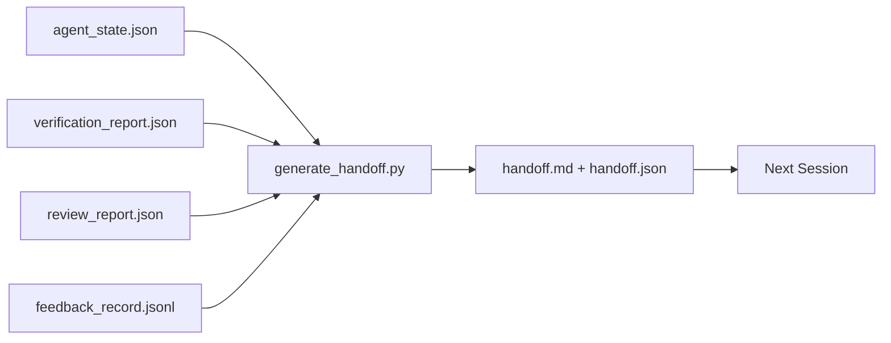

# 40 · 多会话交接

> 会话即将结束，但工作不会。交接包（handoff packet）正是那个把「智能体干了一个小时」变成「下一个会话在第一分钟就能开始产出」的产物。要有意识地构建它，而不是事后补救。

**类型：** 构建
**语言：** Python（标准库）
**前置：** Phase 14 · 34（仓库记忆）、Phase 14 · 38（验证）、Phase 14 · 39（评审者）
**时长：** 约 50 分钟

## 学习目标

- 弄清每个交接包都需要的七个字段。
- 从工作台（workbench）产物生成交接包，无需手写散文式描述。
- 把庞大的反馈日志精简成交接包尺寸的摘要。
- 让下一个会话的首个动作具备确定性。

## 问题所在

会话结束了。智能体说「很好，我们有进展」。下一个会话打开了。下一个智能体问「我们上次进行到哪里了？」第一个智能体的答案早已消失。下一个智能体只能重新摸索、重跑同样的命令、向人类重复问同样的问题，花三十分钟去找回上一个会话最后三十秒的内容。

一次糟糕交接的代价，会在这个任务的整个生命周期里每个会话都付出一次。解决办法是在会话结束时自动生成一个交接包：改了什么、为什么改、试过什么、什么失败了、还剩什么、下次先做什么。

## 核心概念



### 每个交接包携带的七个字段

| 字段 | 它回答的问题 |
|-------|---------------------|
| `summary` | 一段话说明做了什么 |
| `changed_files` | 一眼可见的 diff |
| `commands_run` | 实际执行了什么 |
| `failed_attempts` | 试过什么、为什么没成功 |
| `open_risks` | 下个会话可能踩到的坑，以及严重程度 |
| `next_action` | 下个会话要走的第一个具体步骤 |
| `verdict_pointer` | 指向验证报告 + 评审报告的路径 |

`next_action` 字段是承重的那一个。一个除了 `next_action` 之外什么都有的交接包，是一份状态报告（status report），而不是一次交接。

### 交接包是生成的，不是写出来的

手写的交接包，正是在艰难的一天里会被跳过的那种交接包。生成器读取工作台产物并输出交接包。智能体的职责是把工作台留在一个生成器能够总结的状态，而不是去写那份总结。

### 两种形态：人读的与机读的

`handoff.md` 是给人读的。`handoff.json` 是给下一个智能体加载的。两者都来自同一批源产物。一旦两者出现分歧，以 JSON 为准。

### 反馈日志精简

完整的 `feedback_record.jsonl` 可能有数百条条目。交接包只携带最后 K 条，外加每一条退出码非零（non-zero exit）的条目。下一个会话如有需要可以加载完整日志，但交接包本身保持小巧。

## 动手构建

`code/main.py` 实现了：

- 一个加载器，把状态、判定、评审和反馈汇聚成单个 `WorkbenchSnapshot`。
- 一个 `generate_handoff(snapshot) -> (markdown, payload)` 函数。
- 一个过滤器，挑出最后 K 条反馈条目外加所有非零退出码的条目。
- 一次演示运行，在脚本旁边写出 `handoff.md` 和 `handoff.json`。

运行它：

```
python3 code/main.py
```

输出：打印出的交接包正文，外加磁盘上的两个文件。

## 业界的生产实践模式

Codex CLI、Claude Code 和 OpenCode 各自有一套不同的压缩（compaction）方案；而结构化的交接包凌驾于这三者之上。

**压缩策略各不相同，交接包模式（schema）却始终如一。** Codex CLI 的 POST /v1/responses/compact 是一个服务端不透明的 AES 加密块（针对 OpenAI 模型的快速路径）；其降级方案是把本地的「交接摘要」作为一条 `_summary` user 角色消息追加进去。Claude Code 在上下文达到 95% 时运行五阶段渐进式压缩。OpenCode 则采用基于时间戳的消息隐藏，外加一份 5 个标题的 LLM 摘要。三种不同的机制，同一种需求：把经过压缩后存活下来的内容序列化成一个可移植的产物。交接包就是那个产物。

**全新会话交接不等于压缩。** 压缩是延长一个会话；交接是干净地关闭一个会话并启动下一个。Hermes Issue #20372 的论述（2026 年 4 月）说得对：当原地压缩开始造成质量退化时，智能体应当写出一份紧凑的交接包、结束会话，并在全新的上下文中恢复工作。交接包正是让这种切换变得廉价的东西。错误在于一直压缩到质量崩溃为止；正确做法是预留余量，提早做一次干净的交接。

**每个分支和主题只保留一个活跃交接。** 多智能体协调的崩溃，更多源于过期的交接，而非源于糟糕的模型输出。务必包含 `branch`、`last_known_good_commit`，以及取值为 `active | superseded | archived` 的 `status`。过期的交接会被归档；只有活跃的那一个才驱动下一个会话。这正是「把交接当笔记」与「把交接当状态」的区别。

**在上下文用到 50-75% 之前收尾，别撞到墙上。** 手写模式的实践手册（CLAUDE.md + HANDOVER.md）报告称，当会话在上下文预算的 50-75% 处结束、而非 95% 处结束时，效果最好。交接包生成器要在压缩产生的杂质污染源状态之前干净地运行。趁上下文完好时写交接，成本低廉；等模型已经找不着北了再写，代价高昂。

## 实战运用

生产实践模式：

- **会话结束钩子（session-end hook）。** 当用户关闭对话时，运行时触发生成器。交接包写入 `outputs/handoff/<session_id>/`。
- **PR 模板。** 生成器产出的 markdown 同时也是一份 PR 正文。评审者无需打开另外五个文件就能读懂。
- **跨智能体交接。** 用一个产品（Claude Code）构建，用另一个产品（Codex）继续。交接包就是通用语（lingua franca）。

交接包小巧、规整、产出廉价。其节省的成本会随着每个会话不断累积。

## 交付落地

`outputs/skill-handoff-generator.md` 会产出一个针对某项目产物路径调优过的生成器、一个运行它的会话结束钩子，以及一份下一个智能体在启动时读取的 `handoff.json` 模式。

## 练习

1. 增加一个 `assumptions_to_validate` 字段，把构建者记录下、但评审者评分未超过 1 的每一个假设都暴露出来。
2. 对失败的运行与通过的运行，采用不同方式精简反馈摘要。为这种不对称性辩护。
3. 加入一个「给人类的问题」列表。一个问题要进入交接包（而不是进入聊天消息）的门槛是什么？
4. 让生成器具备幂等性（idempotent）：运行两次产生相同的交接包。要做到这点，什么必须保持稳定？
5. 增加一个「下一会话前置条件」小节，精确列出下一个会话在行动前必须加载的产物。

## 关键术语

| 术语 | 人们的说法 | 实际含义 |
|------|----------------|------------------------|
| 交接包（Handoff packet） | 「会话摘要」 | 携带七个字段、同时具备 markdown 和 JSON 两种形态的生成产物 |
| 下一动作（Next action） | 「先做什么」 | 启动下一个会话的那一个具体步骤 |
| 反馈精简（Feedback trim） | 「日志摘要」 | 最后 K 条记录外加每一条非零退出码 |
| 状态报告（Status report） | 「我们做了什么」 | 一份缺少 `next_action` 的文档；有用，但不是交接 |
| 判定指针（Verdict pointer） | 「凭据」 | 为可追溯性指向验证报告 + 评审报告的路径 |

## 延伸阅读

- [Anthropic, Effective harnesses for long-running agents](https://www.anthropic.com/engineering/effective-harnesses-for-long-running-agents)
- [OpenAI Agents SDK handoffs](https://platform.openai.com/docs/guides/agents-sdk/handoffs)
- [Codex Blog, Codex CLI Context Compaction: Architecture, Configuration, Managing Long Sessions](https://codex.danielvaughan.com/2026/03/31/codex-cli-context-compaction-architecture/) — POST /v1/responses/compact 与本地降级方案
- [Justin3go, Shedding Heavy Memories: Context Compaction in Codex, Claude Code, OpenCode](https://justin3go.com/en/posts/2026/04/09-context-compaction-in-codex-claude-code-and-opencode) — 三家厂商压缩方案对比
- [JD Hodges, Claude Handoff Prompt: How to Keep Context Across Sessions (2026)](https://www.jdhodges.com/blog/ai-session-handoffs-keep-context-across-conversations/) — CLAUDE.md + HANDOVER.md，50-75% 上下文预算
- [Mervin Praison, Managing Handoffs in Multi-Agent Coding Sessions: Fresh Context Without Losing Continuity](https://mer.vin/2026/04/managing-handoffs-in-multi-agent-coding-sessions-fresh-context-without-losing-continuity/) — 分布式系统视角的论述
- [Hermes Issue #20372 — automatic fresh-session handoff when compression becomes risky](https://github.com/NousResearch/hermes-agent/issues/20372)
- [Hermes Issue #499 — Context Compaction Quality Overhaul](https://github.com/NousResearch/hermes-agent/issues/499) — Codex CLI 中面向交接的提示词
- [Microsoft Agent Framework, Compaction](https://learn.microsoft.com/en-us/agent-framework/agents/conversations/compaction)
- [OpenCode, Context Management and Compaction](https://deepwiki.com/sst/opencode/2.4-context-management-and-compaction)
- [LangChain, Context Engineering for Agents](https://www.langchain.com/blog/context-engineering-for-agents)
- Phase 14 · 34 — 生成器读取的状态文件
- Phase 14 · 38 — 交接包所指向的验证判定
- Phase 14 · 39 — 打包进交接包的评审者报告
