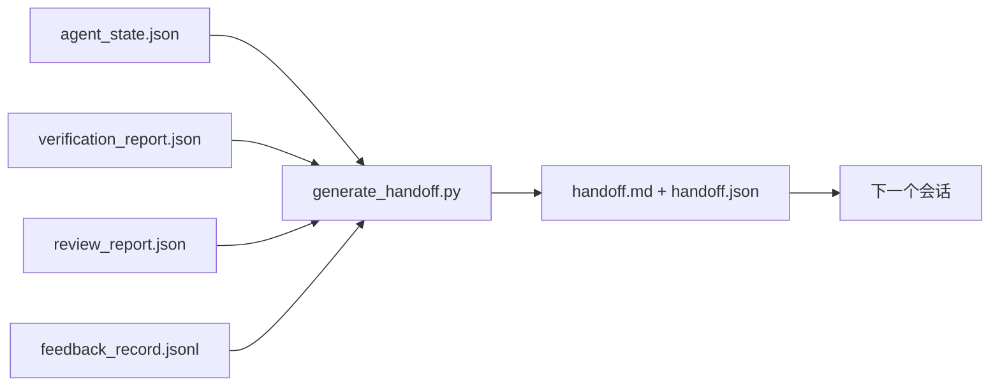

# 多会话交接

> 会话即将结束。工作还没有。交接包是将"agent 工作了一小时"转变为"下一个会话在第一分钟就高效"的工件。有目的地构建它，而不是作为事后思考。

**类型：** 构建
**语言：** Python（标准库）
**前置条件：** 第 14 阶段 · 34（仓库记忆），第 14 阶段 · 38（验证），第 14 阶段 · 39（审查者）
**时间：** ~50 分钟

## 学习目标

- 识别每个交接包需要的七个字段。
- 从工作台工件生成交接，无需手写散文。
- 将大型反馈日志修剪成交接大小的摘要。
- 使下一个会话的第一个动作是确定性的。

## 问题

会话结束。Agent 说"很好，我们取得了进展。"下一个会话打开。下一个 agent 问"我们上次停在哪里？"第一个 agent 的答案已经消失。下一个 agent 重新发现、重新运行相同的命令、重新向人类问相同的问题，并花费三十分钟恢复上一个会话的最后三十秒。

糟糕交接的成本在任务的每个会话中都要支付。修复是在会话结束时自动生成的包：什么改变了、为什么、尝试了什么、什么失败了、剩下什么、下次首先做什么。

## 概念



### 每个交接携带的七个字段

| 字段 | 它回答的问题 |
|------|-------------|
| `summary` | 做了什么的一段文字 |
| `changed_files` | 一目了然的变化 |
| `commands_run` | 实际执行了什么 |
| `failed_attempts` | 尝试了什么以及为什么没成功 |
| `open_risks` | 下次会话可能咬人的东西，带严重度 |
| `next_action` | 下次会话采取的第一个具体步骤 |
| `verdict_pointer` | 验证 + 审查报告的路径 |

`next_action` 字段是承重的。一个除了 `next_action` 之外什么都有的交接是状态报告，不是交接。

### 交接是生成的，不是写的

手写的交接是在艰难日子里会被跳过的交接。生成器读取工作台工件并发出包。Agent 的工作是将工作台留在生成器可以摘要的状态，而不是写摘要。

### 两种形式：人类可读和机器可读

`handoff.md` 是人类读的。`handoff.json` 是下一个 agent 加载的。两者都来自相同的源工件。如果它们分叉，JSON 胜出。

### 反馈日志修剪

完整的 `feedback_record.jsonl` 可能有数百条条目。交接只携带最后 K 条加上每个非零退出的条目。下一个会话如果需要可以加载完整日志，但包保持小巧。

## 构建

`code/main.py` 实现：

- 一个加载器，将状态、裁决、审查和反馈收集到单个 `WorkbenchSnapshot` 中。
- 一个 `generate_handoff(snapshot) -> (markdown, payload)` 函数。
- 一个过滤器，选择最后 K 条反馈条目加上所有非零退出。
- 一个演示运行，将 `handoff.md` 和 `handoff.json` 写在脚本旁边。

运行：

```
python3 code/main.py
```

输出：打印的交接正文，加上磁盘上的两个文件。

## 野外生产模式

Codex CLI、Claude Code 和 OpenCode 各自提供不同的压缩故事；结构化交接包位于所有三个之上。

**压缩策略不同；包模式不变。** Codex CLI 的 POST /v1/responses/compact 是一个服务器端不透明的 AES blob（OpenAI 模型的快速路径）；回退是本地"交接摘要"作为 `_summary` 用户角色消息追加。Claude Code 在 95% 上下文时运行五阶段渐进压缩。OpenCode 做基于时间戳的消息隐藏加 5 标题 LLM 摘要。三种不同机制，相同需求：将压缩后存活的东西序列化为可移植工件。包就是那个工件。

**新会话交接不是压缩。** 压缩扩展会话；交接干净地关闭一个并启动下一个。Hermes Issue #20372 框架（2026 年 4 月）是正确的：当原地压缩开始降级时，agent 应该写一个紧凑交接，结束会话，并在新上下文中恢复。包是使那个转换便宜的东西。错误是持续压缩直到质量崩溃；修复是为早期、干净的交接做预算。

**每个分支和主题一个活动交接。** 多 agent 协调在陈旧交接上比在糟糕模型输出上更容易崩溃。始终包含 `branch`、`last_known_good_commit` 和 `active | superseded | archived` 的 `status`。陈旧交接被归档；只有活动的驱动下一个会话。这是交接作为笔记和交接作为状态之间的区别。

**在 50-75% 上下文之前结束，不是在墙边。** 手写模式剧本（CLAUDE.md + HANDOVER.md）报告最佳结果是在 50-75% 上下文预算时结束会话，而不是 95%。包生成器在压缩工件污染源状态之前干净地运行。上下文完整时写起来便宜；模型已经失去位置时昂贵。

## 使用

生产模式：

- **会话结束钩子。** 运行时当用户关闭聊天时触发生成器。包进入 `outputs/handoff/<session_id>/`。
- **PR 模板。** 生成器的 markdown 也是 PR 正文。审查者无需打开五个其他文件即可阅读。
- **跨 agent 交接。** 用一个产品构建（Claude Code），用另一个继续（Codex）。包是通用语。

包小巧、规则且生产成本低。成本节省在每个会话中复利。

## 交付

`outputs/skill-handoff-generator.md` 产生一个针对项目工件路径调优的生成器、一个运行它的会话结束钩子，以及下一个 agent 在启动时读取的 `handoff.json` 模式。

## 练习

1. 添加一个 `assumptions_to_validate` 字段，呈现构建者记录但审查者评分未超过 1 的每个假设。
2. 对失败运行与通过运行不同地修剪反馈摘要。为不对称辩护。
3. 包含一个"人类问题"列表。问题进入包与进入聊天消息的阈值是什么？
4. 使生成器幂等：运行两次产生相同的包。需要什么稳定才能使这成立？
5. 添加一个"下次会话前置条件"部分，准确列出下次会话在行动前必须加载的工件。

## 关键术语

| 术语 | 人们怎么说 | 实际含义 |
|------|-----------|---------|
| Handoff packet | "会话摘要" | 携带七个字段的生成工件，markdown 和 JSON 两种形式 |
| Next action | "首先做什么" | 启动下一个会话的一个具体步骤 |
| Feedback trim | "日志摘要" | 最后 K 条记录加上每个非零退出 |
| Status report | "我们做了什么" | 缺少 `next_action` 的文档；有用，但不是交接 |
| Verdict pointer | "收据" | 验证 + 审查报告的路径，用于可追溯性 |

## 延伸阅读

- [Anthropic, 长程 agent 的有效工具](https://www.anthropic.com/engineering/effective-harnesses-for-long-running-agents)
- [OpenAI Agents SDK 交接](https://platform.openai.com/docs/guides/agents-sdk/handoffs)
- [Codex Blog, Codex CLI 上下文压缩：架构、配置、管理长会话](https://codex.danielvaughan.com/2026/03/31/codex-cli-context-compaction-architecture/) —— POST /v1/responses/compact 和本地回退
- [Justin3go, 摆脱沉重记忆：Codex、Claude Code、OpenCode 中的上下文压缩](https://justin3go.com/en/posts/2026/04/09-context-compaction-in-codex-claude-code-and-opencode) —— 三供应商压缩比较
- [JD Hodges, Claude 交接提示：如何跨会话保持上下文 (2026)](https://www.jdhodges.com/blog/ai-session-handoffs-keep-context-across-conversations/) —— CLAUDE.md + HANDOVER.md，50-75% 上下文预算
- [Mervin Praison, 管理多 Agent 编码会话中的交接：新鲜上下文不丢失连续性](https://mer.vin/2026/04/managing-handoffs-in-multi-agent-coding-sessions-fresh-context-without-losing-continuity/) —— 分布式系统框架
- [Hermes Issue #20372 — 压缩变得有风险时自动新会话交接](https://github.com/NousResearch/hermes-agent/issues/20372)
- [Hermes Issue #499 — 上下文压缩质量大改](https://github.com/NousResearch/hermes-agent/issues/499) —— Codex CLI 中以交接为导向的提示
- [Microsoft Agent Framework, 压缩](https://learn.microsoft.com/en-us/agent-framework/agents/conversations/compaction)
- [OpenCode, 上下文管理和压缩](https://deepwiki.com/sst/opencode/2.4-context-management-and-compaction)
- [LangChain, Agent 的上下文工程](https://www.langchain.com/blog/context-engineering-for-agents)
- 第 14 阶段 · 34 —— 生成器读取的状态文件
- 第 14 阶段 · 38 —— 包指向的验证裁决
- 第 14 阶段 · 39 —— 打包进包的审查者报告