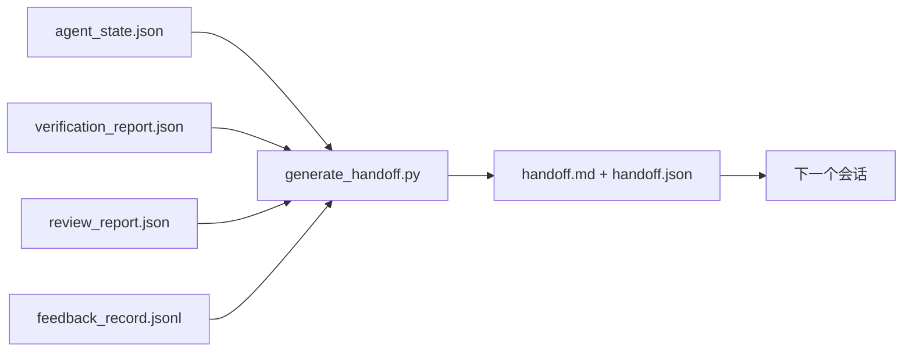

# 多会话交接（Multi-Session Handoff）

> 译注：本文译自同目录 [`en.md`](./en.md)。术语遵循仓根 [TRANSLATION_GUIDE.md](../../../../TRANSLATION_GUIDE.md)。

> 会话要结束了，活儿可还没干完。交接包（handoff packet）就是那份让"agent 干了一小时"变成"下一个会话第一分钟就能产出"的产物。要刻意去构建它，而不是事后补一份。

**Type:** Build
**Languages:** Python (stdlib)
**Prerequisites:** Phase 14 · 34 (Repo Memory), Phase 14 · 38 (Verification), Phase 14 · 39 (Reviewer)
**Time:** ~50 minutes

## 学习目标

- 识别每个交接包必须包含的七个字段。
- 直接从工作台（workbench）产出物生成交接包，不要手写大段文字。
- 把超长的 feedback 日志压成一份交接尺寸的摘要。
- 让下一个会话的第一步动作是确定的。

## 问题（Problem）

会话结束。agent 说"很好，我们有进展"。下一个会话开启。下一个 agent 问"我们停在哪儿了？"上一个 agent 给的答案早没了。下一个 agent 只能重新摸索，重新跑同样的命令，重新问人类同样的问题，于是花三十分钟去找回上一个会话最后三十秒的成果。

一次糟糕的交接，代价会在这项任务的整个生命周期里、每个会话都被偿付一次。修复办法是：在会话结束时自动生成一个交接包——改了什么、为什么、试过什么、什么失败了、还剩什么、下次第一步该干什么。

## 概念（Concept）



### 每个交接包必带的七个字段

| 字段 | 它回答的问题 |
|-------|---------------------|
| `summary` | 用一段话讲做了什么 |
| `changed_files` | 一眼能看完的 diff |
| `commands_run` | 实际执行了什么命令 |
| `failed_attempts` | 试过什么、为什么没成 |
| `open_risks` | 下个会话可能踩什么坑，附严重程度 |
| `next_action` | 下个会话的第一个具体动作 |
| `verdict_pointer` | 指向 verification + review 报告的路径 |

`next_action` 是承重字段。一个除了 `next_action` 什么都有的交接包，是状态报告，不是交接。

### 交接包是生成出来的，不是手写的

手写的交接包会在难熬的日子里被跳过。生成器读取 workbench 产出物，吐出交接包。agent 的工作是把 workbench 留在生成器能总结的状态，而不是亲自去写总结。

### 两种形式：人读 vs 机器读

`handoff.md` 是给人看的。`handoff.json` 是给下一个 agent 加载的。两者来自同一份源产物。如果它们出现分歧，以 JSON 为准。

### Feedback 日志的裁剪

完整的 `feedback_record.jsonl` 可能有几百条。交接包只携带最后 K 条，加上所有非零退出码的条目。下一个会话如果需要，可以加载完整日志，但交接包本身保持精简。

## 动手实现（Build It）

`code/main.py` 实现：

- 一个 loader，把 state、verdict、review、feedback 汇集成一个 `WorkbenchSnapshot`。
- 一个 `generate_handoff(snapshot) -> (markdown, payload)` 函数。
- 一个过滤器，挑出最后 K 条 feedback 加上所有非零退出条目。
- 一段 demo，把 `handoff.md` 和 `handoff.json` 写到脚本旁边。

跑起来：

```
python3 code/main.py
```

输出：打印一份交接正文，外加两个文件落盘。

## 真实世界里的生产模式

Codex CLI、Claude Code、OpenCode 各有一套不同的压缩（compaction）方案；而结构化的交接包，凌驾于这三者之上。

**压缩策略各异，交接包的 schema 不变。** Codex CLI 的 POST /v1/responses/compact 是服务端不透明的 AES blob（OpenAI 模型的快路径）；fallback 则是把一份本地"handoff summary"作为 `_summary` user 角色消息追加进去。Claude Code 在 95% 上下文时跑五阶段渐进式压缩。OpenCode 用基于时间戳的消息隐藏，加上 5 段标题的 LLM 摘要。三种不同机制，同一种需求：把压缩后能存活的部分序列化成可移植的产物。交接包就是那份产物。

**新会话交接不是压缩。** 压缩是延长一个会话；交接是干净地关闭一个会话并开启下一个。Hermes Issue #20372 的提法（2026 年 4 月）是对的：当原地压缩开始降低质量时，agent 应当写一份精简交接包，结束当前会话，在新的 context 里继续。交接包就是让那次切换成本足够低的关键。错误做法是一直压缩到质量崩溃；正确做法是给一次提早的、干净的交接预留预算。

**每条 branch、每个主题只能有一份 active 交接。** 多 agent 协作翻车，更多是因为陈旧的交接，而非模型输出本身。务必带上 `branch`、`last_known_good_commit`，以及一个取值为 `active | superseded | archived` 的 `status`。陈旧交接归档；只有 active 那份驱动下一个会话。这是"交接当笔记"和"交接当状态"的区别。

**在 50-75% 上下文之前收尾，别熬到墙根。** 手写模式（CLAUDE.md + HANDOVER.md）的实战经验显示：在 50-75% 上下文预算结束会话，效果好于撑到 95%。交接生成器要在压缩 artifact 还没污染源状态之前干净地跑。在 context 完整时写很便宜；等模型已经迷路了再写就很贵。

## 用起来（Use It）

生产模式：

- **会话结束钩子。** 用户关掉聊天时，运行时触发生成器。交接包落到 `outputs/handoff/<session_id>/`。
- **PR 模板。** 生成器产出的 markdown 同时就是 PR 正文。reviewer 不必再去翻五个其他文件。
- **跨 agent 交接。** 用一种产品（Claude Code）开工，用另一种（Codex）继续。交接包就是通用语。

交接包小、规整、产出便宜。这份成本节约会随着每一个会话不断复利。

## 上线部署（Ship It）

`outputs/skill-handoff-generator.md` 会产出一个针对项目产物路径调过的生成器、一个会话结束时调用它的钩子，以及下一个 agent 启动时读取的 `handoff.json` schema。

## 练习

1. 加一个 `assumptions_to_validate` 字段，把所有 builder 记录下、但 reviewer 没给到 1 分以上的假设浮出来。
2. 对失败的运行和通过的运行采用不同的 feedback 摘要裁剪策略。为这种不对称辩护。
3. 加一份"给人类的问题"列表。一个问题要进交接包、而不是进聊天消息，门槛是什么？
4. 让生成器幂等：跑两次得到同样的交接包。要让这条成立，哪些东西必须稳定？
5. 加一节"下一会话前置条件"，准确列出下一个会话动手前必须加载的产物。

## 关键术语

| 术语 | 大家口头怎么说 | 它实际是什么 |
|------|----------------|------------------------|
| Handoff packet（交接包） | "会话总结" | 生成出来、装着七个字段的产物，markdown 和 JSON 双形式 |
| Next action（下一步动作） | "先做什么" | 启动下一个会话的那一个具体步骤 |
| Feedback trim（feedback 裁剪） | "日志摘要" | 最后 K 条记录加上所有非零退出 |
| Status report（状态报告） | "我们做了什么" | 缺 `next_action` 的文档；有用，但不是交接 |
| Verdict pointer（裁决指针） | "回执" | 指向 verification + review 报告的路径，便于追溯 |

## 参考资料

- [Anthropic, Effective harnesses for long-running agents](https://www.anthropic.com/engineering/effective-harnesses-for-long-running-agents)
- [OpenAI Agents SDK handoffs](https://platform.openai.com/docs/guides/agents-sdk/handoffs)
- [Codex Blog, Codex CLI Context Compaction: Architecture, Configuration, Managing Long Sessions](https://codex.danielvaughan.com/2026/03/31/codex-cli-context-compaction-architecture/) — POST /v1/responses/compact 与本地 fallback
- [Justin3go, Shedding Heavy Memories: Context Compaction in Codex, Claude Code, OpenCode](https://justin3go.com/en/posts/2026/04/09-context-compaction-in-codex-claude-code-and-opencode) — 三家厂商压缩对比
- [JD Hodges, Claude Handoff Prompt: How to Keep Context Across Sessions (2026)](https://www.jdhodges.com/blog/ai-session-handoffs-keep-context-across-conversations/) — CLAUDE.md + HANDOVER.md，50-75% 上下文预算
- [Mervin Praison, Managing Handoffs in Multi-Agent Coding Sessions: Fresh Context Without Losing Continuity](https://mer.vin/2026/04/managing-handoffs-in-multi-agent-coding-sessions-fresh-context-without-losing-continuity/) — 分布式系统视角
- [Hermes Issue #20372 — automatic fresh-session handoff when compression becomes risky](https://github.com/NousResearch/hermes-agent/issues/20372)
- [Hermes Issue #499 — Context Compaction Quality Overhaul](https://github.com/NousResearch/hermes-agent/issues/499) — Codex CLI 中以交接为导向的 prompt
- [Microsoft Agent Framework, Compaction](https://learn.microsoft.com/en-us/agent-framework/agents/conversations/compaction)
- [OpenCode, Context Management and Compaction](https://deepwiki.com/sst/opencode/2.4-context-management-and-compaction)
- [LangChain, Context Engineering for Agents](https://www.langchain.com/blog/context-engineering-for-agents)
- Phase 14 · 34 — 生成器读取的 state 文件
- Phase 14 · 38 — 交接包指向的 verification 裁决
- Phase 14 · 39 — 打包进交接包的 reviewer 报告
