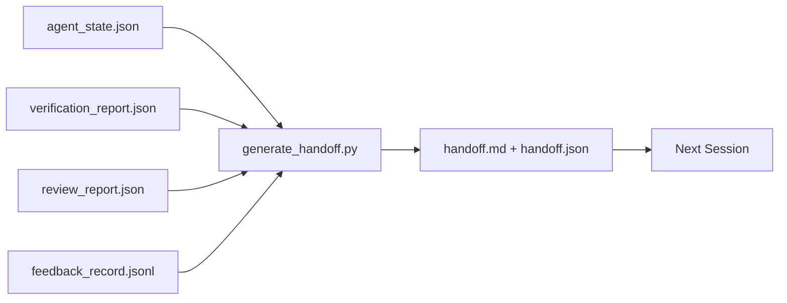

# 多会话交接

> 会话即将结束，但工作并未结束。交接包是将"智能体工作了一小时"转变为"下一个会话在第一分钟就能高效产出"的产物。请有目的地构建它，而非事后才想起。

**类型：** 构建
**语言：** Python（标准库）
**前置条件：** 阶段 14 · 34（仓库记忆），阶段 14 · 38（验证），阶段 14 · 39（审查者）
**预计用时：** ~50 分钟

## 学习目标

- 识别每个交接包所需的七个字段。
- 从工作台产物生成交接包，无需手动撰写描述。
- 将大量反馈日志精简为适合交接的摘要。
- 使下一个会话的第一个操作是确定性的。

## 问题

会话结束。智能体说"很好，我们取得了进展"。下一个会话开始。下一个智能体问"我们上次做到哪了？"上一个智能体的回答已经消失。下一个智能体重蹈覆辙，重新运行相同的命令，向人类重复提问同样的问题，浪费三十分钟去恢复上一个会话最后三十秒的状态。

一个糟糕的交接，其代价在每个会话中都会付出，贯穿任务的整个生命周期。解决方案是一个在会话结束时自动生成的包：发生了什么变化、为什么、尝试了什么、什么失败了、还剩下什么、下次首先要做什么。

## 概念


```mermaid
flowchart LR
  State[agent_state.json] --> Generator[generate_handoff.py]
  Verdict[verification_report.json] --> Generator
  Review[review_report.json] --> Generator
  Feedback[feedback_record.jsonl] --> Generator
  Generator --> Handoff[handoff.md + handoff.json]
  Handoff --> Next[Next Session]
```

### 交接包携带的七个字段

| 字段 | 它回答的问题 |
|-------|---------------------|
| `summary` | 一段话概括做了什么 |
| `changed_files` | 一眼看清差异 |
| `commands_run` | 实际执行了哪些命令 |
| `failed_attempts` | 尝试了什么以及为什么没有成功 |
| `open_risks` | 下个会话可能遇到的问题及其严重程度 |
| `next_action` | 下个会话要采取的第一个具体步骤 |
| `verdict_pointer` | 指向验证和审查报告的路径 |

`next_action` 字段是承重墙。一个除了 `next_action` 以外什么都有的交接包只是一份状态报告，而不是真正的交接。

### 交接包是生成的，而非手写的

手写的交接包是在艰难一天里会被跳过的交接包。生成器读取工作台产物并输出交接包。智能体的职责是让工作台处于生成器可以总结的状态，而不是去写总结。

### 两种形式：人类可读与机器可读

`handoff.md` 是供人类阅读的。`handoff.json` 是供下一个智能体加载的。两者来自相同的源产物。如果它们出现不一致，以 JSON 为准。

### 反馈日志精简

完整的 `feedback_record.jsonl` 可能有数百条记录。交接包只携带最后 K 条以及所有退出码非零的条目。下一个会话如果需要，可以加载完整的日志，但交接包保持小巧。

### 留下一个干净的状态

交接包描述工作。干净的状态让工作可恢复。它们不是一回事。如果下一个会话打开时面对的是半应用的差异、智能体忘记清理的临时文件、游离的分支以及连运行都报错的测试，那么一份完美的 `handoff.md` 也毫无价值。下一个智能体随后花掉前十分钟清理上一个智能体的遗留物，而不是构建新功能，这个代价在每个会话中都会累积，贯穿任务的整个生命周期。

因此，会话不是在功能可以工作时结束。它是在工作台处于生成器可以总结、下一个会话可以信任的状态时才结束。清理是独立的阶段，在交接之前执行，它是一种检查，而不是习惯——因为习惯是在艰难日子里会被跳过的东西。

| 检查项 | 干净意味着 | 脏状态会阻塞，因为 |
|-------|-------------|----------------------|
| 工作树 | 每次更改都已提交或明确暂存并附上说明 | 半应用的差异对下一个智能体来说像是有意的工作 |
| 临时产物 | 没有遗留的 `*.tmp`、临时目录、调试打印或注释掉的代码块 | 残留文件污染了差异和下个智能体的心智模型 |
| 测试 | 全部通过，或者失败但已在 `open_risks` 中标明 | 静默失败的测试是下个会话会踩中的陷阱 |
| 功能面板 | `feature_list.json` 状态反映实际情况（阶段 14 · 36） | 过时的面板会让下个会话去处理已经完成的工作 |
| 分支 | 处于预期的分支上，没有 detached HEAD，没有孤立分支 | 错误的分支意味着下个会话的第一次提交会落在错误的地方 |

清理阶段会输出 `clean_state.json`，列出阻塞性问题；空列表是交接包生成器在写入包之前断言的前提条件。基于脏工作树构建的交接包不是交接，而是转发的烂摊子。这两个产物配对使用：清理证明工作台可以安全离开，交接证明下个会话知道从哪里开始。

## 构建它

`code/main.py` 实现了：

- 一个加载器，将状态、验证结果、审查和反馈聚合到一个 `WorkbenchSnapshot` 中。
- 一个 `generate_handoff(snapshot) -> (markdown, payload)` 函数。
- 一个过滤器，选取最后 K 条反馈条目以及所有非零退出的条目。
- 一个演示运行，在脚本旁边写入 `handoff.md` 和 `handoff.json`。

运行方式：

```
python3 code/main.py
```

输出：打印的交接包正文，以及磁盘上的两个文件。

## 实际生产模式

Codex CLI、Claude Code 和 OpenCode 各自采用了不同的压缩方案；结构化交接包位于三者之上。

**压缩策略各不相同，但交接包模式不变。** Codex CLI 的 POST /v1/responses/compact 是一个服务端不透明的 AES blob（面向 OpenAI 模型的快速路径）；回退方案是一个作为 `_summary` 用户角色消息追加的本地"交接摘要"。Claude Code 在 95% 上下文时执行五阶段渐进压缩。OpenCode 采用基于时间戳的消息隐藏加上 5 标题的 LLM 摘要。三种不同的机制，同样的需求：将经过压缩后仍需保留的内容序列化为一个可移植的产物。交接包就是那个产物。

**新会话交接不是压缩。** 压缩延长一个会话；交接则干净地结束一个会话并启动下一个。Hermes Issue #20372（2026 年 4 月）的论述是正确的：当就地压缩开始退化时，智能体应编写一个紧凑的交接包，结束会话，并在新的上下文中恢复。交接包正是让这种转换代价低廉的关键。错误做法是持续压缩直到质量崩溃；正确做法是预留预算，提早进行干净的交接。

**每个分支和主题只有一个活跃交接包。** 多智能体协同在过时的交接包上出错的概率比在糟糕的模型输出上更高。始终包含 `branch`、`last_known_good_commit` 以及 `active | superseded | archived` 状态的 `status`。过时的交接包被归档；只有活跃的交接包驱动下一个会话。这就是交接即笔记与交接即状态的区别。

**在 50-75% 上下文时收尾，而不是到极限。** 手写模式手册（CLAUDE.md + HANDOVER.md）报告的最佳实践是在上下文预算用到 50-75% 时结束会话，而不是 95%。交接包生成器在压缩产物污染源状态之前可以干净地运行。在上下文完好时生成交接包代价低廉；当模型已经开始丢失上下文时则代价高昂。

## 使用它

生产模式：

- **会话结束钩子。** 运行时在用户关闭聊天时触发生成器。交接包放入 `outputs/handoff/<session_id>/` 目录。
- **PR 模板。** 生成器的 markdown 也可作为 PR 正文。审查者无需打开另外五个文件即可阅读。
- **跨智能体交接。** 用一个产品（Claude Code）构建，用另一个产品（Codex）继续。交接包是通用语言。

交接包小巧、规整且生成成本低廉。其成本节约效果随着每个会话而累积。

## 交付

`outputs/skill-handoff-generator.md` 生成一个针对项目产物路径定制的生成器、一个在会话结束时运行它的钩子，以及下个智能体启动时读取的 `handoff.json` 模式。

## 练习

1. 添加一个 `assumptions_to_validate` 字段，列出构建者记录过但审查者评分未超过 1 分的所有假设。
2. 对失败运行和通过运行采用不同的反馈摘要精简方式。论证这种不对称的合理性。
3. 包含一个"向人类提问"列表。一个问题达到什么阈值应该进入交接包，而非作为聊天消息发送？
4. 使生成器幂等：运行两次产生相同的交接包。要实现这一点，哪些部分需要保持稳定？
5. 添加一个"下个会话前置条件"部分，列出下个会话在行动之前必须加载的具体产物。

## 关键术语

| 术语 | 人们说的 | 实际含义 |
|------|----------------|------------------------|
| 交接包 | "会话摘要" | 生成的产物，携带七个字段，包括 markdown 和 JSON 两种格式 |
| 下一步行动 | "先做什么" | 启动下个会话的一个具体步骤 |
| 反馈精简 | "日志摘要" | 最后 K 条记录加上所有非零退出条目 |
| 状态报告 | "我们做了什么" | 缺少 `next_action` 的文档；有用，但不是交接 |
| 验证指针 | "收据" | 指向验证和审查报告的路径，用于追溯 |

## 延伸阅读

- [Anthropic, Effective harnesses for long-running agents](https://www.anthropic.com/engineering/effective-harnesses-for-long-running-agents)
- [OpenAI Agents SDK handoffs](https://platform.openai.com/docs/guides/agents-sdk/handoffs)
- [Codex Blog, Codex CLI Context Compaction: Architecture, Configuration, Managing Long Sessions](https://codex.danielvaughan.com/2026/03/31/codex-cli-context-compaction-architecture/) — POST /v1/responses/compact 和本地回退方案
- [Justin3go, Shedding Heavy Memories: Context Compaction in Codex, Claude Code, OpenCode](https://justin3go.com/en/posts/2026/04/09-context-compaction-in-codex-claude-code-and-opencode) — 三家厂商的压缩方案对比
- [JD Hodges, Claude Handoff Prompt: How to Keep Context Across Sessions (2026)](https://www.jdhodges.com/blog/ai-session-handoffs-keep-context-across-conversations/) — CLAUDE.md + HANDOVER.md，50-75% 上下文预算
- [Mervin Praison, Managing Handoffs in Multi-Agent Coding Sessions: Fresh Context Without Losing Continuity](https://mer.vin/2026/04/managing-handoffs-in-multi-agent-coding-sessions-fresh-context-without-losing-continuity/) — 分布式系统视角
- [Hermes Issue #20372 — automatic fresh-session handoff when compression becomes risky](https://github.com/NousResearch/hermes-agent/issues/20372)
- [Hermes Issue #499 — Context Compaction Quality Overhaul](https://github.com/NousResearch/hermes-agent/issues/499) — Codex CLI 中面向交接的提示词
- [Microsoft Agent Framework, Compaction](https://learn.microsoft.com/en-us/agent-framework/agents/conversations/compaction)
- [OpenCode, Context Management and Compaction](https://deepwiki.com/sst/opencode/2.4-context-management-and-compaction)
- [LangChain, Context Engineering for Agents](https://www.langchain.com/blog/context-engineering-for-agents)
- 阶段 14 · 34 — 生成器读取的状态文件
- 阶段 14 · 38 — 交接包指向的验证结果
- 阶段 14 · 39 — 打包到交接包中的审查者报告
