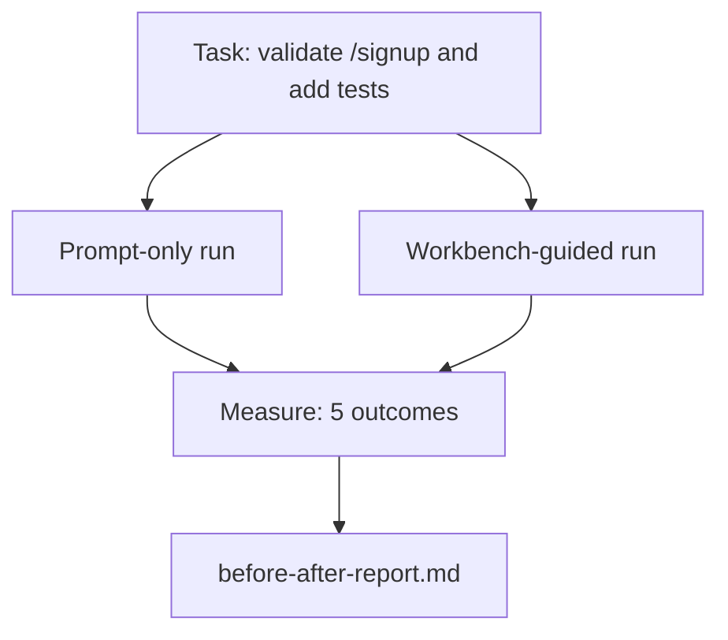

# The Workbench on a Real Repo

> Eleven lessons of surfaces are worth nothing if they do not survive contact with a real codebase. This lesson runs the same task twice on a small sample app: prompt-only versus workbench-guided. The numbers do the arguing.

**Type:** Build
**Languages:** Python (stdlib)
**Prerequisites:** Phases 14 · 32 to 14 · 40
**Time:** ~60 minutes

## Learning Objectives

- Bring the seven workbench surfaces together on a small application.
- Run the same task twice (prompt-only and workbench-guided) and measure five outcomes.
- Read the before/after report and decide which surfaces gave the most leverage.
- Defend the workbench against a "but my model is good enough" pushback.

## The Problem

A demo on a toy task convinces no one. The case for the workbench is made when a real-feeling task on a real-feeling repo lands in production with fewer failures, fewer reverts, and a packet the next session can use.

This lesson ships that real-feeling repo and runs the same task through both pipelines. The result is a before/after report you can hand to a skeptic.

## The Concept



### The sample app

A minimal FastAPI-style handler in `sample_app/`:

- `app.py` with `/signup` (no validation yet).
- `test_app.py` with one happy-path test.
- `README.md` and `scripts/release.sh` as forbidden-zone bait.

### The task

> Add input validation to `/signup`: reject passwords shorter than 8 characters, return 422 with a typed error envelope. Add a test that proves the new behavior.

### The two pipelines

Prompt-only:

1. Read the README.
2. Read `app.py`.
3. Edit files.
4. Claim done.

Workbench-guided:

1. Run init script (Lesson 35).
2. Read scope contract (Lesson 36).
3. Read state (Lesson 34).
4. Edit allowed files only.
5. Run acceptance command via feedback runner (Lesson 37).
6. Run verification gate (Lesson 38).
7. Run reviewer (Lesson 39).
8. Generate handoff (Lesson 40).

### The five outcomes measured

| Outcome | Why it matters |
|---------|----------------|
| `tests_actually_run` | Most "tests passed" claims are unverifiable |
| `acceptance_met` | The test that proves the goal must be the test that ran |
| `files_outside_scope` | Scope creep is the dominant silent failure |
| `handoff_quality` | The next session pays for or benefits from this |
| `reviewer_total` | Qualitative judgment on top of the gate |

## Build It

`code/main.py` orchestrates the two pipelines against the same sample app fixture. Both pipelines are scripted (no LLM in the loop) so the measurement is reproducible. The script writes the comparison into `before-after-report.md` and `comparison.json`.

Run it:

```
python3 code/main.py
```

Output: a console table of outcomes per pipeline, the markdown report saved next to the script, and the JSON for whoever wants to chart it.

## Use It

This lesson is the case file you cite when:

- Someone asks why every PR carries an `agent-rules.md` and a scope contract.
- A team wants to drop the verification gate "just for this sprint."
- A new agent product launches and you need a portable benchmark for whether it actually saves time.

The numbers travel further than the explanation.

## Ship It

`outputs/skill-workbench-benchmark.md` is a portable evaluation harness that runs any agent product through both pipelines against a project's own sample app and reports the five outcomes.

## Exercises

1. Add a sixth outcome: time-to-first-meaningful-edit. How do you measure it cleanly?
2. Run the comparison on a real second-day task in your codebase. Where do the workbench numbers slip?
3. Add a "false negative" pass: tasks where prompt-only would have been faster and the workbench overhead is real cost. Defend keeping the workbench anyway.
4. Replace the scripted "agent" with a real LLM call. Which outcomes get noisier?
5. Author a one-page summary aimed at a non-engineer. What survives the cut?

## Key Terms

| Term | What people say | What it actually means |
|------|----------------|------------------------|
| Sample app | "Toy repo" | Small but realistic enough to exercise all seven surfaces |
| Pipeline | "Workflow" | Ordered sequence of surface reads/writes the agent follows |
| Before/after report | "The receipts" | The artifact you hand to a skeptic |
| False negative | "Workbench overkill" | Tasks where prompt-only is faster; useful to enumerate honestly |
| Workbench benchmark | "Reliability score" | Portable harness that runs the comparison on your codebase |

## Further Reading

- Phases 14 · 32 to 14 · 40 — the surfaces this lesson exercises end-to-end
- Phase 14 · 19 — SWE-bench, GAIA, AgentBench as the macro benchmarks this lesson complements
- Phase 14 · 30 — eval-driven agent development the same harness plugs into
- [Anthropic, Building Effective Agents](https://www.anthropic.com/research/building-effective-agents)
