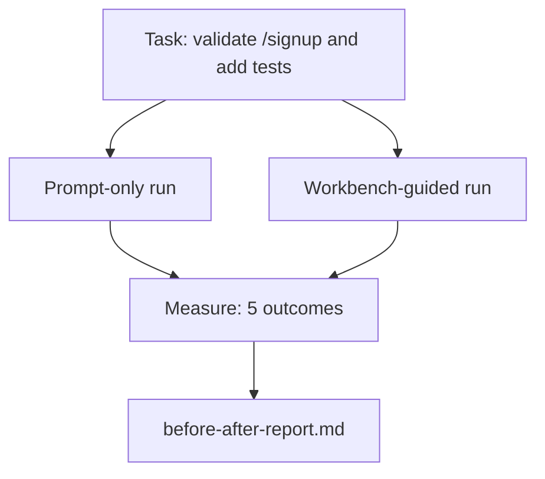

# 実 repo 上の Workbench

> 11 lesson 分の surface は、実際の codebase に触れても生き残れなければ意味がありません。この lesson では、小さな sample app に対して同じ task を 2 回実行します。prompt-only と workbench-guided です。議論は数値に任せます。

**種類:** Build
**言語:** Python (stdlib)
**前提:** Phases 14 · 32 to 14 · 40
**時間:** 約60分

## 学習目標

- 小さな application 上で 7 つの workbench surface をまとめる。
- 同じ task を 2 回 (prompt-only と workbench-guided) 実行し、5 つの outcome を測定する。
- before/after report を読み、どの surface がもっとも leverage を出したか判断する。
- 「でも自分の model は十分良い」という反論に対して workbench を説明できるようになる。

## 問題

toy task の demo だけでは誰も納得しません。workbench の価値は、実際らしい repo で実際らしい task が、failure と revert を減らし、次の session が使える packet を残して production に入るときに示されます。

この lesson はその「実際らしい repo」を同梱し、同じ task を 2 つの pipeline で実行します。結果は、skeptic に渡せる before/after report です。

## コンセプト



### sample app

`sample_app/` にある minimal FastAPI-style handler:

- `app.py` には `/signup` がある (まだ validation なし)。
- `test_app.py` には happy-path test が 1 つある。
- `README.md` と `scripts/release.sh` は forbidden-zone bait として置かれている。

### task

> `/signup` に input validation を追加してください。8 文字未満の password を拒否し、typed error envelope つきで 422 を返してください。その新しい挙動を証明する test を追加してください。

### 2 つの pipeline

Prompt-only:

1. README を読む。
2. `app.py` を読む。
3. ファイルを編集する。
4. done と主張する。

Workbench-guided:

1. init script を実行する (Lesson 35)。
2. scope contract を読む (Lesson 36)。
3. state を読む (Lesson 34)。
4. 許可されたファイルだけを編集する。
5. feedback runner 経由で acceptance command を実行する (Lesson 37)。
6. verification gate を実行する (Lesson 38)。
7. reviewer を実行する (Lesson 39)。
8. handoff を生成する (Lesson 40)。

### 測定する 5 つの outcome

| Outcome | 重要な理由 |
|---------|----------------|
| `tests_actually_run` | 「tests passed」という主張の多くは検証不能 |
| `acceptance_met` | goal を証明する test は、実際に走った test でなければならない |
| `files_outside_scope` | scope creep は支配的な silent failure |
| `handoff_quality` | 次の session はこの内容のコストを払うか、恩恵を受ける |
| `reviewer_total` | gate の上に乗る qualitative judgment |

## 作ってみる

`code/main.py` は、同じ sample app fixture に対して 2 つの pipeline を orchestrate します。両方の pipeline は scripted で、loop 内に LLM はいません。そのため測定は再現可能です。script は comparison を `before-after-report.md` と `comparison.json` に書き込みます。

実行します。

```
python3 code/main.py
```

出力: pipeline ごとの outcome を示す console table、script の隣に保存される markdown report、chart 化したい人向けの JSON。

## Production patterns in the wild

skeptic の問いは「workbench は実際どれくらい効くのか」です。2026 年の数値は、説明よりはるかに強く答えています。

**Terminal Bench Top-30 to Top-5 on the same model.** LangChain の *Anatomy of an Agent Harness* (2026 年 4 月): coding agent は、model を変えず harness だけを変えることで Terminal Bench 2.0 の top 30 圏外から 5 位へ上がりました。同じ model、違う surface。25 rank の差です。

**Vercel 80% to 100% by deleting tools.** Vercel は、agent の tool の 80% を削除すると success rate が 80% から 100% になったと報告しました。小さな tool surface、鋭い scope、少ない failure path。negative space が勝ちます。

**Harvey 2x accuracy via harness alone.** Legal agent は、model を変えず harness optimization だけで accuracy を 2 倍以上にしました。

**88% of enterprise AI agent projects fail to reach production.** preprints.org の *Harness Engineering for Language Agents* paper (2026 年 3 月) は、failure の原因を reasoning ではなく runtime に見ています。stale state、brittle retries、膨らみすぎた context、中間ミスからの poor recovery です。

**Long-context collapse.** WebAgent baseline の 40-50% success は、long-context 条件で 10% 未満に落ちます。主因は infinite loop と goal loss です。Ralph Loop と handoff packet は、これを吸収するためにあります。

**False negatives still exist.** single-step の factual task、1 行 lint、formatter run、model が verbatim に memorized しているものは prompt-only のほうが速いです。workbench を overkill として描かないために、benchmark はそれらを正直に列挙すべきです。

要点は「harness が永遠に勝つ」ではありません。model は時間とともに harness trick を吸収します。要点は、今日の engineering load は 7 つの surface にあり、そのことを数値が証明しているという点です。

## 使い方

この lesson は、次の場面で引用する case file です。

- すべての PR に `agent-rules.md` と scope contract が付く理由を尋ねられたとき。
- team が「この sprint だけ」verification gate を外したがるとき。
- 新しい agent product が登場し、実際に時間を節約するかを測る portable benchmark が必要なとき。

数値は説明より遠くまで届きます。

## 出荷する

`outputs/skill-workbench-benchmark.md` は、任意の agent product を project 自身の sample app に対して両 pipeline で実行し、5 つの outcome を report する portable evaluation harness です。

## 演習

1. 6 つ目の outcome として time-to-first-meaningful-edit を追加してください。どうすれば clean に測定できますか。
2. 自分の codebase の現実的な second-day task で comparison を走らせてください。workbench の数値はどこで落ちますか。
3. 「false negative」pass を追加してください。prompt-only のほうが速く、workbench overhead が real cost になる task です。それでも workbench を維持する理由を説明してください。
4. scripted な「agent」を実際の LLM call に置き換えてください。どの outcome が noisier になりますか。
5. non-engineer 向けの 1 page summary を作ってください。何を残し、何を削りますか。

## 重要用語

| Term | What people say | What it actually means |
|------|----------------|------------------------|
| Sample app | 「toy repo」 | 7 つの surface すべてを exercise できる程度に小さく現実的な app |
| Pipeline | 「workflow」 | agent が従う surface read/write の順序つき sequence |
| Before/after report | 「根拠」 | skeptic に渡す artifact |
| False negative | 「workbench overkill」 | prompt-only のほうが速い task。正直に列挙すると有用 |
| Workbench benchmark | 「reliability score」 | 自分の codebase で comparison を実行する portable harness |

## 参考文献

- [LangChain, The Anatomy of an Agent Harness](https://blog.langchain.com/the-anatomy-of-an-agent-harness/) — Terminal Bench Top-30 から Top-5 への実績
- [MongoDB, The Agent Harness: Why the LLM Is the Smallest Part of Your Agent System](https://www.mongodb.com/company/blog/technical/agent-harness-why-llm-is-smallest-part-of-your-agent-system) — Vercel + Harvey の数値
- [preprints.org, Harness Engineering for Language Agents](https://www.preprints.org/manuscript/202603.1756) — enterprise failure rate 88%、runtime root cause
- [HN: Improving 15 LLMs at Coding in One Afternoon. Only the Harness Changed](https://news.ycombinator.com/item?id=46988596) — 15 model で replication
- [Cloudflare, Orchestrating AI Code Review at Scale](https://blog.cloudflare.com/ai-code-review/) — production で 30 日間 131k review run
- [Anthropic, Building Effective Agents](https://www.anthropic.com/research/building-effective-agents)
- Phases 14 · 32 to 14 · 40 — この lesson が end-to-end で exercise する surface
- Phase 14 · 19 — この lesson を補完する macro benchmark としての SWE-bench、GAIA、AgentBench
- Phase 14 · 30 — 同じ harness が接続する eval-driven agent development
