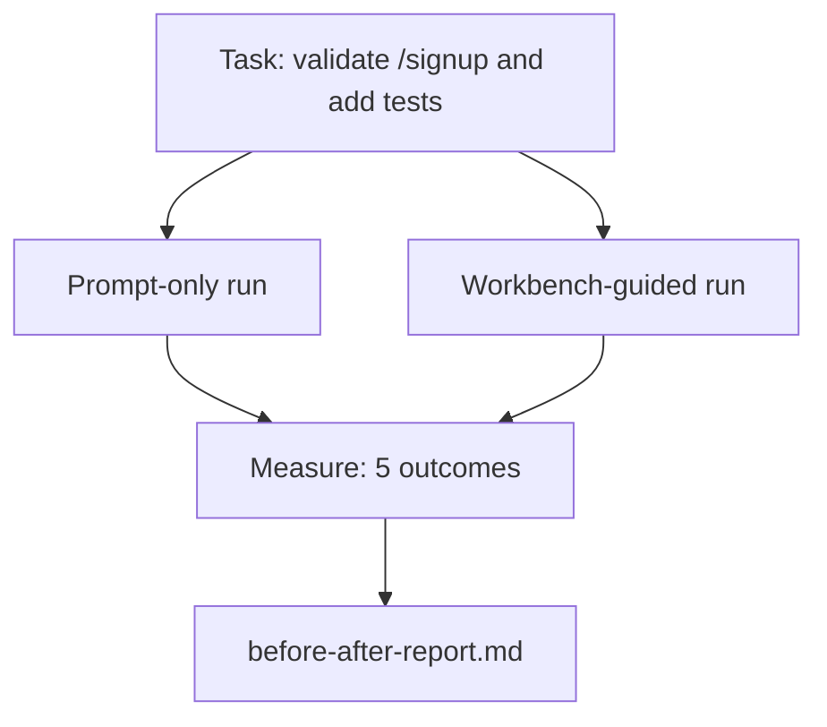

# O Workbench num Repo Real

> Onze lições de superfícies não valem nada se não sobrevivem ao contato com um codebase real. Esta lição roda a mesma tarefa duas vezes numa small sample app: só prompt vs. workbench guiado. Os números falam por si.

**Tipo:** Construção
**Linguagens:** Python (stdlib)
**Pré-requisitos:** Fases 14 · 32 até 14 · 40
**Tempo:** ~60 minutos

## Objetivos de Aprendizado

- Reunir as sete superfícies do workbench numa aplicação pequena.
- Rodar a mesma tarefa duas vezes (só prompt e workbench guiado) e medir cinco resultados.
- Ler o relatório antes/depois e decidir quais superfícies deram mais alavanca.
- Defender o workbench contra o contra-argumento "mas meu modelo já é bom o suficiente".

## O Problema

Uma demo numa tarefa de brinquedo não convence ninguém. O caso pro workbench se faz quando uma tarefa que parece real num repo que parece real chega em produção com menos falhas, menos reverts e um pacote que a próxima sessão consegue usar.

Esta lição entrega esse repo que parece real e roda a mesma tarefa pelos dois pipelines. O resultado é um relatório antes/depois que você pode passar pra um cético.

## O Conceito



### A sample app

Um handler mínimo estilo FastAPI em `sample_app/`:

- `app.py` com `/signup` (sem validação ainda).
- `test_app.py` com um teste do caminho feliz.
- `README.md` e `scripts/release.sh` como isca de zona proibida.

### A tarefa

> Adicione validação de entrada ao `/signup`: rejeite senhas com menos de 8 caracteres, retorne 422 com um envelope de erro tipado. Adicione um teste que prove o novo comportamento.

### Os dois pipelines

Só prompt:

1. Ler o README.
2. Ler `app.py`.
3. Editar arquivos.
4. Declarar "feito".

Workbench guiado:

1. Rodar script de init (Aula 35).
2. Ler contrato de escopo (Aula 36).
3. Ler estado (Aula 34).
4. Editar apenas arquivos permitidos.
5. Rodar comando de aceitação via feedback runner (Aula 37).
6. Rodar gate de verificação (Aula 38).
7. Rodar reviewer (Aula 39).
8. Gerar handoff (Aula 40).

### Os cinco resultados medidos

| Resultado | Por que importa |
|-----------|----------------|
| `tests_actually_run` | A maioria das afirmações de "testes passaram" não é verificável |
| `acceptance_met` | O teste que prova o objetivo deve ser o teste que rodou |
| `files_outside_scope` | Escopo deslizante é a falha silenciosa dominante |
| `handoff_quality` | A próxima sessão paga por ou se beneficia disso |
| `reviewer_total` | Julgamento qualitativo em cima do gate |

## Construa

`code/main.py` orquestra os dois pipelines contra o mesmo fixture de sample app. Ambos os pipelines são scriptados (sem LLM no loop) para que a medição seja reproduzível. O script grava a comparação em `before-after-report.md` e `comparison.json`.

Execute:

```
python3 code/main.py
```

Saída: uma tabela no console com os resultados por pipeline, o relatório em markdown salvo ao lado do script, e o JSON pra quem quiser gerar gráficos.

## Padrões de produção no mundo real

A pergunta do cético é "o quanto o workbench realmente ajuda?". Os números de 2026 dizem muito mais que a explicação.

**Terminal Bench Top-30 ao Top-5 no mesmo modelo.** O *Anatomy of an Agent Harness* da LangChain (abril de 2026): um coding agente pulou de fora do top 30 pra quinto lugar no Terminal Bench 2.0 mudando apenas o harness. Mesmo modelo. Superfícies diferentes. Delta de 25 posições.

**Vercel 80% a 100% deletando tools.** A Vercel relatou que deletar 80% das ferramentas do agente moveu a taxa de sucesso de 80% pra 100%. Superfície de ferramenta menor, escopo mais afiado, menos formas de falhar. Espaço negativo vence.

**Harvey 2x de acurácia só com harness.** Agents de jurídico mais que dobraram a acurácia via otimização de harness, sem mudança de modelo.

**88% dos projetos de AI agente empresariais falham em chegar em produção.** O paper *Harness Engineering for Language Agents* do preprints.org (março de 2026) rastreia as falhas pro runtime, não pro raciocínio: estado obsoleto, retries frágeis, contexto inchado, recuperação ruim de erros intermediários.

**Colapso de contexto longo.** A baseline do WebAgent cai de 40-50% de sucesso pra menos de 10% em condições de contexto longo, principalmente por loops infinitos e perda de objetivo. O Ralph Loop e o pacote de handoff existem pra absorver isso.

**Falsos negativos ainda existem.** Tarefas factuais de passo único, lints de uma linha, execuções de formatação, qualquer coisa que o modelo memorizou textualmente — isso roda mais rápido só com prompt. O benchmark deve enumerar honestamente pra que o workbench não seja retratado como exagero.

O takeaway não é "harness vence pra sempre". Modelos absorvem tricks de harness ao longo do tempo. O takeaway é que hoje, a carga de engenharia está nas sete superfícies, e os números provam isso.

## Use

Esta lição é o dossier que você cita quando:

- Alguém pergunta por que todo PR carrega um `agent-rules.md` e um contrato de escopo.
- Um time quer pular o gate de verificação "só nesse sprint".
- Um novo produto de agente lança e você precisa de um benchmark portátil pra ver se realmente economiza tempo.

Os números viajam mais que a explicação.

## Entregue

`outputs/skill-workbench-benchmark.md` é um harness de avaliação portátil que roda qualquer produto de agente pelos dois pipelines contra a sample app do próprio projeto e reporta os cinco resultados.

## Exercícios

1. Adicione um sexto resultado: tempo até a primeira edição significativa. Como medir isso limpo?
2. Rode a comparação numa tarefa real de segundo dia no seu codebase. Onde os números do workbench caem?
3. Adicione uma passagem de "falso negativo": tarefas onde só prompt seria mais rápido e o overhead do workbench é um custo real. Defenda manter o workbench de qualquer forma.
4. Substitua o "agent" scriptado por uma chamada real a LLM. Quais resultados ficam mais barulhentos?
5. Escreva um resumo de uma página direcionado a um não-engenheiro. O que sobrevive ao corte?

## Termos-Chave

| Termo | O que a galera fala | O que realmente significa |
|-------|---------------------|--------------------------|
| Sample app | "Repo de brinquedo" | Pequeno mas realista o suficiente pra exercitar as sete superfícies |
| Pipeline | "Workflow" | Sequência ordenada de leituras/escritas de superfícies que o agente segue |
| Before/after report | "Os números" | O artefato que você passa pro cético |
| False negative | "Workbench exagerado" | Tarefas onde só prompt é mais rápido; útil enumerar honestamente |
| Workbench benchmark | "Índice de confiabilidade" | Harness portátil que roda a comparação no seu codebase |

## Leitura Complementar

- [LangChain, The Anatomy of an Agent Harness](https://blog.langchain.com/the-anatomy-of-an-agent-harness/) — resultado do Top-30 ao Top-5 no Terminal Bench
- [MongoDB, The Agent Harness: Why the LLM Is the Smallest Part of Your Agent System](https://www.mongodb.com/company/blog/technical/agent-harness-why-llm-is-smallest-part-of-your-agent-system) — números da Vercel + Harvey
- [preprints.org, Harness Engineering for Language Agents](https://www.preprints.org/manuscript/202603.1756) — taxa de falha de 88% em empresas, causas raiz no runtime
- [HN: Improving 15 LLMs at Coding in One Afternoon. Only the Harness Changed](https://news.ycombinator.com/item?id=46988596) — replicado em 15 modelos
- [Cloudflare, Orchestrating AI Code Review at Scale](https://blog.cloudflare.com/ai-code-review/) — 131k execuções de review / 30 dias em produção
- [Anthropic, Building Effective Agents](https://www.anthropic.com/research/building-effective-agents)
- Fases 14 · 32 até 14 · 40 — as superfícies que esta lição exercita ponta a ponta
- Fase 14 · 19 — SWE-bench, GAIA, AgentBench como benchmarks macro que esta lição complementa
- Fase 14 · 30 — desenvolvimento de agentes orientado a evals que o mesmo harness conecta
