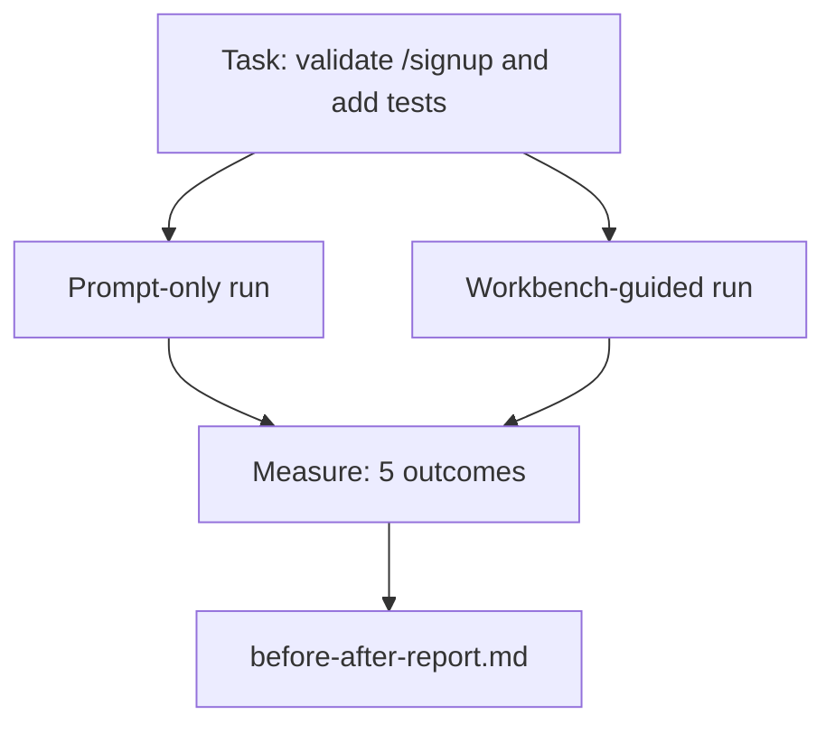

# Gerçek Bir Repo Üzerindeki Çalışma Tezgahı

> Yüzeylerle ilgili on bir ders, eğer gerçek bir kod tabanıyla temasa geçmezlerse hiçbir işe yaramaz. Bu ders, küçük bir örnek uygulamada aynı görevi iki kez çalıştırır: yalnızca prompt ve çalışma tezgahı kılavuzlu. Tartışmayı sayılar yapıyor.

**Tür:** Yapım
**Diller:** Python (stdlib)
**Önkoşullar:** Aşama 14 · 32 - 14 · 40
**Süre:** ~60 dakika

## Öğrenme Hedefleri

- Küçük bir uygulamada yedi tezgah yüzeyini bir araya getirin.
- Aynı görevi iki kez çalıştırın (yalnızca prompt ve çalışma tezgahı rehberliğinde) ve beş sonucu ölçün.
- Öncesi/sonrası raporunu okuyun ve hangi yüzeylerin en fazla etkiyi sağladığına karar verin.
- Çalışma tezgahını "ama benim modelim yeterince iyi" tepkisine karşı savunun.

## Sorun

Bir oyuncak görevine ilişkin bir demo kimseyi ikna etmez. Workbench için durum, gerçek hissi veren bir depodaki gerçek hissi veren bir görevin daha az hatayla, daha az geri dönüşle ve bir sonraki oturumun kullanabileceği bir paketle üretime geçmesiyle ortaya çıkar.

Bu ders, gerçek hissi veren repoyu gönderiyor ve aynı görevi her iki işlem hattı üzerinden de yürütüyor. Sonuç, şüpheciye verebileceğiniz bir öncesi/sonrası raporudur.

## Konsept



### Örnek uygulama

`sample_app/`'de minimal FastAPI tarzı bir işleyici:

- `/signup` ile `app.py` (henüz doğrulama yok).
- Bir mutlu yol testiyle `test_app.py`.
- Yasak bölge yemi olarak `README.md` ve `scripts/release.sh`.

### Görev

> `/signup`'ye giriş doğrulaması ekleyin: 8 karakterden kısa şifreleri reddedin, yazılan bir hata zarfıyla 422'yi döndürün. Yeni davranışı kanıtlayan bir test ekleyin.

### İki boru hattı

Yalnızca Prompt:

1. README'yi okuyun.
2. `app.py`'yi okuyun.
3. Dosyaları düzenleyin.
4. Talep yapıldı.

Tezgah yönlendirmeli:

1. init betiğini çalıştırın (Ders 35).
2. Kapsam sözleşmesini okuyun (Ders 36).
3. Durumu okuyun (Ders 34).
4. Yalnızca izin verilen dosyaları düzenleyin.
5. Geri bildirim çalıştırıcısı aracılığıyla kabul komutunu çalıştırın (Ders 37).
6. Doğrulama kapısını çalıştırın (Ders 38).
7. Gözden geçireni çalıştırın (Ders 39).
8. Aktarımı oluşturun (Ders 40).

### Ölçülen beş sonuç

| Sonuç | Neden önemlidir |
|---------|----------------|
| `tests_actually_run` | Çoğu "test başarılı" iddiası doğrulanamaz |
| `acceptance_met` | Hedefi kanıtlayan test, çalıştırılan test olmalıdır |
| `files_outside_scope` | Kapsam kayması baskın sessiz başarısızlıktır |
| `handoff_quality` | Bir sonraki oturum bunun bedelini öder veya bundan faydalanır |
| `reviewer_total` | Kapının üstünde niteliksel yargı |

## İnşa Et

`code/main.py`, iki işlem hattını aynı örnek uygulama fikstürüne göre düzenler. Her iki işlem hattı da kodlanmıştır (döngüde LLM yoktur), dolayısıyla ölçüm tekrarlanabilir. Betik, karşılaştırmayı `before-after-report.md` ve `comparison.json`'ye yazar.

Çalıştır:

```
python3 code/main.py
```

Çıktı: işlem hattı başına sonuçların konsol tablosu, betiğin yanında kaydedilen işaretleme raporu ve grafiğini oluşturmak isteyenler için JSON.

## Vahşi doğada üretim modelleri

Şüphecinin sorusu şu: "Çalışma tezgahı gerçekte ne kadar yardımcı oluyor?" 2026 rakamları açıklamadan çok daha fazlasını söylüyor.

**Aynı modelde Terminal Bench Top-30'dan Top-5'e.** LangChain'in *Agent Kablo Demeti Anatomisi* (Nisan 2026): kodlamalı bir agent, yalnızca kablo demetini değiştirerek Terminal Bench 2.0'da ilk 30'un dışından beşinci sıraya yükseldi. Aynı model. Farklı yüzeyler. Yirmi beş dereceli delta.

**Araçları silerek Vercel %80'den %100'e.** Vercel, agent araçlarının %80'ini silmenin başarı oranını %80'den %100'e çıkardığını bildirdi. Daha küçük takım yüzeyi, daha keskin kapsam, daha az arızalanma olasılığı. Negatif alan kazanır.

**Yalnızca kablo demeti ile Harvey'in 2 katı doğruluk.** Yasal agent'ler, model değişikliği olmadan, kablo demeti optimizasyonu sayesinde doğruluğunu iki kattan fazla artırdı.

**Kurumsal yapay zeka agent projelerinin %88'i üretime ulaşamıyor.** preprints.org *Dil Agents* için Harness Engineering (Mart 2026) başarısızlıkların izini mantık yürütmeden değil çalışma zamanından alıyor: eski durum, kırılgan yeniden denemeler, aşırı büyümüş bağlam, ara hatalardan zayıf kurtarma.

**Uzun bağlam çöküşü.** WebAgent Temel %40-50 başarı, uzun bağlam koşullarında çoğunlukla sonsuz döngülerden ve hedef kaybından dolayı %10'un altına düşer. Ralph Loop ve aktarma paketi bunu absorbe etmek için var.

**Yanlış negatifler hala mevcut.** Tek adımlı gerçek görevler, tek satırlık lintler, formatlayıcı çalıştırmaları, modelin birebir ezberlediği her şey — bunlar yalnızca prompt'de daha hızlı çalışır. benchmark bunları dürüstçe numaralandırmalıdır, böylece çalışma tezgahı aşırılık olarak çerçevelenmez.

Paket servisi "koşum takımı sonsuza kadar kazanır" değildir. Modeller zamanla koşum hilelerini absorbe eder. Çıkarılan sonuç, bugün mühendislik yükünün yedi yüzeyde olduğu ve sayıların da bunu kanıtladığıdır.

## Kullan onu

Bu ders şu durumlarda alıntı yaptığınız vaka dosyasıdır:

- Birisi neden her PR'nin bir `agent-rules.md` ve kapsam sözleşmesi taşıdığını soruyor.
- Bir takım "sadece bu sprint için" doğrulama kapısını kaldırmak istiyor.
- Yeni bir agent ürünü piyasaya sürüldü ve gerçekten zaman kazandırıp kazandırmadığını görmek için taşınabilir bir benchmark'ye ihtiyacınız var.

Rakamlar açıklamanın ötesine geçiyor.

## Gönderin

`outputs/skill-workbench-benchmark.md`, herhangi bir agent ürününü her iki işlem hattı üzerinden projenin kendi örnek uygulamasına göre çalıştıran ve beş sonucu raporlayan taşınabilir bir değerlendirme donanımıdır.

## Egzersizler

1. Altıncı bir sonuç ekleyin: ilk anlamlı düzenlemeye kadar geçen süre. Temiz bir şekilde nasıl ölçülür?
2. Karşılaştırmayı kod tabanınızdaki gerçek bir ikinci gün görevi üzerinde çalıştırın. Tezgah numaraları nereye kayıyor?
3. Bir "yanlış negatif" geçişi ekleyin: yalnızca prompt'nin daha hızlı olacağı ve çalışma tezgahı genel yükünün gerçek maliyet olduğu görevler. Yine de tezgahı korumayı savunun.
4. Komut dosyasıyla yazılan "agent"yi gerçek bir LLM çağrısıyla değiştirin. Hangi sonuçlar daha gürültülü oluyor?
5. Mühendis olmayan birine yönelik tek sayfalık bir özet yazın. Kesimden ne kurtulur?

## Anahtar Terimler

| Dönem | İnsanlar ne diyor | Aslında ne anlama geliyor |
|------|----------------|------------------------|
| Örnek uygulama | "Oyuncak deposu" | Yedi yüzeyin tamamını çalıştırabilecek kadar küçük ama gerçekçi |
| Boru hattı | "İş Akışı" | agent yüzey okuma/yazma işlemlerinin sıralı sırası aşağıdaki gibidir |
| Öncesi/sonrası raporu | "Makbuzlar" | Şüpheciye verdiğiniz artifact |
| Yanlış negatif | "Çalışma tezgahının aşırı yüklenmesi" | Yalnızca prompt'nin daha hızlı olduğu görevler; dürüstçe sıralamak faydalı |
| Tezgah benchmark | "Güvenilirlik puanı" | Karşılaştırmayı kod tabanınızda çalıştıran taşınabilir donanım |

## Daha Fazla Okuma

- [LangChain, Agent Donanımının Anatomisi](https://blog.langchain.com/the-anatomy-of-an-agent-harness/) — Terminal Tezgahında İlk 30'dan İlk 5'e makbuz
- [MongoDB, Agent Donanımı: Yüksek Lisans Neden Agent Sisteminizin En Küçük Parçasıdır](https://www.mongodb.com/company/blog/technical/agent-harness-why-llm-is-smallest-part-of-your-agent-system) — Vercel + Harvey numaraları
- [preprints.org, Harness Engineering for Language Agents](https://www.preprints.org/manuscript/202603.1756) — %88 kurumsal başarısızlık oranı, çalışma zamanı temel nedenleri
- [HN: Bir Öğleden Sonra Kodlama alanında 15 Yüksek Lisans Derecesinin Geliştirilmesi. Yalnızca Donanım Değiştirildi](https://news.ycombinator.com/item?id=46988596) — 15 modele kopyalandı
- [Cloudflare, Yapay Zeka Kod İncelemesini Geniş Ölçekte Düzenleme](https://blog.cloudflare.com/ai-code-review/) — 131 bin inceleme çalıştırması / üretimde 30 gün
- [Antropik, Etkili Agent Oluşturma](https://www.anthropic.com/research/building-effective-agents)
- Aşama 14 · 32 - 14 · 40 — bu derste uçtan uca uygulanan yüzeyler
- Aşama 14 · 19 — Bu dersin tamamladığı benchmark makrosu olarak SWE-bench, GAIA, AgentBench
- Aşama 14 · 30 — değerlendirme odaklı agent geliştirme aynı kablo demetinin takıldığı
