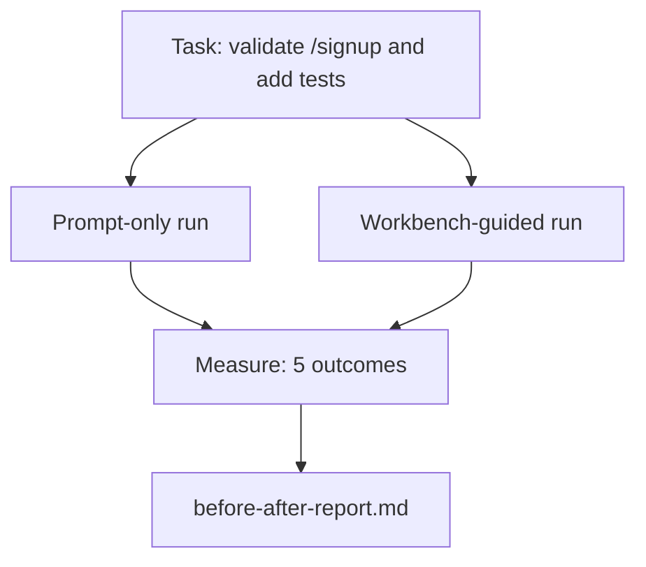

# 41 · 在真实仓库上运行工作台

> 如果十一节课讲的各种「界面（surface）」经不起真实代码库的检验，那它们就毫无价值。本课在一个小型示例应用上把同一个任务跑两遍：仅靠提示词（prompt-only）对决工作台引导（workbench-guided）。让数字来说话。

**类型：** 构建
**语言：** Python（标准库）
**前置：** 阶段 14 · 32 到 14 · 40
**时长：** 约 60 分钟

## 学习目标

- 在一个小型应用上把七个工作台界面整合到一起。
- 把同一个任务跑两遍（仅靠提示词与工作台引导），并测量五项结果。
- 阅读前后对比报告，判断哪些界面带来了最大的杠杆效应。
- 面对「但我的模型已经够好了」这类反驳，为工作台做出辩护。

## 问题所在

一个在玩具任务上做的演示说服不了任何人。只有当一个贴近真实的任务在一个贴近真实的仓库上落地到生产环境，且故障更少、回滚更少、还为下一次会话留下一个可用的交接包（packet）时，工作台的价值才算被证明。

本课交付那个贴近真实的仓库，并让同一个任务走完两条管线。最终产出是一份你可以直接递给质疑者的前后对比报告。

## 核心概念



### 示例应用

位于 `sample_app/` 的一个极简 FastAPI 风格处理器：

- `app.py`，包含 `/signup`（尚无校验）。
- `test_app.py`，包含一个走通顺利路径（happy-path）的测试。
- `README.md` 和 `scripts/release.sh` 作为「禁区诱饵（forbidden-zone bait）」。

### 任务

> 为 `/signup` 添加输入校验：拒绝长度短于 8 个字符的密码，返回 422 并附带一个带类型的错误信封（error envelope）。新增一个测试来证明这个新行为。

### 两条管线

仅靠提示词：

1. 读取 README。
2. 读取 `app.py`。
3. 编辑文件。
4. 声称完成。

工作台引导：

1. 运行初始化脚本（第 35 课）。
2. 读取范围契约（scope contract，第 36 课）。
3. 读取状态（第 34 课）。
4. 只编辑被允许的文件。
5. 通过反馈运行器（feedback runner）运行验收命令（第 37 课）。
6. 运行验证闸门（verification gate，第 38 课）。
7. 运行评审器（reviewer，第 39 课）。
8. 生成交接（handoff，第 40 课）。

### 测量的五项结果

| 结果 | 为何重要 |
|---------|----------------|
| `tests_actually_run` | 大多数「测试通过」的声称都无法核实 |
| `acceptance_met` | 证明目标的那个测试，必须就是实际跑过的那个测试 |
| `files_outside_scope` | 范围蔓延（scope creep）是占主导地位的静默故障 |
| `handoff_quality` | 下一次会话会为此付出代价或从中受益 |
| `reviewer_total` | 在闸门之上叠加的定性判断 |

## 动手构建

`code/main.py` 针对同一份示例应用夹具（fixture）编排这两条管线。两条管线都是脚本化的（回路中没有 LLM），因此测量是可复现的。脚本把对比结果写入 `before-after-report.md` 和 `comparison.json`。

运行它：

```
python3 code/main.py
```

输出：一个控制台表格，列出每条管线的各项结果；一份保存在脚本旁边的 markdown 报告；以及供需要绘图者使用的 JSON。

## 真实世界中的生产模式

质疑者的问题是「工作台到底能帮多大忙？」2026 年的数字比任何解释都更有说服力。

**同一模型上，Terminal Bench 从前 30 名开外冲到前 5 名。** LangChain 的《一个 Agent Harness 的解剖（Anatomy of an Agent Harness）》（2026 年 4 月）：一个编码 agent 仅通过改变 harness，就在 Terminal Bench 2.0 上从前 30 名开外跃升到第五名。同一个模型，不同的界面。整整 25 个名次的差距。

**Vercel 通过删除工具把成功率从 80% 提到 100%。** Vercel 报告称，删掉其 agent 80% 的工具后，成功率从 80% 升至 100%。更小的工具界面、更锐利的范围、更少的失败途径。负空间（negative space）取胜。

**Harvey 仅靠 harness 把准确率翻倍。** 法律 agent 仅通过 harness 优化就把准确率提升了一倍以上，没有更换模型。

**88% 的企业级 AI agent 项目无法走到生产。** preprints.org 的《面向语言 Agent 的 Harness 工程（Harness Engineering for Language Agents）》论文（2026 年 3 月）将这些失败追溯到运行时（runtime）而非推理：陈旧的状态、脆弱的重试、过度膨胀的上下文，以及从中间错误中恢复能力差。

**长上下文崩塌。** WebAgent 在基线条件下 40-50% 的成功率，在长上下文条件下跌到 10% 以下，主要源于无限循环和目标丢失。Ralph 循环（Ralph Loop）和交接包的存在正是为了吸收这种问题。

**假阴性（false negative）依然存在。** 单步事实性任务、一行 lint、格式化运行，以及任何模型已逐字记住的东西——这些用仅靠提示词的方式跑得更快。基准测试应当诚实地把它们一一列出，以免工作台被塑造成杀鸡用牛刀。

要点不是「harness 永远赢」。模型确实会随时间吸收 harness 的技巧。要点在于：在今天，工程负担就坐落在这七个界面上，而数字证明了这一点。

## 如何使用

本课就是你在以下情形中可以引用的案卷：

- 有人问为什么每个 PR 都要带一个 `agent-rules.md` 和一份范围契约。
- 某个团队想「就这一个冲刺（sprint）」砍掉验证闸门。
- 一个新的 agent 产品发布，而你需要一个可移植的基准，来判断它是否真的节省了时间。

数字比解释走得更远。

## 交付物

`outputs/skill-workbench-benchmark.md` 是一个可移植的评估 harness，它能让任意 agent 产品针对项目自带的示例应用走完两条管线，并报告这五项结果。

## 练习

1. 增加第六项结果：到首次有意义编辑的时间（time-to-first-meaningful-edit）。你如何干净利落地测量它？
2. 在你自己代码库里一个真实的「第二天」任务上运行这个对比。工作台的数字在哪里会打折扣？
3. 增加一轮「假阴性」测试：那些仅靠提示词会更快、而工作台开销构成真实成本的任务。在此之上仍为保留工作台做出辩护。
4. 用真实的 LLM 调用替换脚本化的「agent」。哪些结果会变得更嘈杂？
5. 撰写一页面向非工程师的摘要。哪些内容能在删减中幸存？

## 关键术语

| 术语 | 人们常说 | 实际含义 |
|------|----------------|------------------------|
| 示例应用（Sample app） | 「玩具仓库」 | 虽小但足够真实，能锻炼全部七个界面 |
| 管线（Pipeline） | 「工作流」 | agent 遵循的、对界面进行读写的有序序列 |
| 前后对比报告（Before/after report） | 「凭据（the receipts）」 | 你递给质疑者的那件产物 |
| 假阴性（False negative） | 「工作台杀鸡用牛刀」 | 仅靠提示词更快的任务；诚实地列出它们很有用 |
| 工作台基准（Workbench benchmark） | 「可靠性分数」 | 在你的代码库上运行该对比的可移植 harness |

## 延伸阅读

- [LangChain，一个 Agent Harness 的解剖（The Anatomy of an Agent Harness）](https://blog.langchain.com/the-anatomy-of-an-agent-harness/) — Terminal Bench 从前 30 名到前 5 名的凭据
- [MongoDB，Agent Harness：为何 LLM 是你 Agent 系统中最小的部分（The Agent Harness: Why the LLM Is the Smallest Part of Your Agent System）](https://www.mongodb.com/company/blog/technical/agent-harness-why-llm-is-smallest-part-of-your-agent-system) — Vercel 与 Harvey 的数字
- [preprints.org，面向语言 Agent 的 Harness 工程（Harness Engineering for Language Agents）](https://www.preprints.org/manuscript/202603.1756) — 88% 企业失败率、运行时根因
- [HN：一个下午让 15 个 LLM 的编码能力提升。只改了 Harness（Improving 15 LLMs at Coding in One Afternoon. Only the Harness Changed）](https://news.ycombinator.com/item?id=46988596) — 在 15 个模型上复现
- [Cloudflare，大规模编排 AI 代码评审（Orchestrating AI Code Review at Scale）](https://blog.cloudflare.com/ai-code-review/) — 生产环境 30 天 13.1 万次评审运行
- [Anthropic，构建高效的 Agent（Building Effective Agents）](https://www.anthropic.com/research/building-effective-agents)
- 阶段 14 · 32 到 14 · 40 — 本课端到端锻炼的那些界面
- 阶段 14 · 19 — SWE-bench、GAIA、AgentBench，本课所补充的宏观基准
- 阶段 14 · 30 — 本 harness 接入的、由评估驱动的 agent 开发（eval-driven agent development）
