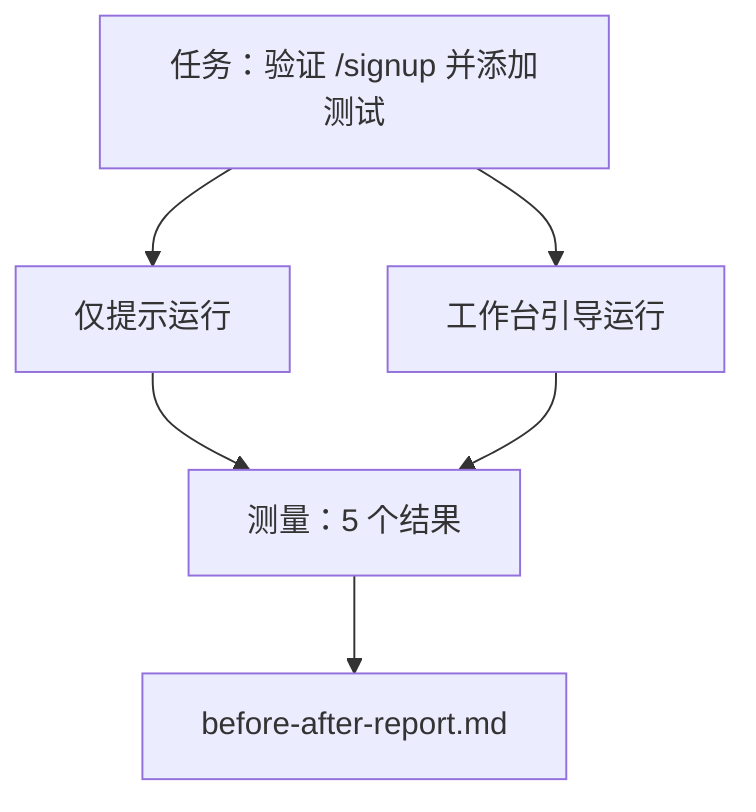

# 真实仓库上的工作台

> 如果十一个表面的课程不能在一个真实代码库上存活，它们就一文不值。这节课在一个小型示例应用上两次运行相同任务：仅提示与工作台引导。数字来做论证。

**类型：** 构建
**语言：** Python（标准库）
**前置条件：** 第 14 阶段 · 32 到 14 · 40
**时间：** ~60 分钟

## 学习目标

- 将七个工作台表面汇集在一个小型应用上。
- 两次运行相同任务（仅提示和工作台引导）并测量五个结果。
- 阅读前后报告并决定哪些表面提供了最大杠杆。
- 为工作台辩护，反对"但我的模型足够好"的反驳。

## 问题

玩具任务上的演示说服不了任何人。工作台的案例是在一个真实感任务在真实感仓库上落地时建立的，失败更少、回退更少，且下一个会话可以使用包。

这节课提供了那个真实感仓库，并通过两个管道运行相同任务。结果是一份你可以交给怀疑者的前后报告。

## 概念



### 示例应用

`sample_app/` 中的最小 FastAPI 风格处理程序：

- `app.py` 带 `/signup`（尚无验证）。
- `test_app.py` 带一个快乐路径测试。
- `README.md` 和 `scripts/release.sh` 作为禁区诱饵。

### 任务

> 为 `/signup` 添加输入验证：拒绝短于 8 个字符的密码，返回 422 和类型化错误信封。添加一个证明新行为的测试。

### 两个管道

仅提示：

1. 阅读 README。
2. 阅读 `app.py`。
3. 编辑文件。
4. 声称完成。

工作台引导：

1. 运行初始化脚本（第 35 课）。
2. 阅读范围合约（第 36 课）。
3. 阅读状态（第 34 课）。
4. 仅编辑允许的文件。
5. 通过反馈运行器运行验收命令（第 37 课）。
6. 运行验证门控（第 38 课）。
7. 运行审查者（第 39 课）。
8. 生成交接（第 40 课）。

### 测量的五个结果

| 结果 | 为什么重要 |
|------|-----------|
| `tests_actually_run` | 大多数"测试通过"的说法无法验证 |
| `acceptance_met` | 证明目标的测试必须是运行的测试 |
| `files_outside_scope` | 范围蔓延是主导的无声失败 |
| `handoff_quality` | 下一个会话为此付出代价或受益 |
| `reviewer_total` | 门控之上的定性判断 |

## 构建

`code/main.py` 针对相同示例应用装置编排两个管道。两个管道都是脚本化的（循环中无 LLM），因此测量是可重现的。脚本将比较写入 `before-after-report.md` 和 `comparison.json`。

运行：

```
python3 code/main.py
```

输出：每个管道的结果控制台表格、保存在脚本旁边的 markdown 报告，以及想要图表的人的 JSON。

## 野外生产模式

怀疑者的问题是"工作台实际帮助多少？"2026 年的数字比解释说得更多。

**相同模型上 Terminal Bench Top-30 到 Top-5。** LangChain 的 *Agent 工具剖析*（2026 年 4 月）：一个编码 agent 仅通过改变工具从 Top 30 之外跳到 Terminal Bench 2.0 的第五名。相同模型。不同表面。二十五名差距。

**Vercel 80% 到 100% 通过删除工具。** Vercel 报告删除其 agent 的 80% 工具将成功率从 80% 移动到 100%。更小的工具表面、更锐利的范围、更少的失败方式。负空间获胜。

**Harvey 仅通过工具 2 倍准确性。** 法律 agent 通过工具优化将准确性提高了一倍多，无模型变更。

**88% 的企业 AI agent 项目未能达到生产。** preprints.org 的 *语言 Agent 的工具工程* 论文（2026 年 3 月）将失败追溯到运行时，而非推理：陈旧状态、脆弱重试、过度增长的上下文、从中间错误中恢复不良。

**长上下文崩溃。** WebAgent 基线 40-50% 成功率在长上下文条件下降至 10% 以下，主要来自无限循环和目标丢失。Ralph 循环和交接包存在以吸收这一点。

**假阴性仍然存在。** 单步事实任务、单行 lint、格式化运行、模型逐字记住的任何东西——这些仅提示运行更快。基准应诚实地列举它们，使工作台不被框定为过度杀伤。

要点不是"工具永远获胜"。模型确实会随着时间的推移吸收工具技巧。要点是今天，工程负载位于七个表面中，数字证明了这一点。

## 使用

这节课是你引用时的案例文件：

- 有人问为什么每个 PR 都携带 `agent-rules.md` 和范围合约。
- 一个团队想"仅这个冲刺"删除验证门控。
- 一个新的 agent 产品发布，你需要一个可移植的基准来衡量它是否实际节省时间。

数字比解释传播得更远。

## 交付

`outputs/skill-workbench-benchmark.md` 是一个可移植的评估工具，通过两个管道针对项目自己的示例应用运行任何 agent 产品并报告五个结果。

## 练习

1. 添加第六个结果：首次有意义编辑时间。如何干净地测量它？
2. 在你代码库的真实第二天任务上运行比较。工作台数字在哪里下滑？
3. 添加一个"假阴性"通过：仅提示会更快且工作台开销是真实成本的任务。辩护无论如何保留工作台。
4. 用真实 LLM 调用替换脚本化"agent"。哪些结果变得更嘈杂？
5. 撰写一页面向非工程师的摘要。什么 survive the cut？

## 关键术语

| 术语 | 人们怎么说 | 实际含义 |
|------|-----------|---------|
| Sample app | "玩具仓库" | 小到足够真实以锻炼所有七个表面 |
| Pipeline | "工作流" | Agent 遵循的表面读取/写入的有序序列 |
| Before/after report | "收据" | 你交给怀疑者的工件 |
| False negative | "工作台过度杀伤" | 仅提示更快的任务；诚实地列举有用 |
| Workbench benchmark | "可靠性分数" | 在你的代码库上运行比较的可移植工具 |

## 延伸阅读

- [LangChain, Agent 工具的剖析](https://blog.langchain.com/the-anatomy-of-an-agent-harness/) —— Terminal Bench Top-30 到 Top-5 收据
- [MongoDB, Agent 工具：为什么 LLM 是你 Agent 系统中最小的部分](https://www.mongodb.com/company/blog/technical/agent-harness-why-llm-is-smallest-part-of-your-agent-system) —— Vercel + Harvey 数字
- [preprints.org, 语言 Agent 的工具工程](https://www.preprints.org/manuscript/202603.1756) —— 88% 企业失败率，运行时根本原因
- [HN: 一个下午改进 15 个 LLM 的编码。只有工具改变了](https://news.ycombinator.com/item?id=46988596) —— 跨 15 个模型复制
- [Cloudflare, 大规模编排 AI 代码审查](https://blog.cloudflare.com/ai-code-review/) —— 生产中 131k 审查运行 / 30 天
- [Anthropic, 构建有效 Agent](https://www.anthropic.com/research/building-effective-agents)
- 第 14 阶段 · 32 到 14 · 40 —— 这节课端到端锻炼的表面
- 第 14 阶段 · 19 —— SWE-bench、GAIA、AgentBench 作为这节课补充的宏观基准
- 第 14 阶段 · 30 —— 相同工具接入的评估驱动 agent 开发