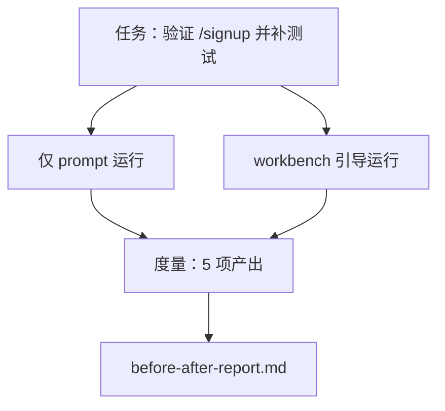

# 在真实仓库上跑 workbench（The Workbench on a Real Repo）

> 译注：本文译自同目录 [`en.md`](./en.md)。术语遵循仓根 [TRANSLATION_GUIDE.md](../../../../TRANSLATION_GUIDE.md)。

> 前面十一节课讲的那些 surface（界面）一旦没法在真实代码库上活下来，就一文不值。这节课在一个小型样例 app 上把同一个任务跑两遍：纯 prompt vs workbench（工作台）引导。让数字自己说话。

**Type:** Build
**Languages:** Python (stdlib)
**Prerequisites:** Phases 14 · 32 to 14 · 40
**Time:** ~60 minutes

## 学习目标（Learning Objectives）

- 在一个小型应用上把 workbench 的七个 surface 串起来用。
- 把同一个任务跑两遍（纯 prompt 与 workbench 引导），并测量五项结果。
- 读懂 before/after（前后对比）报告，判断哪些 surface 带来了最大杠杆。
- 当有人甩出「我的模型已经够好了」这种说辞时，能为 workbench 辩护。

## 问题（The Problem）

在玩具任务上跑个 demo 谁也说服不了。要让 workbench 有说服力，得让一个像真实任务一样的活儿、在一个像真实仓库一样的 repo 上落地，最终故障更少、回退更少，并且产出一个下个会话能直接吃掉的 packet。

这节课就交付那个「像真实仓库一样的 repo」，并把同一个任务塞进两条 pipeline（流水线）跑一遍。结果是一份你可以直接甩到怀疑论者脸上的前后对比报告。

## 概念（The Concept）



### 样例 app（The sample app）

`sample_app/` 下放一个最小化的 FastAPI 风格 handler：

- `app.py`，包含 `/signup`（暂时还没校验）。
- `test_app.py`，含一条 happy-path 测试。
- `README.md` 和 `scripts/release.sh` 作为「禁区诱饵」。

### 任务（The task）

> 给 `/signup` 加输入校验：拒绝长度小于 8 的密码，返回 422 并附一个有类型的错误信封。再加一条测试证明这个新行为。

### 两条 pipeline（The two pipelines）

纯 Prompt：

1. 读 README。
2. 读 `app.py`。
3. 改文件。
4. 声明做完。

Workbench 引导：

1. 跑 init 脚本（Lesson 35）。
2. 读 scope contract（范围契约）（Lesson 36）。
3. 读 state（状态）（Lesson 34）。
4. 只编辑被允许的文件。
5. 通过 feedback runner 跑验收命令（Lesson 37）。
6. 跑 verification gate（验证关卡）（Lesson 38）。
7. 跑 reviewer（验证器）（Lesson 39）。
8. 生成 handoff（交接包）（Lesson 40）。

### 测量的五项结果（The five outcomes measured）

| 结果 | 为什么重要 |
|---------|----------------|
| `tests_actually_run` | 大多数「测试通过了」的说法根本无法验证 |
| `acceptance_met` | 那条证明目标的测试，必须就是真的跑过的那条 |
| `files_outside_scope` | 范围蔓延（scope creep）是最主要的隐性失败 |
| `handoff_quality` | 下一个会话要么因此受益、要么为此买单 |
| `reviewer_total` | gate 之上的定性判断 |

## 动手实现（Build It）

`code/main.py` 在同一个样例 app fixture 上编排这两条 pipeline。两条 pipeline 都是脚本化的（loop 里没有 LLM），这样测量结果可复现。脚本会把对比写入 `before-after-report.md` 和 `comparison.json`。

跑它：

```
python3 code/main.py
```

输出：每条 pipeline 各自结果的控制台表格、保存到脚本旁的 markdown 报告，以及给想画图的人用的 JSON。

## 真实世界中的生产模式（Production patterns in the wild）

怀疑论者总会问：「workbench 到底有多大帮助？」2026 年的数字比解释更有说服力。

**同一个模型，Terminal Bench 从 Top-30 外冲到 Top-5。** LangChain 的 *Anatomy of an Agent Harness*（2026 年 4 月）：一个 coding agent 仅靠改 harness，就在 Terminal Bench 2.0 上从 Top 30 之外蹿到第 5 名。模型相同，surface 不同。25 个名次的差距。

**Vercel 通过删工具把成功率从 80% 提到 100%。** Vercel 报告说，删掉 agent 80% 的工具，把成功率从 80% 拉到了 100%。工具面更小、scope 更利落、出错的路径更少。负空间（negative space）赢了。

**Harvey 仅靠 harness 就把准确率翻了一倍。** 法律领域的 agent 仅通过 harness 优化就让准确率翻了一倍以上，模型没换。

**88% 的企业 AI agent 项目卡在量产前。** preprints.org 的 *Harness Engineering for Language Agents* 论文（2026 年 3 月）把这些失败追溯到了运行时（runtime），而不是推理（reasoning）：陈旧状态、脆弱的重试、过度膨胀的 context、对中间错误的差劲恢复能力。

**长 context 崩溃。** WebAgent 在长 context 下的成功率从基线 40–50% 跌到 10% 以下，主要死在死循环和目标丢失上。Ralph Loop 和 handoff packet 就是为了吸收这部分崩溃而存在的。

**假阴性（false negative）确实存在。** 单步事实型任务、单行 lint、formatter 跑一下、任何模型已经一字不差背下来的东西——这些用纯 prompt 反而更快。基准测试应该把它们老老实实列出来，免得被人指责 workbench 是杀鸡用牛刀。

结论不是「harness 永远赢」。模型确实会随时间把 harness 的小聪明吸收进去。结论是：**今天**，工程负担就坐在这七个 surface 上，数字就是证据。

## 用起来（Use It）

这节课就是一份案卷，下列场合你都可以引用：

- 有人问为什么每个 PR 都要带一份 `agent-rules.md` 和一份 scope contract。
- 某个团队想「就这一个 sprint」把 verification gate 关掉。
- 一个新的 agent 产品发布，你需要一个可移植的 benchmark 来判断它是否真的省时间。

数字能跑得比解释更远。

## 上线部署（Ship It）

`outputs/skill-workbench-benchmark.md` 是一个可移植的评估 harness，可以让任意 agent 产品在你自己项目的样例 app 上跑两条 pipeline，并报出五项结果。

## 练习（Exercises）

1. 加上第六项结果：「首次有意义编辑的耗时（time-to-first-meaningful-edit）」。怎么干净地测它？
2. 在你自己代码库的一个真实「第二天任务」上跑这次对比。workbench 的数字在哪里掉链子？
3. 加一组「假阴性」用例：那些纯 prompt 反而更快、workbench 开销变成实打实成本的任务。然后为「依然保留 workbench」做辩护。
4. 把脚本里的「agent」换成真实 LLM 调用。哪些结果会变得更吵？
5. 写一份面向非工程师的一页摘要。砍完之后还剩什么？

## 关键术语（Key Terms）

| 术语 | 大家嘴上怎么说 | 它真正的意思 |
|------|----------------|------------------------|
| Sample app | 「玩具 repo」 | 够小但够真实，能把七个 surface 全练一遍 |
| Pipeline | 「工作流」 | agent 按顺序读写各个 surface 的有序步骤 |
| Before/after report | 「证据单」 | 你递给怀疑论者的那份产出物 |
| False negative | 「workbench 杀鸡用牛刀」 | 纯 prompt 反而更快的任务；应该如实列出 |
| Workbench benchmark | 「可靠性评分」 | 在你代码库上跑这套对比的可移植 harness |

## 延伸阅读（Further Reading）

- [LangChain, The Anatomy of an Agent Harness](https://blog.langchain.com/the-anatomy-of-an-agent-harness/) — Terminal Bench 从 Top-30 到 Top-5 的证据
- [MongoDB, The Agent Harness: Why the LLM Is the Smallest Part of Your Agent System](https://www.mongodb.com/company/blog/technical/agent-harness-why-llm-is-smallest-part-of-your-agent-system) — Vercel + Harvey 的数字
- [preprints.org, Harness Engineering for Language Agents](https://www.preprints.org/manuscript/202603.1756) — 88% 的企业失败率、运行时根因
- [HN: Improving 15 LLMs at Coding in One Afternoon. Only the Harness Changed](https://news.ycombinator.com/item?id=46988596) — 在 15 个模型上复现
- [Cloudflare, Orchestrating AI Code Review at Scale](https://blog.cloudflare.com/ai-code-review/) — 生产环境 30 天跑了 13.1 万次 review
- [Anthropic, Building Effective Agents](https://www.anthropic.com/research/building-effective-agents)
- Phases 14 · 32 to 14 · 40 — 这节课端到端串起来的所有 surface
- Phase 14 · 19 — SWE-bench、GAIA、AgentBench 这些宏观 benchmark，本课与之互补
- Phase 14 · 30 — eval 驱动的 agent 开发，同一套 harness 直接接进去
