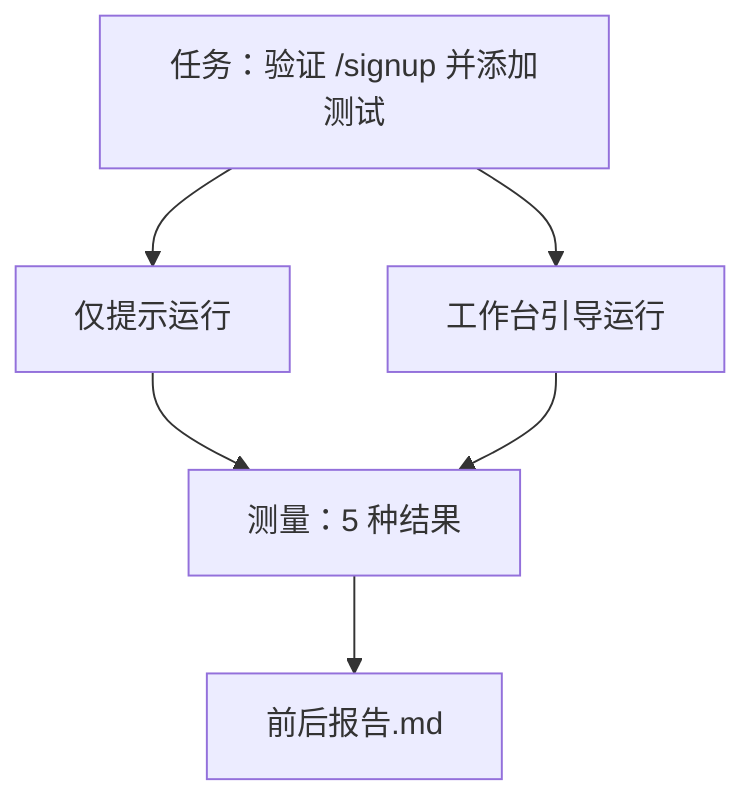

# 真实仓库上的工作台

> 如果十一个层面的课程不能在接触真实代码库后存活，它们就毫无价值。本课在小型示例应用上运行相同任务两次：仅提示与工作台引导。数字会说话。

**类型：** 构建
**语言：** Python（标准库）
**先决条件：** 阶段 14 · 32 至 14 · 40
**时间：** ~60 分钟

## 学习目标

- 在小型应用上汇集七个工作台层面。
- 运行相同任务两次（仅提示和工作台引导）并测量五种结果。
- 阅读前后报告并决定哪些层面提供了最大杠杆。
- 针对"但我的模型已经够好了"的反对意见为工作台辩护。

## 问题

在玩具任务上的演示说服不了任何人。工作台的论据是在真实感觉的仓库上的真实感觉任务投入生产时，失败更少、还原更少，并且下一轮会话可以使用数据包。

本课提供那个真实感觉的仓库，并通过两个流水线运行相同任务。结果是一份前后报告，你可以交给怀疑者。

## 概念



### 示例应用

`sample_app/` 中的一个最小化 FastAPI 风格处理器：

- `app.py` 带有 `/signup`（尚未验证）。
- `test_app.py` 带有一个快乐路径测试。
- `README.md` 和 `scripts/release.sh` 作为禁止区域诱饵。

### 任务

> 向 `/signup` 添加输入验证：拒绝短于 8 字符的密码，返回带类型化错误信封的 422。添加一个证明新行为的测试。

### 两个流水线

仅提示：

1. 阅读 README。
2. 阅读 `app.py`。
3. 编辑文件。
4. 宣布完成。

工作台引导：

1. 运行初始化脚本（第 35 课）。
2. 阅读范围契约（第 36 课）。
3. 阅读状态（第 34 课）。
4. 仅编辑允许的文件。
5. 通过反馈运行器运行验收命令（第 37 课）。
6. 运行验证门（第 38 课）。
7. 运行审查者（第 39 课）。
8. 生成交接（第 40 课）。

### 测量的五种结果

| 结果 | 为何重要 |
|------|----------|
| `tests_actually_run` | 大多数"测试通过"声明是无法验证的 |
| `acceptance_met` | 证明目标的测试必须是通过的测试 |
| `files_outside_scope` | 范围蠕变是主要的静默失败 |
| `handoff_quality` | 下一轮会话为此付费或受益 |
| `reviewer_total` | 门之上的定性判断 |

## 构建

`code/main.py` 针对相同的示例应用固件编排两个流水线。两个流水线都是脚本化的（循环中没有 LLM），因此测量是可复现的。脚本将比较写入 `before-after-report.md` 和 `comparison.json`。

运行：

```
python3 code/main.py
```

输出：每个流水线的结果控制台表格、保存在脚本旁边的 Markdown 报告，以及想要绘制图表的任何人的 JSON。

## 生产模式

怀疑者的问题是"工作台实际帮助多少？" 2026 年的数字比解释说明更多。

**在相同模型上从 Terminal Bench Top-30 到 Top-5。** LangChain 的《Agent Harness 剖析》（2026 年 4 月）：一个编码 Agent 仅通过改变 harness，在 Terminal Bench 2.0 上从第 30 名之外跃升至第 5 名。相同模型。不同的层面。二十五名排名差距。

**Vercel 通过删除工具从 80% 到 100%。** Vercel 报告删除其 Agent 80% 的工具将成功率从 80% 移至 100%。更小的工具层面，更锐利的范围，更少的失败方式。负空间获胜。

**仅通过 harness 使 Harvey 准确度翻倍。** 法律 Agent 仅通过 harness 优化，准确度翻倍。

**88% 的企业 AI Agent 项目未能投产。** preprints.org《语言 Agent 的 Harness 工程》论文（2026 年 3 月）将失败追溯到运行时，而非推理：陈旧状态、脆弱重试、过度增长的上下文、从中间错误恢复不佳。

**长上下文崩溃。** WebAgent 基线 40-50% 成功率在长上下文条件下降至 10% 以下，主要来自无限循环和目标丢失。Ralph Loop 和交接数据包的存在就是为了吸收这一点。

**假阴性仍然存在。** 单步事实任务、单行 lint、格式化程序运行、模型逐字记忆的任何东西 —— 这些在仅提示下运行更快。基准应该诚实地列举它们，以便工作台不被框定为过度杀伤。

启示不是"harness 永远获胜。" 模型确实会随时间吸收 harness 技巧。启示是：今天，工程负载位于七个层面，数字证明了这一点。

## 使用

本课是你引用的情况文件，当：

- 有人问为什么每个 PR 都携带 `agent-rules.md` 和范围契约。
- 一个团队想要"仅针对本次冲刺"丢弃验证门。
- 一个新的 Agent 产品启动，你需要一个关于它是否实际节省时间的可移植基准。

数字比解释传播得更远。

## 部署

`outputs/skill-workbench-benchmark.md` 是一个可移植的评估 harness，通过两个流水线针对项目的 own 示例应用运行任何 Agent 产品，并报告五种结果。

## 练习

1. 添加第六种结果：time-to-first-meaningful-edit。你如何干净地测量它？
2. 在你的代码库中的真实第二天任务上运行比较。工作台数字在哪里下滑？
3. 添加一个"假阴性"通行：仅提示会更快且工作台开销是真实成本的任务。无论如何辩护保留工作台。
4. 用真实的 LLM 调用替换脚本化的"Agent"。哪些结果变得更嘈杂？
5. 编写一个针对非工程师的一页摘要。什么在削减中存活？

## 关键术语

| 术语 | 人们的说法 | 实际含义 |
|------|----------|----------|
| Sample app（示例应用） | "玩具仓库" | 足够小但真实，可以练习所有七个层面 |
| Pipeline（流水线） | "工作流" | Agent 遵循的层面读取/写入的有序序列 |
| Before/after report（前后报告） | "收据" | 你交给怀疑者的制品 |
| False negative（假阴性） | "工作台过度杀伤" | 仅提示更快的任务；诚实地列举很有用 |
| Workbench benchmark（工作台基准） | "可靠性分数" | 在你的代码库上运行比较的可移植 harness |

## 延伸阅读

- [LangChain, Agent Harness 剖析](https://blog.langchain.com/the-anotomy-of-an-agent-harness/) — Terminal Bench Top-30 到 Top-5 收据
- [MongoDB, Agent Harness：为何 LLM 是你的 Agent 系统中最小的部分](https://www.mongodb.com/company/blog/technical/agent-harness-why-llm-is-smallest-part-of-your-agent-system) — Vercel + Harvey 数字
- [preprints.org, 语言 Agent 的 Harness 工程](https://www.preprints.org/manuscript/202603.1756) — 88% 企业失败率，运行时根本原因
- [HN：一个下午改进 15 个 LLM 的编码。仅 Harness 改变了](https://news.ycombinator.com/item?id=46988596) — 跨 15 个模型复制
- [Cloudflare, 大规模编排 AI 代码审查](https://blog.cloudflare.com/ai-code-review/) — 131k 审查运行 / 30 天生产
- [Anthropic, 构建有效的 Agent](https://www.anthropic.com/research/building-effective-agents)
- 阶段 14 · 32 至 14 · 40 — 本课端到端练习的层面
- 阶段 14 · 19 — SWE-bench、GAIA、AgentBench 作为本课补充的宏观基准
- 阶段 14 · 30 — 相同的 harness 插入的评估驱动 Agent 开发
