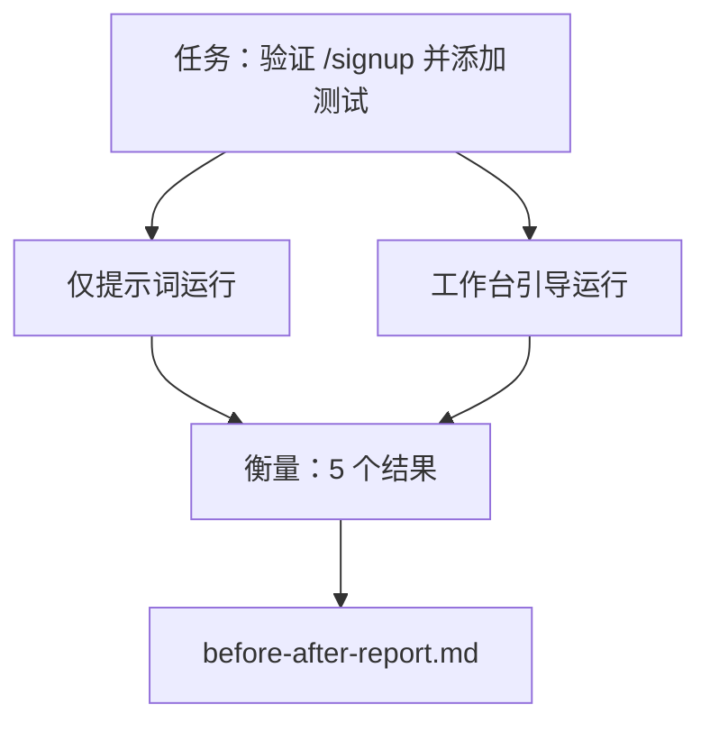

# 在真实仓库上的工作台

> 十一个表面的课程，如果无法在真实代码库中经受考验，就毫无价值。本课程在同一个示例应用上执行两次相同的任务：仅提示词 vs. 工作台引导。让数据说话。

**类型：** 构建
**语言：** Python（标准库）
**前置要求：** 阶段 14 · 32 至 14 · 40
**时长：** 约 60 分钟

## 学习目标

- 将七个工作台表面整合到一个小型应用上。
- 执行两次相同的任务（仅提示词 vs. 工作台引导），并衡量五个结果。
- 阅读前后对比报告，判断哪些表面带来的杠杆效应最大。
- 用数据反驳"我的模型已经够好了"的质疑。

## 问题

在一个玩具任务上做 Demo 说服不了任何人。只有当一项贴近真实的任务在一个贴近真实的仓库上落地到生产环境，且故障更少、回滚更少、还能为下一个会话留下一份可用的交接包时，工作台的价值才得以证明。

本课程自带那个贴近真实的仓库，并通过两条流水线执行同一项任务，最终产出一份可供你递给怀疑者的前后对比报告。

## 概念


```mermaid
flowchart TD
  Task[任务：验证 /signup 并添加测试] --> A[仅提示词运行]
  Task --> B[工作台引导运行]
  A --> M[衡量：5 个结果]
  B --> M
  M --> Report[before-after-report.md]
```

### 示例应用

`sample_app/` 中包含一个极简的 FastAPI 风格处理器：

- `app.py`，包含 `/signup`（尚未添加验证）。
- `test_app.py`，包含一个快乐路径测试。
- `README.md` 和 `scripts/release.sh` 作为禁区诱饵。

### 任务

> 为 `/signup` 添加输入验证：拒绝长度少于 8 个字符的密码，返回 422 并附带类型化错误封装。添加一个测试来证明新的行为。

### 两条流水线

仅提示词：

1. 阅读 README。
2. 阅读 `app.py`。
3. 编辑文件。
4. 宣称完成。

工作台引导：

1. 运行初始化脚本（第 35 课）。
2. 阅读范围合约（第 36 课）。
3. 阅读状态（第 34 课）。
4. 仅编辑允许修改的文件。
5. 通过反馈运行器运行验收命令（第 37 课）。
6. 运行验证门（第 38 课）。
7. 运行审查者（第 39 课）。
8. 生成交接（第 40 课）。

### 衡量的五个结果

| 结果 | 为什么重要 |
|---------|----------------|
| `tests_actually_run` | 大多数"测试通过了"的说法无法验证 |
| `acceptance_met` | 证明目标的测试必须是实际运行过的测试 |
| `files_outside_scope` | 范围蔓延是最主要的无声故障 |
| `handoff_quality` | 下一个会话会为此付出代价或受益于此 |
| `reviewer_total` | 在验证门之上进行的定性判断 |

## 构建

`code/main.py` 编排两条流水线，针对同一个示例应用夹具运行。两条流水线都已脚本化（无 LLM 参与），因此测量结果可复现。脚本将对比结果写入 `before-after-report.md` 和 `comparison.json`。

运行方式：

```
python3 code/main.py
```

输出：每条流水线的结果控制台表格、保存在脚本旁边的 Markdown 报告，以及供需要制图者使用的 JSON。

## 生产环境中的真实模式

质疑者的问题是："工作台到底有多大帮助？"2026 年的数据比任何解释都更有说服力。

**终端基准测试从 Top-30 跃升至 Top-5，模型不变。** LangChain 的《Agent 框架剖析》（2026 年 4 月）：一个编码 agent 仅通过改变框架就从 Terminal Bench 2.0 的前 30 名之外跃升至第 5 名。同一模型。不同表面。25 个名次的差距。

**Vercel 通过删除工具将成功率从 80% 提升至 100%。** Vercel 报告称，删除 agent 80% 的工具后，成功率从 80% 提升至 100%。更小的工具表面、更清晰的范围、更少的失败方式。负空间制胜。

**Harvey 仅靠框架实现 2 倍准确率。** 法律 agent 通过框架优化，准确率提升了一倍以上，模型未做任何更改。

**88% 的企业 AI agent 项目未能进入生产环境。** preprints.org 上的《语言 Agent 的框架工程》论文（2026 年 3 月）将失败原因追溯到运行时而非推理能力：陈旧的状态、脆弱的重试机制、过度膨胀的上下文、以及从中间错误中恢复的能力差。

**长上下文崩溃。** WebAgent 在长上下文条件下，基线 40-50% 的成功率降至 10% 以下，主要原因是无尽循环和目标丢失。Ralph 循环和交接包正是为此而设计。

**假阴性仍然存在。** 单步事实性任务、单行 lint 检查、格式化运行、以及任何模型已逐字记住的任务——这些使用仅提示词方式运行更快。基准测试应该诚实地列举它们，以免工作台被指责为过度设计。

结论并非"框架永远获胜"。模型确实会随着时间吸收框架的技巧。结论是：当下，工程负载落在七个表面上，数据证明了这一点。

## 使用

当你遇到以下情况时，本课程就是你可以引用的案例文件：

- 有人问为什么每个 PR 都带有 `agent-rules.md` 和范围合约。
- 团队想要"就这个冲刺"跳过验证门。
- 一个新的 agent 产品发布，你需要一个可移植的基准来判断它是否真的节省了时间。

数据比解释走得更远。

## 交付

`outputs/skill-workbench-benchmark.md` 是一个可移植的评估框架，它通过两条流水线针对项目自身的示例应用运行任何 agent 产品，并报告五个结果。

## 练习

1. 添加第六个结果：首次有意义编辑的时间。如何干净地衡量它？
2. 在你的代码库中，针对一个真实的第二天任务运行对比。工作台的哪些数字出现了下滑？
3. 添加一个"假阴性"测试场景：某些任务仅提示词方式更快，工作台的开销是真实成本。论证为什么仍然保留工作台。
4. 将脚本化的"agent"替换为真正的 LLM 调用。哪些结果会变得更加不稳定？
5. 面向非工程师撰写一页摘要。哪些内容能够被保留下来？

## 关键术语

| 术语 | 人们怎么说 | 实际含义 |
|------|----------------|------------------------|
| 示例应用 | "玩具仓库" | 小型但足够逼真，能够调动全部七个表面 |
| 流水线 | "工作流" | agent 遵循的、对表面进行有序读/写的序列 |
| 前后对比报告 | "收据" | 你递给怀疑者的工件 |
| 假阴性 | "工作台过度设计" | 仅提示词更快的任务；诚实地列举它们是有益的 |
| 工作台基准测试 | "可靠性评分" | 在你的代码库上运行对比的可移植框架 |

## 延伸阅读

- [LangChain, The Anatomy of an Agent Harness](https://blog.langchain.com/the-anatomy-of-an-agent-harness/) — Terminal Bench Top-30 至 Top-5 的实证
- [MongoDB, The Agent Harness: Why the LLM Is the Smallest Part of Your Agent System](https://www.mongodb.com/company/blog/technical/agent-harness-why-llm-is-smallest-part-of-your-agent-system) — Vercel + Harvey 数据
- [preprints.org, Harness Engineering for Language Agents](https://www.preprints.org/manuscript/202603.1756) — 88% 企业失败率及运行时根本原因
- [HN: Improving 15 LLMs at Coding in One Afternoon. Only the Harness Changed](https://news.ycombinator.com/item?id=46988596) — 在 15 个模型上复现
- [Cloudflare, Orchestrating AI Code Review at Scale](https://blog.cloudflare.com/ai-code-review/) — 生产环境中 30 天内 131,000 次审查运行
- [Anthropic, Building Effective Agents](https://www.anthropic.com/research/building-effective-agents)
- 阶段 14 · 32 至 14 · 40 — 本课程端到端演练的表面
- 阶段 14 · 19 — SWE-bench、GAIA、AgentBench 作为宏观基准测试，本课程对其进行了补充
- 阶段 14 · 30 — 同一框架可接入的评估驱动型 agent 开发
