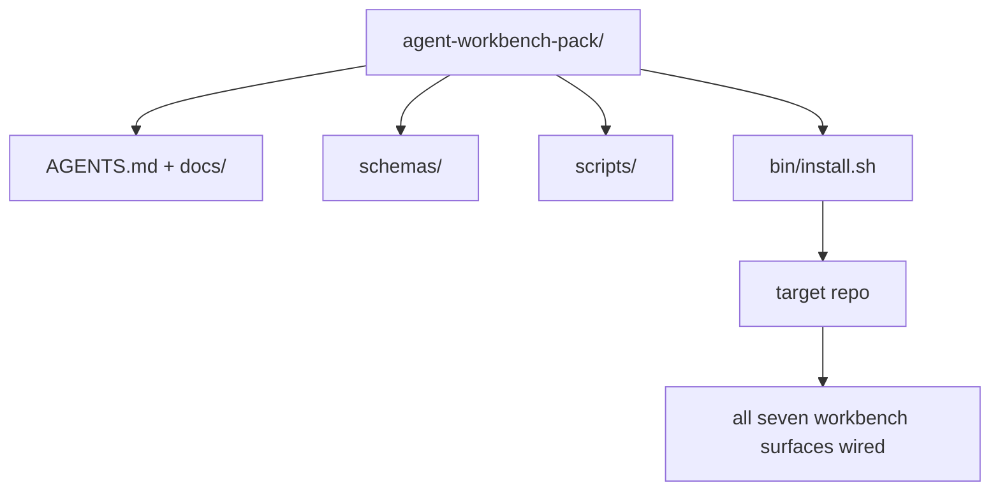

# Capstone: Ship a Reusable Agent Workbench Pack

> The mini-track ends with a pack you drop into any repo. Eleven lessons of surfaces compressed into a directory you can `cp -r` and have an agent working reliably the next morning. The capstone is the artifact this curriculum trades on.

**Type:** Build
**Languages:** Python (stdlib)
**Prerequisites:** Phases 14 · 31 to 14 · 41
**Time:** ~75 minutes

## Learning Objectives

- Package the seven workbench surfaces into one drop-in directory.
- Pin the schemas, scripts, and templates so a new repo gets a known-good baseline.
- Add a single installer script that lays down the pack idempotently.
- Decide what stays in the pack and what stays out, defending the cut for each.

## The Problem

A workbench that lives in a Google Doc, a chat history, and three half-remembered scripts is a workbench that gets rebuilt every quarter. The cure is a versioned pack: a repo or directory with the surfaces, the schemas, the scripts, and a one-command installer.

You will end this lesson with `outputs/agent-workbench-pack/` shipped on disk and a `bin/install.sh` that drops it into any target repo.

## The Concept



### The pack layout

```
outputs/agent-workbench-pack/
├── AGENTS.md
├── docs/
│   ├── agent-rules.md
│   ├── reliability-policy.md
│   ├── handoff-protocol.md
│   └── reviewer-rubric.md
├── schemas/
│   ├── agent_state.schema.json
│   ├── task_board.schema.json
│   └── scope_contract.schema.json
├── scripts/
│   ├── init_agent.py
│   ├── run_with_feedback.py
│   ├── verify_agent.py
│   └── generate_handoff.py
├── bin/
│   └── install.sh
└── README.md
```

### What stays in, what stays out

In:

- Surface schemas. They are the contract.
- The four scripts above. They are the runtime.
- The four docs. They are the rules and the rubric.

Out:

- Project-specific tasks. Tasks belong on the target repo's board, not in the pack.
- Vendor SDK calls. The pack is framework-agnostic.
- Onboarding prose. The pack lives next to the team's existing onboarding, not inside it.

### The installer

A short `bin/install.sh` (or `bin/install.py`):

1. Refuses to install over an existing pack without `--force`.
2. Copies the pack into the target repo.
3. Wires up CI if a `.github/workflows/` exists.
4. Prints next steps: fill in the board, set acceptance commands, run the init script.

### Versioning

The pack carries a `VERSION` file. Schema bumps and script changes that require migrations bump the major. Doc-only changes bump the patch. The target repo's `agent_state.json` records which pack version it was initialized against.

## Build It

`code/main.py` assembles the pack into `outputs/agent-workbench-pack/` next to the lesson, seeded with the schemas and scripts from the previous lessons in this mini-track and the docs you already wrote.

Run it:

```
python3 code/main.py
```

The script copies and pins the surfaces, writes the README, prints the pack tree, and exits zero. Re-running is idempotent.

## Use It

Three places the pack ships:

- **As a directory you drop into a repo.** `cp -r outputs/agent-workbench-pack /path/to/repo`.
- **As a public template repo.** Fork-and-customize, with `VERSION` controlling drift.
- **As a SkillKit skill.** Wired into your agent product so a single command lays it down.

The pack is the recipe. Each install is a serving.

## Ship It

`outputs/skill-workbench-pack.md` generates a project-tuned pack: rules sharpened to the team's history, scope globs matched to the repo, rubric dimensions extended with one domain-specific entry.

## Exercises

1. Decide which optional fifth doc deserves promotion into the canonical pack. Defend the cut.
2. Rewrite the installer as Python with a `--dry-run` flag. Compare ergonomics against bash.
3. Add a `bin/uninstall.sh` that safely removes the pack and refuses if state files have non-trivial history. What counts as non-trivial?
4. Add a `lint_pack.py` that fails when the pack drifts from `VERSION`. Wire it into CI for the pack's own repo.
5. Author the migration runbook from a hand-rolled workbench to this pack. What is the order of operations that minimizes downtime?

## Key Terms

| Term | What people say | What it actually means |
|------|----------------|------------------------|
| Workbench pack | "The starter kit" | A versioned directory carrying all seven surfaces |
| Installer | "Setup script" | `bin/install.sh` that lays the pack down idempotently |
| Pack version | "VERSION" | Major bumps for schema/script changes, patch for doc-only |
| Drop-in pack | "cp -r and go" | Pack works without per-repo customization on day one |
| Forkable template | "GitHub template" | Public repo that GitHub's "Use this template" can clone from |

## Further Reading

- Phases 14 · 31 to 14 · 41 — every surface this pack bundles
- [SkillKit](https://github.com/rohitg00/skillkit) — install this skill across 32 AI agents
- Phase 14 · 30 — eval-driven agent development that consumes the pack's verification gate
- [Anthropic, Effective harnesses for long-running agents](https://www.anthropic.com/engineering/effective-harnesses-for-long-running-agents)
