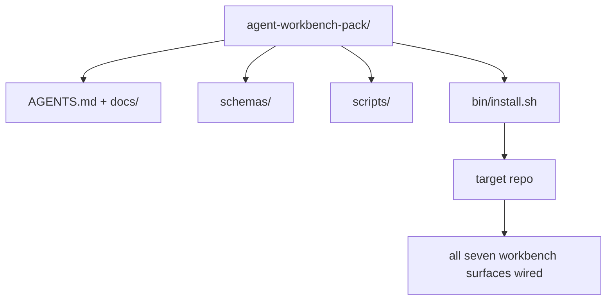

# Capstone: 再利用可能な Agent Workbench Pack を出荷する

> mini-track の最後は、どの repo にも drop できる pack です。11 lesson 分の surface を 1 つの directory に圧縮し、`cp -r` すれば翌朝には agent が信頼性高く動き始めます。この capstone が、この curriculum の実用 artifact です。

**種類:** Build
**言語:** Python (stdlib)
**前提:** Phases 14 · 31 to 14 · 41
**時間:** 約75分

## 学習目標

- 7 つの workbench surface を 1 つの drop-in directory に package する。
- 新しい repo が known-good baseline を得られるように、schema、script、template を pin する。
- pack を idempotent に配置する単一の installer script を追加する。
- pack に何を入れ、何を外すかを決め、それぞれの判断を説明する。

## 問題

Google Doc、chat history、半分だけ覚えている 3 つの script に分散している workbench は、四半期ごとに作り直される workbench です。解決策は versioned pack です。surface、schema、script、one-command installer を持つ repo または directory です。

この lesson の終わりには、`outputs/agent-workbench-pack/` がディスク上に出荷され、`bin/install.sh` が任意の target repo にそれを配置できるようになります。

## コンセプト



### pack layout

```
outputs/agent-workbench-pack/
├── AGENTS.md
├── docs/
│   ├── agent-rules.md
│   ├── reliability-policy.md
│   ├── handoff-protocol.md
│   └── reviewer-rubric.md
├── schemas/
│   ├── agent_state.schema.json
│   ├── task_board.schema.json
│   └── scope_contract.schema.json
├── scripts/
│   ├── init_agent.py
│   ├── run_with_feedback.py
│   ├── verify_agent.py
│   └── generate_handoff.py
├── bin/
│   └── install.sh
└── README.md
```

### 何を入れ、何を外すか

入れるもの:

- Surface schema。これが contract です。
- 上記 4 つの script。これが runtime です。
- 4 つの doc。これが rule と rubric です。

外すもの:

- Project-specific task。task は target repo の board に属し、pack には属しません。
- Vendor SDK call。pack は framework-agnostic です。
- Onboarding prose。pack は team 既存の onboarding の隣に置かれるもので、その中に住むものではありません。

### installer

短い `bin/install.sh` (または `bin/install.py`):

1. `--force` なしで既存 pack を上書きしない。
2. target repo に pack を copy する。
3. `.github/workflows/` が存在する場合は CI を wire する。
4. next steps を出力する: board を埋め、acceptance command を設定し、init script を実行する。

### versioning

pack は `VERSION` file を持ちます。migration が必要な schema bump と script change は major を上げます。doc-only change は patch を上げます。target repo の `agent_state.json` は、どの pack version に対して初期化されたかを記録します。

## 作ってみる

`code/main.py` は pack を組み立て、lesson の隣にある `outputs/agent-workbench-pack/` に置きます。前 lesson で作った schema と script、すでに書いた doc を seed として使います。

実行します。

```
python3 code/main.py
```

script は surface を copy and pin し、README を書き、pack tree を表示し、zero exit します。再実行しても idempotent です。

## Production patterns in the wild

pack は fork、update、扱いづらい upstream に耐えられて初めて価値があります。次の 4 pattern がそれを支えます。

**`VERSION` is the contract, not the marketing.** major bump は state migration を必要とします。minor bump は checker re-run を必要とします。patch bump は doc-only です。installer は install のたびに target repo に `.workbench-version` を書きます。`lint_pack.py` は target の lock が pack の `VERSION` と一致しなければ出荷を拒否します。`npm`、`Cargo`、`pyproject.toml` が 10 年の churn に耐えた方法です。agent だからといって rule は変わりません。

**Single source for cross-tool distribution.** Nx は単一 config から `AGENTS.md`、`CLAUDE.md`、`.cursor/rules/`、`.github/copilot-instructions.md`、MCP server を配置する `nx ai-setup` を出荷しています。pack も同じことをすべきです。installer は symlink (`ln -s AGENTS.md CLAUDE.md`) を発行し、single source of truth をすべての coding agent に fan out します。1 つの tool に対応するために pack を fork すること自体が failure mode です。

**`uninstall.sh` that refuses on non-trivial state.** pack の uninstall は user の `agent_state.json`、`task_board.json`、`outputs/` を削除してはいけません。uninstaller は schema、script、doc、`AGENTS.md` (`--keep-agents-md` opt-out つき) だけを削除し、state file に未 commit の変更がある場合は続行を拒否します。state は user のものです。pack はそれを所有しません。

**Skill-as-publishable. SkillKit-style distribution.** pack は SkillKit skill として出荷されます。`skillkit install agent-workbench-pack` が single source から 32 種類の AI agent に配置します。pack repo が source of truth で、SkillKit が distribution channel です。vendor lock-in は崩れ、7 つの surface は同じままです。

## 使い方

pack の出荷先は 3 つあります。

- **repo に drop する directory として。** `cp -r outputs/agent-workbench-pack /path/to/repo`。
- **public template repo として。** fork-and-customize し、`VERSION` で drift を制御します。
- **SkillKit skill として。** agent product に wire し、single command で配置します。

pack は recipe です。install のたびに 1 つの serving になります。

## 出荷する

`outputs/skill-workbench-pack.md` は project-tuned pack を生成します。team の history に合わせて rule を鋭くし、scope glob を repo に合わせ、rubric dimension に domain-specific entry を 1 つ追加します。

## 演習

1. optional な 5 つ目の doc のうち、canonical pack に昇格すべきものを決めてください。その判断を説明してください。
2. installer を `--dry-run` flag つきの Python に書き換えてください。bash と ergonomics を比較してください。
3. pack を安全に削除し、state file に non-trivial history がある場合は拒否する `bin/uninstall.sh` を追加してください。何を non-trivial と見なしますか。
4. pack が `VERSION` から drift したら fail する `lint_pack.py` を追加してください。pack 自身の repo の CI に wire してください。
5. hand-rolled workbench からこの pack へ移行する runbook を書いてください。downtime を最小化する operation order は何ですか。

## 重要用語

| Term | What people say | What it actually means |
|------|----------------|------------------------|
| Workbench pack | 「starter kit」 | 7 つの surface すべてを運ぶ versioned directory |
| Installer | 「setup script」 | pack を idempotent に配置する `bin/install.sh` |
| Pack version | 「VERSION」 | schema/script change は major、doc-only は patch |
| Drop-in pack | 「cp -r and go」 | day one から per-repo customization なしで動く pack |
| Forkable template | 「GitHub template」 | GitHub の "Use this template" から clone できる public repo |

## 参考文献

- Phases 14 · 31 to 14 · 41 — この pack が bundle するすべての surface
- [SkillKit](https://github.com/rohitg00/skillkit) — この skill を 32 AI agent に install する
- [Nx Blog, Teach Your AI Agent How to Work in a Monorepo](https://nx.dev/blog/nx-ai-agent-skills) — 6 tool にまたがる single-source generator
- [agents.md — the open spec](https://agents.md/) — pack の router が実装すべきもの
- [HKUDS/OpenHarness](https://github.com/HKUDS/OpenHarness) — pack-equivalent の reference implementation
- [andrewgarst/agentic_harness](https://github.com/andrewgarst/agentic_harness) — eval suite を備えた Redis-backed reference
- [Augment Code, A good AGENTS.md is a model upgrade](https://www.augmentcode.com/blog/how-to-write-good-agents-dot-md-files) — pack docs の品質基準
- [Anthropic, Effective harnesses for long-running agents](https://www.anthropic.com/engineering/effective-harnesses-for-long-running-agents)
- [Anthropic, Harness design for long-running application development](https://www.anthropic.com/engineering/harness-design-long-running-apps)
- Phase 14 · 30 — pack の verification gate を consume する eval-driven agent development
- Phase 14 · 41 — この pack が改善する before/after benchmark
