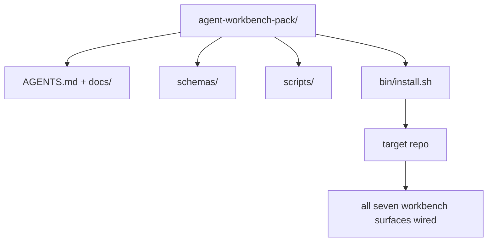

# Capstone: Entregar um Pack Reutilizável de Agent Workbench

> O mini-track termina com um pack que você joga em qualquer repo. Onze lições de superfícies comprimidas num diretório que você pode `cp -r` e ter um agent funcionando de forma confiável na manhã seguinte. O capstone é o artefato que este curso entrega.

**Tipo:** Construção
**Linguagens:** Python (stdlib)
**Pré-requisitos:** Fases 14 · 31 até 14 · 41
**Tempo:** ~75 minutos

## Objetivos de Aprendizado

- Empacotar as sete superfícies do workbench num único diretório drop-in.
- Fixar os schemas, scripts e templates para que um repo novo tenha um baseline conhecido e funcional.
- Adicionar um único script de instalação que instala o pacote de forma idempotente.
- Decidir o que fica no pack e o que fica fora, defendendo a decisão para cada um.

## O Problema

Um workbench que vive num Google Doc, num histórico de chat e em três scripts meio esquecidos é um workbench que é reconstruído a cada trimestre. A cura é um pacote versionado: um repo ou diretório com as superfícies, os schemas, os scripts e um instalador de um comando.

Você vai terminar esta lição com `outputs/agent-workbench-pack/` entregue em disco e um `bin/install.sh` que instala ele em qualquer repo alvo.

## O Conceito



### O layout do pack

```
outputs/agent-workbench-pack/
├── AGENTS.md
├── docs/
│   ├── agent-rules.md
│   ├── reliability-policy.md
│   ├── handoff-protocol.md
│   └── reviewer-rubric.md
├── schemas/
│   ├── agent_state.schema.json
│   ├── task_board.schema.json
│   └── scope_contract.schema.json
├── scripts/
│   ├── init_agent.py
│   ├── run_with_feedback.py
│   ├── verify_agent.py
│   └── generate_handoff.py
├── bin/
│   └── install.sh
└── README.md
```

### O que fica, o que fica fora

Dentro:

- Schemas das superfícies. Eles são o contrato.
- Os quatro scripts acima. Eles são o runtime.
- Os quatro docs. Eles são as regras e a rubrica.

Fora:

- Tarefas específicas do projeto. Tarefas ficam no board do repo alvo, não no pack.
- Chamadas de SDK de fornecedor. O é framework-agnóstico.
- Texto de onboarding. O pack fica ao lado do onboarding existente do time, não dentro dele.

### O instalador

Um `bin/install.sh` curto (ou `bin/install.py`):

1. Recusa instalar sobre um pack existente sem `--force`.
2. Copia o pack pro repo alvo.
3. Configura CI se existir `.github/workflows/`.
4. Imprime próximos passos: preencher o board, definir comandos de aceitação, rodar o script de init.

### Versionamento

O pack carrega um arquivo `VERSION`. Mudanças de schema e script que requerem migrações bumpam a major. Mudanças só de doc bumpam a patch. O `agent_state.json` do repo alvo registra com qual versão do pack ele foi inicializado.

## Construa

`code/main.py` monta o pack em `outputs/agent-workbench-pack/` ao lado da lição, semeado com os schemas e scripts das lições anteriores deste mini-track e os docs que você já escreveu.

Execute:

```
python3 code/main.py
```

O script copia e fixa as superfícies, escreve o README, imprime a árvore do pack e sai com zero. Re-executar é idempotente.

## Padrões de produção no mundo real

Um pack só é valioso se sobrevive a forks, updates e um upstream desafiador. Quatro padrões tornam isso possível.

**`VERSION` é o contrato, não marketing.** Bumps de major requerem migração de estado. Bumps de minor requerem re-execução de verificador. Bumps de patch são só docs. O instalador grava `.workbench-version` no repo alvo a cada instalação; `lint_pack.py` recusa-se a entregar se o lock do alvo divergir da `VERSION` do pack. É assim que `npm`, `Cargo` e `pyproject.toml` sobrevivem a 10 anos de mudanças; nada sobre agents muda as regras.

**Fonte única para distribuição entre ferramentas.** O Nx tem um único `nx ai-setup` que instala `AGENTS.md`, `CLAUDE.md`, `.cursor/rules/`, `.github/copilot-instructions.md` e um servidor MCP de uma única config. O pack deve fazer o mesmo; o instalador emite os symlinks (`ln -s AGENTS.md CLAUDE.md`) para que uma única fonte de verdade se distribua pra cada coding agent. Forkar o pack pra suportar uma ferramenta em vez de outra é um modo de falha.

**`uninstall.sh` que recusa em estado não trivial.** Desinstalar o pack não pode deletar o `agent_state.json`, `task_board.json` ou `outputs/` do usuário. O desinstalador remove schemas, scripts, docs e `AGENTS.md` (com opt-out via `--keep-agents-md`) e recusa prosseguir se os arquivos de estado tiverem alterações não commitadas. Estado pertence ao usuário; o pack não o possui.

**Skill publicável. Distribuição estilo SkillKit.** O pack é entregue como skill do SkillKit: `skillkit install agent-workbench-pack` instala em 32 AI agents de uma única fonte. O repo do pack é a fonte de verdade; SkillKit é o canal de distribuição. Lock-in em fornecedor colapsa; as sete superfícies ficam iguais.

## Use

Três formas de entregar o pack:

- **Como diretório que você joga num repo.** `cp -r outputs/agent-workbench-pack /path/to/repo`.
- **Como repo template público.** Fork-e-customize, com `VERSION` controlando divergência.
- **Como skill do SkillKit.** Integrado ao seu produto de agent para que um único comando o instale.

O pack é a receita. Cada instalação é uma porção.

## Entregue

`outputs/skill-workbench-pack.md` gera um pack ajustado ao projeto: regras afinadas com o histórico do time, globs de escopo casados com o repo, dimensões da rubrica estendidas com uma entrada específica do domínio.

## Exercícios

1. Decida qual quinto doc opcional merece ser promovido pro pack canônico. Defenda a decisão.
2. Reescreva o instalador em Python com flag `--dry-run`. Compare a ergonomia com bash.
3. Adicione um `bin/uninstall.sh` que remova o pack de forma segura e recuse se os arquivos de estado tiverem histórico não trivial. O que conta como não trivial?
4. Adicione um `lint_pack.py` que falhe quando o pack divergir da `VERSION`. Integre no CI do próprio repo do pack.
5. Escreva o runbook de migração de um workbench feito na mão pra este pack. Qual a ordem de operações que minimiza downtime?

## Termos-Chave

| Termo | O que a galera fala | O que realmente significa |
|-------|---------------------|--------------------------|
| Workbench pack | "Kit inicial" | Diretório versionado carregando todas as sete superfícies |
| Installer | "Script de setup" | `bin/install.sh` que instala o pack de forma idempotente |
| Pack version | "VERSION" | Major pra mudanças de schema/script, patch pra só doc |
| Drop-in pack | "cp -r e já era" | Pack funciona sem customização por repo no primeiro dia |
| Forkable template | "GitHub template" | Repo público que o "Use this template" do GitHub pode clonar |

## Leitura Complementar

- Fases 14 · 31 até 14 · 41 — cada superfície que este pack empacota
- [SkillKit](https://github.com/rohitg00/skillkit) — instale esta skill em 32 AI agents
- [Nx Blog, Teach Your AI Agent How to Work in a Monorepo](https://nx.dev/blog/nx-ai-agent-skills) — gerador de fonte única em seis ferramentas
- [agents.md — the open spec](https://agents.md/) — o que o roteador do seu pack precisa implementar
- [HKUDS/OpenHarness](https://github.com/HKUDS/OpenHarness) — implementação de referência de um pack equivalente
- [andrewgarst/agentic_harness](https://github.com/andrewgarst/agentic_harness) — referência com Redis e suite de evals
- [Augment Code, A good AGENTS.md is a model upgrade](https://www.augmentcode.com/blog/how-to-write-good-agents-dot-md-files) — qualidade dos docs do pack
- [Anthropic, Effective harnesses for long-running agents](https://www.anthropic.com/engineering/effective-harnesses-for-long-running-agents)
- [Anthropic, Harness design for long-running application development](https://www.anthropic.com/engineering/harness-design-long-running-apps)
- Fase 14 · 30 — desenvolvimento de agents orientado a evals que consome o gate de verificação do pack
- Fase 14 · 41 — o benchmark antes/depois que este pack melhora
