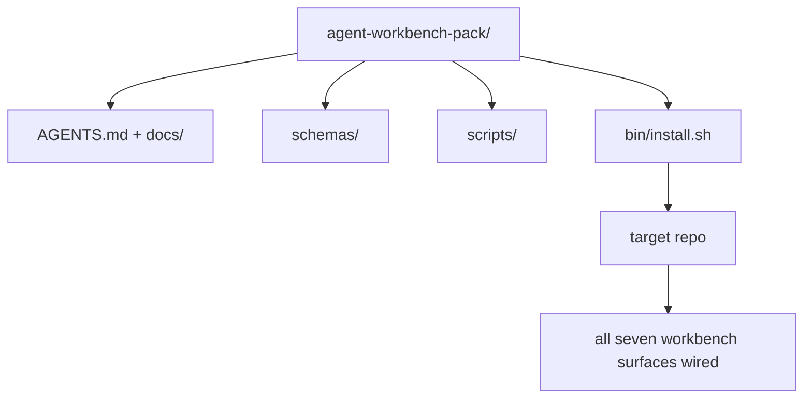

# Capstone: Yeniden Kullanılabilir bir Agent Workbench Paketi Gönderin

> Mini parça, herhangi bir depoya bıraktığınız bir paketle sona erer. `cp -r`'yi bir dizine sıkıştırılmış on bir yüzey dersi ile ertesi sabah agent'nin güvenilir bir şekilde çalışmasını sağlayabilirsiniz. Bu müfredatın temel taşı artifact'dir.

**Tür:** Yapım
**Diller:** Python (stdlib)
**Önkoşullar:** Aşama 14 · 31 - 14 · 41
**Süre:** ~75 dakika

## Öğrenme Hedefleri

- Yedi çalışma tezgahı yüzeyini tek bir açılır dizinde paketleyin.
- Yeni bir reponun iyi olduğu bilinen bir temel alması için şemaları, komut dosyalarını ve şablonları sabitleyin.
- Paketi tam olarak yerleştiren tek bir yükleyici komut dosyası ekleyin.
- Her biri için kesintiyi savunarak, pakette neyin kalacağına ve neyin dışarıda kalacağına karar verin.

## Sorun

Bir Google Dokümanında, bir sohbet geçmişinde ve yarı hatırlanan üç komut dosyasında yaşayan bir çalışma tezgahı, her üç ayda bir yeniden oluşturulan bir çalışma tezgahıdır. Çözüm, sürümlendirilmiş bir pakettir: yüzeyleri, şemaları, komut dosyalarını ve tek komutlu yükleyiciyi içeren bir depo veya dizin.

Bu dersi diskte gönderilen `outputs/agent-workbench-pack/` ve onu herhangi bir hedef depoya bırakan `bin/install.sh` ile sonlandıracaksınız.

## Konsept



### Paket düzeni

```
outputs/agent-workbench-pack/
├── AGENTS.md
├── docs/
│   ├── agent-rules.md
│   ├── reliability-policy.md
│   ├── handoff-protocol.md
│   └── reviewer-rubric.md
├── schemas/
│   ├── agent_state.schema.json
│   ├── task_board.schema.json
│   └── scope_contract.schema.json
├── scripts/
│   ├── init_agent.py
│   ├── run_with_feedback.py
│   ├── verify_agent.py
│   └── generate_handoff.py
├── bin/
│   └── install.sh
└── README.md
```

### Ne içeride kalır, ne dışarıda kalır

İçinde:

- Yüzey şemaları. Onlar sözleşmedir.
- Yukarıdaki dört senaryo. Onlar çalışma zamanıdır.
- Dört belge. Bunlar kurallar ve değerlendirme listesidir.

Çıkış:

- Projeye özel görevler. Görevler pakete değil, hedef deponun panosuna aittir.
- Satıcı SDK çağrıları. Paket framework-agnostiktir.
- Düzyazıya giriş. Sürü, ekibin mevcut katılımının yanında yaşıyor, içinde değil.

### Yükleyici

Kısa bir `bin/install.sh` (veya `bin/install.py`):

1. `--force` olmadan mevcut bir paket üzerine kurulum yapmayı reddediyor.
2. Paketi hedef depoya kopyalar.
3. `.github/workflows/` mevcutsa CI'yi bağlar.
4. Sonraki adımları yazdırır: panoyu doldurun, kabul komutlarını ayarlayın, başlatma komut dosyasını çalıştırın.

### Sürüm oluşturma

Paket bir `VERSION` dosyası taşır. Geçiş gerektiren şema çarpmaları ve komut dosyası değişiklikleri, büyük olanları çarpıtıyor. Yalnızca belgelerde yapılan değişiklikler yamayı etkiler. Hedef reponun `agent_state.json`'si, hangi paket sürümüne göre başlatıldığını kaydeder.

## İnşa Et

`code/main.py`, paketi dersin yanındaki `outputs/agent-workbench-pack/`'de birleştirir; bu mini parçadaki önceki derslerdeki şemalar ve komut dosyaları ve önceden yazdığınız belgelerle tohumlanır.

Çalıştır:

```
python3 code/main.py
```

Komut dosyası yüzeyleri kopyalayıp sabitler, README'yi yazar, paket ağacını yazdırır ve sıfırdan çıkar. Yeniden çalıştırma önemsizdir.

## Vahşi doğada üretim modelleri

Bir paket yalnızca çatallanmalardan, güncellemelerden ve düşmanca bir yukarı akıştan sağ kurtulursa değerlidir. Dört desen bu işi sağlıyor.

**`VERSION` pazarlama değil sözleşmedir.** Büyük dalgalanmalar eyalet geçişini gerektirir. Küçük darbeler denetleyicinin yeniden çalıştırılmasını gerektirir. Yama çıkıntıları yalnızca dokümanlara yöneliktir. Yükleyici her kurulumda hedef depoya `.workbench-version` yazar; Hedefin kilidi paketin `VERSION`'si ile uyuşmuyorsa `lint_pack.py` gönderimi reddeder. `npm`, `Cargo` ve `pyproject.toml` 10 yıllık kayıptan bu şekilde kurtuldu; agent'lerle ilgili hiçbir şey kuralları değiştirmez.

**Araçlar arası dağıtım için tek kaynak.** Nx, tek bir yapılandırmadan `AGENTS.md`, `CLAUDE.md`, `.cursor/rules/`, `.github/copilot-instructions.md` ve bir MCP sunucusunu barındıran bir `nx ai-setup` gönderir. Sürü de aynısını yapmalı; yükleyici sembolik bağlantıları (`ln -s AGENTS.md CLAUDE.md`) yayar, böylece her agent kodlamasına tek bir doğruluk kaynağı yayılır. Paketin bir aracı diğerine göre desteklemesi bir başarısızlık modudur.

**Önemsiz olmayan durumda reddeden `uninstall.sh`.** Paketin kaldırılması kullanıcının `agent_state.json`, `task_board.json` veya `outputs/`'sini silmemelidir. Kaldırıcı şemaları, komut dosyalarını, belgeleri ve `AGENTS.md`'yi (`--keep-agents-md` devre dışı bırakılarak) kaldırır ve durum dosyalarında kaydedilmemiş değişiklikler varsa devam etmeyi reddeder. Durumu kullanıcıya aittir; paket ona sahip değil.

**Yayınlanabilir beceri. SkillKit tarzı dağıtım.** Paket, SkillKit becerisi olarak gönderilir: `skillkit install agent-workbench-pack`, onu tek bir kaynaktan gelen 32 AI agent'ye dağıtır. Paket deposu gerçeğin kaynağıdır; SkillKit dağıtım kanalıdır. Satıcıya bağlılık çöküyor; yedi yüzey aynı kalıyor.

## Kullan onu

Paketin gönderildiği üç yer:

- **Dizin olarak bir depoya girersiniz.** `cp -r outputs/agent-workbench-pack /path/to/repo`.
- **Genel bir şablon deposu olarak.** Sapmayı kontrol eden `VERSION` ile çatallayın ve özelleştirin.
- **SkillKit becerisi olarak.** agent ürününüze kabloyla bağlanarak tek bir komutun devreye girmesini sağlar.

Paket tarifidir. Her kurulum bir sunumdur.

## Gönderin

`outputs/skill-workbench-pack.md`, projeye göre ayarlanmış bir paket oluşturur: ekibin geçmişine göre keskinleştirilmiş kurallar, depoyla eşleşen kapsam küreleri, alana özgü tek bir girişle genişletilmiş değerlendirme listesi boyutları.

## Egzersizler

1. Hangi isteğe bağlı beşinci belgenin standart pakete yükseltilmeyi hak ettiğine karar verin. Kesimi savun.
2. Yükleyiciyi `--dry-run` bayrağıyla Python olarak yeniden yazın. Ergonomiyi bash ile karşılaştırın.
3. Paketi güvenli bir şekilde kaldıran ve durum dosyalarının önemsiz olmayan bir geçmişi varsa reddeden bir `bin/uninstall.sh` ekleyin. Neler önemsiz sayılıyor?
4. Paket `VERSION`'den saptığında başarısız olan bir `lint_pack.py` ekleyin. Paketin kendi deposu için CI'ya bağlayın.
5. Elle yuvarlanan bir çalışma tezgahından bu pakete geçiş runbook'unu yazın. Kesinti süresini en aza indirecek operasyon sırası nedir?

## Anahtar Terimler

| Dönem | İnsanlar ne diyor | Aslında ne anlama geliyor |
|------|----------------|------------------------|
| Tezgah paketi | "Başlangıç ​​kiti" | Yedi yüzeyin tümünü taşıyan versiyonlanmış bir dizin |
| Yükleyici | "Kurulum komut dosyası" | `bin/install.sh` paketi tam anlamıyla yere bırakıyor |
| Paket sürümü | "VERSİYON" | Şema/komut dosyası değişikliklerinde büyük artışlar, yalnızca belgeler için yama |
| Açılan paket | "cp -r ve git" | Paket, ilk günde repo başına özelleştirme olmadan çalışır |
| Çatallanabilir şablon | "GitHub şablonu" | GitHub'ın "Bu şablonu kullan" seçeneğinin kopyalanabileceği genel depo |

## Daha Fazla Okuma

- Aşama 14 · 31 - 14 · 41 — bu paketin içerdiği her yüzey
- [SkillKit](https://github.com/rohitg00/skillkit) — bu beceriyi 32 AI agent'ye yükleyin
- [Nx Blogu, Yapay Zekanıza Agent Monorepo'da Nasıl Çalışılacağını Öğretin](https://nx.dev/blog/nx-ai-agent-skills) — altı araçla tek kaynaklı oluşturucu
- [agents.md — açık spesifikasyon](https://agents.md/) — paketinizin yönlendiricisinin uygulaması gereken şey
- [HKUDS/OpenHarness](https://github.com/HKUDS/OpenHarness) — paket eşdeğerinin referans uygulaması
- [andrewgarst/agentic_harness](https://github.com/andrewgarst/agentic_harness) — Değerlendirme paketiyle Redis destekli referans
- [Augment Code, iyi bir AGENTS.md bir model yükseltmesidir](https://www.augmentcode.com/blog/how-to-write-good-agents-dot-md-files) — belge kalitesi çubuğunu paketleyin
- [Uzun süreli agent'ler için Antropik, Etkili koşum takımları](https://www.anthropic.com/engineering/effective-harnesses-for-long-running-agents)
- [Uzun süreli uygulama geliştirme için Antropik, Kablo Demeti tasarımı](https://www.anthropic.com/engineering/harness-design-long-running-apps)
- Aşama 14 · 30 — paketin doğrulama kapısını kullanan değerlendirme odaklı agent geliştirmesi
- Aşama 14 · 41 — bu paketin geliştirildiği benchmark öncesi/sonrası
