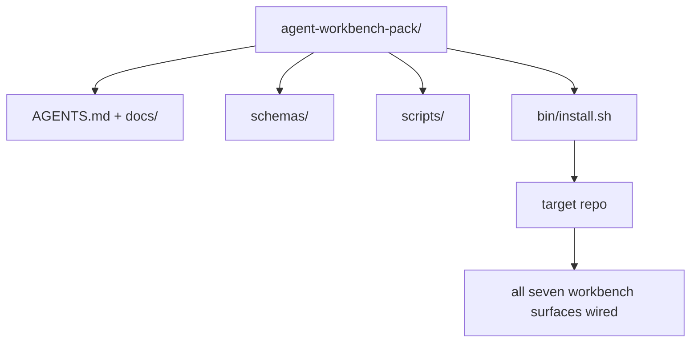

# 42 · 综合项目：交付一个可复用的智能体工作台包

> 这条迷你专线以一个可直接放进任意仓库的「包（pack）」收尾。十一节课的各类「界面（surface）」被压缩进一个目录，你只需 `cp -r`，第二天早上智能体就能可靠地干活了。这个综合项目就是整套课程所交付的核心产物。

**类型：** 构建
**语言：** Python（标准库）
**前置：** 阶段 14 · 31 至 14 · 41
**时长：** 约 75 分钟

## 学习目标

- 把七个工作台界面打包进一个「即插即用（drop-in）」目录。
- 固定（pin）schema、脚本和模板，让新仓库拿到一个已知良好的基线。
- 增加一个安装脚本，幂等地铺下整个包。
- 决定哪些东西留在包内、哪些排除在外，并为每一处取舍给出理由。

## 问题所在

一个分散在某个 Google Doc、一段聊天记录和三个半记半忘的脚本里的工作台，是一个每个季度都要重建一遍的工作台。解药是一个带版本的包：一个包含各类界面、schema、脚本以及一键安装器的仓库或目录。

学完本课，你会在磁盘上交付出 `outputs/agent-workbench-pack/`，以及一个能把它铺进任意目标仓库的 `bin/install.sh`。

## 核心概念



### 包的布局

```
outputs/agent-workbench-pack/
├── AGENTS.md
├── docs/
│   ├── agent-rules.md
│   ├── reliability-policy.md
│   ├── handoff-protocol.md
│   └── reviewer-rubric.md
├── schemas/
│   ├── agent_state.schema.json
│   ├── task_board.schema.json
│   └── scope_contract.schema.json
├── scripts/
│   ├── init_agent.py
│   ├── run_with_feedback.py
│   ├── verify_agent.py
│   └── generate_handoff.py
├── bin/
│   └── install.sh
└── README.md
```

### 哪些留在包内，哪些排除在外

留在包内：

- 界面 schema。它们就是契约。
- 上面那四个脚本。它们就是运行时（runtime）。
- 那四份文档。它们就是规则与评审准则（rubric）。

排除在外：

- 项目专属任务。任务应该放在目标仓库的看板（board）上，而不是包里。
- 厂商 SDK 调用。本包与框架无关（framework-agnostic）。
- 入职说明文案。本包与团队现有的入职流程并列存在，而不是嵌入其中。

### 安装器

一个简短的 `bin/install.sh`（或 `bin/install.py`）：

1. 在已存在某个包的情况下，没有 `--force` 就拒绝安装。
2. 把包复制进目标仓库。
3. 如果存在 `.github/workflows/`，就接通 CI。
4. 打印后续步骤：填好看板、设置验收命令、运行初始化脚本。

### 版本管理

包里带有一个 `VERSION` 文件。需要迁移（migration）的 schema 升级和脚本变更要提升主版本号（major）。仅文档的改动提升修订号（patch）。目标仓库的 `agent_state.json` 会记录它初始化时所对照的包版本。

## 动手构建

`code/main.py` 把整个包组装进与本课同级的 `outputs/agent-workbench-pack/`，其中预置了来自本迷你专线前几课的 schema 与脚本，以及你已经写好的那些文档。

运行它：

```
python3 code/main.py
```

该脚本会复制并固定各类界面、写出 README、打印包的目录树，并以零退出码结束。重复运行是幂等的。

## 真实世界中的生产实践模式

只有当一个包能在分叉（fork）、更新以及不友好的上游变更中存活下来，它才有价值。四个模式让这一点成为可能。

**`VERSION` 是契约，不是营销话术。** 主版本号升级需要一次状态迁移。次版本号（minor）升级需要重跑一次检查器（checker）。修订号升级仅限文档。安装器每次安装都会把 `.workbench-version` 写进目标仓库；如果目标的锁文件与包的 `VERSION` 不一致，`lint_pack.py` 会拒绝交付。`npm`、`Cargo` 和 `pyproject.toml` 正是这样熬过 10 年的频繁变动；智能体的存在丝毫不会改变这些规则。

**面向跨工具分发的单一来源。** Nx 提供了单一的 `nx ai-setup`，它从一份配置出发，一次性铺下 `AGENTS.md`、`CLAUDE.md`、`.cursor/rules/`、`.github/copilot-instructions.md` 以及一个 MCP 服务器。本包也应如此；安装器会发出符号链接（`ln -s AGENTS.md CLAUDE.md`），让单一事实来源（single source of truth）扇出到每一个编码智能体。为支持某个工具而分叉这个包、再排挤另一个工具，是一种失败模式。

**在非平凡状态下会拒绝执行的 `uninstall.sh`。** 卸载本包绝不能删掉用户的 `agent_state.json`、`task_board.json` 或 `outputs/`。卸载器会移除 schema、脚本、文档和 `AGENTS.md`（可用 `--keep-agents-md` 选择保留），并在状态文件存在任何未提交改动时拒绝继续。状态属于用户；包并不拥有它。

**技能即可发布物，采用 SkillKit 式分发。** 本包以一个 SkillKit 技能（skill）的形式交付：`skillkit install agent-workbench-pack` 会从单一来源把它铺设到 32 个 AI 智能体上。包仓库是事实来源；SkillKit 是分发渠道。厂商锁定（vendor lock-in）随之瓦解；七个界面保持不变。

## 上手使用

包有三种交付场景：

- **作为一个放进仓库的目录。** `cp -r outputs/agent-workbench-pack /path/to/repo`。
- **作为一个公开的模板仓库。** 分叉后定制，由 `VERSION` 控制漂移（drift）。
- **作为一个 SkillKit 技能。** 接入你的智能体产品，一条命令即可铺下。

包是配方，每一次安装是一份成品。

## 交付产物

`outputs/skill-workbench-pack.md` 会生成一个针对项目调优的包：规则按团队历史磨锐、作用域通配符（scope glob）匹配该仓库、评审准则维度再加一条领域专属条目。

## 练习

1. 决定哪个可选的「第五份文档」值得提升进规范化的包中。为这次取舍辩护。
2. 把安装器改写成带 `--dry-run` 标志的 Python 版本。在使用体验上与 bash 版本做对比。
3. 增加一个 `bin/uninstall.sh`，安全移除包，并在状态文件存在非平凡历史时拒绝执行。怎样才算「非平凡」？
4. 增加一个 `lint_pack.py`，当包与 `VERSION` 发生漂移时让它失败。把它接入这个包自身仓库的 CI。
5. 编写从手搓工作台迁移到本包的操作手册（runbook）。怎样的操作顺序能把停机时间降到最低？

## 关键术语

| 术语 | 人们怎么说 | 它实际指什么 |
|------|----------------|------------------------|
| 工作台包（Workbench pack） | “启动套件” | 一个带版本的目录，承载全部七个界面 |
| 安装器（Installer） | “安装脚本” | 幂等铺下包的 `bin/install.sh` |
| 包版本（Pack version） | “VERSION” | schema/脚本变更升主版本号，仅文档升修订号 |
| 即插即用包（Drop-in pack） | “cp -r 直接跑” | 第一天就能用，无需逐仓库定制 |
| 可分叉模板（Forkable template） | “GitHub 模板” | 可供 GitHub 的「Use this template」克隆的公开仓库 |

## 延伸阅读

- 阶段 14 · 31 至 14 · 41 —— 本包打包的每一个界面
- [SkillKit](https://github.com/rohitg00/skillkit) —— 把这个技能安装到 32 个 AI 智能体上
- [Nx 博客，Teach Your AI Agent How to Work in a Monorepo](https://nx.dev/blog/nx-ai-agent-skills) —— 跨六种工具的单一来源生成器
- [agents.md —— 开放规范](https://agents.md/) —— 你的包的路由器必须实现的内容
- [HKUDS/OpenHarness](https://github.com/HKUDS/OpenHarness) —— 一个等价于「包」的参考实现
- [andrewgarst/agentic_harness](https://github.com/andrewgarst/agentic_harness) —— 基于 Redis、带评测套件的参考实现
- [Augment Code，A good AGENTS.md is a model upgrade](https://www.augmentcode.com/blog/how-to-write-good-agents-dot-md-files) —— 包文档的质量基准
- [Anthropic，Effective harnesses for long-running agents](https://www.anthropic.com/engineering/effective-harnesses-for-long-running-agents)
- [Anthropic，Harness design for long-running application development](https://www.anthropic.com/engineering/harness-design-long-running-apps)
- 阶段 14 · 30 —— 消费本包验证关卡的评测驱动智能体开发
- 阶段 14 · 41 —— 本包在其之上改进的前后对照基准
