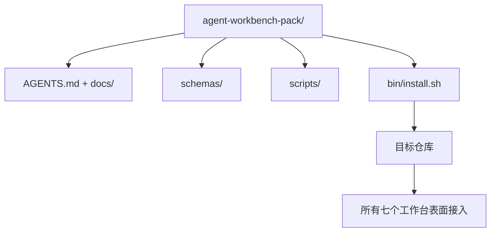

# 顶点：交付可复用的 Agent 工作台包

> 迷你轨道以一个你可以放入任何仓库的包结束。十一个表面的课程压缩成一个可以 `cp -r` 的目录，第二天早上就有一个可靠工作的 agent。顶点是这门课程交易的工件。

**类型：** 构建
**语言：** Python（标准库）
**前置条件：** 第 14 阶段 · 31 到 14 · 41
**时间：** ~75 分钟

## 学习目标

- 将七个工作台表面打包成一个放入目录。
- 固定模式、脚本和模板，使新仓库获得已知良好的基线。
- 添加一个安装脚本，幂等地放置包。
- 决定什么留在包中，什么留在包外，为每个切割辩护。

## 问题

一个存在于 Google 文档、聊天历史和三个半记住的脚本中的工作台是一个每个季度都要重建的工作台。治愈是一个版本化包：一个带有表面、模式、脚本和一键安装程序的仓库或目录。

你将在这节课结束时在磁盘上交付 `outputs/agent-workbench-pack/` 和一个 `bin/install.sh`，将其放入任何目标仓库。

## 概念



### 包布局

```
outputs/agent-workbench-pack/
├── AGENTS.md
├── docs/
│   ├── agent-rules.md
│   ├── reliability-policy.md
│   ├── handoff-protocol.md
│   └── reviewer-rubric.md
├── schemas/
│   ├── agent_state.schema.json
│   ├── task_board.schema.json
│   └── scope_contract.schema.json
├── scripts/
│   ├── init_agent.py
│   ├── run_with_feedback.py
│   ├── verify_agent.py
│   └── generate_handoff.py
├── bin/
│   └── install.sh
└── README.md
```

### 什么留在里面，什么留在外面

里面：

- 表面模式。它们是合约。
- 上面的四个脚本。它们是运行时。
- 四个文档。它们是规则和评分标准。

外面：

- 项目特定任务。任务属于目标仓库的板，不在包中。
- 供应商 SDK 调用。包是框架无关的。
- 入职散文。包位于团队现有入职培训旁边，不在其中。

### 安装程序

一个简短的 `bin/install.sh`（或 `bin/install.py`）：

1. 拒绝在没有 `--force` 的情况下安装到现有包上。
2. 将包复制到目标仓库。
3. 如果存在 `.github/workflows/`，则接入 CI。
4. 打印下一步：填写板、设置验收命令、运行初始化脚本。

### 版本控制

包携带一个 `VERSION` 文件。需要迁移的模式升级和脚本更改升级主版本。仅文档更改升级补丁版本。目标仓库的 `agent_state.json` 记录它针对哪个包版本初始化。

## 构建

`code/main.py` 将包组装到课程旁边的 `outputs/agent-workbench-pack/`，用本迷你轨道前面课程的模式和脚本以及你已经写好的文档播种。

运行：

```
python3 code/main.py
```

脚本复制并固定表面，写入 README，打印包树，并以零退出。重新运行是幂等的。

## 野外生产模式

一个包只有在其在分叉、更新和不友好的上游中存活时才有价值。四种模式使其工作。

**`VERSION` 是合约，不是营销。** 主版本升级需要状态迁移。次版本升级需要检查器重新运行。补丁升级仅文档。安装程序在每次安装时将 `.workbench-version` 写入目标仓库；`lint_pack.py` 如果目标的锁与包的 `VERSION` 不一致则拒绝发布。这就是 `npm`、`Cargo` 和 `pyproject.toml` 在 10 年变动中存活的方式；关于 agent 没有什么改变规则。

**跨工具分发的单一来源。** Nx 提供一个 `nx ai-setup`，从单个配置放下 `AGENTS.md`、`CLAUDE.md`、`.cursor/rules/`、`.github/copilot-instructions.md` 和一个 MCP 服务器。包应该做同样的事情；安装程序发出符号链接（`ln -s AGENTS.md CLAUDE.md`），使单一事实来源扇出到每个编码 agent。将包分叉以支持一个工具而非另一个是失败模式。

**`uninstall.sh` 在非平凡状态上拒绝。** 卸载包不得删除用户的 `agent_state.json`、`task_board.json` 或 `outputs/`。卸载程序删除模式、脚本、文档和 `AGENTS.md`（带 `--keep-agents-md` 选择退出），如果状态文件有任何未提交的更改则拒绝继续。状态属于用户；包不拥有它。

**技能作为可发布。SkillKit 风格分发。** 包作为 SkillKit 技能发布：`skillkit install agent-workbench-pack` 从单一来源跨 32 个 AI agent 放下它。包仓库是事实来源；SkillKit 是分发渠道。供应商锁定崩溃；七个表面保持不变。

## 使用

包发布的三个地方：

- **作为放入仓库的目录。** `cp -r outputs/agent-workbench-pack /path/to/repo`。
- **作为公共模板仓库。** 分叉并自定义，用 `VERSION` 控制漂移。
- **作为 SkillKit 技能。** 接入你的 agent 产品，使单一命令放下它。

包是食谱。每次安装是一份服务。

## 交付

`outputs/skill-workbench-pack.md` 生成一个针对项目调优的包：规则锐化到团队历史、范围通配符匹配仓库、评分标准维度扩展一个领域特定条目。

## 练习

1. 决定哪个可选的第五文档值得晋升到规范包中。为切割辩护。
2. 用 `--dry-run` 标志将安装程序重写为 Python。与 bash 比较人体工程学。
3. 添加一个 `bin/uninstall.sh`，安全地移除包并在状态文件有非平凡历史时拒绝。什么算作非平凡？
4. 添加一个 `lint_pack.py`，当包从 `VERSION` 漂移时失败。将其接入包自己仓库的 CI。
5. 撰写从手工工作台到此包的迁移运行手册。什么是最小化停机时间的操作顺序？

## 关键术语

| 术语 | 人们怎么说 | 实际含义 |
|------|-----------|---------|
| Workbench pack | "入门套件" | 携带所有七个表面的版本化目录 |
| Installer | "设置脚本" | `bin/install.sh`，幂等地放下包 |
| Pack version | "VERSION" | 模式/脚本更改升级主版本，仅文档升级补丁 |
| Drop-in pack | "cp -r 并走" | 包在第一天无需每仓库自定义即可工作 |
| Forkable template | "GitHub 模板" | GitHub 的"使用此模板"可以克隆的公共仓库 |

## 延伸阅读

- 第 14 阶段 · 31 到 14 · 41 —— 此包捆绑的每个表面
- [SkillKit](https://github.com/rohitg00/skillkit) —— 跨 32 个 AI agent 安装此技能
- [Nx Blog, 教你的 AI Agent 如何在 Monorepo 中工作](https://nx.dev/blog/nx-ai-agent-skills) —— 跨六个工具的单一来源生成器
- [agents.md — 开放规范](https://agents.md/) —— 你的包的路由器必须实现的内容
- [HKUDS/OpenHarness](https://github.com/HKUDS/OpenHarness) —— 包等效物的参考实现
- [andrewgarst/agentic_harness](https://github.com/andrewgarst/agentic_harness) —— 带评估套件的 Redis 支持参考
- [Augment Code, 好的 AGENTS.md 是模型升级](https://www.augmentcode.com/blog/how-to-write-good-agents-dot-md-files) —— 包文档质量栏
- [Anthropic, 长程 agent 的有效工具](https://www.anthropic.com/engineering/effective-harnesses-for-long-running-agents)
- [Anthropic, 长程应用开发的工具设计](https://www.anthropic.com/engineering/harness-design-long-running-apps)
- 第 14 阶段 · 30 —— 消费包验证门控的评估驱动 agent 开发
- 第 14 阶段 · 41 —— 此包改进的前后基准