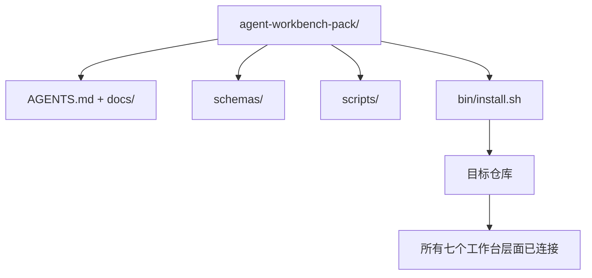

# 顶点：交付可复用的 Agent 工作台包

> 迷你课程以一个你可以放入任何仓库的包结束。十一课的层面压缩到一个目录中，你可以 `cp -r` 并且在第二天早上让 Agent 可靠地工作。顶点是本课程交换的制品。

**类型：** 构建
**语言：** Python（标准库）
**先决条件：** 阶段 14 · 31 至 14 · 41
**时间：** ~75 分钟

## 学习目标

- 将七个工作台层面打包到一个即插即用的目录中。
- 固定模式、脚本和模板，以便新仓库获得已知良好的基线。
- 添加一个单次安装脚本，幂等地布置包。
- 决定什么留在包内，什么留在包外，为每一个辩护取舍。

## 问题

工作台如果活在 Google 文档、聊天历史和三个半记忆的脚本中，就是每个季度都要重建的工作台。治愈方法是一个版本化的包：一个带有层面、模式、脚本和单命令安装程序的仓库或目录。

你将在本课结束时在磁盘上交付 `outputs/agent-workbench-pack/`，以及一个将其放入任何目标仓库的 `bin/install.sh`。

## 概念



### 包布局

```
outputs/agent-workbench-pack/
├── AGENTS.md
├── docs/
│   ├── agent-rules.md
│   ├── reliability-policy.md
│   ├── handoff-protocol.md
│   └── reviewer-rubric.md
├── schemas/
│   ├── agent_state.schema.json
│   ├── task_board.schema.json
│   └── scope_contract.schema.json
├── scripts/
│   ├── init_agent.py
│   ├── run_with_feedback.py
│   ├── verify_agent.py
│   └── generate_handoff.py
├── bin/
│   └── install.sh
└── README.md
```

### 什么放入，什么不放入

放入：

- 层面模式。它们是契约。
- 上述四个脚本。它们是运行时。
- 四个文档。它们是规则和评分标准。

不放入：

- 项目特定任务。任务属于目标仓库的面板，而非包内。
- 供应商 SDK 调用。包是框架无关的。
- 入职散文。包存在于团队现有入职文档旁边，而非其内部。

### 安装程序

一个简短的 `bin/install.sh`（或 `bin/install.py`）：

1. 无 `--force` 时拒绝覆盖现有包。
2. 将包复制到目标仓库。
3. 如果存在 `.github/workflows/`，连接 CI。
4. 打印后续步骤：填写面板、设置验收命令、运行初始化脚本。

### 版本控制

包携带一个 `VERSION` 文件。需要迁移的模式变更和脚本变更提升主版本。仅文档变更提升补丁版本。目标仓库的 `agent_state.json` 记录它针对哪个包版本初始化。

## 构建

`code/main.py` 将包组装到本课旁边的 `outputs/agent-workbench-pack/` 中，用本迷你课程中先前课程的模式和脚本以及你已经编写的文档作为种子。

运行：

```
python3 code/main.py
```

脚本复制并固定层面，编写 README，打印包树，并零退出。重新运行是幂等的。

## 生产模式

包只有在能在 fork、更新和不友好的上游中存活才有价值。四种模式使这工作。

**`VERSION` 是契约，而非营销。** 主版本提升需要状态迁移。次版本提升需要检查器重新运行。补丁版本提升仅文档。安装程序在每次安装时将 `.workbench-version` 写入目标仓库；`lint_pack.py` 如果目标的锁与包的 `VERSION` 不一致则拒绝交付。这就是 `npm`、`Cargo` 和 `pyproject.toml` 如何在十年的动荡中存活；关于 Agent 的任何事情都不会改变规则。

**跨工具分发的单一来源。** Nx 提供一个 `nx ai-setup`，从单个配置布置 `AGENTS.md`、`CLAUDE.md`、`.cursor/rules/`、`.github/copilot-instructions.md` 和 MCP 服务器。包应该做相同的事；安装程序发出符号链接（`ln -s AGENTS.md CLAUDE.md`），以便单一真相来源分散到每个编码 Agent。为了支持一个工具而非另一个而 fork 包是一种失败模式。

**`uninstall.sh` 在非平凡状态时拒绝。** 卸载包绝不能删除用户的 `agent_state.json`、`task_board.json` 或 `outputs/`。卸载程序移除模式、脚本、文档和 `AGENTS.md`（带 `--keep-agents-md` 选择退出），并且如果状态文件有任何未提交变更则拒绝继续。状态属于用户；包不拥有它。

**Skill 作为可发布物。SkillKit 风格分发。** 包作为 SkillKit 技能交付：`skillkit install agent-workbench-pack` 从单一来源布置它到 32 个 AI Agent。包仓库是真相来源；SkillKit 是分发渠道。供应商锁定崩溃；七个层面保持相同。

## 使用

包在三个地方交付：

- **作为你放入仓库的目录。** `cp -r outputs/agent-workbench-pack /path/to/repo`。
- **作为公共模板仓库。** Fork 并自定义，用 `VERSION` 控制漂移。
- **作为 SkillKit 技能。** 连接到你的 Agent 产品，以便单命令布置它。

包是配方。每次安装都是一份供应。

## 部署

`outputs/skill-workbench-pack.md` 生成一个项目调优的包：针对团队历史锐化的规则、匹配仓库的范围 Glob、用领域特定条目扩展的评分标准维度。

## 练习

1. 决定哪个可选的第五个文档值得提升到规范包。辩护取舍。
2. 将安装程序重写为带 `--dry-run` 标志的 Python。比较人体工程学与 bash。
3. 添加 `bin/uninstall.sh`，在安全移除包时，如果状态文件有非平凡历史则拒绝。什么算作非平凡？
4. 添加 `lint_pack.py`，当包从 `VERSION` 漂移时失败。将其接入包的自身仓库的 CI。
5. 编写从手工制作的工作台到该包的迁移运行手册。最小化停机时间的操作顺序是什么？

## 关键术语

| 术语 | 人们的说法 | 实际含义 |
|------|----------|----------|
| Workbench pack（工作台包） | "入门套件" | 携带所有七个工作台层面的版本化目录 |
| Installer（安装程序） | "设置脚本" | 幂等地布置包的 `bin/install.sh` |
| Pack version（包版本） | "VERSION" | 模式/脚本变更提升主版本，仅文档提升补丁版本 |
| Drop-in pack（即插即用包） | "cp -r 即走" | 第一天无需每仓库自定义即可工作的包 |
| Forkable template（可 fork 模板） | "GitHub 模板" | GitHub 的"使用此模板"可以克隆的公共仓库 |

## 延伸阅读

- 阶段 14 · 31 至 14 · 41 — 此包捆绑的每个层面
- [SkillKit](https://github.com/rohitg00/skillkit) — 跨 32 个 AI Agent 安装此技能
- [Nx Blog, 教你的 AI Agent 如何在 Monorepo 中工作](https://nx.dev/blog/nx-ai-agent-skills) — 跨六个工具的单一来源生成器
- [agents.md — 开放规范](https://agents.md/) — 你的包的路由器必须实现的内容
- [HKUDS/OpenHarness](https://github.com/HKUDS/OpenHarness) — 包等效项的参考实现
- [andrewgarst/agentic_harness](https://github.com/andrewgarst/agentic_harness) — 带评估套件的 Redis 支持参考
- [Augment Code, 好的 AGENTS.md 是模型升级](https://www.augmentcode.com/blog/how-to-write-good-agents-dot-md-files) — 包文档质量基准
- [Anthropic, 长运行 Agent 的有效 Harness](https://www.anthropic.com/engineering/effective-harnesses-for-long-running-agents)
- [Anthropic, 长运行应用程序开发的 Harness 设计](https://www.anthropic.com/engineering/harness-design-long-running-apps)
- 阶段 14 · 30 — 消费包验证门的评估驱动 Agent 开发
- 阶段 14 · 41 — 此包改进的前后基准
