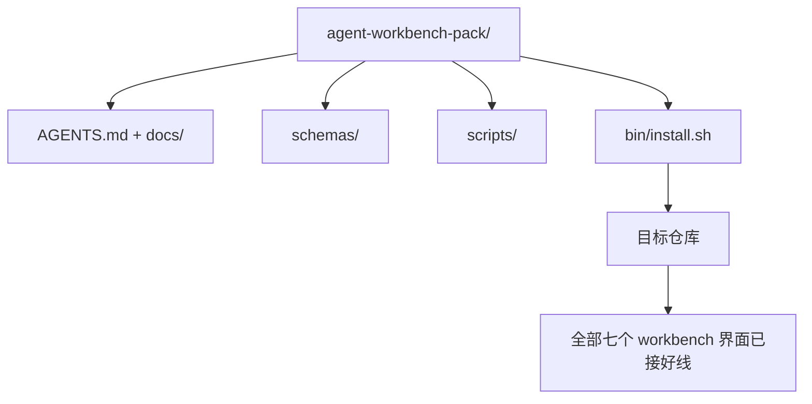

# Capstone：交付一个可复用的 Agent Workbench Pack

> 译注：本文译自同目录 [`en.md`](./en.md)。术语遵循仓根 [TRANSLATION_GUIDE.md](../../../../TRANSLATION_GUIDE.md)。

> 这条迷你支线以一个 pack 收尾——你可以把它直接 drop 进任何 repo。前面十一节课打磨出来的 surface（界面/层面），被压缩进一个 `cp -r` 就能走的目录，第二天早上 agent 就能稳稳跑起来。这个 capstone 就是整套课程交易的实物。

**Type:** Build
**Languages:** Python (stdlib)
**Prerequisites:** Phases 14 · 31 to 14 · 41
**Time:** ~75 minutes

## 学习目标（Learning Objectives）

- 把 workbench 的七个 surface 打包成一个 drop-in 目录。
- 把 schema、脚本和模板都钉死，让新 repo 拿到的就是一个已知可用的基线。
- 加一个一键安装脚本，幂等地把 pack 铺下去。
- 想清楚什么进 pack、什么不进，并为每一刀的取舍给出辩护。

## 问题（The Problem）

如果你的 workbench 散落在一个 Google Doc、一段聊天记录、外加三个只记得一半的脚本里，那它就是一个每个季度都要重建一次的 workbench。解药是一个有版本号的 pack：一个 repo 或目录，把 surface、schema、脚本和一键安装器都装齐。

这节课结束时，你会在磁盘上交付 `outputs/agent-workbench-pack/`，外加一个 `bin/install.sh`，能把它铺到任何目标 repo 里。

## 概念（The Concept）



### Pack 的目录布局

```
outputs/agent-workbench-pack/
├── AGENTS.md
├── docs/
│   ├── agent-rules.md
│   ├── reliability-policy.md
│   ├── handoff-protocol.md
│   └── reviewer-rubric.md
├── schemas/
│   ├── agent_state.schema.json
│   ├── task_board.schema.json
│   └── scope_contract.schema.json
├── scripts/
│   ├── init_agent.py
│   ├── run_with_feedback.py
│   ├── verify_agent.py
│   └── generate_handoff.py
├── bin/
│   └── install.sh
└── README.md
```

### 什么留下，什么剔除

留下：

- Surface 的 schema。它们就是契约。
- 上面那四个脚本。它们就是运行时。
- 上面那四份文档。它们是规则，也是评分标准（rubric）。

剔除：

- 项目特有的任务。任务该躺在目标 repo 的 board 上，不在 pack 里。
- 厂商 SDK 的调用。pack 必须 framework-agnostic（与框架无关）。
- 入职文案（onboarding prose）。pack 应该和团队既有的入职文档并排放，而不是塞进它里面。

### 安装器

一个简短的 `bin/install.sh`（或者 `bin/install.py`）：

1. 在已有 pack 存在时拒绝覆盖，除非传 `--force`。
2. 把 pack 拷进目标 repo。
3. 如果存在 `.github/workflows/`，顺带把 CI 串起来。
4. 打印下一步：填 board、设置 acceptance 命令、跑 init 脚本。

### 版本管理

Pack 自带一个 `VERSION` 文件。schema 调整、以及需要迁移的脚本变更，bump major；只动文档的变更，bump patch。目标 repo 的 `agent_state.json` 会记录它当初是基于哪个 pack 版本初始化的。

## 动手实现（Build It）

`code/main.py` 把 pack 组装到课程同目录下的 `outputs/agent-workbench-pack/`，种子来源是这条迷你支线前几节课打磨出来的 schema、脚本，以及你已经写好的那几份文档。

跑一下：

```
python3 code/main.py
```

这个脚本会拷贝并钉死所有 surface、写出 README、打印 pack 的目录树，然后以 0 退出。重复跑是幂等的。

## 真实世界里的生产模式（Production patterns in the wild）

只有当一个 pack 经得起 fork、更新和不友好的上游时，它才有价值。下面四种模式让这件事可行。

**`VERSION` 是契约，不是营销话术。** Major bump 必须配套 state 迁移；minor bump 要求 checker 重跑一遍；patch bump 只动文档。安装器在每次安装时把 `.workbench-version` 写进目标 repo；`lint_pack.py` 在目标的锁与 pack 的 `VERSION` 不一致时拒绝发布。`npm`、`Cargo`、`pyproject.toml` 就是靠这一套熬过了十年的 churn；agent 这个领域没有任何东西能改写这条规则。

**跨工具分发只留单一来源（single source）。** Nx 提供一条 `nx ai-setup`，从一份配置出发同时铺出 `AGENTS.md`、`CLAUDE.md`、`.cursor/rules/`、`.github/copilot-instructions.md` 和一个 MCP server。pack 应当照做：安装器输出 symlink（`ln -s AGENTS.md CLAUDE.md`），让单一真源 fan-out 到每个编码 agent。为了支持某一种工具而 fork pack，就是失败模式。

**`uninstall.sh` 在遇到非平凡状态时拒绝执行。** 卸载 pack 绝不能删掉用户的 `agent_state.json`、`task_board.json` 或 `outputs/`。卸载器会移除 schema、脚本、文档以及 `AGENTS.md`（带 `--keep-agents-md` 的退出选项），并且在 state 文件存在任何未提交修改时拒绝继续。状态属于用户；pack 不拥有它。

**Skill 即可发布物：SkillKit 风格的分发。** Pack 以一个 SkillKit skill 形态发布：`skillkit install agent-workbench-pack` 会从单一来源把它铺到 32 个 AI agent 上。pack 的 repo 是真源；SkillKit 是分发渠道。厂商锁定（vendor lock-in）随之坍缩；七个 surface 保持不变。

## 用起来（Use It）

Pack 在三个地方落地：

- **作为一个 drop-in 进 repo 的目录。** `cp -r outputs/agent-workbench-pack /path/to/repo`。
- **作为一个公开的 template repo。** Fork 后定制，靠 `VERSION` 控制漂移。
- **作为一个 SkillKit skill。** 接进你的 agent 产品，让一条命令就把它铺下去。

Pack 是 recipe（配方），每次安装是一份成品。

## 上线部署（Ship It）

`outputs/skill-workbench-pack.md` 会生成一个为具体项目调过的 pack：规则按团队历史磨锐、scope glob 匹配到这个 repo、rubric 维度再加一条领域专属条目。

## 练习（Exercises）

1. 决定那个可选的「第五份文档」哪一份值得晋升进经典 pack。为这一刀辩护。
2. 把安装器改写成 Python，带 `--dry-run` flag。和 bash 比一比 ergonomics（手感）。
3. 加一个 `bin/uninstall.sh`，安全地移除 pack；如果 state 文件存在非平凡历史则拒绝执行。什么算「非平凡」？
4. 加一个 `lint_pack.py`，在 pack 偏离 `VERSION` 时失败。把它接进 pack 自己 repo 的 CI。
5. 写一份从手搓 workbench 迁移到这个 pack 的 runbook。怎样的操作顺序最能压低停机？

## 关键术语（Key Terms）

| Term | What people say | What it actually means |
|------|----------------|------------------------|
| Workbench pack | "The starter kit" | A versioned directory carrying all seven surfaces |
| Installer | "Setup script" | `bin/install.sh` that lays the pack down idempotently |
| Pack version | "VERSION" | Major bumps for schema/script changes, patch for doc-only |
| Drop-in pack | "cp -r and go" | Pack works without per-repo customization on day one |
| Forkable template | "GitHub template" | Public repo that GitHub's "Use this template" can clone from |

## 延伸阅读（Further Reading）

- Phases 14 · 31 to 14 · 41 — 这个 pack 打包的每一个 surface 都来自这里
- [SkillKit](https://github.com/rohitg00/skillkit) — 让这个 skill 在 32 个 AI agent 上同时安装
- [Nx Blog, Teach Your AI Agent How to Work in a Monorepo](https://nx.dev/blog/nx-ai-agent-skills) — 单一来源生成器，覆盖六种工具
- [agents.md — the open spec](https://agents.md/) — 你 pack 的 router 必须实现的那个开放规范
- [HKUDS/OpenHarness](https://github.com/HKUDS/OpenHarness) — 一个等价 pack 的参考实现
- [andrewgarst/agentic_harness](https://github.com/andrewgarst/agentic_harness) — 基于 Redis 的参考实现，自带 eval 套件
- [Augment Code, A good AGENTS.md is a model upgrade](https://www.augmentcode.com/blog/how-to-write-good-agents-dot-md-files) — pack 文档质量基准
- [Anthropic, Effective harnesses for long-running agents](https://www.anthropic.com/engineering/effective-harnesses-for-long-running-agents)
- [Anthropic, Harness design for long-running application development](https://www.anthropic.com/engineering/harness-design-long-running-apps)
- Phase 14 · 30 — 消费这个 pack 验证关卡的 eval 驱动 agent 开发
- Phase 14 · 41 — 这个 pack 要在它之上做出改进的 before/after 基准
